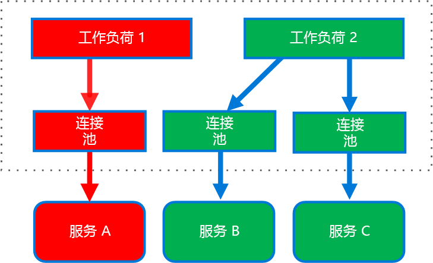

# <a name="bulkhead-pattern"></a><span data-ttu-id="f4721-103">隔舱模式</span><span class="sxs-lookup"><span data-stu-id="f4721-103">Bulkhead pattern</span></span>

<span data-ttu-id="f4721-104">将应用程序的元素隔离到池中，这样，如果一个元素发生故障，其他元素可继续工作。</span><span class="sxs-lookup"><span data-stu-id="f4721-104">Isolate elements of an application into pools so that if one fails, the others will continue to function.</span></span>

<span data-ttu-id="f4721-105">此模式之所以称为“隔舱”(Bulkhead)，是因为它类似于船体的分段区。</span><span class="sxs-lookup"><span data-stu-id="f4721-105">This pattern is named *Bulkhead* because it resembles the sectioned partitions of a ship's hull.</span></span> <span data-ttu-id="f4721-106">如果船体受到破坏，只有受损的分段才会进水，从而可以防止船只下沉。</span><span class="sxs-lookup"><span data-stu-id="f4721-106">If the hull of a ship is compromised, only the damaged section fills with water, which prevents the ship from sinking.</span></span> 

## <a name="context-and-problem"></a><span data-ttu-id="f4721-107">上下文和问题</span><span class="sxs-lookup"><span data-stu-id="f4721-107">Context and problem</span></span>

<span data-ttu-id="f4721-108">基于云的应用程序可以包含多个服务，其中每个服务具有一个或多个使用者。</span><span class="sxs-lookup"><span data-stu-id="f4721-108">A cloud-based application may include multiple services, with each service having one or more consumers.</span></span> <span data-ttu-id="f4721-109">服务过载或发生故障会影响服务的所有使用者。</span><span class="sxs-lookup"><span data-stu-id="f4721-109">Excessive load or failure in a service will impact all consumers of the service.</span></span>

<span data-ttu-id="f4721-110">此外，一个使用者可以使用每个请求的资源同时向多个服务发送请求。</span><span class="sxs-lookup"><span data-stu-id="f4721-110">Moreover, a consumer may send requests to multiple services simultaneously, using resources for each request.</span></span> <span data-ttu-id="f4721-111">当使用者向配置不当或无响应的服务发送请求时，可能无法及时释放客户端请求所用的资源。</span><span class="sxs-lookup"><span data-stu-id="f4721-111">When the consumer sends a request to a service that is misconfigured or not responding, the resources used by the client's request may not be freed in a timely manner.</span></span> <span data-ttu-id="f4721-112">随着不断地向服务发送请求，这些资源可能会耗尽。</span><span class="sxs-lookup"><span data-stu-id="f4721-112">As requests to the service continue, those resources may be exhausted.</span></span> <span data-ttu-id="f4721-113">例如，客户端的连接池可能会耗尽。</span><span class="sxs-lookup"><span data-stu-id="f4721-113">For example, the client's connection pool may be exhausted.</span></span> <span data-ttu-id="f4721-114">此时，使用者向其他服务发出的请求会受到影响。</span><span class="sxs-lookup"><span data-stu-id="f4721-114">At that point, requests by the consumer to other services are impacted.</span></span> <span data-ttu-id="f4721-115">最终，使用者不再能够向其他服务（而不仅仅是原始的无响应服务）发送请求。</span><span class="sxs-lookup"><span data-stu-id="f4721-115">Eventually the consumer can no longer send requests to other services, not just the original unresponsive service.</span></span>

<span data-ttu-id="f4721-116">资源耗尽问题同样会影响具有多个使用者的服务。</span><span class="sxs-lookup"><span data-stu-id="f4721-116">The same issue of resource exhaustion affects services with multiple consumers.</span></span> <span data-ttu-id="f4721-117">源自一个客户端的大量请求可能耗尽服务中的可用资源。</span><span class="sxs-lookup"><span data-stu-id="f4721-117">A large number of requests originating from one client may exhaust available resources in the service.</span></span> <span data-ttu-id="f4721-118">其他使用者不再能够使用该服务，从而导致连锁故障效应。</span><span class="sxs-lookup"><span data-stu-id="f4721-118">Other consumers are no longer able to consume the service, causing a cascading failure effect.</span></span>

## <a name="solution"></a><span data-ttu-id="f4721-119">解决方案</span><span class="sxs-lookup"><span data-stu-id="f4721-119">Solution</span></span>

<span data-ttu-id="f4721-120">根据使用者负载和可用性要求，将服务实例分区成不同的组。</span><span class="sxs-lookup"><span data-stu-id="f4721-120">Partition service instances into different groups, based on consumer load and availability requirements.</span></span> <span data-ttu-id="f4721-121">此设计有助于隔离故障，即使在发生故障期间，也能为某些使用者保留服务功能。</span><span class="sxs-lookup"><span data-stu-id="f4721-121">This design helps to isolate failures, and allows you to sustain service functionality for some consumers, even during a failure.</span></span>

<span data-ttu-id="f4721-122">使用者也可以将资源分区，确保用于调用一个服务的资源不会影响用于调用另一个服务的资源。</span><span class="sxs-lookup"><span data-stu-id="f4721-122">A consumer can also partition resources, to ensure that resources used to call one service don't affect the resources used to call another service.</span></span> <span data-ttu-id="f4721-123">例如，对于调用多个服务的使用者，可为其分配每个服务的连接池。</span><span class="sxs-lookup"><span data-stu-id="f4721-123">For example, a consumer that calls multiple services may be assigned a connection pool for each service.</span></span> <span data-ttu-id="f4721-124">如果某个服务开始发生故障，只有分配给该服务的连接池才会受到影响，因此，使用者可继续使用其他服务。</span><span class="sxs-lookup"><span data-stu-id="f4721-124">If a service begins to fail, it only affects the connection pool assigned for that service, allowing the consumer to continue using the other services.</span></span>

<span data-ttu-id="f4721-125">此模式的优势包括：</span><span class="sxs-lookup"><span data-stu-id="f4721-125">The benefits of this pattern include:</span></span>

- <span data-ttu-id="f4721-126">隔离使用者和服务，防止发生连锁故障。</span><span class="sxs-lookup"><span data-stu-id="f4721-126">Isolates consumers and services from cascading failures.</span></span> <span data-ttu-id="f4721-127">可在使用者或服务自身的隔舱中隔离对其造成影响的问题，防止整个解决方案发生故障。</span><span class="sxs-lookup"><span data-stu-id="f4721-127">An issue affecting a consumer or service can be isolated within its own bulkhead, preventing the entire solution from failing.</span></span>
- <span data-ttu-id="f4721-128">在发生服务故障时，可以保留一部分功能。</span><span class="sxs-lookup"><span data-stu-id="f4721-128">Allows you to preserve some functionality in the event of a service failure.</span></span> <span data-ttu-id="f4721-129">应用程序的其他服务和功能可继续工作。</span><span class="sxs-lookup"><span data-stu-id="f4721-129">Other services and features of the application will continue to work.</span></span>
- <span data-ttu-id="f4721-130">可以部署能够为使用方应用程序提供不同服务质量的服务。</span><span class="sxs-lookup"><span data-stu-id="f4721-130">Allows you to deploy services that offer a different quality of service for consuming applications.</span></span> <span data-ttu-id="f4721-131">可以配置高优先级使用者池来利用高优先级服务。</span><span class="sxs-lookup"><span data-stu-id="f4721-131">A high-priority consumer pool can be configured to use high-priority services.</span></span> 

<span data-ttu-id="f4721-132">下图显示了围绕调用单个服务的连接池构建的隔舱。</span><span class="sxs-lookup"><span data-stu-id="f4721-132">The following diagram shows bulkheads structured around connection pools that call individual services.</span></span> <span data-ttu-id="f4721-133">如果服务 A 发生故障或导致其他某种问题，该连接池将被隔离，因此，只有使用分配给服务 A 的线程池的工作负荷才受影响。</span><span class="sxs-lookup"><span data-stu-id="f4721-133">If Service A fails or causes some other issue, the connection pool is isolated, so only workloads using the thread pool assigned to Service A are affected.</span></span> <span data-ttu-id="f4721-134">使用服务 B 和 C 的工作负载不受影响，可继续工作而不会中断。</span><span class="sxs-lookup"><span data-stu-id="f4721-134">Workloads that use Service B and C are not affected and can continue working without interruption.</span></span>

 

<span data-ttu-id="f4721-135">下图显示了调用单个服务的多个客户端。</span><span class="sxs-lookup"><span data-stu-id="f4721-135">The next diagram shows multiple clients calling a single service.</span></span> <span data-ttu-id="f4721-136">为每个客户端分配了独立的服务实例。</span><span class="sxs-lookup"><span data-stu-id="f4721-136">Each client is assigned a separate service instance.</span></span> <span data-ttu-id="f4721-137">客户端 1 发出了过多的请求，使其实例近乎瘫痪。</span><span class="sxs-lookup"><span data-stu-id="f4721-137">Client 1 has made too many requests and overwhelmed its instance.</span></span> <span data-ttu-id="f4721-138">由于每个服务实例相互隔离，其他客户端可继续发出调用。</span><span class="sxs-lookup"><span data-stu-id="f4721-138">Because each service instance is isolated from the others, the other clients can continue making calls.</span></span>


     
## <a name="issues-and-considerations"></a><span data-ttu-id="f4721-139">问题和注意事项</span><span class="sxs-lookup"><span data-stu-id="f4721-139">Issues and considerations</span></span>

- <span data-ttu-id="f4721-140">围绕应用程序的业务和技术要求定义分区。</span><span class="sxs-lookup"><span data-stu-id="f4721-140">Define partitions around the business and technical requirements of the application.</span></span>
- <span data-ttu-id="f4721-141">将服务或使用者分区到隔舱时，请考虑相应技术提供的隔离级别，以及成本、性能和可管理性方面的开销。</span><span class="sxs-lookup"><span data-stu-id="f4721-141">When partitioning services or consumers into bulkheads, consider the level of isolation offered by the technology as well as the overhead in terms of cost, performance and manageability.</span></span>
- <span data-ttu-id="f4721-142">考虑将隔舱与重试、断路器和限制模式合并，提供更周密的故障处理。</span><span class="sxs-lookup"><span data-stu-id="f4721-142">Consider combining bulkheads with retry, circuit breaker, and throttling patterns to provide more sophisticated fault handling.</span></span>
- <span data-ttu-id="f4721-143">将使用者分区到隔舱时，请考虑使用进程、线程池和信号灯。</span><span class="sxs-lookup"><span data-stu-id="f4721-143">When partitioning consumers into bulkheads, consider using processes, thread pools, and semaphores.</span></span> <span data-ttu-id="f4721-144">[Netflix Hystrix][hystrix] 和 [Polly][polly] 等项目提供了一个框架用于创建使用者隔舱。</span><span class="sxs-lookup"><span data-stu-id="f4721-144">Projects like [Netflix Hystrix][hystrix] and [Polly][polly] offer a framework for creating consumer bulkheads.</span></span>
- <span data-ttu-id="f4721-145">将服务分区到隔舱时，请考虑将这些服务部署到独立的虚拟机、容器或进程。</span><span class="sxs-lookup"><span data-stu-id="f4721-145">When partitioning services into bulkheads, consider deploying them into separate virtual machines, containers, or processes.</span></span> <span data-ttu-id="f4721-146">容器能够以相当低的开销合理平衡资源隔离。</span><span class="sxs-lookup"><span data-stu-id="f4721-146">Containers offer a good balance of resource isolation with fairly low overhead.</span></span>
- <span data-ttu-id="f4721-147">使用异步消息通信的服务可以通过不同的队列集进行隔离。</span><span class="sxs-lookup"><span data-stu-id="f4721-147">Services that communicate using asynchronous messages can be isolated through different sets of queues.</span></span> <span data-ttu-id="f4721-148">每个队列可以包含专用的实例集用于处理该队列中的消息，或者包含单个实例组，以通过某种算法来取消排队和调度处理负载。</span><span class="sxs-lookup"><span data-stu-id="f4721-148">Each queue can have a dedicated set of instances processing messages on the queue, or a single group of instances using an algorithm to dequeue and dispatch processing.</span></span>
- <span data-ttu-id="f4721-149">确定隔舱的粒度级。</span><span class="sxs-lookup"><span data-stu-id="f4721-149">Determine the level of granularity for the bulkheads.</span></span> <span data-ttu-id="f4721-150">例如，若要将租户分配到不同的分区，可将每个租户放入独立的分区，或者将多个租户放入一个分区。</span><span class="sxs-lookup"><span data-stu-id="f4721-150">For example, if you want to distribute tenants across partitions, you could place each tenant into a separate partition, a put several tenants into one partition.</span></span>
- <span data-ttu-id="f4721-151">监视每个分区的性能和 SLA。</span><span class="sxs-lookup"><span data-stu-id="f4721-151">Monitor each partition’s performance and SLA.</span></span>

## <a name="when-to-use-this-pattern"></a><span data-ttu-id="f4721-152">何时使用此模式</span><span class="sxs-lookup"><span data-stu-id="f4721-152">When to use this pattern</span></span>

<span data-ttu-id="f4721-153">使用此模式可以：</span><span class="sxs-lookup"><span data-stu-id="f4721-153">Use this pattern to:</span></span>

- <span data-ttu-id="f4721-154">隔离使用一组后端服务所用的资源，尤其是应用程序可以提供某种功能级别时，即使某个服务未能响应。</span><span class="sxs-lookup"><span data-stu-id="f4721-154">Isolate resources used to consume a set of backend services, especially if the application can provide some level of functionality even when one of the services is not responding.</span></span>
- <span data-ttu-id="f4721-155">将关键使用者与标准使用者相隔离。</span><span class="sxs-lookup"><span data-stu-id="f4721-155">Isolate critical consumers from standard consumers.</span></span>
- <span data-ttu-id="f4721-156">防止应用程序发生连锁故障。</span><span class="sxs-lookup"><span data-stu-id="f4721-156">Protect the application from cascading failures.</span></span>

<span data-ttu-id="f4721-157">此模式可能不适用于以下情况：</span><span class="sxs-lookup"><span data-stu-id="f4721-157">This pattern may not be suitable when:</span></span>

- <span data-ttu-id="f4721-158">项目中可能不接受资源的低效利用。</span><span class="sxs-lookup"><span data-stu-id="f4721-158">Less efficient use of resources may not be acceptable in the project.</span></span>
- <span data-ttu-id="f4721-159">没有必要提高复杂性</span><span class="sxs-lookup"><span data-stu-id="f4721-159">The added complexity is not necessary</span></span>

## <a name="example"></a><span data-ttu-id="f4721-160">示例</span><span class="sxs-lookup"><span data-stu-id="f4721-160">Example</span></span>

<span data-ttu-id="f4721-161">以下 Kubernetes 配置文件创建一个隔离的容器用于运行单个服务，该容器具有自身的 CPU 和内存资源与限制。</span><span class="sxs-lookup"><span data-stu-id="f4721-161">The following Kubernetes configuration file creates an isolated container to run a single service, with its own CPU and memory resources and limits.</span></span>

```yml
apiVersion: v1
kind: Pod
metadata:
  name: drone-management
spec:
  containers:
  - name: drone-management-container
    image: drone-service
    resources:
      requests:
        memory: "64Mi"
        cpu: "250m"
      limits:
        memory: "128Mi"
        cpu: "1"
```

## <a name="related-guidance"></a><span data-ttu-id="f4721-162">相关指南</span><span class="sxs-lookup"><span data-stu-id="f4721-162">Related guidance</span></span>

- [<span data-ttu-id="f4721-163">断路器模式</span><span class="sxs-lookup"><span data-stu-id="f4721-163">Circuit Breaker pattern</span></span>](./circuit-breaker.md)
- [<span data-ttu-id="f4721-164">设计适用于 Azure 的弹性应用程序</span><span class="sxs-lookup"><span data-stu-id="f4721-164">Designing resilient applications for Azure</span></span>](../resiliency/index.md)
- [<span data-ttu-id="f4721-165">重试模式</span><span class="sxs-lookup"><span data-stu-id="f4721-165">Retry pattern</span></span>](./retry.md)
- [<span data-ttu-id="f4721-166">限制模式</span><span class="sxs-lookup"><span data-stu-id="f4721-166">Throttling pattern</span></span>](./throttling.md)


<!-- links -->

[hystrix]: https://github.com/Netflix/Hystrix
[polly]: https://github.com/App-vNext/Polly