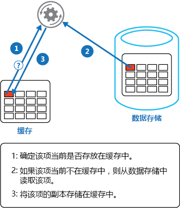

# <a name="cache-aside-pattern"></a>缓存端模式

[!INCLUDE [header](../_includes/header.md)]

将数据按需从数据存储加载到缓存中。 这可提升性能，并且有助于在缓存中保存的数据与基础数据存储中的数据之间保持一致性。

## <a name="context-and-problem"></a>上下文和问题

应用程序使用缓存来改善对数据存储中保存的信息的重复访问。 但是，期望缓存的数据始终与数据存储中的数据完全一致是不切实际的。 应用程序应实施策略，帮助尽可能确保缓存中的数据为最新状态，并且检测和处理当缓存中的数据过期时所出现的情况。

## <a name="solution"></a>解决方案

许多商业缓存系统提供直读和直写/后写操作。 在这些系统中，应用程序通过引用缓存来检索数据。 如果数据不在缓存中，则将从数据存储中检索数据并将其添加到缓存。 对缓存中保存的数据进行的任何修改还会自动写回到数据存储。

对于不提供此功能的缓存，使用缓存的应用程序将负责保存数据。

通过实施缓存端策略，应用程序可以模拟直读缓存的功能。 此策略可按需将数据加载到缓存。 下图演示使用缓存端模式在缓存中存储数据。




如果应用程序更新了信息，则可按照直写策略操作，方法是修改数据存储和使缓存中的相应项无效。

如果下一步需要该项，使用缓存端策略将导致可从数据存储检索更新后的数据，并将其添加回缓存。

## <a name="issues-and-considerations"></a>问题和注意事项

在决定如何实现此模式时，请考虑以下几点： 

**已缓存数据的生存期**。 许多缓存实施过期策略，如果未在指定期间访问数据，则数据将失效并从缓存中删除。 若要使缓存端有效，请确保过期策略与使用数据的应用程序的访问模式相匹配。 过期期限不宜太短，因为可能导致应用程序不断从数据存储检索数据并将其添加到缓存。 同样，过期期限不宜太长，否则缓存数据可能会过期。 请记住，缓存最适用于相对静态的数据或经常读取的数据。

**逐出数据**。 与数据起源的数据存储相比，大多数缓存的大小有限，并且在必要时逐出数据。 大多数缓存采用最近最少使用策略来选择要逐出的项，但这也可自定义。 配置缓存的全局过期属性和其他属性，以及每个已缓存项的过期属性，以确保缓存具有成本效益。 将全局逐出策略应用于缓存中的每个项并不总是适用。 例如，如果从数据存储检索某个已缓存项的代价很高，则将该项保留在缓存中是有益的，尽管访问更频繁，但减少了成本高的项。

**填充缓存**。 很多解决方案使用可能用作应用程序启动处理一部分的数据来预填充缓存。 如果一些数据已过期或已逐出，则缓存端模式仍然十分有用。

**一致性**。 实现缓存端模式并不能保证数据存储与缓存之间的一致性。 外部进程可随时更改数据存储中的项，并且在下次加载该项之前，此更改不会反映在缓存中。 在跨数据存储复制数据的系统中，如果经常发生同步，则此问题可能会变得严重。

**本地（内存中）缓存**。 缓存可能是应用程序实例的本地缓存，并且存储在内存中。 如果应用程序反复访问相同的数据，则缓存端在此环境中很有用。 但是，因为本地缓存是专用的，因此不同的应用程序实例可各自拥有相同缓存数据的副本。 缓存之间的此数据可快速变得不一致，因此有必要使专用缓存中保存的数据过期并更加频繁地刷新该数据。 在这些情况下，请考虑研究共享或分布式缓存机制的使用。

## <a name="when-to-use-this-pattern"></a>何时使用此模式

在以下情况下使用此模式：

- 缓存不提供本机直读和直写操作。
- 资源需求不可预知。 此模式可使应用程序按需加载数据。 无法提前假设应用程序将需要哪些数据。

此模式可能不适用：

- 缓存的数据集为静态。 如果数据可融入可用的缓存空间，则在启动时用数据填充缓存，并应用可防止数据过期的策略。
- 在 Web 场中托管的 Web 应用程序中的缓存会话状态信息。 在此环境中，应避免引入基于客户端服务器相关性的依赖关系。

## <a name="example"></a>示例

在 Microsoft Azure 中，可以使用 Azure Redis 缓存来创建可由应用程序的多个实例共享的分布式缓存。 

若要连接到 Azure Redis 缓存实例，请调用静态 `Connect` 方法并传入连接字符串。 该方法返回表示连接的 `ConnectionMultiplexer`。 共享应用程序中的 `ConnectionMultiplexer` 实例的一个方法是，拥有返回连接示例的静态属性（与下列示例类似）。 此方法是一种线程安全方法，仅初始化连接的一个实例。

```csharp
private static ConnectionMultiplexer Connection;

// Redis Connection string info
private static Lazy<ConnectionMultiplexer> lazyConnection = new Lazy<ConnectionMultiplexer>(() =>
{
    string cacheConnection = ConfigurationManager.AppSettings["CacheConnection"].ToString();
    return ConnectionMultiplexer.Connect(cacheConnection);
});

public static ConnectionMultiplexer Connection => lazyConnection.Value;
```

以下代码示例中的 `GetMyEntityAsync` 方法演示对基于 Azure Redis 缓存的缓存端模式的实现。 此方法使用直读方法从缓存检索对象。

通过将整数 ID 用作密钥来识别对象。 `GetMyEntityAsync` 方法尝试使用此密钥从缓存检索项。 如果找到匹配项，则它将返回。 如果缓存中没有匹配项，`GetMyEntityAsync` 方法将从数据存储检索对象、将其添加到缓存中，然后将其返回。 从数据存储实际读取数据的代码取决于数据存储，所以它未在此处显示。 请注意，缓存的项已配置为过期，以防止在其他位置对其进行更新后它会变得陈旧。


```csharp
// Set five minute expiration as a default
private const double DefaultExpirationTimeInMinutes = 5.0;

public async Task<MyEntity> GetMyEntityAsync(int id)
{
  // Define a unique key for this method and its parameters.
  var key = $"MyEntity:{id}";
  var cache = Connection.GetDatabase();
  
  // Try to get the entity from the cache.
  var json = await cache.StringGetAsync(key).ConfigureAwait(false);
  var value = string.IsNullOrWhiteSpace(json) 
                ? default(MyEntity) 
                : JsonConvert.DeserializeObject<MyEntity>(json);
  
  if (value == null) // Cache miss
  {
    // If there's a cache miss, get the entity from the original store and cache it.
    // Code has been omitted because it's data store dependent.  
    value = ...;

    // Avoid caching a null value.
    if (value != null)
    {
      // Put the item in the cache with a custom expiration time that 
      // depends on how critical it is to have stale data.
      await cache.StringSetAsync(key, JsonConvert.SerializeObject(value)).ConfigureAwait(false);
      await cache.KeyExpireAsync(key, TimeSpan.FromMinutes(DefaultExpirationTimeInMinutes)).ConfigureAwait(false);
    }
  }

  return value;
}
```

>  此示例使用 Azure Redis 缓存 API 访问存储并从缓存中检索信息。 有关详细信息，请参阅[使用 Microsoft Azure Redis 缓存](https://docs.microsoft.com/azure/redis-cache/cache-dotnet-how-to-use-azure-redis-cache)和[如何使用 Redis 缓存创建 Web 应用](https://docs.microsoft.com/azure/redis-cache/cache-web-app-howto)

如下所示，`UpdateEntityAsync` 方法演示如何在应用程序更改值时使缓存中的对象无效。 代码更新原始数据存储，然后从缓存中删除缓存的项。

```csharp
public async Task UpdateEntityAsync(MyEntity entity)
{
    // Update the object in the original data store.
    await this.store.UpdateEntityAsync(entity).ConfigureAwait(false); 

    // Invalidate the current cache object.
    var cache = Connection.GetDatabase();
    var id = entity.Id;
    var key = $"MyEntity:{id}"; // The key for the cached object.
    await cache.KeyDeleteAsync(key).ConfigureAwait(false); // Delete this key from the cache.
}
```

> [!NOTE]
> 该步骤的顺序非常重要。 请先更新数据存储，然后再从缓存中删除项。 如果首先删除缓存的项，在短时间内，客户端可能会在数据存储更新前提取该项。 这将造成缓存失误（因为从缓存中删除了项），导致要从数据存储提取该项的早期版本并将其添加回缓存。 造成缓存数据陈旧。


## <a name="related-guidance"></a>相关指南 

实现此模式时，以下信息可能相关：

- [Caching Guidance](https://docs.microsoft.com/azure/architecture/best-practices/caching)（缓存指南）。 提供有关如何在云解决方案中缓存数据的其他信息，以及实现缓存时应考虑的问题。

- [Data Consistency Primer](https://msdn.microsoft.com/library/dn589800.aspx)（数据一致性入门）。 云应用程序通常使用遍布数据存储的数据。 系统的一个重要方面是在此环境中管理和维护数据一致性，特别是可能出现的并发性和可用性问题。 此入门介绍了有关跨分布式数据的一致性问题，并总结了应用程序实现最终一致性以维持数据的可用性的方法。
