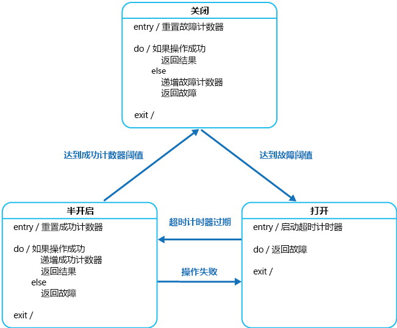

# <a name="circuit-breaker-pattern"></a><span data-ttu-id="925df-104">断路器模式</span><span class="sxs-lookup"><span data-stu-id="925df-104">Circuit Breaker pattern</span></span>

<span data-ttu-id="925df-105">连接到远程服务或资源时处理故障，此类故障所需恢复时间不定。</span><span class="sxs-lookup"><span data-stu-id="925df-105">Handle faults that might take a variable amount of time to recover from, when connecting to a remote service or resource.</span></span> <span data-ttu-id="925df-106">这可以提高应用程序的稳定性和复原能力。</span><span class="sxs-lookup"><span data-stu-id="925df-106">This can improve the stability and resiliency of an application.</span></span>

## <a name="context-and-problem"></a><span data-ttu-id="925df-107">上下文和问题</span><span class="sxs-lookup"><span data-stu-id="925df-107">Context and problem</span></span>

<span data-ttu-id="925df-108">在分布式环境中，对远程资源和服务的调用可能会由于临时性故障（如网络连接缓慢、超时、资源过载或资源暂时不可用）而失败。</span><span class="sxs-lookup"><span data-stu-id="925df-108">In a distributed environment, calls to remote resources and services can fail due to transient faults, such as slow network connections, timeouts, or the resources being overcommitted or temporarily unavailable.</span></span> <span data-ttu-id="925df-109">这些故障通常会在短时间内自行更正，而且，应该会准备一个可靠的云应用程序，通过[重试模式][retry-pattern]这样的策略来处理它们。</span><span class="sxs-lookup"><span data-stu-id="925df-109">These faults typically correct themselves after a short period of time, and a robust cloud application should be prepared to handle them by using a strategy such as the [Retry pattern][retry-pattern].</span></span>

<span data-ttu-id="925df-110">但是，也可能遇到由于意外事件而导致的故障，且需要更长的时间来进行修复。</span><span class="sxs-lookup"><span data-stu-id="925df-110">However, there can also be situations where faults are due to unanticipated events, and that might take much longer to fix.</span></span> <span data-ttu-id="925df-111">这些故障按严重程度从部分连接丢失到服务彻底故障都有可能。</span><span class="sxs-lookup"><span data-stu-id="925df-111">These faults can range in severity from a partial loss of connectivity to the complete failure of a service.</span></span> <span data-ttu-id="925df-112">这类情况下，让应用程序持续重试不可能成功的操作是毫无意义的。相反，应用程序应该快速认识到操作已失败，并相应地处理此故障。</span><span class="sxs-lookup"><span data-stu-id="925df-112">In these situations it might be pointless for an application to continually retry an operation that is unlikely to succeed, and instead the application should quickly accept that the operation has failed and handle this failure accordingly.</span></span>

<span data-ttu-id="925df-113">此外，如果服务十分繁忙，那么系统一个部分的故障可能会导致连锁故障。</span><span class="sxs-lookup"><span data-stu-id="925df-113">Additionally, if a service is very busy, failure in one part of the system might lead to cascading failures.</span></span> <span data-ttu-id="925df-114">例如，调用服务的操作可以被配置为实现超时，并且在服务未能在此期间内响应时返回失败消息。</span><span class="sxs-lookup"><span data-stu-id="925df-114">For example, an operation that invokes a service could be configured to implement a timeout, and reply with a failure message if the service fails to respond within this period.</span></span> <span data-ttu-id="925df-115">但是，此策略可能导致同一操作的许多并发请求受到阻止，直至超时期间到期。</span><span class="sxs-lookup"><span data-stu-id="925df-115">However, this strategy could cause many concurrent requests to the same operation to be blocked until the timeout period expires.</span></span> <span data-ttu-id="925df-116">这些阻止的请求可能占用了关键的系统资源，如内存、线程、数据库连接等。</span><span class="sxs-lookup"><span data-stu-id="925df-116">These blocked requests might hold critical system resources such as memory, threads, database connections, and so on.</span></span> <span data-ttu-id="925df-117">因此，这些资源可能被耗尽，从而导致需要使用相同资源的系统其他不相关部分出现故障。</span><span class="sxs-lookup"><span data-stu-id="925df-117">Consequently, these resources could become exhausted, causing failure of other possibly unrelated parts of the system that need to use the same resources.</span></span> <span data-ttu-id="925df-118">在这些情况下，更有益的做法便是让操作立即失败并只在服务可能成功时才尝试调用服务。</span><span class="sxs-lookup"><span data-stu-id="925df-118">In these situations, it would be preferable for the operation to fail immediately, and only attempt to invoke the service if it's likely to succeed.</span></span> <span data-ttu-id="925df-119">请注意，设置较短的超时可能有助于解决此问题，但为避免操作在大多数时间内失败，超时不应太短（即使对服务的请求最终会成功）。</span><span class="sxs-lookup"><span data-stu-id="925df-119">Note that setting a shorter timeout might help to resolve this problem, but the timeout shouldn't be so short that the operation fails most of the time, even if the request to the service would eventually succeed.</span></span>

## <a name="solution"></a><span data-ttu-id="925df-120">解决方案</span><span class="sxs-lookup"><span data-stu-id="925df-120">Solution</span></span>

<span data-ttu-id="925df-121">Michael Nygard 在 [Release It!](https://pragprog.com/book/mnee/release-it)（发布吧！）一书中推广的断路器模式可以防止应用程序重复尝试执行很可能失败的操作。</span><span class="sxs-lookup"><span data-stu-id="925df-121">The Circuit Breaker pattern, popularized by Michael Nygard in his book, [Release It!](https://pragprog.com/book/mnee/release-it), can prevent an application from repeatedly trying to execute an operation that's likely to fail.</span></span> <span data-ttu-id="925df-122">在确定故障的持续时间很长时允许它继续，而不等待故障修复或浪费 CPU 周期。</span><span class="sxs-lookup"><span data-stu-id="925df-122">Allowing it to continue without waiting for the fault to be fixed or wasting CPU cycles while it determines that the fault is long lasting.</span></span> <span data-ttu-id="925df-123">断路器模式还可让应用程序检测故障是否已经解决。</span><span class="sxs-lookup"><span data-stu-id="925df-123">The Circuit Breaker pattern also enables an application to detect whether the fault has been resolved.</span></span> <span data-ttu-id="925df-124">如果问题已被修复，应用程序便可以尝试调用操作。</span><span class="sxs-lookup"><span data-stu-id="925df-124">If the problem appears to have been fixed, the application can try to invoke the operation.</span></span>

> <span data-ttu-id="925df-125">断路器模式的目的与重试模式不同。</span><span class="sxs-lookup"><span data-stu-id="925df-125">The purpose of the Circuit Breaker pattern is different than the Retry pattern.</span></span> <span data-ttu-id="925df-126">重试模式在预期操作将成功的情况下让应用程序重试操作。</span><span class="sxs-lookup"><span data-stu-id="925df-126">The Retry pattern enables an application to retry an operation in the expectation that it'll succeed.</span></span> <span data-ttu-id="925df-127">断路器模式则防止应用程序执行很可能失败的操作。</span><span class="sxs-lookup"><span data-stu-id="925df-127">The Circuit Breaker pattern prevents an application from performing an operation that is likely to fail.</span></span> <span data-ttu-id="925df-128">应用程序可以使用重试模式通过断路器调用操作，来组合这两种模式。</span><span class="sxs-lookup"><span data-stu-id="925df-128">An application can combine these two patterns by using the Retry pattern to invoke an operation through a circuit breaker.</span></span> <span data-ttu-id="925df-129">但重试逻辑应该对断路器返回的任何异常保持敏感，并且在断路器指示故障为非临时性的情况下放弃重试尝试。</span><span class="sxs-lookup"><span data-stu-id="925df-129">However, the retry logic should be sensitive to any exceptions returned by the circuit breaker and abandon retry attempts if the circuit breaker indicates that a fault is not transient.</span></span>

<span data-ttu-id="925df-130">针对可能失败的操作，断路器充当其代理。</span><span class="sxs-lookup"><span data-stu-id="925df-130">A circuit breaker acts as a proxy for operations that might fail.</span></span> <span data-ttu-id="925df-131">代理应监视最近发生的失败次数，并使用此信息来决定是允许操作继续进行，还是立即返回异常。</span><span class="sxs-lookup"><span data-stu-id="925df-131">The proxy should monitor the number of recent failures that have occurred, and use this information to decide whether to allow the operation to proceed, or simply return an exception immediately.</span></span>

<span data-ttu-id="925df-132">通过模仿电力断路器的功能，可将代理作为具有以下状态的状态机来实现：</span><span class="sxs-lookup"><span data-stu-id="925df-132">The proxy can be implemented as a state machine with the following states that mimic the functionality of an electrical circuit breaker:</span></span>

- <span data-ttu-id="925df-133">**关闭**：将来自应用程序的请求路由到操作。</span><span class="sxs-lookup"><span data-stu-id="925df-133">**Closed**: The request from the application is routed to the operation.</span></span> <span data-ttu-id="925df-134">代理维护最近失败次数的计数，如果对操作的调用不成功，代理将递增此计数。</span><span class="sxs-lookup"><span data-stu-id="925df-134">The proxy maintains a count of the number of recent failures, and if the call to the operation is unsuccessful the proxy increments this count.</span></span> <span data-ttu-id="925df-135">如果在给定时间段内最近失败次数超过指定的阈值，则代理将置于**打开**状态。</span><span class="sxs-lookup"><span data-stu-id="925df-135">If the number of recent failures exceeds a specified threshold within a given time period, the proxy is placed into the **Open** state.</span></span> <span data-ttu-id="925df-136">此时，代理会启动超时计时器，并且当此计时器过期时，代理将置于**半开**状态。</span><span class="sxs-lookup"><span data-stu-id="925df-136">At this point the proxy starts a timeout timer, and when this timer expires the proxy is placed into the **Half-Open** state.</span></span>

    > <span data-ttu-id="925df-137">超时计时器的目的是给系统一段时间来解决导致失败的问题，并允许应用程序再次尝试执行操作。</span><span class="sxs-lookup"><span data-stu-id="925df-137">The purpose of the timeout timer is to give the system time to fix the problem that caused the failure before allowing the application to try to perform the operation again.</span></span>

- <span data-ttu-id="925df-138">**打开**：来自应用程序的请求立即失败，并向应用程序返回异常。</span><span class="sxs-lookup"><span data-stu-id="925df-138">**Open**: The request from the application fails immediately and an exception is returned to the application.</span></span>

- <span data-ttu-id="925df-139">**半开**：允许数量有限的来自应用程序的请求通过并调用操作。</span><span class="sxs-lookup"><span data-stu-id="925df-139">**Half-Open**: A limited number of requests from the application are allowed to pass through and invoke the operation.</span></span> <span data-ttu-id="925df-140">如果这些请求成功，则假定先前导致失败的问题已被修复，并且断路器将切换到**关闭**状态（失败计数器重置）。</span><span class="sxs-lookup"><span data-stu-id="925df-140">If these requests are successful, it's assumed that the fault that was previously causing the failure has been fixed and the circuit breaker switches to the **Closed** state (the failure counter is reset).</span></span> <span data-ttu-id="925df-141">如果有任何请求失败，则断路器将假定故障仍然存在，因此它会恢复到**打开**状态，并重新启动超时计时器，再给系统一段时间来从故障中恢复。</span><span class="sxs-lookup"><span data-stu-id="925df-141">If any request fails, the circuit breaker assumes that the fault is still present so it reverts back to the **Open** state and restarts the timeout timer to give the system a further period of time to recover from the failure.</span></span>

    > <span data-ttu-id="925df-142">**半开**状态对于防止恢复服务突然被大量请求淹没很有用。</span><span class="sxs-lookup"><span data-stu-id="925df-142">The **Half-Open** state is useful to prevent a recovering service from suddenly being flooded with requests.</span></span> <span data-ttu-id="925df-143">在服务恢复的同时，它或许能够支持数量有限的请求，直至恢复完成；但当恢复正在进行时，大量的工作可能导致服务超时或再次失败。</span><span class="sxs-lookup"><span data-stu-id="925df-143">As a service recovers, it might be able to support a limited volume of requests until the recovery is complete, but while recovery is in progress a flood of work can cause the service to time out or fail again.</span></span>



<span data-ttu-id="925df-145">在图中，**关闭**状态所使用的失败计数器是基于时间的。</span><span class="sxs-lookup"><span data-stu-id="925df-145">In the figure, the failure counter used by the **Closed** state is time based.</span></span> <span data-ttu-id="925df-146">它会定期自动重置。</span><span class="sxs-lookup"><span data-stu-id="925df-146">It's automatically reset at periodic intervals.</span></span> <span data-ttu-id="925df-147">这有助于防止断路器在遇到偶然失败时进入**打开**状态。</span><span class="sxs-lookup"><span data-stu-id="925df-147">This helps to prevent the circuit breaker from entering the **Open** state if it experiences occasional failures.</span></span> <span data-ttu-id="925df-148">仅当在指定间隔期间内发生指定数量的失败时，才会达到将断路器跳闸到**打开**状态的故障阈值。</span><span class="sxs-lookup"><span data-stu-id="925df-148">The failure threshold that trips the circuit breaker into the **Open** state is only reached when a specified number of failures have occurred during a specified interval.</span></span> <span data-ttu-id="925df-149">**半开**状态使用的计数器记录成功调用操作的次数。</span><span class="sxs-lookup"><span data-stu-id="925df-149">The counter used by the **Half-Open** state records the number of successful attempts to invoke the operation.</span></span> <span data-ttu-id="925df-150">在指定数量的连续操作调用成功后，断路器将恢复到**关闭**状态。</span><span class="sxs-lookup"><span data-stu-id="925df-150">The circuit breaker reverts to the **Closed** state after a specified number of consecutive operation invocations have been successful.</span></span> <span data-ttu-id="925df-151">如果任何调用失败，断路器会立即进入**打开**状态，成功计数器会在下次进入**半开**状态时重置。</span><span class="sxs-lookup"><span data-stu-id="925df-151">If any invocation fails, the circuit breaker enters the **Open** state immediately and the success counter will be reset the next time it enters the **Half-Open** state.</span></span>

> <span data-ttu-id="925df-152">系统恢复是从外部进行的，可能的方法是通过还原或重新启动失败的组件，或修复网络连接。</span><span class="sxs-lookup"><span data-stu-id="925df-152">How the system recovers is handled externally, possibly by restoring or restarting a failed component or repairing a network connection.</span></span>

<span data-ttu-id="925df-153">断路器模式在系统从故障中恢复时提供稳定性，并将对性能的影响降至最低。</span><span class="sxs-lookup"><span data-stu-id="925df-153">The Circuit Breaker pattern provides stability while the system recovers from a failure and minimizes the impact on performance.</span></span> <span data-ttu-id="925df-154">它可以通过快速拒绝很可能失败的操作的请求（而非等待操作超时或永不返回）来帮助维持系统的响应时间。</span><span class="sxs-lookup"><span data-stu-id="925df-154">It can help to maintain the response time of the system by quickly rejecting a request for an operation that's likely to fail, rather than waiting for the operation to time out, or never return.</span></span> <span data-ttu-id="925df-155">如果断路器在每次改变状态时引发事件，则该信息可以用于监视由断路器保护的系统部分的运行状况，或者当断路器跳闸到**打开**状态时，对管理员发出警报。</span><span class="sxs-lookup"><span data-stu-id="925df-155">If the circuit breaker raises an event each time it changes state, this information can be used to monitor the health of the part of the system protected by the circuit breaker, or to alert an administrator when a circuit breaker trips to the **Open** state.</span></span>

<span data-ttu-id="925df-156">该模式是可自定义的，并且可以根据可能的故障类型进行调整。</span><span class="sxs-lookup"><span data-stu-id="925df-156">The pattern is customizable and can be adapted according to the type of the possible failure.</span></span> <span data-ttu-id="925df-157">例如，可以向断路器应用可递增的超时计时器。</span><span class="sxs-lookup"><span data-stu-id="925df-157">For example, you can apply an increasing timeout timer to a circuit breaker.</span></span> <span data-ttu-id="925df-158">最开始可以将断路器置于**打开**状态几秒钟，如果故障未得到解决，则将超时增加到几分钟，以此类推。</span><span class="sxs-lookup"><span data-stu-id="925df-158">You could place the circuit breaker in the **Open** state for a few seconds initially, and then if the failure hasn't been resolved increase the timeout to a few minutes, and so on.</span></span> <span data-ttu-id="925df-159">在某些情况下，与其通过**打开**状态返回失败并引发异常，返回对应用程序来说有意义的默认值实则更加有用。</span><span class="sxs-lookup"><span data-stu-id="925df-159">In some cases, rather than the **Open** state returning failure and raising an exception, it could be useful to return a default value that is meaningful to the application.</span></span>

## <a name="issues-and-considerations"></a><span data-ttu-id="925df-160">问题和注意事项</span><span class="sxs-lookup"><span data-stu-id="925df-160">Issues and considerations</span></span>

<span data-ttu-id="925df-161">在决定如何实现此模式时，应考虑以下几点：</span><span class="sxs-lookup"><span data-stu-id="925df-161">You should consider the following points when deciding how to implement this pattern:</span></span>

<span data-ttu-id="925df-162">**异常处理**。</span><span class="sxs-lookup"><span data-stu-id="925df-162">**Exception Handling**.</span></span> <span data-ttu-id="925df-163">通过断路器调用操作的应用程序必须做好在操作不可用的情况下处理异常的准备。</span><span class="sxs-lookup"><span data-stu-id="925df-163">An application invoking an operation through a circuit breaker must be prepared to handle the exceptions raised if the operation is unavailable.</span></span> <span data-ttu-id="925df-164">异常的处理方式特定于应用程序。</span><span class="sxs-lookup"><span data-stu-id="925df-164">The way exceptions are handled will be application specific.</span></span> <span data-ttu-id="925df-165">例如，应用程序可暂时降低其功能，调用替代操作来尝试执行相同的任务或获取相同的数据，或向用户报告异常并让他们稍后再试。</span><span class="sxs-lookup"><span data-stu-id="925df-165">For example, an application could temporarily degrade its functionality, invoke an alternative operation to try to perform the same task or obtain the same data, or report the exception to the user and ask them to try again later.</span></span>

<span data-ttu-id="925df-166">**异常的类型**。</span><span class="sxs-lookup"><span data-stu-id="925df-166">**Types of Exceptions**.</span></span> <span data-ttu-id="925df-167">请求可能由于多种原因而失败，其中一些原因可能指示比其他原因更严重的故障类型。</span><span class="sxs-lookup"><span data-stu-id="925df-167">A request might fail for many reasons, some of which might indicate a more severe type of failure than others.</span></span> <span data-ttu-id="925df-168">例如，由于远程服务已崩溃且需要数分钟才恢复，或服务临时超载而导致超时，请求可能会失败。</span><span class="sxs-lookup"><span data-stu-id="925df-168">For example, a request might fail because a remote service has crashed and will take several minutes to recover, or because of a timeout due to the service being temporarily overloaded.</span></span> <span data-ttu-id="925df-169">断路器可检查发生的异常的类型，并根据这些异常的性质来调整其策略。</span><span class="sxs-lookup"><span data-stu-id="925df-169">A circuit breaker might be able to examine the types of exceptions that occur and adjust its strategy depending on the nature of these exceptions.</span></span> <span data-ttu-id="925df-170">例如，由于服务完全不可用，相比失败次数，有可能需要更多数量的超时异常才能使断路器跳闸至**打开**状态。</span><span class="sxs-lookup"><span data-stu-id="925df-170">For example, it might require a larger number of timeout exceptions to trip the circuit breaker to the **Open** state compared to the number of failures due to the service being completely unavailable.</span></span>

<span data-ttu-id="925df-171">**日志记录**。</span><span class="sxs-lookup"><span data-stu-id="925df-171">**Logging**.</span></span> <span data-ttu-id="925df-172">断路器应记录所有失败的请求（可能还有成功的请求），以使管理员能够监视操作的运行状况。</span><span class="sxs-lookup"><span data-stu-id="925df-172">A circuit breaker should log all failed requests (and possibly successful requests) to enable an administrator to monitor the health of the operation.</span></span>

<span data-ttu-id="925df-173">**可恢复性**。</span><span class="sxs-lookup"><span data-stu-id="925df-173">**Recoverability**.</span></span> <span data-ttu-id="925df-174">应将断路器配置为匹配受其保护的操作的可能恢复模式。</span><span class="sxs-lookup"><span data-stu-id="925df-174">You should configure the circuit breaker to match the likely recovery pattern of the operation it's protecting.</span></span> <span data-ttu-id="925df-175">例如，如果断路器长期处于**打开**状态，即使故障原因已得到解决，它也可能引发异常。</span><span class="sxs-lookup"><span data-stu-id="925df-175">For example, if the circuit breaker remains in the **Open** state for a long period, it could raise exceptions even if the reason for the failure has been resolved.</span></span> <span data-ttu-id="925df-176">类似地，如果断路器从**打开**状态切换到**半开**状态的速度太快，则断路器可能会波动，并减少应用程序的响应时间。</span><span class="sxs-lookup"><span data-stu-id="925df-176">Similarly, a circuit breaker could fluctuate and reduce the response times of applications if it switches from the **Open** state to the **Half-Open** state too quickly.</span></span>

<span data-ttu-id="925df-177">**测试失败的操作**。</span><span class="sxs-lookup"><span data-stu-id="925df-177">**Testing Failed Operations**.</span></span> <span data-ttu-id="925df-178">在**打开**状态中，断路器可定期执行对远程服务或资源的 ping 操作来决定其是否变得再次可用，而无需使用计时器来判断何时应切换至**半开**状态。</span><span class="sxs-lookup"><span data-stu-id="925df-178">In the **Open** state, rather than using a timer to determine when to switch to the **Half-Open** state, a circuit breaker can instead periodically ping the remote service or resource to determine whether it's become available again.</span></span> <span data-ttu-id="925df-179">此种 ping 操作可以尝试调用之前失败的操作，或使用由远程服务提供的专门用于测试服务运行状况的特殊操作，如[运行状况终结点监视模式](health-endpoint-monitoring.md)中所述。</span><span class="sxs-lookup"><span data-stu-id="925df-179">This ping could take the form of an attempt to invoke an operation that had previously failed, or it could use a special operation provided by the remote service specifically for testing the health of the service, as described by the [Health Endpoint Monitoring pattern](health-endpoint-monitoring.md).</span></span>

<span data-ttu-id="925df-180">**手动替代**。</span><span class="sxs-lookup"><span data-stu-id="925df-180">**Manual Override**.</span></span> <span data-ttu-id="925df-181">在失败操作的恢复时间可变性极大的系统中，最好提供手动重置选项以便管理员能够关闭断路器（并重置失败计数器）。</span><span class="sxs-lookup"><span data-stu-id="925df-181">In a system where the recovery time for a failing operation is extremely variable, it's beneficial to provide a manual reset option that enables an administrator to close a circuit breaker (and reset the failure counter).</span></span> <span data-ttu-id="925df-182">类似地，如果受断路器保护的操作暂时不可用，管理员可以强制断路器进入**打开**状态（并重新启动超时计时器）。</span><span class="sxs-lookup"><span data-stu-id="925df-182">Similarly, an administrator could force a circuit breaker into the **Open** state (and restart the timeout timer) if the operation protected by the circuit breaker is temporarily unavailable.</span></span>

<span data-ttu-id="925df-183">**并发**。</span><span class="sxs-lookup"><span data-stu-id="925df-183">**Concurrency**.</span></span> <span data-ttu-id="925df-184">应用程序的大量并发实例可以访问同一断路器。</span><span class="sxs-lookup"><span data-stu-id="925df-184">The same circuit breaker could be accessed by a large number of concurrent instances of an application.</span></span> <span data-ttu-id="925df-185">该实现不应阻止并发请求，或对操作的每个调用添加过多的开销。</span><span class="sxs-lookup"><span data-stu-id="925df-185">The implementation shouldn't block concurrent requests or add excessive overhead to each call to an operation.</span></span>

<span data-ttu-id="925df-186">**资源区分**。</span><span class="sxs-lookup"><span data-stu-id="925df-186">**Resource Differentiation**.</span></span> <span data-ttu-id="925df-187">在对一种类型的资源使用单个断路器时，请注意是否存在多个基础独立提供程序。</span><span class="sxs-lookup"><span data-stu-id="925df-187">Be careful when using a single circuit breaker for one type of resource if there might be multiple underlying independent providers.</span></span> <span data-ttu-id="925df-188">例如，在包含多个分片的数据存储中，有可能能够完全访问一个分片，而另一个分片却遇到临时性问题。</span><span class="sxs-lookup"><span data-stu-id="925df-188">For example, in a data store that contains multiple shards, one shard might be fully accessible while another is experiencing a temporary issue.</span></span> <span data-ttu-id="925df-189">如果将这些情况下的错误相应合并，则应用程序可能会尝试访问某些分片（即使失败的可能性很高），而对其他分片的访问则可能会被阻止（即使可能成功）。</span><span class="sxs-lookup"><span data-stu-id="925df-189">If the error responses in these scenarios are merged, an application might try to access some shards even when failure is highly likely, while access to other shards might be blocked even though it's likely to succeed.</span></span>

<span data-ttu-id="925df-190">**加速的断路**。</span><span class="sxs-lookup"><span data-stu-id="925df-190">**Accelerated Circuit Breaking**.</span></span> <span data-ttu-id="925df-191">有时，失败响应可能包含足够的信息，以便断路器立刻跳闸，并在最短的时间内保持跳闸状态。</span><span class="sxs-lookup"><span data-stu-id="925df-191">Sometimes a failure response can contain enough information for the circuit breaker to trip immediately and stay tripped for a minimum amount of time.</span></span> <span data-ttu-id="925df-192">例如，来自超载的共享资源的错误响应可能指示不建议立即重试，且应用程序应改为在几分钟后再次尝试。</span><span class="sxs-lookup"><span data-stu-id="925df-192">For example, the error response from a shared resource that's overloaded could indicate that an immediate retry isn't recommended and that the application should instead try again in a few minutes.</span></span>

> [!NOTE]
> <span data-ttu-id="925df-193">如果服务限制客户端，则返回 HTTP 429（请求过多）；如果服务当前不可用，则返回 HTTP 503（服务不可用）。</span><span class="sxs-lookup"><span data-stu-id="925df-193">A service can return HTTP 429 (Too Many Requests) if it is throttling the client, or HTTP 503 (Service Unavailable) if the service is not currently available.</span></span> <span data-ttu-id="925df-194">响应可包括附加信息，如延迟的预期持续时间。</span><span class="sxs-lookup"><span data-stu-id="925df-194">The response can include additional information, such as the anticipated duration of the delay.</span></span>

<span data-ttu-id="925df-195">**重播失败的请求**。</span><span class="sxs-lookup"><span data-stu-id="925df-195">**Replaying Failed Requests**.</span></span> <span data-ttu-id="925df-196">在**打开**状态下，断路器还可以将每个请求的详细信息记录到日志中，并安排这些请求在远程资源或服务可用时重播，而不是简单地快速失败。</span><span class="sxs-lookup"><span data-stu-id="925df-196">In the **Open** state, rather than simply failing quickly, a circuit breaker could also record the details of each request to a journal and arrange for these requests to be replayed when the remote resource or service becomes available.</span></span>

<span data-ttu-id="925df-197">**外部服务的不恰当超时**。</span><span class="sxs-lookup"><span data-stu-id="925df-197">**Inappropriate Timeouts on External Services**.</span></span> <span data-ttu-id="925df-198">对于配置有很长超时时间的外部服务中失败的操作，断路器可能无法完全保护应用程序不产生此类操作。</span><span class="sxs-lookup"><span data-stu-id="925df-198">A circuit breaker might not be able to fully protect applications from operations that fail in external services that are configured with a lengthy timeout period.</span></span> <span data-ttu-id="925df-199">如果超时过长，则在断路器指示操作已失败之前，可能会在较长时间内阻止运行断路器的线程。</span><span class="sxs-lookup"><span data-stu-id="925df-199">If the timeout is too long, a thread running a circuit breaker might be blocked for an extended period before the circuit breaker indicates that the operation has failed.</span></span> <span data-ttu-id="925df-200">此时，许多其他应用程序实例也可能尝试通过断路器调用服务，并在它们全部失败之前占用大量的线程。</span><span class="sxs-lookup"><span data-stu-id="925df-200">In this time, many other application instances might also try to invoke the service through the circuit breaker and tie up a significant number of threads before they all fail.</span></span>

## <a name="when-to-use-this-pattern"></a><span data-ttu-id="925df-201">何时使用此模式</span><span class="sxs-lookup"><span data-stu-id="925df-201">When to use this pattern</span></span>

<span data-ttu-id="925df-202">使用此模式：</span><span class="sxs-lookup"><span data-stu-id="925df-202">Use this pattern:</span></span>

- <span data-ttu-id="925df-203">防止应用程序尝试调用远程服务或访问共享资源（如果此操作很可能失败）。</span><span class="sxs-lookup"><span data-stu-id="925df-203">To prevent an application from trying to invoke a remote service or access a shared resource if this operation is highly likely to fail.</span></span>

<span data-ttu-id="925df-204">不推荐使用此模式：</span><span class="sxs-lookup"><span data-stu-id="925df-204">This pattern isn't recommended:</span></span>

- <span data-ttu-id="925df-205">用于处理对应用程序中的本地私有资源的访问，例如内存中数据结构。</span><span class="sxs-lookup"><span data-stu-id="925df-205">For handling access to local private resources in an application, such as in-memory data structure.</span></span> <span data-ttu-id="925df-206">在此环境中，使用断路器会增加系统开销。</span><span class="sxs-lookup"><span data-stu-id="925df-206">In this environment, using a circuit breaker would add overhead to your system.</span></span>
- <span data-ttu-id="925df-207">作为处理应用程序的业务逻辑中的异常的替代。</span><span class="sxs-lookup"><span data-stu-id="925df-207">As a substitute for handling exceptions in the business logic of your applications.</span></span>

## <a name="example"></a><span data-ttu-id="925df-208">示例</span><span class="sxs-lookup"><span data-stu-id="925df-208">Example</span></span>

<span data-ttu-id="925df-209">在 Web 应用程序中，多个页面使用从外部服务检索的数据进行填充。</span><span class="sxs-lookup"><span data-stu-id="925df-209">In a web application, several of the pages are populated with data retrieved from an external service.</span></span> <span data-ttu-id="925df-210">如果系统实现最小缓存，对这些页面的大多数点击都将导致对服务的往返。</span><span class="sxs-lookup"><span data-stu-id="925df-210">If the system implements minimal caching, most hits to these pages will cause a round trip to the service.</span></span> <span data-ttu-id="925df-211">从 Web 应用程序到服务的连接可以配置超时期间（通常为 60 秒），如果服务在此时间段内未响应，则每个网页中的逻辑将假定服务不可用并引发异常。</span><span class="sxs-lookup"><span data-stu-id="925df-211">Connections from the web application to the service could be configured with a timeout period (typically 60 seconds), and if the service doesn't respond in this time the logic in each web page will assume that the service is unavailable and throw an exception.</span></span>

<span data-ttu-id="925df-212">但是，如果服务失败并且系统非常繁忙，则可能会在异常发生之前强制用户等待最长 60 秒。</span><span class="sxs-lookup"><span data-stu-id="925df-212">However, if the service fails and the system is very busy, users could be forced to wait for up to 60 seconds before an exception occurs.</span></span> <span data-ttu-id="925df-213">最终，可能会耗尽内存、连接和线程等资源，从而阻止其他用户连接到系统（即使他们并不是访问从服务检索数据的页面）。</span><span class="sxs-lookup"><span data-stu-id="925df-213">Eventually resources such as memory, connections, and threads could be exhausted, preventing other users from connecting to the system, even if they aren't accessing pages that retrieve data from the service.</span></span>

<span data-ttu-id="925df-214">通过添加更多 Web 服务器和实现负载均衡来扩展系统可能会延迟资源耗尽的时间，但无法解决问题，因为用户请求仍然无响应，所有 Web 服务器最终仍会耗尽资源。</span><span class="sxs-lookup"><span data-stu-id="925df-214">Scaling the system by adding further web servers and implementing load balancing might delay when resources become exhausted, but it won't resolve the issue because user requests will still be unresponsive and all web servers could still eventually run out of resources.</span></span>

<span data-ttu-id="925df-215">包装连接到服务并在断路器中检索数据的逻辑，有助于解决该问题，并更从容地处理服务失败。</span><span class="sxs-lookup"><span data-stu-id="925df-215">Wrapping the logic that connects to the service and retrieves the data in a circuit breaker could help to solve this problem and handle the service failure more elegantly.</span></span> <span data-ttu-id="925df-216">用户请求仍然会失败，但速度更快，且不会阻止资源。</span><span class="sxs-lookup"><span data-stu-id="925df-216">User requests will still fail, but they'll fail more quickly and the resources won't be blocked.</span></span>

<span data-ttu-id="925df-217">`CircuitBreaker` 类在实现 `ICircuitBreakerStateStore` 接口的对象中维持有关断路器的状态信息，如以下代码中所示。</span><span class="sxs-lookup"><span data-stu-id="925df-217">The `CircuitBreaker` class maintains state information about a circuit breaker in an object that implements the `ICircuitBreakerStateStore` interface shown in the following code.</span></span>

```csharp
interface ICircuitBreakerStateStore
{
  CircuitBreakerStateEnum State { get; }

  Exception LastException { get; }

  DateTime LastStateChangedDateUtc { get; }

  void Trip(Exception ex);

  void Reset();

  void HalfOpen();

  bool IsClosed { get; }
}
```

<span data-ttu-id="925df-218">`State` 属性指示断路器的当前状态，并且由 `CircuitBreakerStateEnum` 枚举定义为**打开**、**半开**或**关闭**。</span><span class="sxs-lookup"><span data-stu-id="925df-218">The `State` property indicates the current state of the circuit breaker, and will be either **Open**, **HalfOpen**, or **Closed** as defined by the `CircuitBreakerStateEnum` enumeration.</span></span> <span data-ttu-id="925df-219">如果断路器处于关闭状态，则 `IsClosed` 属性应为 true，如果处于打开或半开状态，则为 false。</span><span class="sxs-lookup"><span data-stu-id="925df-219">The `IsClosed` property should be true if the circuit breaker is closed, but false if it's open or half open.</span></span> <span data-ttu-id="925df-220">`Trip` 方法将断路器的状态切换为打开状态，并记录导致状态更改的异常，以及异常发生的日期和时间。</span><span class="sxs-lookup"><span data-stu-id="925df-220">The `Trip` method switches the state of the circuit breaker to the open state and records the exception that caused the change in state, together with the date and time that the exception occurred.</span></span> <span data-ttu-id="925df-221">`LastException` 和 `LastStateChangedDateUtc` 属性返回此信息。</span><span class="sxs-lookup"><span data-stu-id="925df-221">The `LastException` and the `LastStateChangedDateUtc` properties return this information.</span></span> <span data-ttu-id="925df-222">`Reset` 方法关闭断路器，`HalfOpen` 方法将断路器设置为半开。</span><span class="sxs-lookup"><span data-stu-id="925df-222">The `Reset` method closes the circuit breaker, and the `HalfOpen` method sets the circuit breaker to half open.</span></span>

<span data-ttu-id="925df-223">示例中的 `InMemoryCircuitBreakerStateStore` 类包含 `ICircuitBreakerStateStore` 接口的实现。</span><span class="sxs-lookup"><span data-stu-id="925df-223">The `InMemoryCircuitBreakerStateStore` class in the example contains an implementation of the `ICircuitBreakerStateStore` interface.</span></span> <span data-ttu-id="925df-224">`CircuitBreaker` 类创建此类的实例以维持断路器的状态。</span><span class="sxs-lookup"><span data-stu-id="925df-224">The `CircuitBreaker` class creates an instance of this class to hold the state of the circuit breaker.</span></span>

<span data-ttu-id="925df-225">`CircuitBreaker` 类中的 `ExecuteAction` 方法包装指定为 `Action` 委托的操作。</span><span class="sxs-lookup"><span data-stu-id="925df-225">The `ExecuteAction` method in the `CircuitBreaker` class wraps an operation, specified as an `Action` delegate.</span></span> <span data-ttu-id="925df-226">如果断路器处于关闭状态，`ExecuteAction` 将调用 `Action` 委托。</span><span class="sxs-lookup"><span data-stu-id="925df-226">If the circuit breaker is closed, `ExecuteAction` invokes the `Action` delegate.</span></span> <span data-ttu-id="925df-227">如果操作失败，异常处理程序会调用 `TrackException`，它将断路器状态设置为打开。</span><span class="sxs-lookup"><span data-stu-id="925df-227">If the operation fails, an exception handler calls `TrackException`, which sets the circuit breaker state to open.</span></span> <span data-ttu-id="925df-228">以下代码示例突出显示此流。</span><span class="sxs-lookup"><span data-stu-id="925df-228">The following code example highlights this flow.</span></span>

```csharp
public class CircuitBreaker
{
  private readonly ICircuitBreakerStateStore stateStore =
    CircuitBreakerStateStoreFactory.GetCircuitBreakerStateStore();

  private readonly object halfOpenSyncObject = new object ();
  ...
  public bool IsClosed { get { return stateStore.IsClosed; } }

  public bool IsOpen { get { return !IsClosed; } }

  public void ExecuteAction(Action action)
  {
    ...
    if (IsOpen)
    {
      // The circuit breaker is Open.
      ... (see code sample below for details)
    }

    // The circuit breaker is Closed, execute the action.
    try
    {
      action();
    }
    catch (Exception ex)
    {
      // If an exception still occurs here, simply
      // retrip the breaker immediately.
      this.TrackException(ex);

      // Throw the exception so that the caller can tell
      // the type of exception that was thrown.
      throw;
    }
  }

  private void TrackException(Exception ex)
  {
    // For simplicity in this example, open the circuit breaker on the first exception.
    // In reality this would be more complex. A certain type of exception, such as one
    // that indicates a service is offline, might trip the circuit breaker immediately.
    // Alternatively it might count exceptions locally or across multiple instances and
    // use this value over time, or the exception/success ratio based on the exception
    // types, to open the circuit breaker.
    this.stateStore.Trip(ex);
  }
}
```

<span data-ttu-id="925df-229">下面的示例显示了当断路器未关闭时所执行的代码（上例中已省略）。</span><span class="sxs-lookup"><span data-stu-id="925df-229">The following example shows the code (omitted from the previous example) that is executed if the circuit breaker isn't closed.</span></span> <span data-ttu-id="925df-230">它首先检查断路器已经打开的时间是否长于 `CircuitBreaker` 类中的本地 `OpenToHalfOpenWaitTime` 字段所指定的时间。</span><span class="sxs-lookup"><span data-stu-id="925df-230">It first checks if the circuit breaker has been open for a period longer than the time specified by the local `OpenToHalfOpenWaitTime` field in the `CircuitBreaker` class.</span></span> <span data-ttu-id="925df-231">如果是这种情况，则 `ExecuteAction` 方法将断路器设置为半开，然后尝试执行 `Action` 委托所指定的操作。</span><span class="sxs-lookup"><span data-stu-id="925df-231">If this is the case, the `ExecuteAction` method sets the circuit breaker to half open, then tries to perform the operation specified by the `Action` delegate.</span></span>

<span data-ttu-id="925df-232">如果操作成功，断路器将重置为关闭状态。</span><span class="sxs-lookup"><span data-stu-id="925df-232">If the operation is successful, the circuit breaker is reset to the closed state.</span></span> <span data-ttu-id="925df-233">如果操作失败，则跳回打开状态，并且更新异常发生的时间，从而使断路器再等待一段时间，才再次尝试执行操作。</span><span class="sxs-lookup"><span data-stu-id="925df-233">If the operation fails, it is tripped back to the open state and the time the exception occurred is updated so that the circuit breaker will wait for a further period before trying to perform the operation again.</span></span>

<span data-ttu-id="925df-234">如果断路器仅在短时间内（小于 `OpenToHalfOpenWaitTime` 值）处于打开状态，则 `ExecuteAction` 方法只会引发 `CircuitBreakerOpenException` 异常并返回导致断路器转换到打开状态的错误。</span><span class="sxs-lookup"><span data-stu-id="925df-234">If the circuit breaker has only been open for a short time, less than the `OpenToHalfOpenWaitTime` value, the `ExecuteAction` method simply throws a `CircuitBreakerOpenException` exception and returns the error that caused the circuit breaker to transition to the open state.</span></span>

<span data-ttu-id="925df-235">此外，它使用锁来防止断路器在半开时尝试对操作执行并发调用。</span><span class="sxs-lookup"><span data-stu-id="925df-235">Additionally, it uses a lock to prevent the circuit breaker from trying to perform concurrent calls to the operation while it's half open.</span></span> <span data-ttu-id="925df-236">将处理调用操作的并发尝试（犹如断路器处于打开状态一样），该尝试会失败，其异常会在稍后进行说明。</span><span class="sxs-lookup"><span data-stu-id="925df-236">A concurrent attempt to invoke the operation will be handled as if the circuit breaker was open, and it'll fail with an exception as described later.</span></span>

```csharp
    ...
    if (IsOpen)
    {
      // The circuit breaker is Open. Check if the Open timeout has expired.
      // If it has, set the state to HalfOpen. Another approach might be to
      // check for the HalfOpen state that had be set by some other operation.
      if (stateStore.LastStateChangedDateUtc + OpenToHalfOpenWaitTime < DateTime.UtcNow)
      {
        // The Open timeout has expired. Allow one operation to execute. Note that, in
        // this example, the circuit breaker is set to HalfOpen after being
        // in the Open state for some period of time. An alternative would be to set
        // this using some other approach such as a timer, test method, manually, and
        // so on, and check the state here to determine how to handle execution
        // of the action.
        // Limit the number of threads to be executed when the breaker is HalfOpen.
        // An alternative would be to use a more complex approach to determine which
        // threads or how many are allowed to execute, or to execute a simple test
        // method instead.
        bool lockTaken = false;
        try
        {
          Monitor.TryEnter(halfOpenSyncObject, ref lockTaken)
          if (lockTaken)
          {
            // Set the circuit breaker state to HalfOpen.
            stateStore.HalfOpen();

            // Attempt the operation.
            action();

            // If this action succeeds, reset the state and allow other operations.
            // In reality, instead of immediately returning to the Closed state, a counter
            // here would record the number of successful operations and return the
            // circuit breaker to the Closed state only after a specified number succeed.
            this.stateStore.Reset();
            return;
          }
          catch (Exception ex)
          {
            // If there's still an exception, trip the breaker again immediately.
            this.stateStore.Trip(ex);

            // Throw the exception so that the caller knows which exception occurred.
            throw;
          }
          finally
          {
            if (lockTaken)
            {
              Monitor.Exit(halfOpenSyncObject);
            }
          }
        }
      }
      // The Open timeout hasn't yet expired. Throw a CircuitBreakerOpen exception to
      // inform the caller that the call was not actually attempted,
      // and return the most recent exception received.
      throw new CircuitBreakerOpenException(stateStore.LastException);
    }
    ...
```

<span data-ttu-id="925df-237">为了使用 `CircuitBreaker` 对象来保护操作，应用程序会创建 `CircuitBreaker` 类的实例并调用 `ExecuteAction` 方法，指定要作为参数执行的操作。</span><span class="sxs-lookup"><span data-stu-id="925df-237">To use a `CircuitBreaker` object to protect an operation, an application creates an instance of the `CircuitBreaker` class and invokes the `ExecuteAction` method, specifying the operation to be performed as the parameter.</span></span> <span data-ttu-id="925df-238">如果操作由于断路器打开而失败，应用程序应做好捕获 `CircuitBreakerOpenException` 异常的准备。</span><span class="sxs-lookup"><span data-stu-id="925df-238">The application should be prepared to catch the `CircuitBreakerOpenException` exception if the operation fails because the circuit breaker is open.</span></span> <span data-ttu-id="925df-239">以下代码展示一个示例：</span><span class="sxs-lookup"><span data-stu-id="925df-239">The following code shows an example:</span></span>

```csharp
var breaker = new CircuitBreaker();

try
{
  breaker.ExecuteAction(() =>
  {
    // Operation protected by the circuit breaker.
    ...
  });
}
catch (CircuitBreakerOpenException ex)
{
  // Perform some different action when the breaker is open.
  // Last exception details are in the inner exception.
  ...
}
catch (Exception ex)
{
  ...
}
```

## <a name="related-patterns-and-guidance"></a><span data-ttu-id="925df-240">相关模式和指南</span><span class="sxs-lookup"><span data-stu-id="925df-240">Related patterns and guidance</span></span>

<span data-ttu-id="925df-241">实现此模式时，以下模式也可能有用：</span><span class="sxs-lookup"><span data-stu-id="925df-241">The following patterns might also be useful when implementing this pattern:</span></span>

- <span data-ttu-id="925df-242">[重试模式][retry-pattern]。</span><span class="sxs-lookup"><span data-stu-id="925df-242">[Retry Pattern][retry-pattern].</span></span> <span data-ttu-id="925df-243">描述当应用程序尝试连接到服务或网络资源（通过明显地重试先前失败的操作）时，它如何处理预期的临时故障。</span><span class="sxs-lookup"><span data-stu-id="925df-243">Describes how an application can handle anticipated temporary failures when it tries to connect to a service or network resource by transparently retrying an operation that has previously failed.</span></span>

- <span data-ttu-id="925df-244">[运行状况终结点监视模式](health-endpoint-monitoring.md)。</span><span class="sxs-lookup"><span data-stu-id="925df-244">[Health Endpoint Monitoring Pattern](health-endpoint-monitoring.md).</span></span> <span data-ttu-id="925df-245">通过向由服务公开的终结点发送请求，断路器可能能够测试服务的运行状况。</span><span class="sxs-lookup"><span data-stu-id="925df-245">A circuit breaker might be able to test the health of a service by sending a request to an endpoint exposed by the service.</span></span> <span data-ttu-id="925df-246">服务应返回指示其状态的信息。</span><span class="sxs-lookup"><span data-stu-id="925df-246">The service should return information indicating its status.</span></span>


[retry-pattern]: ./retry.md
