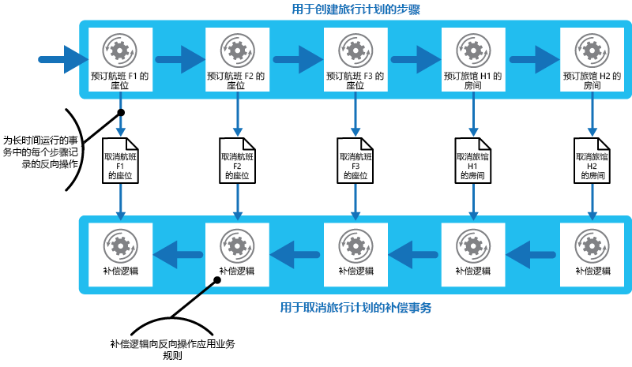

# 补偿事务模式Compensating Transaction pattern

[!INCLUDE [header](../_includes/header.md)]

撤消一系列步骤执行的工作，当一个或多个步骤失败时，这些步骤会共同定义最终一致的操作。Undo the work performed by a series of steps, which together define an eventually consistent operation, if one or more of the steps fail. 遵循最终一致性模型的操作常见于实现复杂业务流程和工作流的云托管应用程序中。Operations that follow the eventual consistency model are commonly found in cloud-hosted applications that implement complex business processes and workflows.

## 上下文和问题Context and problem

云中运行的应用程序经常修改数据。Applications running in the cloud frequently modify data. 该数据可能在不同的地理位置中的多个数据源间传播。This data might be spread across various data sources held in different geographic locations. 为避免争用和提高分布式环境中的性能，应用程序不应提供事务强一致性。To avoid contention and improve performance in a distributed environment, an application shouldn't try to provide strong transactional consistency. 相反，应用程序应实现最终一致性。Rather, the application should implement eventual consistency. 在此模型中，典型的业务操作包含一系列单独的步骤。In this model, a typical business operation consists of a series of separate steps. 虽然在执行这些步骤的期间，系统状态的总体视图可能会不一致，但操作完成且所有的步骤执行后，系统会再次变得一致。While these steps are being performed, the overall view of the system state might be inconsistent, but when the operation has completed and all of the steps have been executed the system should become consistent again.

> [Data Consistency Primer](https://msdn.microsoft.com/library/dn589800.aspx)（数据一致性入门）提供了分布式事务缩放性不佳的原因以及有关最终一致性模型原则的信息。The [Data Consistency Primer](https://msdn.microsoft.com/library/dn589800.aspx) provides information about why distributed transactions don't scale well, and the principles of the eventual consistency model.

最终一致性模型中的一个难题是如何处理失败步骤。A challenge in the eventual consistency model is how to handle a step that has failed. 这种情况下，可能需要撤销此操作中先前步骤已完成的所有工作。In this case it might be necessary to undo all of the work completed by the previous steps in the operation. 然而，数据不能回滚，因为应用程序的其他并发实例可能已更改了数据。However, the data can't simply be rolled back because other concurrent instances of the application might have changed it. 即使在数据并未被并发实例更改的情况下，撤销步骤也可能不仅仅是还原原始状态。Even in cases where the data hasn't been changed by a concurrent instance, undoing a step might not simply be a matter of restoring the original state. 可能需要应用多种业务特定规则（参阅示例部分中所述的旅行网站）。It might be necessary to apply various business-specific rules (see the travel website described in the Example section).

如果实现最终一致性的操作跨多个异类数据存储，则撤销操作中的步骤需要依次访问每个数据存储。If an operation that implements eventual consistency spans several heterogeneous data stores, undoing the steps in the operation will require visiting each data store in turn. 必须以可靠方式撤销每个数据存储中执行的工作，以此防止系统保持不一致。The work performed in every data store must be undone reliably to prevent the system from remaining inconsistent.

并非所有受实现最终一致性操作影响的数据都可能保留在数据库中。Not all data affected by an operation that implements eventual consistency might be held in a database. 在面向服务的体系结构 (SOA) 环境中，操作可能会调用服务中的操作，并导致该服务的状态发生更改。In a service oriented architecture (SOA) environment an operation could invoke an action in a service, and cause a change in the state held by that service. 若要撤消该操作，则也必须撤消该状态更改。To undo the operation, this state change must also be undone. 这可能涉及到再次调用服务和再执行一个撤销第一次操作效果的操作。This can involve invoking the service again and performing another action that reverses the effects of the first.

## 解决方案Solution

解决方案是实现补偿事务。The solution is to implement a compensating transaction. 补偿事务中的步骤必须撤销原始操作中步骤的效果。The steps in a compensating transaction must undo the effects of the steps in the original operation. 补偿事务可能无法仅将当前状态替换为此操作开始时系统所处的状态，因为此方法可能会覆盖由应用程序其他并发实例所作的更改。A compensating transaction might not be able to simply replace the current state with the state the system was in at the start of the operation because this approach could overwrite changes made by other concurrent instances of an application. 相反，必须是一个智能过程，该智能过程会考虑到并发实例执行的所有工作。Instead, it must be an intelligent process that takes into account any work done by concurrent instances. 该过程通常特定于应用程序，由原始操作执行的工作的性质驱动。This process will usually be application specific, driven by the nature of the work performed by the original operation.

常见方法是使用工作流来实现需要补偿的最终一致操作。A common approach is to use a workflow to implement an eventually consistent operation that requires compensation. 原始操作进行期间，系统会记录每个步骤以及如何可撤销相应步骤执行的操作的相关信息。As the original operation proceeds, the system records information about each step and how the work performed by that step can be undone. 如果操作在任何时刻失败，则工作流会回退已完成的步骤，并撤销每个步骤。If the operation fails at any point, the workflow rewinds back through the steps it's completed and performs the work that reverses each step. 请注意，补偿事务可能并非必须按照原始操作的逆序来撤销工作，其可能会并行执行部分撤销步骤。Note that a compensating transaction might not have to undo the work in the exact reverse order of the original operation, and it might be possible to perform some of the undo steps in parallel.

> 这种方法类似于 [Clemens Vasters 博客](http://vasters.com/clemensv/2012/09/01/Sagas.aspx)中所述的 Sagas 策略。This approach is similar to the Sagas strategy discussed in [Clemens Vasters’ blog](http://vasters.com/clemensv/2012/09/01/Sagas.aspx).

补偿事务也是最终一致操作，并且也可能会失败。A compensating transaction is also an eventually consistent operation and it could also fail. 系统应能够在失败时恢复补偿事务，然后继续。The system should be able to resume the compensating transaction at the point of failure and continue. 可能需要重复已失败的步骤，因此补偿事务中的步骤应定义为幂等命令。It might be necessary to repeat a step that's failed, so the steps in a compensating transaction should be defined as idempotent commands. 有关详细信息，请参阅 Jonathan Oliver 博客中的 [Idempotency Patterns](http://blog.jonathanoliver.com/2010/04/idempotency-patterns/)（幂等模式）。For more information, see [Idempotency Patterns](http://blog.jonathanoliver.com/2010/04/idempotency-patterns/) on Jonathan Oliver’s blog.

某些情况下，除非手动干预，否则可能无法恢复已失败的步骤。In some cases it might not be possible to recover from a step that has failed except through manual intervention. 这类情况下，系统应会发出警报，并会提供尽可能多的有关失败原因的信息。In these situations the system should raise an alert and provide as much information as possible about the reason for the failure.

## 问题和注意事项Issues and considerations

在决定如何实现此模式时，请考虑以下几点：Consider the following points when deciding how to implement this pattern:

确定实现最终一致性的操作中的步骤何时失败并非易事。It might not be easy to determine when a step in an operation that implements eventual consistency has failed. 步骤可能不会立即失败，相反，其可能会阻止。A step might not fail immediately, but instead could block. 可能需要实现某种形式的超时机制。It might be necessary to implement some form of time-out mechanism.

—归纳补偿逻辑并不可行。-Compensation logic isn't easily generalized. 补偿事务特定于应用程序。A compensating transaction is application specific. 它依赖于具有足够信息的应用程序，从而能够撤消失败的操作中每个步骤的效果。It relies on the application having sufficient information to be able to undo the effects of each step in a failed operation.

应将补偿事务中的步骤定义为幂等命令。You should define the steps in a compensating transaction as idempotent commands. 这样，补偿事务自身失败时可重复步骤。This enables the steps to be repeated if the compensating transaction itself fails.

处理该原始操作中步骤的基础结构和补偿事务必须具有复原性。The infrastructure that handles the steps in the original operation, and the compensating transaction, must be resilient. 其不得丢失补偿失败步骤所需信息，且必须能够可靠地监视补偿逻辑的进程。It must not lose the information required to compensate for a failing step, and it must be able to reliably monitor the progress of the compensation logic.

补偿事务不一定会将系统中的数据返回到原始操作开始时其所处的状态。A compensating transaction doesn't necessarily return the data in the system to the state it was in at the start of the original operation. 相反，它补偿操作失败前由已成功完成的步骤所执行的工作。Instead, it compensates for the work performed by the steps that completed successfully before the operation failed.

补偿事务中步骤的顺序不一定与原始操作中步骤的顺序完全相反。The order of the steps in the compensating transaction doesn't necessarily have to be the exact opposite of the steps in the original operation. 例如，一个数据存储可能比另一个数据存储对不一致性更加敏感，因而补偿事务中撤销对此存储的更改的步骤应该会首先发生。For example, one data store might be more sensitive to inconsistencies than another, and so the steps in the compensating transaction that undo the changes to this store should occur first.

对完成操作所需的每个资源采用短期的基于超时的锁并预先获取这些资源，这样有助于增加总体活动成功的可能性。Placing a short-term timeout-based lock on each resource that's required to complete an operation, and obtaining these resources in advance, can help increase the likelihood that the overall activity will succeed. 仅在获取所有资源后才应执行工作。The work should be performed only after all the resources have been acquired. 锁过期之前必须完成所有操作。All actions must be finalized before the locks expire.

考虑使用包容性更强的重试逻辑来尽可能避免会触发补偿事务的失败。Consider using retry logic that is more forgiving than usual to minimize failures that trigger a compensating transaction. 如果实现最终一致性操作中的步骤失败，请尝试会失败处理为暂时异常，然后重复相应步骤。If a step in an operation that implements eventual consistency fails, try handling the failure as a transient exception and repeat the step. 仅在步骤出现反复失败或不可恢复性失败时停止操作并启动补偿事务。Only stop the operation and initiate a compensating transaction if a step fails repeatedly or irrecoverably.

> 实现补偿事务的许多难题与实现最终一致性中的难题相同。Many of the challenges of implementing a compensating transaction are the same as those with implementing eventual consistency. 有关详细信息，请参阅 [Data Consistency Primer](https://msdn.microsoft.com/library/dn589800.aspx)（数据一致性入门）中的“实现最终一致性注意事项”部分。See the section Considerations for Implementing Eventual Consistency in the [Data Consistency Primer](https://msdn.microsoft.com/library/dn589800.aspx) for more information.

## 何时使用此模式When to use this pattern

仅对失败时必须撤销的操作使用此模式。Use this pattern only for operations that must be undone if they fail. 如果可能，请设计相关解决方案来避免需要补偿事务所带来的麻烦。If possible, design solutions to avoid the complexity of requiring compensating transactions.

## 示例Example

旅行网站让客户订购旅行路线。A travel website lets customers book itineraries. 单个路线可能包含一系列航班和酒店。A single itinerary might comprise a series of flights and hotels. 一位先从西雅图到伦敦再到巴黎的客户在创建路线时，可执行以下步骤：A customer traveling from Seattle to London and then on to Paris could perform the following steps when creating an itinerary:

1. 订购从西雅图到伦敦的 F1 航班机票。Book a seat on flight F1 from Seattle to London.
2. 订购从伦敦到巴黎的 F2 航班机票。Book a seat on flight F2 from London to Paris.
3. 订购从巴黎到西雅图的 F3 航班机票。Book a seat on flight F3 from Paris to Seattle.
4. 预定伦敦 H1 酒店房间。Reserve a room at hotel H1 in London.
5. 预定巴黎 H2 酒店房间。Reserve a room at hotel H2 in Paris.

虽然每个步骤为单独操作，但这些步骤会构成一个最终一致操作。These steps constitute an eventually consistent operation, although each step is a separate action. 因此，除执行这些步骤外，系统也必须记录撤销每个步骤所需的对立操作，以处理客户取消路线的情况。Therefore, as well as performing these steps, the system must also record the counter operations necessary to undo each step in case the customer decides to cancel the itinerary. 之后，执行对立操作所需的步骤可作为补偿事务运行。The steps necessary to perform the counter operations can then run as a compensating transaction.

请注意，补偿事务中的步骤与原始步骤的顺序可能会不正好相反，且补偿事务中每个步骤中的逻辑必须要考虑到特定于业务的规则。Notice that the steps in the compensating transaction might not be the exact opposite of the original steps, and the logic in each step in the compensating transaction must take into account any business-specific rules. 例如，如果取消航班机票订购，客户可能不会享有已支付金额的全额退款。For example, unbooking a seat on a flight might not entitle the customer to a complete refund of any money paid. 该图介绍了生成补偿事务来撤销长时间运行的事务，从而来订购旅行路线。The figure illustrates generating a compensating transaction to undo a long-running transaction to book a travel itinerary.

> 补偿事务中的步骤可能会并行执行，具体取决于每个步骤的补偿逻辑的设计方式。It might be possible for the steps in the compensating transaction to be performed in parallel, depending on how you've designed the compensating logic for each step.

在许多业务解决方案中，单个步骤失败并不始终要求通过使用补偿事务回滚系统。In many business solutions, failure of a single step doesn't always necessitate rolling the system back by using a compensating transaction. 例如，如果&mdash;在旅行网站上预订航班 F1、F2 和 F3 后&mdash;，客户无法预订 H1 酒店的房间，则首选方案是为客户提供该市另一家酒店的房间，而不是取消航班。For example, if&mdash;after having booked flights F1, F2, and F3 in the travel website scenario&mdash;the customer is unable to reserve a room at hotel H1, it's preferable to offer the customer a room at a different hotel in the same city rather than canceling the flights. 客户仍可决定取消（这种情况下，会运行补偿事务并撤销 F1、F2 和 F3 航班预订），但应由客户而不是系统作出此决定。The customer can still decide to cancel (in which case the compensating transaction runs and undoes the bookings made on flights F1, F2, and F3), but this decision should be made by the customer rather than by the system.

## 相关模式和指南Related patterns and guidance

实现此模式时可能，可能也会与以下模式和指南相关：The following patterns and guidance might also be relevant when implementing this pattern:

- [Data consistency primer](https://msdn.microsoft.com/library/dn589800.aspx)（数据一致性入门）。[Data Consistency Primer](https://msdn.microsoft.com/library/dn589800.aspx). 补偿事务模式通常用于撤消实现最终一致性模型的操作。The Compensating Transaction pattern is often used to undo operations that implement the eventual consistency model. 该入门指导提供了有关最终一致性优点和不足的信息。This primer provides information on the benefits and tradeoffs of eventual consistency.

- [计划程序代理监督模式](scheduler-agent-supervisor.md)。[Scheduler-Agent-Supervisor Pattern](scheduler-agent-supervisor.md). 介绍如何实现弹性系统，这些弹性系统执行使用分布式服务和资源的业务操作。Describes how to implement resilient systems that perform business operations that use distributed services and resources. 有时，可能需要使用补偿事务来撤销操作执行的工作。Sometimes, it might be necessary to undo the work performed by an operation by using a compensating transaction.

- [重试模式](./retry.md)。[Retry Pattern](./retry.md). 补偿事务执行成本比较高，因此可按照重试模式，通过实现有效的重试失败策略来尽可能少地使用补偿事务。Compensating transactions can be expensive to perform, and it might be possible to minimize their use by implementing an effective policy of retrying failing operations by following the Retry pattern.
