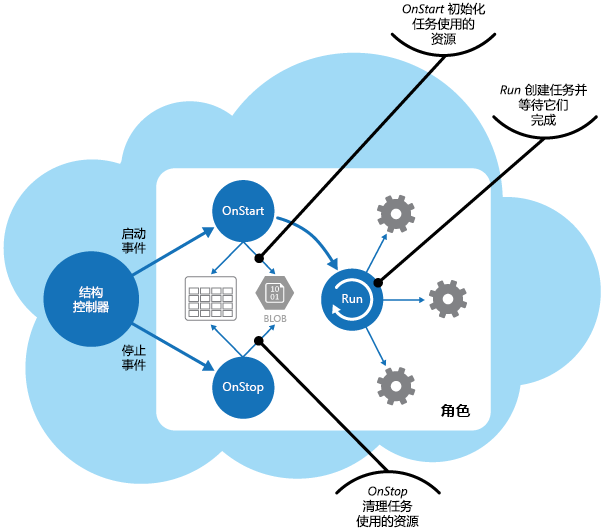

# <a name="compute-resource-consolidation-pattern"></a><span data-ttu-id="80df5-104">计算资源合并模式</span><span class="sxs-lookup"><span data-stu-id="80df5-104">Compute Resource Consolidation pattern</span></span>

[!INCLUDE [header](../_includes/header.md)]

<span data-ttu-id="80df5-105">将多个任务或操作合并到单个计算单元。</span><span class="sxs-lookup"><span data-stu-id="80df5-105">Consolidate multiple tasks or operations into a single computational unit.</span></span> <span data-ttu-id="80df5-106">这可以提高计算资源利用率，并减少与在云托管应用程序中执行计算处理关联的成本和管理开销。</span><span class="sxs-lookup"><span data-stu-id="80df5-106">This can increase compute resource utilization, and reduce the costs and management overhead associated with performing compute processing in cloud-hosted applications.</span></span>

## <a name="context-and-problem"></a><span data-ttu-id="80df5-107">上下文和问题</span><span class="sxs-lookup"><span data-stu-id="80df5-107">Context and problem</span></span>

<span data-ttu-id="80df5-108">云应用程序通常实现各种操作。</span><span class="sxs-lookup"><span data-stu-id="80df5-108">A cloud application often implements a variety of operations.</span></span> <span data-ttu-id="80df5-109">在某些解决方案中，合理的做法是最初遵循问题分离的设计原则，将这些操作划分成分别进行托管和部署的单独计算单元（例如，作为单独的应用服务 Web 应用、单独的虚拟机或单独的云服务角色）。</span><span class="sxs-lookup"><span data-stu-id="80df5-109">In some solutions it makes sense to follow the design principle of separation of concerns initially, and divide these operations into separate computational units that are hosted and deployed individually (for example, as separate App Service web apps, separate Virtual Machines, or separate Cloud Service roles).</span></span> <span data-ttu-id="80df5-110">但是，虽然此策略可以帮助简化解决方案的逻辑设计，不过将大量计算单元作为相同应用程序的一部分进行部署可能会增加运行时托管成本并使系统管理更复杂。</span><span class="sxs-lookup"><span data-stu-id="80df5-110">However, although this strategy can help simplify the logical design of the solution, deploying a large number of computational units as part of the same application can increase runtime hosting costs and make management of the system more complex.</span></span>

<span data-ttu-id="80df5-111">作为示例，下图显示使用多个计算单元实现的云托管解决方案的简化结构。</span><span class="sxs-lookup"><span data-stu-id="80df5-111">As an example, the figure shows the simplified structure of a cloud-hosted solution that is implemented using more than one computational unit.</span></span> <span data-ttu-id="80df5-112">每个计算单元都在其自己的虚拟环境中运行。</span><span class="sxs-lookup"><span data-stu-id="80df5-112">Each computational unit runs in its own virtual environment.</span></span> <span data-ttu-id="80df5-113">每个函数都作为在其自己的计算单元中运行的单独任务（标记为任务 A 到任务 E）来实现。</span><span class="sxs-lookup"><span data-stu-id="80df5-113">Each function has been implemented as a separate task (labeled Task A through Task E) running in its own computational unit.</span></span>


<span data-ttu-id="80df5-115">每个计算单元都会消耗应计费资源，即使它处于空闲状态或不常使用。</span><span class="sxs-lookup"><span data-stu-id="80df5-115">Each computational unit consumes chargeable resources, even when it's idle or lightly used.</span></span> <span data-ttu-id="80df5-116">因此，这并不总是最经济高效的解决方案。</span><span class="sxs-lookup"><span data-stu-id="80df5-116">Therefore, this isn't always the most cost-effective solution.</span></span>

<span data-ttu-id="80df5-117">在 Azure 中，此问题适用于云服务、应用服务和虚拟机中的角色。</span><span class="sxs-lookup"><span data-stu-id="80df5-117">In Azure, this concern applies to roles in a Cloud Service, App Services, and Virtual Machines.</span></span> <span data-ttu-id="80df5-118">这些项在其自己的虚拟环境中运行。</span><span class="sxs-lookup"><span data-stu-id="80df5-118">These items run in their own virtual environment.</span></span> <span data-ttu-id="80df5-119">运行设计为执行一组定义完善的操作，但需要作为单个解决方案的一部分进行通信和协作的单独角色、网站或虚拟机的集合可能对资源的使用较为低效。</span><span class="sxs-lookup"><span data-stu-id="80df5-119">Running a collection of separate roles, websites, or virtual machines that are designed to perform a set of well-defined operations, but that need to communicate and cooperate as part of a single solution, can be an inefficient use of resources.</span></span>

## <a name="solution"></a><span data-ttu-id="80df5-120">解决方案</span><span class="sxs-lookup"><span data-stu-id="80df5-120">Solution</span></span>

<span data-ttu-id="80df5-121">若要帮助降低成本、提高利用率、加快通信速度并减少管理，可以将多个任务或操作合并到单个计算单元。</span><span class="sxs-lookup"><span data-stu-id="80df5-121">To help reduce costs, increase utilization, improve communication speed, and reduce management it's possible to consolidate multiple tasks or operations into a single computational unit.</span></span>

<span data-ttu-id="80df5-122">任务可以按照基于环境提供的功能以及与这些功能关联的成本的条件进行分组。</span><span class="sxs-lookup"><span data-stu-id="80df5-122">Tasks can be grouped according to criteria based on the features provided by the environment and the costs associated with these features.</span></span> <span data-ttu-id="80df5-123">一种常见方法是查找在其可伸缩性、生存期和处理要求方面具有类似特征的任务。</span><span class="sxs-lookup"><span data-stu-id="80df5-123">A common approach is to look for tasks that have a similar profile concerning their scalability, lifetime, and processing requirements.</span></span> <span data-ttu-id="80df5-124">将它们组合在一起可使它们作为一个单元进行缩放。</span><span class="sxs-lookup"><span data-stu-id="80df5-124">Grouping these together allows them to scale as a unit.</span></span> <span data-ttu-id="80df5-125">借助许多云环境提供的弹性，可以根据工作负载来启动和停止计算单元的附加实例。</span><span class="sxs-lookup"><span data-stu-id="80df5-125">The elasticity provided by many cloud environments enables additional instances of a computational unit to be started and stopped according to the workload.</span></span> <span data-ttu-id="80df5-126">例如，Azure 提供自动缩放功能，可以应用于云服务、应用服务和虚拟机中的角色。</span><span class="sxs-lookup"><span data-stu-id="80df5-126">For example, Azure provides autoscaling that you can apply to roles in a Cloud Service, App Services, and Virtual Machines.</span></span> <span data-ttu-id="80df5-127">有关详细信息，请参阅 [Autoscaling Guidance](https://msdn.microsoft.com/library/dn589774.aspx)（自动缩放指南）。</span><span class="sxs-lookup"><span data-stu-id="80df5-127">For more information, see [Autoscaling Guidance](https://msdn.microsoft.com/library/dn589774.aspx).</span></span>

<span data-ttu-id="80df5-128">作为用于演示如何使用可伸缩性确定不应组合在一起的操作的计数器示例，请考虑以下两个任务：</span><span class="sxs-lookup"><span data-stu-id="80df5-128">As a counter example to show how scalability can be used to determine which operations shouldn't be grouped together, consider the following two tasks:</span></span>

- <span data-ttu-id="80df5-129">任务 1 轮询发送给队列的对时间不敏感的少见消息。</span><span class="sxs-lookup"><span data-stu-id="80df5-129">Task 1 polls for infrequent, time-insensitive messages sent to a queue.</span></span>
- <span data-ttu-id="80df5-130">任务 2 处理大量网络流量突发。</span><span class="sxs-lookup"><span data-stu-id="80df5-130">Task 2 handles high-volume bursts of network traffic.</span></span>

<span data-ttu-id="80df5-131">第二个任务需要可能会涉及到启动和停止大量计算单元实例的弹性。</span><span class="sxs-lookup"><span data-stu-id="80df5-131">The second task requires elasticity that can involve starting and stopping a large number of instances of the computational unit.</span></span> <span data-ttu-id="80df5-132">将相同缩放应用于第一个任务只会导致更多任务在相同队列中侦听少见消息，是一种资源浪费。</span><span class="sxs-lookup"><span data-stu-id="80df5-132">Applying the same scaling to the first task would simply result in more tasks listening for infrequent messages on the same queue, and is a waste of resources.</span></span>

<span data-ttu-id="80df5-133">在许多云环境中，可以在 CPU 核心数、内存、磁盘空间等方面指定可供计算单元使用的资源。</span><span class="sxs-lookup"><span data-stu-id="80df5-133">In many cloud environments it's possible to specify the resources available to a computational unit in terms of the number of CPU cores, memory, disk space, and so on.</span></span> <span data-ttu-id="80df5-134">一般情况下，指定的资源越多，成本便越高。</span><span class="sxs-lookup"><span data-stu-id="80df5-134">Generally, the more resources specified, the greater the cost.</span></span> <span data-ttu-id="80df5-135">为了节省资金，请务必最大程度提高昂贵计算单元执行的工作量，不要让它长时间处于非活动状态。</span><span class="sxs-lookup"><span data-stu-id="80df5-135">To save money, it's important to maximize the work an expensive computational unit performs, and not let it become inactive for an extended period.</span></span>

<span data-ttu-id="80df5-136">如果有在短暂突发中需要大量 CPU 能力的任务，请考虑将这些任务合并到可提供所需能力的单个计算单元。</span><span class="sxs-lookup"><span data-stu-id="80df5-136">If there are tasks that require a great deal of CPU power in short bursts, consider consolidating these into a single computational unit that provides the necessary power.</span></span> <span data-ttu-id="80df5-137">但是，请务必平衡此需求以使昂贵资源在面对可能发生的争用（如果它们处于超负荷状态）时保持繁忙状态。</span><span class="sxs-lookup"><span data-stu-id="80df5-137">However, it's important to balance this need to keep expensive resources busy against the contention that could occur if they are over stressed.</span></span> <span data-ttu-id="80df5-138">例如，长时间运行的计算密集型任务不应共享相同的计算单元。</span><span class="sxs-lookup"><span data-stu-id="80df5-138">Long-running, compute-intensive tasks shouldn't share the same computational unit, for example.</span></span>

## <a name="issues-and-considerations"></a><span data-ttu-id="80df5-139">问题和注意事项</span><span class="sxs-lookup"><span data-stu-id="80df5-139">Issues and considerations</span></span>

<span data-ttu-id="80df5-140">在实现此模式时，请考虑以下几点：</span><span class="sxs-lookup"><span data-stu-id="80df5-140">Consider the following points when implementing this pattern:</span></span>

<span data-ttu-id="80df5-141">**可伸缩性和弹性**。</span><span class="sxs-lookup"><span data-stu-id="80df5-141">**Scalability and elasticity**.</span></span> <span data-ttu-id="80df5-142">许多云解决方案通过启动和停止计算单元实例，在计算单元级别实现可伸缩性和弹性。</span><span class="sxs-lookup"><span data-stu-id="80df5-142">Many cloud solutions implement scalability and elasticity at the level of the computational unit by starting and stopping instances of units.</span></span> <span data-ttu-id="80df5-143">应避免将具有冲突可伸缩性要求的任务分组到相同计算单元中。</span><span class="sxs-lookup"><span data-stu-id="80df5-143">Avoid grouping tasks that have conflicting scalability requirements in the same computational unit.</span></span>

<span data-ttu-id="80df5-144">**生存期**。</span><span class="sxs-lookup"><span data-stu-id="80df5-144">**Lifetime**.</span></span> <span data-ttu-id="80df5-145">云基础结构会定期回收托管计算单元的虚拟环境。</span><span class="sxs-lookup"><span data-stu-id="80df5-145">The cloud infrastructure periodically recycles the virtual environment that hosts a computational unit.</span></span> <span data-ttu-id="80df5-146">当一个计算单元中存在许多长时间运行的任务时，可能需要配置该单元以防止在这些任务完成之前回收它。</span><span class="sxs-lookup"><span data-stu-id="80df5-146">When there are many long-running tasks inside a computational unit, it might be necessary to configure the unit to prevent it from being recycled until these tasks have finished.</span></span> <span data-ttu-id="80df5-147">或者，使用检查点方法设计任务，该方法使任务可完全停止，然后在计算单元重新启动时在中断位置处继续执行。</span><span class="sxs-lookup"><span data-stu-id="80df5-147">Alternatively, design the tasks by using a check-pointing approach that enables them to stop cleanly, and continue at the point they were interrupted when the computational unit is restarted.</span></span>

<span data-ttu-id="80df5-148">**发布节奏**。</span><span class="sxs-lookup"><span data-stu-id="80df5-148">**Release cadence**.</span></span> <span data-ttu-id="80df5-149">如果任务的实现或配置经常更改，则可能需要停止托管更新的代码的计算单元，重新配置和重新部署该单元，然后重新启动它。</span><span class="sxs-lookup"><span data-stu-id="80df5-149">If the implementation or configuration of a task changes frequently, it might be necessary to stop the computational unit hosting the updated code, reconfigure and redeploy the unit, and then restart it.</span></span> <span data-ttu-id="80df5-150">此过程还需要相同计算单元中的所有其他任务停止、重新部署并重新启动。</span><span class="sxs-lookup"><span data-stu-id="80df5-150">This process will also require that all other tasks within the same computational unit are stopped, redeployed, and restarted.</span></span>

<span data-ttu-id="80df5-151">**安全性**。</span><span class="sxs-lookup"><span data-stu-id="80df5-151">**Security**.</span></span> <span data-ttu-id="80df5-152">相同计算单元中的任务可能会共享相同安全性上下文，并能够访问相同资源。</span><span class="sxs-lookup"><span data-stu-id="80df5-152">Tasks in the same computational unit might share the same security context and be able to access the same resources.</span></span> <span data-ttu-id="80df5-153">任务之间必须存在高度信任，并且确信一个任务不会对其他任务造成损坏或产生负面影响。</span><span class="sxs-lookup"><span data-stu-id="80df5-153">There must be a high degree of trust between the tasks, and confidence that one task isn't going to corrupt or adversely affect another.</span></span> <span data-ttu-id="80df5-154">此外，增加在计算单元中运行的任务数会增大单元的攻击面。</span><span class="sxs-lookup"><span data-stu-id="80df5-154">Additionally, increasing the number of tasks running in a computational unit increases the attack surface of the unit.</span></span> <span data-ttu-id="80df5-155">每个任务的安全性只与具有最多漏洞的任务相同。</span><span class="sxs-lookup"><span data-stu-id="80df5-155">Each task is only as secure as the one with the most vulnerabilities.</span></span>

<span data-ttu-id="80df5-156">**容错**。</span><span class="sxs-lookup"><span data-stu-id="80df5-156">**Fault tolerance**.</span></span> <span data-ttu-id="80df5-157">如果计算单元中的一个任务失败或行为异常，则它可能会影响在相同单元中运行的其他任务。</span><span class="sxs-lookup"><span data-stu-id="80df5-157">If one task in a computational unit fails or behaves abnormally, it can affect the other tasks running within the same unit.</span></span> <span data-ttu-id="80df5-158">例如，如果一个任务未能正确启动，则它可能会导致计算单元的整个启动逻辑失败，并阻止相同单元中的其他任务运行。</span><span class="sxs-lookup"><span data-stu-id="80df5-158">For example, if one task fails to start correctly it can cause the entire startup logic for the computational unit to fail, and prevent other tasks in the same unit from running.</span></span>

<span data-ttu-id="80df5-159">**争用**。</span><span class="sxs-lookup"><span data-stu-id="80df5-159">**Contention**.</span></span> <span data-ttu-id="80df5-160">应避免在相同计算单元中的任务之间出现竞争资源的争用。</span><span class="sxs-lookup"><span data-stu-id="80df5-160">Avoid introducing contention between tasks that compete for resources in the same computational unit.</span></span> <span data-ttu-id="80df5-161">理想情况下，共享相同计算单元的任务应表现出不同的资源利用率特征。</span><span class="sxs-lookup"><span data-stu-id="80df5-161">Ideally, tasks that share the same computational unit should exhibit different resource utilization characteristics.</span></span> <span data-ttu-id="80df5-162">例如，两个计算密集型任务不应位于相同计算单元中，两个占用大量内存的任务也是如此。</span><span class="sxs-lookup"><span data-stu-id="80df5-162">For example, two compute-intensive tasks should probably not reside in the same computational unit, and neither should two tasks that consume large amounts of memory.</span></span> <span data-ttu-id="80df5-163">但是，混合使用计算密集型任务与需要大量内存的任务是可行的组合。</span><span class="sxs-lookup"><span data-stu-id="80df5-163">However, mixing a compute intensive task with a task that requires a large amount of memory is a workable combination.</span></span>

> [!NOTE]
>  <span data-ttu-id="80df5-164">可考虑仅对已在一段时间内处于生产环境的系统合并计算资源，以便操作员和开发人员可以监视系统并创建标识每个任务如何利用不同资源的热度地图。</span><span class="sxs-lookup"><span data-stu-id="80df5-164">Consider consolidating compute resources only for a system that's been in production for a period of time so that operators and developers can monitor the system and create a _heat map_ that identifies how each task utilizes differing resources.</span></span> <span data-ttu-id="80df5-165">此地图可以用于确定非常适合用于共享计算资源的任务。</span><span class="sxs-lookup"><span data-stu-id="80df5-165">This map can be used to determine which tasks are good candidates for sharing compute resources.</span></span>

<span data-ttu-id="80df5-166">**复杂性**。</span><span class="sxs-lookup"><span data-stu-id="80df5-166">**Complexity**.</span></span> <span data-ttu-id="80df5-167">将多个任务合并到单个计算单元会向单元中的代码增加复杂性，从而更加难以进行测试、调试和维护。</span><span class="sxs-lookup"><span data-stu-id="80df5-167">Combining multiple tasks into a single computational unit adds complexity to the code in the unit, possibly making it more difficult to test, debug, and maintain.</span></span>

<span data-ttu-id="80df5-168">**稳定的逻辑体系结构**。</span><span class="sxs-lookup"><span data-stu-id="80df5-168">**Stable logical architecture**.</span></span> <span data-ttu-id="80df5-169">设计和实现每个任务中的代码，以便即使运行任务的物理环境发生更改也无需更改代码。</span><span class="sxs-lookup"><span data-stu-id="80df5-169">Design and implement the code in each task so that it shouldn't need to change, even if the physical environment the task runs in does change.</span></span>

<span data-ttu-id="80df5-170">**其他策略**。</span><span class="sxs-lookup"><span data-stu-id="80df5-170">**Other strategies**.</span></span> <span data-ttu-id="80df5-171">合并计算资源只是可帮助降低与并发运行多个任务关联的成本的一种方式。</span><span class="sxs-lookup"><span data-stu-id="80df5-171">Consolidating compute resources is only one way to help reduce costs associated with running multiple tasks concurrently.</span></span> <span data-ttu-id="80df5-172">它需要进行仔细规划和监视以确保保持为有效方法。</span><span class="sxs-lookup"><span data-stu-id="80df5-172">It requires careful planning and monitoring to ensure that it remains an effective approach.</span></span> <span data-ttu-id="80df5-173">其他策略可能更为合适，具体取决于工作的性质以及运行这些任务的用户所处的位置。</span><span class="sxs-lookup"><span data-stu-id="80df5-173">Other strategies might be more appropriate, depending on the nature of the work and where the users these tasks are running are located.</span></span> <span data-ttu-id="80df5-174">例如，工作负载的功能分解（如[计算分区指南](https://msdn.microsoft.com/library/dn589773.aspx)中所述）可能是更好的选择。</span><span class="sxs-lookup"><span data-stu-id="80df5-174">For example, functional decomposition of the workload (as described by the [Compute Partitioning Guidance](https://msdn.microsoft.com/library/dn589773.aspx)) might be a better option.</span></span>

## <a name="when-to-use-this-pattern"></a><span data-ttu-id="80df5-175">何时使用此模式</span><span class="sxs-lookup"><span data-stu-id="80df5-175">When to use this pattern</span></span>

<span data-ttu-id="80df5-176">对于在其自己的计算单元中运行时不怎么经济高效的任务，可使用此模式。</span><span class="sxs-lookup"><span data-stu-id="80df5-176">Use this pattern for tasks that are not cost effective if they run in their own computational units.</span></span> <span data-ttu-id="80df5-177">如果任务长时间处于空闲状态，则在专用单元中运行此任务可能成本高昂。</span><span class="sxs-lookup"><span data-stu-id="80df5-177">If a task spends much of its time idle, running this task in a dedicated unit can be expensive.</span></span>

<span data-ttu-id="80df5-178">此模式可能不适合执行关键容错操作的任务，或是处理高度敏感或私有数据并需要其自己的安全性上下文的任务。</span><span class="sxs-lookup"><span data-stu-id="80df5-178">This pattern might not be suitable for tasks that perform critical fault-tolerant operations, or tasks that process highly sensitive or private data and require their own security context.</span></span> <span data-ttu-id="80df5-179">这些任务应在其自己的隔离环境、在单独的计算单元中运行。</span><span class="sxs-lookup"><span data-stu-id="80df5-179">These tasks should run in their own isolated environment, in a separate computational unit.</span></span>

## <a name="example"></a><span data-ttu-id="80df5-180">示例</span><span class="sxs-lookup"><span data-stu-id="80df5-180">Example</span></span>

<span data-ttu-id="80df5-181">在 Azure 上构建云服务时，可以将多个任务执行的处理合并到单个角色。</span><span class="sxs-lookup"><span data-stu-id="80df5-181">When building a cloud service on Azure, it’s possible to consolidate the processing performed by multiple tasks into a single role.</span></span> <span data-ttu-id="80df5-182">通常，这是执行后台或异步处理任务的辅助角色。</span><span class="sxs-lookup"><span data-stu-id="80df5-182">Typically this is a worker role that performs background or asynchronous processing tasks.</span></span>

> <span data-ttu-id="80df5-183">在某些情况下，可以在 Web 角色中包含后台或异步处理任务。</span><span class="sxs-lookup"><span data-stu-id="80df5-183">In some cases it's possible to include background or asynchronous processing tasks in the web role.</span></span> <span data-ttu-id="80df5-184">此方法可帮助降低成本和简化部署，尽管它可能会影响 Web 角色提供的面向公众的接口的可伸缩性和响应能力。</span><span class="sxs-lookup"><span data-stu-id="80df5-184">This technique helps to reduce costs and simplify deployment, although it can impact the scalability and responsiveness of the public-facing interface provided by the web role.</span></span> <span data-ttu-id="80df5-185">[将多个 Azure 辅助角色合并到 Azure Web 角色](http://www.31a2ba2a-b718-11dc-8314-0800200c9a66.com/2012/02/combining-multiple-azure-worker-roles.html)一文包含在 Web 角色中实现后台或异步处理任务的详细说明。</span><span class="sxs-lookup"><span data-stu-id="80df5-185">The article [Combining Multiple Azure Worker Roles into an Azure Web Role](http://www.31a2ba2a-b718-11dc-8314-0800200c9a66.com/2012/02/combining-multiple-azure-worker-roles.html) contains a detailed description of implementing background or asynchronous processing tasks in a web role.</span></span>

<span data-ttu-id="80df5-186">角色负责启动和停止任务。</span><span class="sxs-lookup"><span data-stu-id="80df5-186">The role is responsible for starting and stopping the tasks.</span></span> <span data-ttu-id="80df5-187">当 Azure 结构控制器加载角色时，它会对角色引发 `Start` 事件。</span><span class="sxs-lookup"><span data-stu-id="80df5-187">When the Azure fabric controller loads a role, it raises the `Start` event for the role.</span></span> <span data-ttu-id="80df5-188">可以替代 `WebRole` 或 `WorkerRole` 类的 `OnStart` 方法以处理此事件，这可能是为了初始化此方法中的任务所依赖的数据和其他资源。</span><span class="sxs-lookup"><span data-stu-id="80df5-188">You can override the `OnStart` method of the `WebRole` or `WorkerRole` class to handle this event, perhaps to initialize the data and other resources the tasks in this method depend on.</span></span>

<span data-ttu-id="80df5-189">当 `OnStart ` 方法完成时，角色可以开始响应请求。</span><span class="sxs-lookup"><span data-stu-id="80df5-189">When the `OnStart `method completes, the role can start responding to requests.</span></span> <span data-ttu-id="80df5-190">可以在模式和做法指南[将应用程序移动到](https://msdn.microsoft.com/library/ff728592.aspx)中的[应用程序启动进程](https://msdn.microsoft.com/library/ff803371.aspx#sec16)部分中找到有关在角色中使用 `OnStart` 和 `Run` 方法的详细信息和指导。</span><span class="sxs-lookup"><span data-stu-id="80df5-190">You can find more information and guidance about using the `OnStart` and `Run` methods in a role in the [Application Startup Processes](https://msdn.microsoft.com/library/ff803371.aspx#sec16) section in the patterns & practices guide [Moving Applications to the Cloud](https://msdn.microsoft.com/library/ff728592.aspx).</span></span>

> <span data-ttu-id="80df5-191">使 `OnStart` 方法中的代码尽可能简洁。</span><span class="sxs-lookup"><span data-stu-id="80df5-191">Keep the code in the `OnStart` method as concise as possible.</span></span> <span data-ttu-id="80df5-192">Azure 不会对此方法完成所花费的时间施加任何限制，但是角色在此方法完成之前，无法开始响应发送给它的网络请求。</span><span class="sxs-lookup"><span data-stu-id="80df5-192">Azure doesn't impose any limit on the time taken for this method to complete, but the role won't be able to start responding to network requests sent to it until this method completes.</span></span>

<span data-ttu-id="80df5-193">当 `OnStart` 方法完成时，角色会执行 `Run` 方法。</span><span class="sxs-lookup"><span data-stu-id="80df5-193">When the `OnStart` method has finished, the role executes the `Run` method.</span></span> <span data-ttu-id="80df5-194">此时，结构控制器可以开始将请求发送给角色。</span><span class="sxs-lookup"><span data-stu-id="80df5-194">At this point, the fabric controller can start sending requests to the role.</span></span>

<span data-ttu-id="80df5-195">将实际创建任务的代码置于 `Run` 方法中。</span><span class="sxs-lookup"><span data-stu-id="80df5-195">Place the code that actually creates the tasks in the `Run` method.</span></span> <span data-ttu-id="80df5-196">请注意，`Run` 方法定义角色实例的生存期。</span><span class="sxs-lookup"><span data-stu-id="80df5-196">Note that the `Run` method defines the lifetime of the role instance.</span></span> <span data-ttu-id="80df5-197">当此方法完成时，结构控制器会安排角色关闭。</span><span class="sxs-lookup"><span data-stu-id="80df5-197">When this method completes, the fabric controller will arrange for the role to be shut down.</span></span>

<span data-ttu-id="80df5-198">当角色关闭或回收时，结构控制器会阻止负载均衡器接收任何其他传入请求并引发 `Stop` 事件。</span><span class="sxs-lookup"><span data-stu-id="80df5-198">When a role shuts down or is recycled, the fabric controller prevents any more incoming requests being received from the load balancer and raises the `Stop` event.</span></span> <span data-ttu-id="80df5-199">可以通过替代角色的 `OnStop` 方法来捕获此事件，并执行角色终止之前所需的任何整理。</span><span class="sxs-lookup"><span data-stu-id="80df5-199">You can capture this event by overriding the `OnStop` method of the role and perform any tidying up required before the role terminates.</span></span>

> <span data-ttu-id="80df5-200">在 `OnStop` 方法中执行的任何操作都必须在五分钟（如果在本地计算机上使用 Azure 仿真器，则是 30 秒）内完成。</span><span class="sxs-lookup"><span data-stu-id="80df5-200">Any actions performed in the `OnStop` method must be completed within five minutes (or 30 seconds if you are using the Azure emulator on a local computer).</span></span> <span data-ttu-id="80df5-201">否则 Azure 结构控制器会假设角色已终止，并强制它停止。</span><span class="sxs-lookup"><span data-stu-id="80df5-201">Otherwise the Azure fabric controller assumes that the role has stalled and will force it to stop.</span></span>

<span data-ttu-id="80df5-202">任务由 `Run` 方法启动，该方法会等待任务完成。</span><span class="sxs-lookup"><span data-stu-id="80df5-202">The tasks are started by the `Run` method that waits for the tasks to complete.</span></span> <span data-ttu-id="80df5-203">任务实现云服务的业务逻辑，并可以响应通过 Azure 负载均衡器发布到角色的消息。</span><span class="sxs-lookup"><span data-stu-id="80df5-203">The tasks implement the business logic of the cloud service, and can respond to messages posted to the role through the Azure load balancer.</span></span> <span data-ttu-id="80df5-204">下图显示 Azure 云服务的角色中的任务和资源生命周期。</span><span class="sxs-lookup"><span data-stu-id="80df5-204">The figure shows the lifecycle of tasks and resources in a role in an Azure cloud service.</span></span>




<span data-ttu-id="80df5-206">ComputeResourceConsolidation.Worker 项目中的 WorkerRole.cs 文件演示如何在 Azure 云服务中实现此模式的示例。</span><span class="sxs-lookup"><span data-stu-id="80df5-206">The _WorkerRole.cs_ file in the _ComputeResourceConsolidation.Worker_ project shows an example of how you might implement this pattern in an Azure cloud service.</span></span>

> <span data-ttu-id="80df5-207">ComputeResourceConsolidation.Worker 项目是 ComputeResourceConsolidation 解决方案的一部分，可从 [GitHub](https://github.com/mspnp/cloud-design-patterns/tree/master/compute-resource-consolidation) 进行下载。</span><span class="sxs-lookup"><span data-stu-id="80df5-207">The _ComputeResourceConsolidation.Worker_ project is part of the _ComputeResourceConsolidation_ solution available for download from [GitHub](https://github.com/mspnp/cloud-design-patterns/tree/master/compute-resource-consolidation).</span></span>

<span data-ttu-id="80df5-208">`MyWorkerTask1` 和 `MyWorkerTask2` 方法演示如何在相同辅助角色中执行不同任务。</span><span class="sxs-lookup"><span data-stu-id="80df5-208">The `MyWorkerTask1` and the `MyWorkerTask2` methods illustrate how to perform different tasks within the same worker role.</span></span> <span data-ttu-id="80df5-209">以下代码演示 `MyWorkerTask1`。</span><span class="sxs-lookup"><span data-stu-id="80df5-209">The following code shows `MyWorkerTask1`.</span></span> <span data-ttu-id="80df5-210">这是一个简单任务，它会睡眠 30 秒，然后输出跟踪消息。</span><span class="sxs-lookup"><span data-stu-id="80df5-210">This is a simple task that sleeps for 30 seconds and then outputs a trace message.</span></span> <span data-ttu-id="80df5-211">它会重复此过程，直到取消任务。</span><span class="sxs-lookup"><span data-stu-id="80df5-211">It repeats this process until the task is canceled.</span></span> <span data-ttu-id="80df5-212">`MyWorkerTask2` 中的代码类似。</span><span class="sxs-lookup"><span data-stu-id="80df5-212">The code in `MyWorkerTask2` is similar.</span></span>

```csharp
// A sample worker role task.
private static async Task MyWorkerTask1(CancellationToken ct)
{
  // Fixed interval to wake up and check for work and/or do work.
  var interval = TimeSpan.FromSeconds(30);

  try
  {
    while (!ct.IsCancellationRequested)
    {
      // Wake up and do some background processing if not canceled.
      // TASK PROCESSING CODE HERE
      Trace.TraceInformation("Doing Worker Task 1 Work");

      // Go back to sleep for a period of time unless asked to cancel.
      // Task.Delay will throw an OperationCanceledException when canceled.
      await Task.Delay(interval, ct);
    }
  }
  catch (OperationCanceledException)
  {
    // Expect this exception to be thrown in normal circumstances or check
    // the cancellation token. If the role instances are shutting down, a
    // cancellation request will be signaled.
    Trace.TraceInformation("Stopping service, cancellation requested");

    // Rethrow the exception.
    throw;
  }
}
```

> <span data-ttu-id="80df5-213">该示例代码演示后台进程的常见实现。</span><span class="sxs-lookup"><span data-stu-id="80df5-213">The sample code shows a common implementation of a background process.</span></span> <span data-ttu-id="80df5-214">在实际应用程序中，可以遵循此相同结构，只不过应在等待取消请求的循环主体中放置自己的处理逻辑。</span><span class="sxs-lookup"><span data-stu-id="80df5-214">In a real world application you can follow this same structure, except that you should place your own processing logic in the body of the loop that waits for the cancellation request.</span></span>

<span data-ttu-id="80df5-215">辅助角色初始化了它使用的资源之后，`Run` 方法会并发启动两个任务，如下所示。</span><span class="sxs-lookup"><span data-stu-id="80df5-215">After the worker role has initialized the resources it uses, the `Run` method starts the two tasks concurrently, as shown here.</span></span>

```csharp
/// <summary>
/// The cancellation token source use to cooperatively cancel running tasks
/// </summary>
private readonly CancellationTokenSource cts = new CancellationTokenSource();

/// <summary>
/// List of running tasks on the role instance
/// </summary>
private readonly List<Task> tasks = new List<Task>();

// RoleEntry Run() is called after OnStart().
// Returning from Run() will cause a role instance to recycle.
public override void Run()
{
  // Start worker tasks and add to the task list
  tasks.Add(MyWorkerTask1(cts.Token));
  tasks.Add(MyWorkerTask2(cts.Token));

  foreach (var worker in this.workerTasks)
  {
      this.tasks.Add(worker);
  }

  Trace.TraceInformation("Worker host tasks started");
  // The assumption is that all tasks should remain running and not return,
  // similar to role entry Run() behavior.
  try
  {
    Task.WaitAll(tasks.ToArray());
  }
  catch (AggregateException ex)
  {
    Trace.TraceError(ex.Message);

    // If any of the inner exceptions in the aggregate exception
    // are not cancellation exceptions then re-throw the exception.
    ex.Handle(innerEx => (innerEx is OperationCanceledException));
  }

  // If there wasn't a cancellation request, stop all tasks and return from Run()
  // An alternative to canceling and returning when a task exits would be to
  // restart the task.
  if (!cts.IsCancellationRequested)
  {
    Trace.TraceInformation("Task returned without cancellation request");
    Stop(TimeSpan.FromMinutes(5));
  }
}
...
```

<span data-ttu-id="80df5-216">在此示例中，`Run` 方法会等待任务完成。</span><span class="sxs-lookup"><span data-stu-id="80df5-216">In this example, the `Run` method waits for tasks to be completed.</span></span> <span data-ttu-id="80df5-217">如果取消任务，则 `Run` 方法会假设角色正在关闭，并在完成之前等待取消剩余任务（最多等待五分钟，然后终止）。</span><span class="sxs-lookup"><span data-stu-id="80df5-217">If a task is canceled, the `Run` method assumes that the role is being shut down and waits for the remaining tasks to be canceled before finishing (it waits for a maximum of five minutes before terminating).</span></span> <span data-ttu-id="80df5-218">如果任务由于预期异常而失败，则 `Run` 方法会取消任务。</span><span class="sxs-lookup"><span data-stu-id="80df5-218">If a task fails due to an expected exception, the `Run` method cancels the task.</span></span>

> <span data-ttu-id="80df5-219">可以在 `Run` 方法中实现更全面的监视和异常处理策略，如重新启动失败的任务，或包含使角色可以停止和启动各个任务的代码。</span><span class="sxs-lookup"><span data-stu-id="80df5-219">You could implement more comprehensive monitoring and exception handling strategies in the `Run` method such as restarting tasks that have failed, or including code that enables the role to stop and start individual tasks.</span></span>

<span data-ttu-id="80df5-220">当结构控制器关闭角色实例时，会调用以下代码中所示的 `Stop` 方法（从 `OnStop` 方法进行调用）。</span><span class="sxs-lookup"><span data-stu-id="80df5-220">The `Stop` method shown in the following code is called when the fabric controller shuts down the role instance (it's invoked from the `OnStop` method).</span></span> <span data-ttu-id="80df5-221">该代码通过取消来正常停止每个任务。</span><span class="sxs-lookup"><span data-stu-id="80df5-221">The code stops each task gracefully by canceling it.</span></span> <span data-ttu-id="80df5-222">如果任何任务完成所需的时间超过五分钟，则 `Stop` 方法中的取消处理会停止等待并终止角色。</span><span class="sxs-lookup"><span data-stu-id="80df5-222">If any task takes more than five minutes to complete, the cancellation processing in the `Stop` method ceases waiting and the role is terminated.</span></span>

```csharp
// Stop running tasks and wait for tasks to complete before returning
// unless the timeout expires.
private void Stop(TimeSpan timeout)
{
  Trace.TraceInformation("Stop called. Canceling tasks.");
  // Cancel running tasks.
  cts.Cancel();

  Trace.TraceInformation("Waiting for canceled tasks to finish and return");

  // Wait for all the tasks to complete before returning. Note that the
  // emulator currently allows 30 seconds and Azure allows five
  // minutes for processing to complete.
  try
  {
    Task.WaitAll(tasks.ToArray(), timeout);
  }
  catch (AggregateException ex)
  {
    Trace.TraceError(ex.Message);

    // If any of the inner exceptions in the aggregate exception
    // are not cancellation exceptions then rethrow the exception.
    ex.Handle(innerEx => (innerEx is OperationCanceledException));
  }
}
```

## <a name="related-patterns-and-guidance"></a><span data-ttu-id="80df5-223">相关模式和指南</span><span class="sxs-lookup"><span data-stu-id="80df5-223">Related patterns and guidance</span></span>

<span data-ttu-id="80df5-224">实施此模式时，可能也会与以下模式和指南相关：</span><span class="sxs-lookup"><span data-stu-id="80df5-224">The following patterns and guidance might also be relevant when implementing this pattern:</span></span>

- <span data-ttu-id="80df5-225">[Autoscaling Guidance](https://msdn.microsoft.com/library/dn589774.aspx)（自动缩放指南）。</span><span class="sxs-lookup"><span data-stu-id="80df5-225">[Autoscaling Guidance](https://msdn.microsoft.com/library/dn589774.aspx).</span></span> <span data-ttu-id="80df5-226">自动缩放可以用于根据对处理的预计需求，启动和停止托管计算资源的服务的实例。</span><span class="sxs-lookup"><span data-stu-id="80df5-226">Autoscaling can be used to start and stop instances of service hosting computational resources, depending on the anticipated demand for processing.</span></span>

- <span data-ttu-id="80df5-227">[计算分区指南](https://msdn.microsoft.com/library/dn589773.aspx)。</span><span class="sxs-lookup"><span data-stu-id="80df5-227">[Compute Partitioning Guidance](https://msdn.microsoft.com/library/dn589773.aspx).</span></span> <span data-ttu-id="80df5-228">介绍如何在云服务中分配服务和组件，以便最大程度地降低运行成本，同时保持服务的可伸缩性、性能、可用性和安全性。</span><span class="sxs-lookup"><span data-stu-id="80df5-228">Describes how to allocate the services and components in a cloud service in a way that helps to minimize running costs while maintaining the scalability, performance, availability, and security of the service.</span></span>

- <span data-ttu-id="80df5-229">此模式包含一个可下载的[示例应用程序](https://github.com/mspnp/cloud-design-patterns/tree/master/compute-resource-consolidation)。</span><span class="sxs-lookup"><span data-stu-id="80df5-229">This pattern includes a downloadable [sample application](https://github.com/mspnp/cloud-design-patterns/tree/master/compute-resource-consolidation).</span></span>
