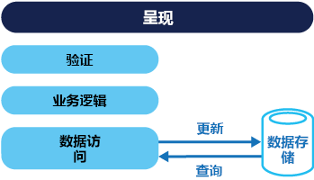
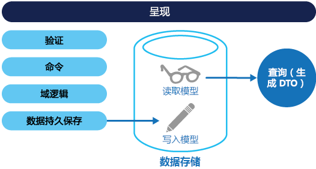
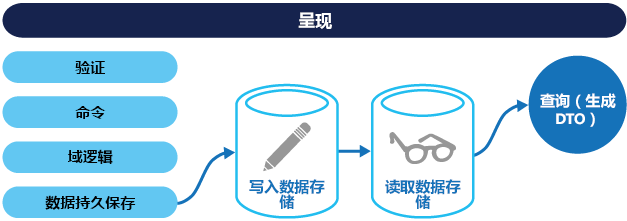

# <a name="command-and-query-responsibility-segregation-cqrs-pattern"></a><span data-ttu-id="1e802-104">命令和查询责任分离 (CQRS) 模式</span><span class="sxs-lookup"><span data-stu-id="1e802-104">Command and Query Responsibility Segregation (CQRS) pattern</span></span>

[!INCLUDE [header](../_includes/header.md)]

<span data-ttu-id="1e802-105">使用独立接口将读取数据的操作与更新数据的操作分离。</span><span class="sxs-lookup"><span data-stu-id="1e802-105">Segregate operations that read data from operations that update data by using separate interfaces.</span></span> <span data-ttu-id="1e802-106">这可以最大程度地提高性能、可伸缩性和安全性。</span><span class="sxs-lookup"><span data-stu-id="1e802-106">This can maximize performance, scalability, and security.</span></span> <span data-ttu-id="1e802-107">支持系统随着时间的推移而改进；防止更新命令在域级别引起合并冲突。</span><span class="sxs-lookup"><span data-stu-id="1e802-107">Supports the evolution of the system over time through higher flexibility, and prevent update commands from causing merge conflicts at the domain level.</span></span>

## <a name="context-and-problem"></a><span data-ttu-id="1e802-108">上下文和问题</span><span class="sxs-lookup"><span data-stu-id="1e802-108">Context and problem</span></span>

<span data-ttu-id="1e802-109">在传统的数据管理系统中，针对单个数据存储库中的相同实体集来执行命令（对数据的更新）和查询（数据请求）。</span><span class="sxs-lookup"><span data-stu-id="1e802-109">In traditional data management systems, both commands (updates to the data) and queries (requests for data) are executed against the same set of entities in a single data repository.</span></span> <span data-ttu-id="1e802-110">这些实体可以是关系数据库（如 SQL Server）中一个或多个表中的行的子集。</span><span class="sxs-lookup"><span data-stu-id="1e802-110">These entities can be a subset of the rows in one or more tables in a relational database such as SQL Server.</span></span>

<span data-ttu-id="1e802-111">通常在这些系统中，所有创建、读取、更新和删除 (CRUD) 操作都应用于实体的相同表示法。</span><span class="sxs-lookup"><span data-stu-id="1e802-111">Typically in these systems, all create, read, update, and delete (CRUD) operations are applied to the same representation of the entity.</span></span> <span data-ttu-id="1e802-112">例如，通过数据访问层 (DAL) 从数据存储检索表示使用者的数据传输对象 (DTO)，并在屏幕上显示。</span><span class="sxs-lookup"><span data-stu-id="1e802-112">For example, a data transfer object (DTO) representing a customer is retrieved from the data store by the data access layer (DAL) and displayed on the screen.</span></span> <span data-ttu-id="1e802-113">用户（可能是通过数据绑定）更新 DTO 的某些字段，然后 DAL 将 DTO 保存回数据存储中。</span><span class="sxs-lookup"><span data-stu-id="1e802-113">A user updates some fields of the DTO (perhaps through data binding) and the DTO is then saved back in the data store by the DAL.</span></span> <span data-ttu-id="1e802-114">同一 DTO 可同时用于读取和写入操作。</span><span class="sxs-lookup"><span data-stu-id="1e802-114">The same DTO is used for both the read and write operations.</span></span> <span data-ttu-id="1e802-115">该图说明了传统 CRUD 体系结构。</span><span class="sxs-lookup"><span data-stu-id="1e802-115">The figure illustrates a traditional CRUD architecture.</span></span>



<span data-ttu-id="1e802-117">当仅将有限的业务逻辑应用于数据操作时，传统 CRUD 设计工作正常。</span><span class="sxs-lookup"><span data-stu-id="1e802-117">Traditional CRUD designs work well when only limited business logic is applied to the data operations.</span></span> <span data-ttu-id="1e802-118">开发工具的基架机制可快速创建数据访问代码，并可根据需要对其自定义。</span><span class="sxs-lookup"><span data-stu-id="1e802-118">Scaffold mechanisms provided by development tools can create data access code very quickly, which can then be customized as required.</span></span>

<span data-ttu-id="1e802-119">但传统 CRUD 方法存在一些缺陷：</span><span class="sxs-lookup"><span data-stu-id="1e802-119">However, the traditional CRUD approach has some disadvantages:</span></span>

- <span data-ttu-id="1e802-120">它通常意味着数据的读取和写入表示法之间不匹配，例如必须正确更新的附加列或属性（即使它们并非操作的一部分）。</span><span class="sxs-lookup"><span data-stu-id="1e802-120">It often means that there's a mismatch between the read and write representations of the data, such as additional columns or properties that must be updated correctly even though they aren't required as part of an operation.</span></span>

- <span data-ttu-id="1e802-121">当协作域内数据存储中的记录锁定时，它会面临数据争用的风险，其中多个执行组件会在相同的数据集上并行操作。</span><span class="sxs-lookup"><span data-stu-id="1e802-121">It risks data contention when records are locked in the data store in a collaborative domain, where multiple actors operate in parallel on the same set of data.</span></span> <span data-ttu-id="1e802-122">或者当使用乐观锁定时并发更新会引起更新冲突。</span><span class="sxs-lookup"><span data-stu-id="1e802-122">Or update conflicts caused by concurrent updates when optimistic locking is used.</span></span> <span data-ttu-id="1e802-123">这些风险会随着系统复杂性和吞吐量的增加而增加。</span><span class="sxs-lookup"><span data-stu-id="1e802-123">These risks increase as the complexity and throughput of the system grows.</span></span> <span data-ttu-id="1e802-124">此外，由于数据存储和数据访问层上的负载以及检索消息所需查询的复杂性，传统方法可能对性能具有负面影响。</span><span class="sxs-lookup"><span data-stu-id="1e802-124">In addition, the traditional approach can have a negative effect on performance due to load on the data store and data access layer, and the complexity of queries required to retrieve information.</span></span>

- <span data-ttu-id="1e802-125">它可以使管理安全性和权限更复杂，因为每个实体同时受读取和写入操作的影响，这可能会在错误的上下文中暴露数据。</span><span class="sxs-lookup"><span data-stu-id="1e802-125">It can make managing security and permissions more complex because each entity is subject to both read and write operations, which might expose data in the wrong context.</span></span>

> <span data-ttu-id="1e802-126">若要深入了解有关 CRUD 方法的限制，请参阅 [CRUD, Only When You Can Afford It](https://blogs.msdn.microsoft.com/maarten_mullender/2004/07/23/crud-only-when-you-can-afford-it-revisited/)（仅在可承受一定限制的情况下使用 CRUD）。</span><span class="sxs-lookup"><span data-stu-id="1e802-126">For a deeper understanding of the limits of the CRUD approach see [CRUD, Only When You Can Afford It](https://blogs.msdn.microsoft.com/maarten_mullender/2004/07/23/crud-only-when-you-can-afford-it-revisited/).</span></span>

## <a name="solution"></a><span data-ttu-id="1e802-127">解决方案</span><span class="sxs-lookup"><span data-stu-id="1e802-127">Solution</span></span>

<span data-ttu-id="1e802-128">命令和查询责任分离 (CQRS) 模式，它使用单独接口分离读取数据的操作（查询）和更新数据的操作（命令）。</span><span class="sxs-lookup"><span data-stu-id="1e802-128">Command and Query Responsibility Segregation (CQRS) is a pattern that segregates the operations that read data (queries) from the operations that update data (commands) by using separate interfaces.</span></span> <span data-ttu-id="1e802-129">这意味着，用于查询和更新的数据模型互不相同。</span><span class="sxs-lookup"><span data-stu-id="1e802-129">This means that the data models used for querying and updates are different.</span></span> <span data-ttu-id="1e802-130">然后可以隔离模型，如下图所示（尽管这不是绝对要求）。</span><span class="sxs-lookup"><span data-stu-id="1e802-130">The models can then be isolated, as shown in the following figure, although that's not an absolute requirement.</span></span>



<span data-ttu-id="1e802-132">与基于 CRUD 的系统中使用的单个数据模型相比，在基于 CQRS 的系统中使用分离的数据查询和更新模型可简化设计和实现。</span><span class="sxs-lookup"><span data-stu-id="1e802-132">Compared to the single data model used in CRUD-based systems, the use of separate query and update models for the data in CQRS-based systems simplifies design and implementation.</span></span> <span data-ttu-id="1e802-133">但缺点是 CQRS 代码不能通过基架机制自动生成（这与 CRUD 设计不同）。</span><span class="sxs-lookup"><span data-stu-id="1e802-133">However, one disadvantage is that unlike CRUD designs, CQRS code can't automatically be generated using scaffold mechanisms.</span></span>

<span data-ttu-id="1e802-134">用于读取数据的查询模型和用于写入数据的更新模型可访问相同的物理存储（可能通过使用 SQL 视图或通过生成动态投影）。</span><span class="sxs-lookup"><span data-stu-id="1e802-134">The query model for reading data and the update model for writing data can access the same physical store, perhaps by using SQL views or by generating projections on the fly.</span></span> <span data-ttu-id="1e802-135">但通常将数据分隔到不同的物理存储，从而最大程度提高性能、伸缩性和安全性，如下图所示。</span><span class="sxs-lookup"><span data-stu-id="1e802-135">However, it's common to separate the data into different physical stores to maximize performance, scalability, and security, as shown in the next figure.</span></span>



<span data-ttu-id="1e802-137">读取存储可以是写入存储的只读副本，或者读取和写入存储可以具有完全不同的结构。</span><span class="sxs-lookup"><span data-stu-id="1e802-137">The read store can be a read-only replica of the write store, or the read and write stores can have a different structure altogether.</span></span> <span data-ttu-id="1e802-138">使用读取存储的多个只读副本可以极大地提高查询性能和应用程序 UI 响应能力，尤其是在只读副本所在的位置靠近应用程序实例的分布式方案中。</span><span class="sxs-lookup"><span data-stu-id="1e802-138">Using multiple read-only replicas of the read store can greatly increase query performance and application UI responsiveness, especially in distributed scenarios where read-only replicas are located close to the application instances.</span></span> <span data-ttu-id="1e802-139">某些数据库系统 (SQL Server) 会提供其他功能（如故障转移的副本）以最大限度地提高可用性。</span><span class="sxs-lookup"><span data-stu-id="1e802-139">Some database systems (SQL Server) provide additional features such as failover replicas to maximize availability.</span></span>

<span data-ttu-id="1e802-140">读取和写入存储的分离还允许彼此适当地缩放以匹配负载。</span><span class="sxs-lookup"><span data-stu-id="1e802-140">Separation of the read and write stores also allows each to be scaled appropriately to match the load.</span></span> <span data-ttu-id="1e802-141">例如，读取存储通常会遇到高于写入存储的负载。</span><span class="sxs-lookup"><span data-stu-id="1e802-141">For example, read stores typically encounter a much higher load than write stores.</span></span>

<span data-ttu-id="1e802-142">当查询/读取模型包含非规范化数据时（请参阅[具体化视图模式](materialized-view.md)），在读取应用程序中每个视图的数据时或在查询系统中的数据时，性能会实现最大化。</span><span class="sxs-lookup"><span data-stu-id="1e802-142">When the query/read model contains denormalized data (see [Materialized View pattern](materialized-view.md)), performance is maximized when reading data for each of the views in an application or when querying the data in the system.</span></span>

## <a name="issues-and-considerations"></a><span data-ttu-id="1e802-143">问题和注意事项</span><span class="sxs-lookup"><span data-stu-id="1e802-143">Issues and considerations</span></span>

<span data-ttu-id="1e802-144">在决定如何实现此模式时，请考虑以下几点：</span><span class="sxs-lookup"><span data-stu-id="1e802-144">Consider the following points when deciding how to implement this pattern:</span></span>

- <span data-ttu-id="1e802-145">将数据划分到读取和写入操作的单独物理存储可提高系统性能和系统的安全性，但它也会增加复原和最终一致性方面的复杂性。</span><span class="sxs-lookup"><span data-stu-id="1e802-145">Dividing the data store into separate physical stores for read and write operations can increase the performance and security of a system, but it can add complexity in terms of resiliency and eventual consistency.</span></span> <span data-ttu-id="1e802-146">必须更新读取模型存储以反映写入模型存储更改，并且当用户发出基于陈旧读取数据的请求后将难以将其删除，这意味着无法完成该操作。</span><span class="sxs-lookup"><span data-stu-id="1e802-146">The read model store must be updated to reflect changes to the write model store, and it can be difficult to detect when a user has issued a request based on stale read data, which means that the operation can't be completed.</span></span>

    > <span data-ttu-id="1e802-147">有关最终一致性的说明，请参阅 [Data Consistency Primer](https://msdn.microsoft.com/library/dn589800.aspx)（数据一致性入门）。</span><span class="sxs-lookup"><span data-stu-id="1e802-147">For a description of eventual consistency see the [Data Consistency Primer](https://msdn.microsoft.com/library/dn589800.aspx).</span></span>

- <span data-ttu-id="1e802-148">请考虑将 CQRS 应用于系统中最能实现其价值的有限部分。</span><span class="sxs-lookup"><span data-stu-id="1e802-148">Consider applying CQRS to limited sections of your system where it will be most valuable.</span></span>

- <span data-ttu-id="1e802-149">部署最终一致性的典型方法是结合使用事件溯源和 CQRS，以便写入模型是由命令执行驱动的仅限附加事件流。</span><span class="sxs-lookup"><span data-stu-id="1e802-149">A typical approach to deploying eventual consistency is to use event sourcing in conjunction with CQRS so that the write model is an append-only stream of events driven by execution of commands.</span></span> <span data-ttu-id="1e802-150">这些事件用于更新充当读取模型的具体化视图。</span><span class="sxs-lookup"><span data-stu-id="1e802-150">These events are used to update materialized views that act as the read model.</span></span> <span data-ttu-id="1e802-151">有关详细信息请参阅 [Event Sourcing and CQRS](https://msdn.microsoft.com/library/dn568103.aspx#EventSourcingandCQRS)（事件溯源和 CQRS）。</span><span class="sxs-lookup"><span data-stu-id="1e802-151">For more information see [Event Sourcing and CQRS](https://msdn.microsoft.com/library/dn568103.aspx#EventSourcingandCQRS).</span></span>

## <a name="when-to-use-this-pattern"></a><span data-ttu-id="1e802-152">何时使用此模式</span><span class="sxs-lookup"><span data-stu-id="1e802-152">When to use this pattern</span></span>

<span data-ttu-id="1e802-153">在以下情况下使用此模式：</span><span class="sxs-lookup"><span data-stu-id="1e802-153">Use this pattern in the following situations:</span></span>

- <span data-ttu-id="1e802-154">在其中对相同数据并行执行多个操作的协同域。</span><span class="sxs-lookup"><span data-stu-id="1e802-154">Collaborative domains where multiple operations are performed in parallel on the same data.</span></span> <span data-ttu-id="1e802-155">CQRS 允许用户定义具有足够粒度的命令，以最小化域级别的合并冲突（该命令可合并任何出现的冲突），即使在更新显示为相同类型的数据时也可执行此操作。</span><span class="sxs-lookup"><span data-stu-id="1e802-155">CQRS allows you to define commands with enough granularity to minimize merge conflicts at the domain level (any conflicts that do arise can be merged by the command), even when updating what appears to be the same type of data.</span></span>

- <span data-ttu-id="1e802-156">基于任务的用户界面，用户在该界面可按照一系列步骤组成的复杂过程指南或通过复杂域模型指南来操作。</span><span class="sxs-lookup"><span data-stu-id="1e802-156">Task-based user interfaces where users are guided through a complex process as a series of steps or with complex domain models.</span></span> <span data-ttu-id="1e802-157">此外，对已熟悉域驱动设计 (DDD) 技术的团队非常有用。</span><span class="sxs-lookup"><span data-stu-id="1e802-157">Also, useful for teams already familiar with domain-driven design (DDD) techniques.</span></span> <span data-ttu-id="1e802-158">写入模型具有包含业务逻辑、输入验证和业务验证的完整命令处理堆栈，以确保写入模型中的每个聚合（将每个关联对象群集视作数据更改的一个单元）的所有内容始终一致。</span><span class="sxs-lookup"><span data-stu-id="1e802-158">The write model has a full command-processing stack with business logic, input validation, and business validation to ensure that everything is always consistent for each of the aggregates (each cluster of associated objects treated as a unit for data changes) in the write model.</span></span> <span data-ttu-id="1e802-159">读取模型不具有任何业务逻辑或验证堆栈，只返回 DTO 以在视图模型中使用。</span><span class="sxs-lookup"><span data-stu-id="1e802-159">The read model has no business logic or validation stack and just returns a DTO for use in a view model.</span></span> <span data-ttu-id="1e802-160">读取模型最终与写入模型保持一致。</span><span class="sxs-lookup"><span data-stu-id="1e802-160">The read model is eventually consistent with the write model.</span></span>

- <span data-ttu-id="1e802-161">应用场景：数据读取性能与数据写入性能必须分开进行优化（特别是当读取/写入比率非常高或需要水平缩放时）。</span><span class="sxs-lookup"><span data-stu-id="1e802-161">Scenarios where performance of data reads must be fine tuned separately from performance of data writes, especially when the read/write ratio is very high, and when horizontal scaling is required.</span></span> <span data-ttu-id="1e802-162">例如，在许多系统中读取操作数是写入操作数的数倍。</span><span class="sxs-lookup"><span data-stu-id="1e802-162">For example, in many systems the number of read operations is many times greater that the number of write operations.</span></span> <span data-ttu-id="1e802-163">为了适应这种情况，请考虑向外扩展读取模型，但只在一个或几个实例上运行写入模型。</span><span class="sxs-lookup"><span data-stu-id="1e802-163">To accommodate this, consider scaling out the read model, but running the write model on only one or a few instances.</span></span> <span data-ttu-id="1e802-164">一小部分写入模型实例还有助于最大程度减少合并冲突。</span><span class="sxs-lookup"><span data-stu-id="1e802-164">A small number of write model instances also helps to minimize the occurrence of merge conflicts.</span></span>

- <span data-ttu-id="1e802-165">应用场景：一个开发团队可专注于复杂域模型（作为写入模型一部分），而另一团队可专注于读取模型和用户界面。</span><span class="sxs-lookup"><span data-stu-id="1e802-165">Scenarios where one team of developers can focus on the complex domain model that is part of the write model, and another team can focus on the read model and the user interfaces.</span></span>

- <span data-ttu-id="1e802-166">应用场景：系统会随着时间不断演变，并且可能会包含多个版本的模型，或业务规则会定期更改。</span><span class="sxs-lookup"><span data-stu-id="1e802-166">Scenarios where the system is expected to evolve over time and might contain multiple versions of the model, or where business rules change regularly.</span></span>

- <span data-ttu-id="1e802-167">与其他系统集成时（尤其是与事件溯源集成时），一个子系统的临时故障错误不允许影响其他子系统的可用性。</span><span class="sxs-lookup"><span data-stu-id="1e802-167">Integration with other systems, especially in combination with event sourcing, where the temporal failure of one subsystem shouldn't affect the availability of the others.</span></span>

<span data-ttu-id="1e802-168">在以下情况下不建议使用此模式：</span><span class="sxs-lookup"><span data-stu-id="1e802-168">This pattern isn't recommended in the following situations:</span></span>

- <span data-ttu-id="1e802-169">域或业务规则简单。</span><span class="sxs-lookup"><span data-stu-id="1e802-169">Where the domain or the business rules are simple.</span></span>

- <span data-ttu-id="1e802-170">简单 CRUD 样式的用户界面和相关数据访问操作充足。</span><span class="sxs-lookup"><span data-stu-id="1e802-170">Where a simple CRUD-style user interface and the related data access operations are sufficient.</span></span>

- <span data-ttu-id="1e802-171">跨整个系统的实现。</span><span class="sxs-lookup"><span data-stu-id="1e802-171">For implementation across the whole system.</span></span> <span data-ttu-id="1e802-172">CQRS 可能对整体数据管理方案的某些特定组件非常有用，但在非必需时它会增加大量和不必要的复杂性。</span><span class="sxs-lookup"><span data-stu-id="1e802-172">There are specific components of an overall data management scenario where CQRS can be useful, but it can add considerable and unnecessary complexity when it isn't required.</span></span>

## <a name="event-sourcing-and-cqrs"></a><span data-ttu-id="1e802-173">事件溯源和 CQRS</span><span class="sxs-lookup"><span data-stu-id="1e802-173">Event Sourcing and CQRS</span></span>

<span data-ttu-id="1e802-174">CQRS 模式通常与事件溯源模式一起使用。</span><span class="sxs-lookup"><span data-stu-id="1e802-174">The CQRS pattern is often used along with the Event Sourcing pattern.</span></span> <span data-ttu-id="1e802-175">基于 CQRS 的系统使用分离的读取和写入数据模型，每个模型针对相关任务定制，并且通常位于物理分离存储中。</span><span class="sxs-lookup"><span data-stu-id="1e802-175">CQRS-based systems use separate read and write data models, each tailored to relevant tasks and often located in physically separate stores.</span></span> <span data-ttu-id="1e802-176">当使用[事件溯源](event-sourcing.md)模式时，事件存储是写入模型，并且是信息的官方源。</span><span class="sxs-lookup"><span data-stu-id="1e802-176">When used with the [Event Sourcing](event-sourcing.md) pattern, the store of events is the write model, and is the official source of information.</span></span> <span data-ttu-id="1e802-177">基于 CQRS 系统的读取模型提供数据的具体化视图，通常是高度非规范化视图。</span><span class="sxs-lookup"><span data-stu-id="1e802-177">The read model of a CQRS-based system provides materialized views of the data, typically as highly denormalized views.</span></span> <span data-ttu-id="1e802-178">针对应用程序的接口和显示要求定制这些视图，这有助于最大限度地提高显示和查询性能。</span><span class="sxs-lookup"><span data-stu-id="1e802-178">These views are tailored to the interfaces and display requirements of the application, which helps to maximize both display and query performance.</span></span>

<span data-ttu-id="1e802-179">使用事件流作为写入存储（而不是使用某个时间点的实际数据），这可避免单个聚合上的更新冲突，并最大限度提高性能和可扩展性。</span><span class="sxs-lookup"><span data-stu-id="1e802-179">Using the stream of events as the write store, rather than the actual data at a point in time, avoids update conflicts on a single aggregate and maximizes performance and scalability.</span></span> <span data-ttu-id="1e802-180">事件可以用于以异步方式生成用于填充读取存储的数据具体化视图。</span><span class="sxs-lookup"><span data-stu-id="1e802-180">The events can be used to asynchronously generate materialized views of the data that are used to populate the read store.</span></span>

<span data-ttu-id="1e802-181">由于事件存储是官方信息源，因此可删除具体化视图并重放所有过去事件，以便在系统升级时或必需更改读取模型时创建当前状态的新表示法。</span><span class="sxs-lookup"><span data-stu-id="1e802-181">Because the event store is the official source of information, it is possible to delete the materialized views and replay all past events to create a new representation of the current state when the system evolves, or when the read model must change.</span></span> <span data-ttu-id="1e802-182">具体化视图实际上是数据的持久只读缓存。</span><span class="sxs-lookup"><span data-stu-id="1e802-182">The materialized views are in effect a durable read-only cache of the data.</span></span>

<span data-ttu-id="1e802-183">当结合使用 CQRS 和事件溯源模式时，请考虑以下方面：</span><span class="sxs-lookup"><span data-stu-id="1e802-183">When using CQRS combined with the Event Sourcing pattern, consider the following:</span></span>

- <span data-ttu-id="1e802-184">在任何写入和读取存储分离的系统中，基于此模式的系统只会最终一致。</span><span class="sxs-lookup"><span data-stu-id="1e802-184">As with any system where the write and read stores are separate, systems based on this pattern are only eventually consistent.</span></span> <span data-ttu-id="1e802-185">正在生成的事件与正在更新的数据存储之间的存在一定延迟。</span><span class="sxs-lookup"><span data-stu-id="1e802-185">There will be some delay between the event being generated and the data store being updated.</span></span>

- <span data-ttu-id="1e802-186">本模式会增加复杂性，因为必需创建代码以启动和处理事件，组合或更新查询或读取模型所需的适当视图或对象。</span><span class="sxs-lookup"><span data-stu-id="1e802-186">The pattern adds complexity because code must be created to initiate and handle events, and assemble or update the appropriate views or objects required by queries or a read model.</span></span> <span data-ttu-id="1e802-187">结合事件溯源模式使用时，CQRS 模式的复杂性会使实现难以顺利完成，需要使用设计系统的其他方法。</span><span class="sxs-lookup"><span data-stu-id="1e802-187">The complexity of the CQRS pattern when used with the Event Sourcing pattern can make a successful implementation more difficult, and requires a different approach to designing systems.</span></span> <span data-ttu-id="1e802-188">但是，事件溯源可以更加轻松地对域创建模型，从而可以很方便地重新生成视图或创建新视图，因为它保留了想要执行的数据更改。</span><span class="sxs-lookup"><span data-stu-id="1e802-188">However, event sourcing can make it easier to model the domain, and makes it easier to rebuild views or create new ones because the intent of the changes in the data is preserved.</span></span>

- <span data-ttu-id="1e802-189">通过重放和处理特定实体或实体集合的事件来生成用于读取模型或数据投影的具体化视图可能需要大量的处理时间和资源。</span><span class="sxs-lookup"><span data-stu-id="1e802-189">Generating materialized views for use in the read model or projections of the data by replaying and handling the events for specific entities or collections of entities can require significant processing time and resource usage.</span></span> <span data-ttu-id="1e802-190">特别是当如果需要长时间求和或分析值时，因为需要检查所有相关的事件。</span><span class="sxs-lookup"><span data-stu-id="1e802-190">This is especially true if it requires summation or analysis of values over long periods, because all the associated events might need to be examined.</span></span> <span data-ttu-id="1e802-191">通过以计划的时间间隔（例如已发生的特定操作的总计数或实体的当前状态）实现数据快照来解决此问题。</span><span class="sxs-lookup"><span data-stu-id="1e802-191">Resolve this by implementing snapshots of the data at scheduled intervals, such as a total count of the number of a specific action that have occurred, or the current state of an entity.</span></span>

## <a name="example"></a><span data-ttu-id="1e802-192">示例</span><span class="sxs-lookup"><span data-stu-id="1e802-192">Example</span></span>

<span data-ttu-id="1e802-193">以下代码显示了从 CQRS 实现（它对读取和写入模型使用不同的定义）的示例中提取的一些内容。</span><span class="sxs-lookup"><span data-stu-id="1e802-193">The following code shows some extracts from an example of a CQRS implementation that uses different definitions for the read and the write models.</span></span> <span data-ttu-id="1e802-194">模型接口不规定基础数据存储的任何功能，而且它们可以不断变化并进行细微调整，因为这些接口是独立的。</span><span class="sxs-lookup"><span data-stu-id="1e802-194">The model interfaces don't dictate any features of the underlying data stores, and they can evolve and be fine-tuned independently because these interfaces are separated.</span></span>

<span data-ttu-id="1e802-195">下面的代码显示读取模型定义。</span><span class="sxs-lookup"><span data-stu-id="1e802-195">The following code shows the read model definition.</span></span>

```csharp
// Query interface
namespace ReadModel
{
  public interface ProductsDao
  {
    ProductDisplay FindById(int productId);
    ICollection<ProductDisplay> FindByName(string name);
    ICollection<ProductInventory> FindOutOfStockProducts();
    ICollection<ProductDisplay> FindRelatedProducts(int productId);
  }

  public class ProductDisplay
  {
    public int Id { get; set; }
    public string Name { get; set; }
    public string Description { get; set; }
    public decimal UnitPrice { get; set; }
    public bool IsOutOfStock { get; set; }
    public double UserRating { get; set; }
  }

  public class ProductInventory
  {
    public int Id { get; set; }
    public string Name { get; set; }
    public int CurrentStock { get; set; }
  }
}
```

<span data-ttu-id="1e802-196">系统允许用户对产品制定费率。</span><span class="sxs-lookup"><span data-stu-id="1e802-196">The system allows users to rate products.</span></span> <span data-ttu-id="1e802-197">应用程序代码使用以下代码中所示的 `RateProduct` 命令执行此操作。</span><span class="sxs-lookup"><span data-stu-id="1e802-197">The application code does this using the `RateProduct` command shown in the following code.</span></span>

```csharp
public interface ICommand
{
  Guid Id { get; }
}

public class RateProduct : ICommand
{
  public RateProduct()
  {
    this.Id = Guid.NewGuid();
  }
  public Guid Id { get; set; }
  public int ProductId { get; set; }
  public int Rating { get; set; }
  public int UserId {get; set; }
}
```

<span data-ttu-id="1e802-198">系统使用 `ProductsCommandHandler` 类处理应用程序所发送的命令。</span><span class="sxs-lookup"><span data-stu-id="1e802-198">The system uses the `ProductsCommandHandler` class to handle commands sent by the application.</span></span> <span data-ttu-id="1e802-199">通常，客户端通过消息传递系统（如队列）将命令发送到域。</span><span class="sxs-lookup"><span data-stu-id="1e802-199">Clients typically send commands to the domain through a messaging system such as a queue.</span></span> <span data-ttu-id="1e802-200">命令处理程序接受这些命令，并调用域接口方法。</span><span class="sxs-lookup"><span data-stu-id="1e802-200">The command handler accepts these commands and invokes methods of the domain interface.</span></span> <span data-ttu-id="1e802-201">每个命令的粒度旨在减少冲突请求。</span><span class="sxs-lookup"><span data-stu-id="1e802-201">The granularity of each command is designed to reduce the chance of conflicting requests.</span></span> <span data-ttu-id="1e802-202">下面的代码显示了 `ProductsCommandHandler` 类的概述。</span><span class="sxs-lookup"><span data-stu-id="1e802-202">The following code shows an outline of the `ProductsCommandHandler` class.</span></span>

```csharp
public class ProductsCommandHandler :
    ICommandHandler<AddNewProduct>,
    ICommandHandler<RateProduct>,
    ICommandHandler<AddToInventory>,
    ICommandHandler<ConfirmItemShipped>,
    ICommandHandler<UpdateStockFromInventoryRecount>
{
  private readonly IRepository<Product> repository;

  public ProductsCommandHandler (IRepository<Product> repository)
  {
    this.repository = repository;
  }

  void Handle (AddNewProduct command)
  {
    ...
  }

  void Handle (RateProduct command)
  {
    var product = repository.Find(command.ProductId);
    if (product != null)
    {
      product.RateProduct(command.UserId, command.Rating);
      repository.Save(product);
    }
  }

  void Handle (AddToInventory command)
  {
    ...
  }

  void Handle (ConfirmItemsShipped command)
  {
    ...
  }

  void Handle (UpdateStockFromInventoryRecount command)
  {
    ...
  }
}
```

<span data-ttu-id="1e802-203">下面的代码显示了写入模型中的 `IProductsDomain` 接口。</span><span class="sxs-lookup"><span data-stu-id="1e802-203">The following code shows the `IProductsDomain` interface from the write model.</span></span>

```csharp
public interface IProductsDomain
{
  void AddNewProduct(int id, string name, string description, decimal price);
  void RateProduct(int userId, int rating);
  void AddToInventory(int productId, int quantity);
  void ConfirmItemsShipped(int productId, int quantity);
  void UpdateStockFromInventoryRecount(int productId, int updatedQuantity);
}
```

<span data-ttu-id="1e802-204">另请注意 `IProductsDomain` 接口如何包含在域中有含义的方法。</span><span class="sxs-lookup"><span data-stu-id="1e802-204">Also notice how the `IProductsDomain` interface contains methods that have a meaning in the domain.</span></span> <span data-ttu-id="1e802-205">通常情况下，在 CRUD 环境中这些方法将具有通用名称如 `Save` 或 `Update`，并且具有唯一参数 DTO。</span><span class="sxs-lookup"><span data-stu-id="1e802-205">Typically, in a CRUD environment these methods would have generic names such as `Save` or `Update`, and have a DTO as the only argument.</span></span> <span data-ttu-id="1e802-206">CQRS 方法可以用于满足此组织业务和库存管理系统的需求。</span><span class="sxs-lookup"><span data-stu-id="1e802-206">The CQRS approach can be designed to meet the needs of this organization's business and inventory management systems.</span></span>

## <a name="related-patterns-and-guidance"></a><span data-ttu-id="1e802-207">相关模式和指南</span><span class="sxs-lookup"><span data-stu-id="1e802-207">Related patterns and guidance</span></span>

<span data-ttu-id="1e802-208">实现此模式时，以下模式和指南将非常有用：</span><span class="sxs-lookup"><span data-stu-id="1e802-208">The following patterns and guidance are useful when implementing this pattern:</span></span>

- <span data-ttu-id="1e802-209">有关 CQRS 与其他体系结构样式的比较，请参阅[体系结构样式](/azure/architecture/guide/architecture-styles/)和 [CQRS 体系结构样式](/azure/architecture/guide/architecture-styles/cqrs)。</span><span class="sxs-lookup"><span data-stu-id="1e802-209">For a comparison of CQRS with other architectural styles, see [Architecture styles](/azure/architecture/guide/architecture-styles/) and [CQRS architecture style](/azure/architecture/guide/architecture-styles/cqrs).</span></span>

- <span data-ttu-id="1e802-210">[Data Consistency Primer](https://msdn.microsoft.com/library/dn589800.aspx)（数据一致性入门）。</span><span class="sxs-lookup"><span data-stu-id="1e802-210">[Data Consistency Primer](https://msdn.microsoft.com/library/dn589800.aspx).</span></span> <span data-ttu-id="1e802-211">描述通常在使用 CQRS 模式时由于读取和写入数据存储之间的最终一致性而引起的问题，以及如何解决这些问题。</span><span class="sxs-lookup"><span data-stu-id="1e802-211">Explains the issues that are typically encountered due to eventual consistency between the read and write data stores when using the CQRS pattern, and how these issues can be resolved.</span></span>

- <span data-ttu-id="1e802-212">[Data Partitioning Guidance](https://msdn.microsoft.com/library/dn589795.aspx)（数据分区指南）。</span><span class="sxs-lookup"><span data-stu-id="1e802-212">[Data Partitioning Guidance](https://msdn.microsoft.com/library/dn589795.aspx).</span></span> <span data-ttu-id="1e802-213">介绍如何会在 CQRS 模式中使用的读取和写入数据存储分成可独立管理和访问的多个分区，以提高伸缩性，减少争用并优化性能。</span><span class="sxs-lookup"><span data-stu-id="1e802-213">Describes how the read and write data stores used in the CQRS pattern can be divided into partitions that can be managed and accessed separately to improve scalability, reduce contention, and optimize performance.</span></span>

- <span data-ttu-id="1e802-214">[事件溯源模式](event-sourcing.md)。</span><span class="sxs-lookup"><span data-stu-id="1e802-214">[Event Sourcing Pattern](event-sourcing.md).</span></span> <span data-ttu-id="1e802-215">更加详细地介绍如何一起使用事件溯源和 CQRS 模式来简化复杂的域中任务的同时提高性能、可伸缩性和响应能力。</span><span class="sxs-lookup"><span data-stu-id="1e802-215">Describes in more detail how Event Sourcing can be used with the CQRS pattern to simplify tasks in complex domains while improving performance, scalability, and responsiveness.</span></span> <span data-ttu-id="1e802-216">以及如何在维护可启用补偿操作的完整审核记录和历史记录的同时提供事务数据的一致性。</span><span class="sxs-lookup"><span data-stu-id="1e802-216">As well as how to provide consistency for transactional data while maintaining full audit trails and history that can enable compensating actions.</span></span>

- <span data-ttu-id="1e802-217">[具体化视图模式](materialized-view.md)。</span><span class="sxs-lookup"><span data-stu-id="1e802-217">[Materialized View Pattern](materialized-view.md).</span></span> <span data-ttu-id="1e802-218">CQRS 实现的读取模型可包含写入模型数据的具体化视图，或该读取模型可用于生成具体化视图。</span><span class="sxs-lookup"><span data-stu-id="1e802-218">The read model of a CQRS implementation can contain materialized views of the write model data, or the read model can be used to generate materialized views.</span></span>

- <span data-ttu-id="1e802-219">模式与实践指南 [CQRS Journey](http://aka.ms/cqrs)（CQRS 之旅）。</span><span class="sxs-lookup"><span data-stu-id="1e802-219">The patterns & practices guide [CQRS Journey](http://aka.ms/cqrs).</span></span> <span data-ttu-id="1e802-220">具体而言，[查询责任分离模式命令简介](https://msdn.microsoft.com/library/jj591573.aspx)探讨了模式及其适用性，[尾声：学到的经验教训](https://msdn.microsoft.com/library/jj591568.aspx)介绍使用此模式时会遇到的一些问题。</span><span class="sxs-lookup"><span data-stu-id="1e802-220">In particular, [Introducing the Command Query Responsibility Segregation Pattern](https://msdn.microsoft.com/library/jj591573.aspx) explores the pattern and when it's useful, and [Epilogue: Lessons Learned](https://msdn.microsoft.com/library/jj591568.aspx) helps you understand some of the issues that come up when using this pattern.</span></span>

- <span data-ttu-id="1e802-221">[Martin Fowler 发布的 CQRS](http://martinfowler.com/bliki/CQRS.html) 文章介绍了该模式的基础以及获取其他有用资源的链接。</span><span class="sxs-lookup"><span data-stu-id="1e802-221">The post [CQRS by Martin Fowler](http://martinfowler.com/bliki/CQRS.html), which explains the basics of the pattern and links to other useful resources.</span></span>

- <span data-ttu-id="1e802-222">[Greg Young 的文章](http://codebetter.com/gregyoung/)从多方面介绍了 CQRS 模式。</span><span class="sxs-lookup"><span data-stu-id="1e802-222">[Greg Young’s posts](http://codebetter.com/gregyoung/), which explore many aspects of the CQRS pattern.</span></span>
