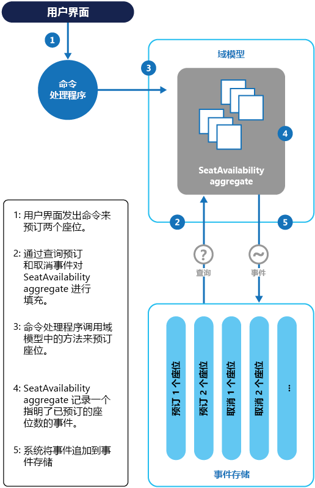

# 事件溯源模式Event Sourcing pattern

[!INCLUDE [header](../_includes/header.md)]

使用只追加存储来记录对数据采取的完整系列操作，而不是仅存储域中数据的当前状态。Instead of storing just the current state of the data in a domain, use an append-only store to record the full series of actions taken on that data.
该存储可作为记录系统，可用于具体化域对象。The store acts as the system of record and can be used to materialize the domain objects. 这样一来，无需同步数据模型和业务域，从而简化复杂域中的任务，同时可提高性能、可扩展性和响应能力。This can simplify tasks in complex domains, by avoiding the need to synchronize the data model and the business domain, while improving performance, scalability, and responsiveness. 它还可提供事务数据一致性并保留可启用补偿操作的完整审核记录和历史记录。It can also provide consistency for transactional data, and maintain full audit trails and history that can enable compensating actions.

## 上下文和问题Context and problem

大多数应用程序会使用数据，而典型的方法是用户使用数据时通过更新数据使应用程序保持数据的当前状态。Most applications work with data, and the typical approach is for the application to maintain the current state of the data by updating it as users work with it. 例如，在传统的创建、读取、更新和删除 (CRUD) 模型中，典型的数据处理是从存储读取数据、对其作出修改、使用新值更新数据的当前状态（通常通过使用锁定数据的事务）。For example, in the traditional create, read, update, and delete (CRUD) model a typical data process is to read data from the store, make some modifications to it, and update the current state of the data with the new values&mdash;often by using transactions that lock the data.

CRUD 方法具有一些限制：The CRUD approach has some limitations:

- CRUD 系统直接对数据存储执行更新操作，其所需的处理工作开销会降低性能和响应能力，并会限制可扩展性。CRUD systems perform update operations directly against a data store, which can slow down performance and responsiveness, and limit scalability, due to the processing overhead it requires.

- 在包含多个并发用户的协作域中，由于会对数据单个项进行更新操作，因此出现数据更新冲突的可能性更大。In a collaborative domain with many concurrent users, data update conflicts are more likely because the update operations take place on a single item of data.

- 除非存在记录单独日志中每个操作详细信息的其他审核机制，否则历史记录会丢失。Unless there's an additional auditing mechanism that records the details of each operation in a separate log, history is lost.

> 若要深入了解有关 CRUD 方法的限制，请参阅 [CRUD, Only When You Can Afford It](https://blogs.msdn.microsoft.com/maarten_mullender/2004/07/23/crud-only-when-you-can-afford-it-revisited/)（仅在可承受一定限制的情况下使用 CRUD）。For a deeper understanding of the limits of the CRUD approach see [CRUD, Only When You Can Afford It](https://blogs.msdn.microsoft.com/maarten_mullender/2004/07/23/crud-only-when-you-can-afford-it-revisited/).

## 解决方案Solution

事件溯源模式定义对一系列事件（每个事件记录在只追加存储中）驱动的数据进行处理操作的方法。The Event Sourcing pattern defines an approach to handling operations on data that's driven by a sequence of events, each of which is recorded in an append-only store. 应用程序代码以命令方式描述每个数据操作的一系列事件发送到事件存储，这些事件在其中是持久化的。Application code sends a series of events that imperatively describe each action that has occurred on the data to the event store, where they're persisted. 每个事件表示对数据所作的一系列更改（例如 `AddedItemToOrder`）。Each event represents a set of changes to the data (such as `AddedItemToOrder`).

事件在事件存储中持久化，事件存储充当数据当前状态的记录系统（权威数据源）。The events are persisted in an event store that acts as the system of record (the authoritative data source) about the current state of the data. 事件存储通常会发布这些事件，使用者可收到通知并在需要时对其进行处理。The event store typically publishes these events so that consumers can be notified and can handle them if needed. 例如，使用者可启动将事件中的操作应用到其他系统的任务，或者执行完成此操作所需的任何关联操作。Consumers could, for example, initiate tasks that apply the operations in the events to other systems, or perform any other associated action that's required to complete the operation. 请注意，生成事件的应用程序代码从订阅到事件的系统中分离。Notice that the application code that generates the events is decoupled from the systems that subscribe to the events.

事件存储发布的事件的典型用途是在应用程序中的操作更改实体时保持实体的具体化视图以及用于与外部系统集成。Typical uses of the events published by the event store are to maintain materialized views of entities as actions in the application change them, and for integration with external systems. 例如，系统可保持用于填充 UI 各部分的所有客户订单的具体化视图。For example, a system can maintain a materialized view of all customer orders that's used to populate parts of the UI. 应用程序添加新的订单、添加或删除订单中的项和添加发货信息时，可处理描述这些更改的事件以及使用这些事件来更新[具体化视图](materialized-view.md)。As the application adds new orders, adds or removes items on the order, and adds shipping information, the events that describe these changes can be handled and used to update the [materialized view](materialized-view.md).

此外，应用程序可随时读取事件历史记录，并通过播放和使用所有与实体相关的事件，使用事件历史记录来具体化实体的当前状态。In addition, at any point it's possible for applications to read the history of events, and use it to materialize the current state of an entity by playing back and consuming all the events related to that entity. 可根据需要，在处理请求时或通过计划任务具体化域对象，将实体状态保存为具体化视图以支持演示层。This can occur on demand to materialize a domain object when handling a request, or through a scheduled task so that the state of the entity can be stored as a materialized view to support the presentation layer.

此图提供了此模式的概述，其中包括使用事件流的部分选项，例如创建具体化视图、将事件与外部应用程序和系统集成以及重播事件以创建特定实体的当前状态投影。The figure shows an overview of the pattern, including some of the options for using the event stream such as creating a materialized view, integrating events with external applications and systems, and replaying events to create projections of the current state of specific entities.

事件溯源模式具有以下优点：The Event Sourcing pattern provides the following advantages:

- 事件不可变，并且可使用只追加操作进行存储。Events are immutable and can be stored using an append-only operation. 用户界面、工作流或启动事件的进程可继续，处理事件的任务可在后台运行。The user interface, workflow, or process that initiated an event can continue, and tasks that handle the events can run in the background. 此外，处理事务期间不存在争用，这两点可极大提高应用程序的性能和可伸缩性，尤其是对于演示级别或用户界面。This, combined with the fact that there's no contention during the processing of transactions, can vastly improve performance and scalability for applications, especially for the presentation level or user interface.

- 事件是描述已发生操作的简单对象以及描述事件代表的操作所需的相关数据。Events are simple objects that describe some action that occurred, together with any associated data required to describe the action represented by the event. 事件不会直接更新数据存储。Events don't directly update a data store. 只会对事件进行记录，以便在合适的时间进行处理。They're simply recorded for handling at the appropriate time. 这可简化实施和管理。This can simplify implementation and management.

- 事件通常对域专家而言具有意义，然而[对象关系阻抗不匹配](https://en.wikipedia.org/wiki/Object-relational_impedance_mismatch)却会让复杂数据库表变得难以理解。Events typically have meaning for a domain expert, whereas [object-relational impedance mismatch](https://en.wikipedia.org/wiki/Object-relational_impedance_mismatch) can make complex database tables hard to understand. 表是表示系统的当前状态（而不是已发生事件）的人工构造。Tables are artificial constructs that represent the current state of the system, not the events that occurred.

- 事件溯源不需要直接更新数据存储中的对象，因而有助于防止并发更新造成冲突。Event sourcing can help prevent concurrent updates from causing conflicts because it avoids the requirement to directly update objects in the data store. 但是，域模型必须仍然设计为避免可能导致不一致状态的请求。However, the domain model must still be designed to protect itself from requests that might result in an inconsistent state.

- 事件的只追加存储提供的审核线索可用于监视对数据存储采取的操作，通过随时重播事件将当前状态重新生成为具体化视图或投影，以及测试和调试系统。The append-only storage of events provides an audit trail that can be used to monitor actions taken against a data store, regenerate the current state as materialized views or projections by replaying the events at any time, and assist in testing and debugging the system. 此外，需要使用补偿事件来取消更改，此要求可提供已撤销更改的历史记录，但对于模型只存储当前状态的情况则不适用。In addition, the requirement to use compensating events to cancel changes provides a history of changes that were reversed, which wouldn't be the case if the model simply stored the current state. 事件列表还可用于分析应用程序性能和检测用户行为趋势或者获取其他有用的业务信息。The list of events can also be used to analyze application performance and detect user behavior trends, or to obtain other useful business information.

- 事件存储会引发事件，任务会执行操作以响应这些事件。The event store raises events, and tasks perform operations in response to those events. 通过将任务从事件中分离，可提供灵活性和可扩展性。This decoupling of the tasks from the events provides flexibility and extensibility. 任务知道事件类型和事件数据，但不知道触发事件的操作。Tasks know about the type of event and the event data, but not about the operation that triggered the event. 此外，多个任务可以处理每个事件。In addition, multiple tasks can handle each event. 这样可实现与仅侦听事件存储引发的新事件的其他服务和系统的轻松集成。This enables easy integration with other services and systems that only listen for new events raised by the event store. 但是，事件溯源事件的级别通常非常低，可能需要生成特定的集成事件。However, the event sourcing events tend to be very low level, and it might be necessary to generate specific integration events instead.

> 通过执行响应事件的数据管理任务和具体化存储事件的视图，事件溯源通常与 CQRS 模式结合。Event sourcing is commonly combined with the CQRS pattern by performing the data management tasks in response to the events, and by materializing views from the stored events.

## 问题和注意事项Issues and considerations

在决定如何实现此模式时，请考虑以下几点：Consider the following points when deciding how to implement this pattern:

只有通过重播事件创建具体化视图或生成数据投影时，系统才可实现最终一致性。The system will only be eventually consistent when creating materialized views or generating projections of data by replaying events. 应用程序将事件添加到事件存储作为处理请求的结果、发布事件和事件使用者处理事件之间存在一定程度的延迟。There's some delay between an application adding events to the event store as the result of handling a request, the events being published, and consumers of the events handling them. 在此期间，描述实体的进一步更改的新事件可能已到达事件存储。During this period, new events that describe further changes to entities might have arrived at the event store.

> [!NOTE]
> 有关最终一致性的信息，请参阅 [Data consistency primer](https://msdn.microsoft.com/library/dn589800.aspx)（数据一致性入门）。See the [Data Consistency Primer](https://msdn.microsoft.com/library/dn589800.aspx) for information about eventual consistency.

事件存储是信息的永久源，因此请勿更新事件数据。The event store is the permanent source of information, and so the event data should never be updated. 更新实体以撤销更改的唯一方式是将补偿事件添加到事件存储。The only way to update an entity to undo a change is to add a compensating event to the event store. 如果持久化事件的格式（而不是数据）需要更改，也许在迁移期间，很难将存储中的现有事件和新版本结合。If the format (rather than the data) of the persisted events needs to change, perhaps during a migration, it can be difficult to combine existing events in the store with the new version. 可能需要循环访问所有事件进行更改，使其符合新格式，或添加使用新格式的新事件。It might be necessary to iterate through all the events making changes so they're compliant with the new format, or add new events that use the new format. 考虑在事件架构的每个版本上使用版本标记，以同时保留事件的旧格式和新格式。Consider using a version stamp on each version of the event schema to maintain both the old and the new event formats.

多线程应用程序和应用程序的多个实例可能将事件存储在事件存储中。Multi-threaded applications and multiple instances of applications might be storing events in the event store. 事件存储中的事件一致性至关重要，影响特定实体的事件的顺序（实体更改发生的顺序会影响当前状态）同样至关重要。The consistency of events in the event store is vital, as is the order of events that affect a specific entity (the order that changes occur to an entity affects its current state). 将时间戳添加到每个事件有助于避免出现问题。Adding a timestamp to every event can help to avoid issues. 另一常见做法是使用增量标识符注释请求引起的每个事件。Another common practice is to annotate each event resulting from a request with an incremental identifier. 如果两个操作尝试同时为同一实体添加事件，则事件存储可拒绝与现有实体标识符和事件标识符相匹配的事件。If two actions attempt to add events for the same entity at the same time, the event store can reject an event that matches an existing entity identifier and event identifier.

读取事件以获取信息并没有标准方法或现有机制，例如 SQL 查询。There's no standard approach, or existing mechanisms such as SQL queries, for reading the events to obtain information. 可提取的唯一数据是将事件标识符用作条件的事件流。The only data that can be extracted is a stream of events using an event identifier as the criteria. 事件 ID 通常会映射到各个实体。The event ID typically maps to individual entities. 仅可根据实体原始状态通过重播与其关联的所有事件来确定实体的当前状态。The current state of an entity can be determined only by replaying all of the events that relate to it against the original state of that entity.

每个事件流的长度会影响管理和更新系统。The length of each event stream affects managing and updating the system. 如果是大型流，请考虑按特定间隔（例如指定数量的事件）创建快照。If the streams are large, consider creating snapshots at specific intervals such as a specified number of events. 可通过快照和重播此时间点后发生的事件获取实体的当前状态。The current state of the entity can be obtained from the snapshot and by replaying any events that occurred after that point in time. 有关创建数据快照的详细信息，请参阅 [Martin Fowler 的企业应用程序体系结构网站上的快照](http://martinfowler.com/eaaDev/Snapshot.html)和 [Master-Subordinate Snapshot Replication](https://msdn.microsoft.com/library/ff650012.aspx)（主从关系快照复制）。For more information about creating snapshots of data, see [Snapshot on Martin Fowler’s Enterprise Application Architecture website](http://martinfowler.com/eaaDev/Snapshot.html) and [Master-Subordinate Snapshot Replication](https://msdn.microsoft.com/library/ff650012.aspx).

即使事件溯源会最大程度降低数据更新冲突的可能性，应用程序仍必须能够处理由最终一致性和缺少事务引起的不一致性。Even though event sourcing minimizes the chance of conflicting updates to the data, the application must still be able to deal with inconsistencies that result from eventual consistency and the lack of transactions. 例如，在指示存货减少的事件到达数据存储时，客户可能正在对该商品下订单，这会导致需要在这两个操作之间作出协调，即通知客户或创建延期交付订单。For example, an event that indicates a reduction in stock inventory might arrive in the data store while an order for that item is being placed, resulting in a requirement to reconcile the two operations either by advising the customer or creating a back order.

事件发布可能是“至少一次”，因此事件使用者必须是幂等的。Event publication might be “at least once,” and so consumers of the events must be idempotent. 如果事件处理次数大于 1，则使用者不得重新应用该事件中描述的更新。They must not reapply the update described in an event if the event is handled more than once. 例如，如果使用者的多个实例将一个合计保留为实体的属性（例如已下订单总数），则下订单事件发生时，仅一个实例必须可成功增加合计。For example, if multiple instances of a consumer maintain an aggregate an entity's property, such as the total number of orders placed, only one must succeed in incrementing the aggregate when an order placed event occurs. 尽管这不是事件溯源的主要特点，但却是通常的实施决策。While this isn't a key characteristic of event sourcing, it's the usual implementation decision.

## 何时使用此模式When to use this pattern

请在以下方案中使用此模式：Use this pattern in the following scenarios:

- 要捕获数据中的意图、用途或原因。When you want to capture intent, purpose, or reason in the data. 例如，可将对客户实体的更改捕获为一系列特定事件类型，例如“已搬家”、“帐户已关闭”或“已死亡”。For example, changes to a customer entity can be captured as a series of specific event types such as _Moved home_, _Closed account_, or _Deceased_.

- 尽量减少或完全避免出现数据更新冲突。When it's vital to minimize or completely avoid the occurrence of conflicting updates to data.

- 需要记录发生的事件，并可重播事件以还原系统状态、回滚更改或保留历史记录和审核日志。When you want to record events that occur, and be able to replay them to restore the state of a system, roll back changes, or keep a history and audit log. 例如，任务涉及多个步骤时，可能需要执行操作来恢复更新，并重播某些步骤使数据重返一致的状态。For example, when a task involves multiple steps you might need to execute actions to revert updates and then replay some steps to bring the data back into a consistent state.

- 使用事件是应用程序操作的自然功能，且几乎不需要其他开发或实施工作。When using events is a natural feature of the operation of the application, and requires little additional development or implementation effort.

- 需要将输入或更新数据的过程从应用这些操作所需的任务中分离。When you need to decouple the process of inputting or updating data from the tasks required to apply these actions. 为了提高 UI 性能或在事件发生时会事件分发到采取操作的其他侦听器。This might be to improve UI performance, or to distribute events to other listeners that take action when the events occur. 例如，将工资系统与开支报销网站集成，使由事件存储引起的响应网站中数据更新的事件可同时供该网站和工资系统使用。For example, integrating a payroll system with an expense submission website so that events raised by the event store in response to data updates made in the website are consumed by both the website and the payroll system.

- 希望随要求更改而灵活更改具体化模型和实体数据的格式，或需要调整读取模型或公开数据的视图（与 CQRS 结合使用时）。When you want flexibility to be able to change the format of materialized models and entity data if requirements change, or&mdash;when used in conjunction with CQRS&mdash;you need to adapt a read model or the views that expose the data.

- 与 CQRS 结合使用且更新读取模型时最终一致性可接受或事件流中的解冻实体和数据的性能影响可接受。When used in conjunction with CQRS, and eventual consistency is acceptable while a read model is updated, or the performance impact of rehydrating entities and data from an event stream is acceptable.

此模式在以下情况中可能不起作用：This pattern might not be useful in the following situations:

- 小型域或简单域、几乎或完全没有业务逻辑的系统或者自然地适用于传统 CRUD 数据管理机制的非域系统。Small or simple domains, systems that have little or no business logic, or nondomain systems that naturally work well with traditional CRUD data management mechanisms.

- 要求一致性和数据视图实时更新的系统。Systems where consistency and real-time updates to the views of the data are required.

- 不需要审核线索、历史记录以及回滚和重播操作功能的系统。Systems where audit trails, history, and capabilities to roll back and replay actions are not required.

- 基础数据更新冲突发生率极低的系统。Systems where there's only a very low occurrence of conflicting updates to the underlying data. 例如，主要是添加数据而不是更新数据的系统。For example, systems that predominantly add data rather than updating it.

## 示例Example

会议管理系统需要跟踪会议的已完成预订数，以检查潜在与会者预订时是否有可用席位。A conference management system needs to track the number of completed bookings for a conference so that it can check whether there are seats still available when a potential attendee tries to make a booking. 此系统可通过至少两种方式存储会议的预订总数：The system could store the total number of bookings for a conference in at least two ways:

- 此系统可将预订总数信息作为单独的实体存储在包含预订信息的数据库中。The system could store the information about the total number of bookings as a separate entity in a database that holds booking information. 进行预订或取消预订时，此系统可相应地增加或减少此数量。As bookings are made or canceled, the system could increment or decrement this number as appropriate. 理论上而言，此方式很简单，但如果短时间内有大量与会者尝试预订席位，则可能导致可伸缩性问题。This approach is simple in theory, but can cause scalability issues if a large number of attendees are attempting to book seats during a short period of time. 例如，在预订期结束前的最后一天左右。For example, in the last day or so prior to the booking period closing.

- 此系统可将预订和取消预订信息存储为事件存储中的事件。The system could store information about bookings and cancellations as events held in an event store. 可通过重播这些事件来计算可用的席位数。It could then calculate the number of seats available by replaying these events. 由于事件的不变性，此方式更具伸缩性。This approach can be more scalable due to the immutability of events. 此系统仅需要可从事件存储读取数据，或将数据追加到事件存储。The system only needs to be able to read data from the event store, or append data to the event store. 不会修改有关预订和取消预订的事件信息。Event information about bookings and cancellations is never modified.

下图说明了如何使用事件溯源实施会议管理系统的席位预订子系统。The following diagram illustrates how the seat reservation subsystem of the conference management system might be implemented using event sourcing.

预订两个席位的操作顺序如下：The sequence of actions for reserving two seats is as follows:

1. 用户界面发出为两位与会者预订席位的命令。The user interface issues a command to reserve seats for two attendees. 该命令由单独的命令处理程序处理。The command is handled by a separate command handler. 一条逻辑，此逻辑从用户界面分离且负责处理发布为命令的请求。A piece of logic that is decoupled from the user interface and is responsible for handling requests posted as commands.

2. 通过查询描述预订和取消预订的事件，构造包含有关会议的所有预订的信息的一个聚合。An aggregate containing information about all reservations for the conference is constructed by querying the events that describe bookings and cancellations. 此聚合名为 `SeatAvailability`，且包含在公开此聚合中数据的查询和修改方法的域模型中。This aggregate is called `SeatAvailability`, and is contained within a domain model that exposes methods for querying and modifying the data in the aggregate.

    > 需要考虑的一些优化是使用快照（使获取聚合的当前状态无需查询和重播事件的完整列表）和将此聚合的缓存副本保留在内存中。Some optimizations to consider are using snapshots (so that you don’t need to query and replay the full list of events to obtain the current state of the aggregate), and maintaining a cached copy of the aggregate in memory.

3. 命令处理程序调用域模型公开的方法来进行预订。The command handler invokes a method exposed by the domain model to make the reservations.

4. `SeatAvailability` 聚合会记录包含已预订席位数的事件。The `SeatAvailability` aggregate records an event containing the number of seats that were reserved. 聚合下次应用事件时，会使用所有的预订数来计算剩余的席位数。The next time the aggregate applies events, all the reservations will be used to compute how many seats remain.

5. 此系统将新事件追加到事件存储中的事件列表。The system appends the new event to the list of events in the event store.

如果某位用户取消席位，此系统将执行相似过程，但命令处理程序会发出生成席位取消事件并将其追加到事件存储的命令。If a user cancels a seat, the system follows a similar process except the command handler issues a command that generates a seat cancellation event and appends it to the event store.

除了扩大可伸缩性范围外，使用事件存储还可提供会议预订和取消预订的完整历史记录或审核线索。As well as providing more scope for scalability, using an event store also provides a complete history, or audit trail, of the bookings and cancellations for a conference. 事件存储中的事件是准确的记录。The events in the event store are the accurate record. 无需以其他任何方式持久化聚合，因为此系统可轻松重播事件并将状态还原到任意时间点。There is no need to persist aggregates in any other way because the system can easily replay the events and restore the state to any point in time.

> 有关此示例的详细信息，请参阅[事件溯源介绍](https://msdn.microsoft.com/library/jj591559.aspx)。You can find more information about this example in [Introducing Event Sourcing](https://msdn.microsoft.com/library/jj591559.aspx).

## 相关模式和指南Related patterns and guidance

实施此模式时，可能也会与以下模式和指南相关：The following patterns and guidance might also be relevant when implementing this pattern:

- [命令和查询责任分离 (CQRS) 模式](cqrs.md)。[Command and Query Responsibility Segregation (CQRS) Pattern](cqrs.md). 提供 CQRS 实现的信息永久源的写入存储通常基于事件溯源模式的实现。The write store that provides the permanent source of information for a CQRS implementation is often based on an implementation of the Event Sourcing pattern. 介绍使用独立接口将读取应用程序中数据的操作与更新数据的操作分离。Describes how to segregate the operations that read data in an application from the operations that update data by using separate interfaces.

- [具体化视图模式](materialized-view.md)。[Materialized View Pattern](materialized-view.md). 基于事件溯源的系统所使用的数据存储通常不是很适合高效查询。The data store used in a system based on event sourcing is typically not well suited to efficient querying. 常见做法是定期或在数据更改时生成数据的预填充视图。Instead, a common approach is to generate prepopulated views of the data at regular intervals, or when the data changes. 演示如何执行此操作。Shows how this can be done.

- [补偿事务模式](compensating-transaction.md)。[Compensating Transaction Pattern](compensating-transaction.md). 不会更新事件溯源存储中的现有数据，而是添加将实体状态转换到新值的新条目。The existing data in an event sourcing store is not updated, instead new entries are added that transition the state of entities to the new values. 撤销更改需要使用补偿条目，因为不可能仅撤销上一个更改。To reverse a change, compensating entries are used because it isn't possible to simply reverse the previous change. 介绍如何撤销上一个操作执行的工作。Describes how to undo the work that was performed by a previous operation.

- [Data Consistency Primer](https://msdn.microsoft.com/library/dn589800.aspx)（数据一致性入门）。[Data Consistency Primer](https://msdn.microsoft.com/library/dn589800.aspx). 将事件溯源用于单独的读取存储或具体化视图时，读取数据不会立即一致，而是仅为最终一致。When using event sourcing with a separate read store or materialized views, the read data won't be immediately consistent, instead it'll be only eventually consistent. 总结有关保持分布式数据一致性的问题。Summarizes the issues surrounding maintaining consistency over distributed data.

- [Data Partitioning Guidance](https://msdn.microsoft.com/library/dn589795.aspx)（数据分区指南）。[Data Partitioning Guidance](https://msdn.microsoft.com/library/dn589795.aspx). 使用事件溯源时通常进行数据分区，以提高可伸缩性、减少争用和优化性能。Data is often partitioned when using event sourcing to improve scalability, reduce contention, and optimize performance. 介绍如何将数据划分到离散分区以及可能出现的问题。Describes how to divide data into discrete partitions, and the issues that can arise.

- Greg Young 的帖子[Why use Event Sourcing?](http://codebetter.com/gregyoung/2010/02/20/why-use-event-sourcing/)（为何要使用事件溯源？）。Greg Young’s post [Why use Event Sourcing?](http://codebetter.com/gregyoung/2010/02/20/why-use-event-sourcing/).
