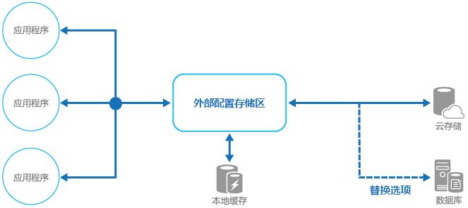

# <a name="external-configuration-store-pattern"></a><span data-ttu-id="d60da-104">外部配置存储模式</span><span class="sxs-lookup"><span data-stu-id="d60da-104">External Configuration Store pattern</span></span>

[!INCLUDE [header](../_includes/header.md)]

<span data-ttu-id="d60da-105">将配置信息从应用程序部署包移出，移到一个集中的位置。</span><span class="sxs-lookup"><span data-stu-id="d60da-105">Move configuration information out of the application deployment package to a centralized location.</span></span> <span data-ttu-id="d60da-106">这可以提供用于简化管理和控制配置数据，以及用于在应用程序和应用程序实例之间共享配置数据的机会。</span><span class="sxs-lookup"><span data-stu-id="d60da-106">This can provide opportunities for easier management and control of configuration data, and for sharing configuration data across applications and application instances.</span></span>

## <a name="context-and-problem"></a><span data-ttu-id="d60da-107">上下文和问题</span><span class="sxs-lookup"><span data-stu-id="d60da-107">Context and problem</span></span>

<span data-ttu-id="d60da-108">应用程序运行时环境的大部分包括随应用程序部署的文件中保留的配置信息。</span><span class="sxs-lookup"><span data-stu-id="d60da-108">The majority of application runtime environments include configuration information that's held in files deployed with the application.</span></span> <span data-ttu-id="d60da-109">在某些情况下，可以编辑这些文件，以在部署应用程序之后更改应用程序行为。</span><span class="sxs-lookup"><span data-stu-id="d60da-109">In some cases, it's possible to edit these files to change the application behavior after it's been deployed.</span></span> <span data-ttu-id="d60da-110">但是，对配置的更改需要重新部署应用程序，常常导致不可接受的停机和其他管理开销。</span><span class="sxs-lookup"><span data-stu-id="d60da-110">However, changes to the configuration require the application be redeployed, often resulting in unacceptable downtime and other administrative overhead.</span></span>

<span data-ttu-id="d60da-111">本地配置文件也将配置限制到单个应用程序，但有时在多个应用程序之间共享配置设置会很有用。</span><span class="sxs-lookup"><span data-stu-id="d60da-111">Local configuration files also limit the configuration to a single application, but sometimes it would be useful to share configuration settings across multiple applications.</span></span> <span data-ttu-id="d60da-112">示例包括数据库连接字符串、UI 主题信息或一组相关应用程序使用的队列和存储的 URL。</span><span class="sxs-lookup"><span data-stu-id="d60da-112">Examples include database connection strings, UI theme information, or the URLs of queues and storage used by a related set of applications.</span></span>

<span data-ttu-id="d60da-113">跨多个正在运行的应用程序实例管理本地配置的更改具有挑战性，特别是在云托管方案中。</span><span class="sxs-lookup"><span data-stu-id="d60da-113">It's challenging to manage changes to local configurations across multiple running instances of the application, especially in a cloud-hosted scenario.</span></span> <span data-ttu-id="d60da-114">它可能导致在部署更新的过程中实例使用不同的配置设置。</span><span class="sxs-lookup"><span data-stu-id="d60da-114">It can result in instances using different configuration settings while the update is being deployed.</span></span>

<span data-ttu-id="d60da-115">此外，应用程序和组件的更新可能需要更改配置架构。</span><span class="sxs-lookup"><span data-stu-id="d60da-115">In addition, updates to applications and components might require changes to configuration schemas.</span></span> <span data-ttu-id="d60da-116">许多配置系统不支持不同版本的配置信息。</span><span class="sxs-lookup"><span data-stu-id="d60da-116">Many configuration systems don't support different versions of configuration information.</span></span>

## <a name="solution"></a><span data-ttu-id="d60da-117">解决方案</span><span class="sxs-lookup"><span data-stu-id="d60da-117">Solution</span></span>

<span data-ttu-id="d60da-118">将配置信息存储在外部存储中，并提供可用来快速、高效地读取和更新配置设置的接口。</span><span class="sxs-lookup"><span data-stu-id="d60da-118">Store the configuration information in external storage, and provide an interface that can be used to quickly and efficiently read and update configuration settings.</span></span> <span data-ttu-id="d60da-119">外部存储的类型取决于应用程序的托管和运行时环境。</span><span class="sxs-lookup"><span data-stu-id="d60da-119">The type of external store depends on the hosting and runtime environment of the application.</span></span> <span data-ttu-id="d60da-120">在云托管方案中，它通常是一种基于云的存储服务，但可能是托管数据库或其他系统。</span><span class="sxs-lookup"><span data-stu-id="d60da-120">In a cloud-hosted scenario it's typically a cloud-based storage service, but could be a hosted database or other system.</span></span>

<span data-ttu-id="d60da-121">为配置信息选择的后备存储应有一个接口，该接口提供一致和易于使用的访问。</span><span class="sxs-lookup"><span data-stu-id="d60da-121">The backing store you choose for configuration information should have an interface that provides consistent and easy-to-use access.</span></span> <span data-ttu-id="d60da-122">它应以正确类型化和结构化的格式公开信息。</span><span class="sxs-lookup"><span data-stu-id="d60da-122">It should expose the information in a correctly typed and structured format.</span></span> <span data-ttu-id="d60da-123">实现可能还需要授予用户的访问权限，以便保护配置数据，并有足够的灵活性以允许存储多个版本的配置（如开发、过渡或生产，包括每一个的多个发行版）。</span><span class="sxs-lookup"><span data-stu-id="d60da-123">The implementation might also need to authorize users’ access in order to protect configuration data, and be flexible enough to allow storage of multiple versions of the configuration (such as development, staging, or production, including multiple release versions of each one).</span></span>

> <span data-ttu-id="d60da-124">许多内置配置系统在应用程序启动时读取数据并在内存中缓存数据，以提供快速访问并最大程度减少对应用程序性能的影响。</span><span class="sxs-lookup"><span data-stu-id="d60da-124">Many built-in configuration systems read the data when the application starts up, and cache the data in memory to provide fast access and minimize the impact on application performance.</span></span> <span data-ttu-id="d60da-125">根据所使用的后备存储的类型以及此存储的延迟，在外部配置存储中实现一种缓存机制可能会有用。</span><span class="sxs-lookup"><span data-stu-id="d60da-125">Depending on the type of backing store used, and the latency of this store, it might be helpful to implement a caching mechanism within the external configuration store.</span></span> <span data-ttu-id="d60da-126">有关详细信息，请参阅[缓存指南](https://msdn.microsoft.com/library/dn589802.aspx)。</span><span class="sxs-lookup"><span data-stu-id="d60da-126">For more information, see the [Caching Guidance](https://msdn.microsoft.com/library/dn589802.aspx).</span></span> <span data-ttu-id="d60da-127">该图说明了具有可选本地存储的外部配置存储模式的概述。</span><span class="sxs-lookup"><span data-stu-id="d60da-127">The figure illustrates an overview of the External Configuration Store pattern with optional local cache.</span></span>




## <a name="issues-and-considerations"></a><span data-ttu-id="d60da-129">问题和注意事项</span><span class="sxs-lookup"><span data-stu-id="d60da-129">Issues and considerations</span></span>

<span data-ttu-id="d60da-130">在决定如何实现此模式时，请考虑以下几点：</span><span class="sxs-lookup"><span data-stu-id="d60da-130">Consider the following points when deciding how to implement this pattern:</span></span>

<span data-ttu-id="d60da-131">选择提供可接受的性能、高可用性、可靠性，并可以作为应用程序维护和管理过程的一部分进行备份的后备存储。</span><span class="sxs-lookup"><span data-stu-id="d60da-131">Choose a backing store that offers acceptable performance, high availability, robustness, and can be backed up as part of the application maintenance and administration process.</span></span> <span data-ttu-id="d60da-132">在云托管应用程序中，使用云存储机制通常是满足这些需求的不错选择。</span><span class="sxs-lookup"><span data-stu-id="d60da-132">In a cloud-hosted application, using a cloud storage mechanism is usually a good choice to meet these requirements.</span></span>

<span data-ttu-id="d60da-133">设计后备存储的架构，以使它可保留的信息类型具有灵活性。</span><span class="sxs-lookup"><span data-stu-id="d60da-133">Design the schema of the backing store to allow flexibility in the types of information it can hold.</span></span> <span data-ttu-id="d60da-134">确保它提供所有配置要求，如类型化的数据、设置的集合、多个版本的设置以及应用程序使用它需要的任何其他功能。</span><span class="sxs-lookup"><span data-stu-id="d60da-134">Ensure that it provides for all configuration requirements such as typed data, collections of settings, multiple versions of settings, and any other features that the applications using it require.</span></span> <span data-ttu-id="d60da-135">架构应该易于扩展，以在需求发生变化时支持其他设置。</span><span class="sxs-lookup"><span data-stu-id="d60da-135">The schema should be easy to extend to support additional settings as requirements change.</span></span>

<span data-ttu-id="d60da-136">请考虑后备存储的物理容量、它与存储配置信息的方式的关系，以及对性能的影响。</span><span class="sxs-lookup"><span data-stu-id="d60da-136">Consider the physical capabilities of the backing store, how it relates to the way configuration information is stored, and the effects on performance.</span></span> <span data-ttu-id="d60da-137">例如，存储包含配置信息的 XML 文档将需要配置界面或应用程序分析文档，以便读取各个设置。</span><span class="sxs-lookup"><span data-stu-id="d60da-137">For example, storing an XML document containing configuration information will require either the configuration interface or the application to parse the document in order to read individual settings.</span></span> <span data-ttu-id="d60da-138">它将使更新设置变得更复杂，尽管缓存设置可有助于抵消较慢的读取性能。</span><span class="sxs-lookup"><span data-stu-id="d60da-138">It'll make updating a setting more complicated, though caching the settings can help to offset slower read performance.</span></span>

<span data-ttu-id="d60da-139">请考虑配置界面将如何允许控制配置设置的作用域和继承。</span><span class="sxs-lookup"><span data-stu-id="d60da-139">Consider how the configuration interface will permit control of the scope and inheritance of configuration settings.</span></span> <span data-ttu-id="d60da-140">例如，可能要求将配置设置限定在组织、应用程序和计算机级别。</span><span class="sxs-lookup"><span data-stu-id="d60da-140">For example, it might be a requirement to scope configuration settings at the organization, application, and the machine level.</span></span> <span data-ttu-id="d60da-141">它可能需要对不同作用域的访问支持控制委派，并阻止或允许各个应用程序替代设置。</span><span class="sxs-lookup"><span data-stu-id="d60da-141">It might need to support delegation of control over access to different scopes, and to prevent or allow individual applications to override settings.</span></span>

<span data-ttu-id="d60da-142">确保配置界面可以所需的格式（如类型化的值、集合、键/值对或属性包）公开配置数据。</span><span class="sxs-lookup"><span data-stu-id="d60da-142">Ensure that the configuration interface can expose the configuration data in the required formats such as typed values, collections, key/value pairs, or property bags.</span></span>

<span data-ttu-id="d60da-143">请考虑当设置包含错误，或不存在于后备存储中时，配置存储接口的行为方式。</span><span class="sxs-lookup"><span data-stu-id="d60da-143">Consider how the configuration store interface will behave when settings contain errors, or don't exist in the backing store.</span></span> <span data-ttu-id="d60da-144">可能返回默认设置并记录错误比较合适。</span><span class="sxs-lookup"><span data-stu-id="d60da-144">It might be appropriate to return default settings and log errors.</span></span> <span data-ttu-id="d60da-145">此外，考虑配置设置密钥或名称的区分大小写、二进制数据的存储和处理以及处理 null 值或空值的方法等方面。</span><span class="sxs-lookup"><span data-stu-id="d60da-145">Also consider aspects such as the case sensitivity of configuration setting keys or names, the storage and handling of binary data, and the ways that null or empty values are handled.</span></span>

<span data-ttu-id="d60da-146">考虑如何保护配置数据以允许仅访问相应的用户和应用程序。</span><span class="sxs-lookup"><span data-stu-id="d60da-146">Consider how to protect the configuration data to allow access to only the appropriate users and applications.</span></span> <span data-ttu-id="d60da-147">这可能是配置存储接口的一项功能，但还需要确保在没有适当权限的情况下不能直接访问后备存储中的数据。</span><span class="sxs-lookup"><span data-stu-id="d60da-147">This is likely a feature of the configuration store interface, but it's also necessary to ensure that the data in the backing store can't be accessed directly without the appropriate permission.</span></span> <span data-ttu-id="d60da-148">确保严格分离读取配置数据和写入配置数据所需的权限。</span><span class="sxs-lookup"><span data-stu-id="d60da-148">Ensure strict separation between the permissions required to read and to write configuration data.</span></span> <span data-ttu-id="d60da-149">还要考虑是否需要加密部分或全部配置设置，以及将如何在配置存储接口中实现这一操作。</span><span class="sxs-lookup"><span data-stu-id="d60da-149">Also consider whether you need to encrypt some or all of the configuration settings, and how this'll be implemented in the configuration store interface.</span></span>

<span data-ttu-id="d60da-150">在运行过程中会更改应用程序行为的集中存储的配置至关重要，应该使用与部署应用程序代码相同的机制部署、更新和管理它们。</span><span class="sxs-lookup"><span data-stu-id="d60da-150">Centrally stored configurations, which change application behavior during runtime, are critically important and should be deployed, updated, and managed using the same mechanisms as deploying application code.</span></span> <span data-ttu-id="d60da-151">例如，可能会影响多个应用程序的更改必须使用完整的测试和暂存部署方法执行，以确保更改适合使用此配置的所有应用程序。</span><span class="sxs-lookup"><span data-stu-id="d60da-151">For example, changes that can affect more than one application must be carried out using a full test and staged deployment approach to ensure that the change is appropriate for all applications that use this configuration.</span></span> <span data-ttu-id="d60da-152">如果管理员编辑某项设置以更新一个应用程序，则它可能对使用该同一设置的应用程序产生负面影响。</span><span class="sxs-lookup"><span data-stu-id="d60da-152">If an administrator edits a setting to update one application, it could adversely impact other applications that use the same setting.</span></span>

<span data-ttu-id="d60da-153">如果应用程序缓存配置信息，则需要在配置更改时警告应用程序。</span><span class="sxs-lookup"><span data-stu-id="d60da-153">If an application caches configuration information, the application needs to be alerted if the configuration changes.</span></span> <span data-ttu-id="d60da-154">可以对缓存的配置数据实现过期策略，以便定期自动刷新此信息和选取（以及操作）任何更改。</span><span class="sxs-lookup"><span data-stu-id="d60da-154">It might be possible to implement an expiration policy over cached configuration data so that this information is automatically refreshed periodically and any changes picked up (and acted on).</span></span>

## <a name="when-to-use-this-pattern"></a><span data-ttu-id="d60da-155">何时使用此模式</span><span class="sxs-lookup"><span data-stu-id="d60da-155">When to use this pattern</span></span>

<span data-ttu-id="d60da-156">此模式适合用于：</span><span class="sxs-lookup"><span data-stu-id="d60da-156">This pattern is useful for:</span></span>

- <span data-ttu-id="d60da-157">在多个应用程序和应用程序实例之间共享的配置设置，或必须在多个应用程序和应用程序实例之间实施标准配置的情况。</span><span class="sxs-lookup"><span data-stu-id="d60da-157">Configuration settings that are shared between multiple applications and application instances, or where a standard configuration must be enforced across multiple applications and application instances.</span></span>

- <span data-ttu-id="d60da-158">不支持所有所需配置设置的标准配置系统，如存储图像或复杂数据类型。</span><span class="sxs-lookup"><span data-stu-id="d60da-158">A standard configuration system that doesn't support all of the required configuration settings, such as storing images or complex data types.</span></span>

- <span data-ttu-id="d60da-159">作为应用程序的某些设置的互补存储，可能允许应用程序重写部分或全部集中存储的设置。</span><span class="sxs-lookup"><span data-stu-id="d60da-159">As a complementary store for some of the settings for applications, perhaps allowing applications to override some or all of the centrally-stored settings.</span></span>

- <span data-ttu-id="d60da-160">记录配置存储的部分或全部访问类型，可作为简化管理多个应用程序的一种方法，也可选用于监视配置设置的使用情况。</span><span class="sxs-lookup"><span data-stu-id="d60da-160">As a way to simplify administration of multiple applications, and optionally for monitoring use of configuration settings by logging some or all types of access to the configuration store.</span></span>

## <a name="example"></a><span data-ttu-id="d60da-161">示例</span><span class="sxs-lookup"><span data-stu-id="d60da-161">Example</span></span>

<span data-ttu-id="d60da-162">在 Microsoft Azure 托管应用程序中，用于从外部存储配置信息的一个典型选择是使用 Azure 存储。</span><span class="sxs-lookup"><span data-stu-id="d60da-162">In a Microsoft Azure hosted application, a typical choice for storing configuration information externally is to use Azure Storage.</span></span> <span data-ttu-id="d60da-163">这是弹性的、提供高性能，并通过自动故障转移复制三次，以提供高可用性。</span><span class="sxs-lookup"><span data-stu-id="d60da-163">This is resilient, offers high performance, and is replicated three times with automatic failover to offer high availability.</span></span> <span data-ttu-id="d60da-164">Azure 表存储提供键/值存储以及对值使用灵活架构的功能。</span><span class="sxs-lookup"><span data-stu-id="d60da-164">Azure Table storage provides a key/value store with the ability to use a flexible schema for the values.</span></span> <span data-ttu-id="d60da-165">Azure Blob 存储提供分层的、基于容器的存储，可在单独命名的 blob 中存储任何类型的数据。</span><span class="sxs-lookup"><span data-stu-id="d60da-165">Azure Blob storage provides a hierarchical, container-based store that can hold any type of data in individually named blobs.</span></span>

<span data-ttu-id="d60da-166">下面的示例演示可如何对 Blob 存储实现配置存储，以存储和公开配置信息。</span><span class="sxs-lookup"><span data-stu-id="d60da-166">The following example shows how a configuration store can be implemented over Blob storage to store and expose configuration information.</span></span> <span data-ttu-id="d60da-167">`BlobSettingsStore` 类提取用于保存配置信息的 Blob 存储，并实现以下代码中所示的 `ISettingsStore` 接口。</span><span class="sxs-lookup"><span data-stu-id="d60da-167">The `BlobSettingsStore` class abstracts Blob storage for holding configuration information, and implements the `ISettingsStore` interface shown in the following code.</span></span>

> <span data-ttu-id="d60da-168">此代码在 _ExternalConfigurationStore_ 解决方案中的 _ExternalConfigurationStore.Cloud_ 项目中提供，可从 [GitHub](https://github.com/mspnp/cloud-design-patterns/tree/master/external-configuration-store) 获取。</span><span class="sxs-lookup"><span data-stu-id="d60da-168">This code is provided in the _ExternalConfigurationStore.Cloud_ project in the _ExternalConfigurationStore_ solution, available from [GitHub](https://github.com/mspnp/cloud-design-patterns/tree/master/external-configuration-store).</span></span>

```csharp
public interface ISettingsStore
{
    Task<string> GetVersionAsync();

    Task<Dictionary<string, string>> FindAllAsync();
}
```

<span data-ttu-id="d60da-169">此接口定义用于检索和更新保存在配置存储中的配置设置的方法，并包括可用于检测最近是否修改任何配置设置的版本号。</span><span class="sxs-lookup"><span data-stu-id="d60da-169">This interface defines methods for retrieving and updating configuration settings held in the configuration store, and includes a version number that can be used to detect whether any configuration settings have been modified recently.</span></span> <span data-ttu-id="d60da-170">`BlobSettingsStore` 类使用 Blob 的 `ETag` 属性实施版本控制。</span><span class="sxs-lookup"><span data-stu-id="d60da-170">The `BlobSettingsStore` class uses the `ETag` property of the blob to implement versioning.</span></span> <span data-ttu-id="d60da-171">每次写入 blob 时会自动更新 `ETag` 属性。</span><span class="sxs-lookup"><span data-stu-id="d60da-171">The `ETag` property is updated automatically each time the blob is written.</span></span>

> <span data-ttu-id="d60da-172">按照设计，这种简单的解决方案将所有配置设置公开为字符串值，而不是类型化的值。</span><span class="sxs-lookup"><span data-stu-id="d60da-172">By design, this simple solution exposes all configuration settings as string values rather than typed values.</span></span>

<span data-ttu-id="d60da-173">`ExternalConfigurationManager` 类提供 `BlobSettingsStore` 对象的包装。</span><span class="sxs-lookup"><span data-stu-id="d60da-173">The `ExternalConfigurationManager` class provides a wrapper around a `BlobSettingsStore` object.</span></span> <span data-ttu-id="d60da-174">应用程序可以使用此类存储和检索配置信息。</span><span class="sxs-lookup"><span data-stu-id="d60da-174">An application can use this class to store and retrieve configuration information.</span></span> <span data-ttu-id="d60da-175">此类使用 Microsoft [Reactive Extensions](https://msdn.microsoft.com/library/hh242985.aspx)（重新激活扩展）库公开通过实现 `IObservable` 接口对配置进行的任何更改。</span><span class="sxs-lookup"><span data-stu-id="d60da-175">This class uses the Microsoft [Reactive Extensions](https://msdn.microsoft.com/library/hh242985.aspx) library to expose any changes made to the configuration through an implementation of the `IObservable` interface.</span></span> <span data-ttu-id="d60da-176">如果通过调用 `SetAppSetting` 方法修改某项设置，则会引发 `Changed` 事件，并且会通知此事件的所有订阅服务器。</span><span class="sxs-lookup"><span data-stu-id="d60da-176">If a setting is modified by calling the `SetAppSetting` method, the `Changed` event is raised and all subscribers to this event will be notified.</span></span>

<span data-ttu-id="d60da-177">请注意，所有设置也会缓存在 `ExternalConfigurationManager` 类中的 `Dictionary` 对象内，以实现快速访问。</span><span class="sxs-lookup"><span data-stu-id="d60da-177">Note that all settings are also cached in a `Dictionary` object inside the `ExternalConfigurationManager` class for fast access.</span></span> <span data-ttu-id="d60da-178">用于检索配置设置的 `GetSetting` 方法会从缓存中读取数据。</span><span class="sxs-lookup"><span data-stu-id="d60da-178">The `GetSetting` method used to retrieve a configuration setting reads the data from the cache.</span></span> <span data-ttu-id="d60da-179">如果在缓存中找不到设置，可改为从 `BlobSettingsStore` 对象检索。</span><span class="sxs-lookup"><span data-stu-id="d60da-179">If the setting isn't found in the cache, it's retrieved from the `BlobSettingsStore` object instead.</span></span>

<span data-ttu-id="d60da-180">`GetSettings` 方法调用 `CheckForConfigurationChanges` 方法来检测 Blob 存储中的配置信息是否已发生更改。</span><span class="sxs-lookup"><span data-stu-id="d60da-180">The `GetSettings` method invokes the `CheckForConfigurationChanges` method to detect whether the configuration information in blob storage has changed.</span></span> <span data-ttu-id="d60da-181">它通过检查版本号并将其与 `ExternalConfigurationManager` 对象持有的当前版本号进行比较来执行此操作。</span><span class="sxs-lookup"><span data-stu-id="d60da-181">It does this by examining the version number and comparing it with the current version number held by the `ExternalConfigurationManager` object.</span></span> <span data-ttu-id="d60da-182">如果发生了一个或多个更改，则会引发 `Changed` 事件，并刷新 `Dictionary` 对象中缓存的配置设置。</span><span class="sxs-lookup"><span data-stu-id="d60da-182">If one or more changes have occurred, the `Changed` event is raised and the configuration settings cached in the `Dictionary` object are refreshed.</span></span> <span data-ttu-id="d60da-183">这是[缓存端模式](cache-aside.md)的一个应用程序。</span><span class="sxs-lookup"><span data-stu-id="d60da-183">This is an application of the [Cache-Aside pattern](cache-aside.md).</span></span>

<span data-ttu-id="d60da-184">下面的代码示例演示如何实现 `Changed` 事件、`GetSettings` 方法和 `CheckForConfigurationChanges` 方法：</span><span class="sxs-lookup"><span data-stu-id="d60da-184">The following code sample shows how the `Changed` event, the `GetSettings` method, and the `CheckForConfigurationChanges` method are implemented:</span></span>

```csharp
public class ExternalConfigurationManager : IDisposable
{
  // An abstraction of the configuration store.
  private readonly ISettingsStore settings;
  private readonly ISubject<KeyValuePair<string, string>> changed;
  ...
  private readonly ReaderWriterLockSlim settingsCacheLock = new ReaderWriterLockSlim();
  private readonly SemaphoreSlim syncCacheSemaphore = new SemaphoreSlim(1);  
  ...
  private Dictionary<string, string> settingsCache;
  private string currentVersion;
  ...
  public ExternalConfigurationManager(ISettingsStore settings, ...)
  {
    this.settings = settings;
    ...
  }
  ...
  public IObservable<KeyValuePair<string, string>> Changed => this.changed.AsObservable();
  ...

  public string GetAppSetting(string key)
  {
    ...
    // Try to get the value from the settings cache. 
    // If there's a cache miss, get the setting from the settings store and refresh the settings cache.

    string value;
    try
    {
        this.settingsCacheLock.EnterReadLock();

        this.settingsCache.TryGetValue(key, out value);
    }
    finally
    {
        this.settingsCacheLock.ExitReadLock();
    }

    return value;
  }
  ...
  private void CheckForConfigurationChanges()
  {
    try
    {
        // It is assumed that updates are infrequent.
        // To avoid race conditions in refreshing the cache, synchronize access to the in-memory cache.
        await this.syncCacheSemaphore.WaitAsync();

        var latestVersion = await this.settings.GetVersionAsync();

        // If the versions are the same, nothing has changed in the configuration.
        if (this.currentVersion == latestVersion) return;

        // Get the latest settings from the settings store and publish changes.
        var latestSettings = await this.settings.FindAllAsync();

        // Refresh the settings cache.
        try
        {
            this.settingsCacheLock.EnterWriteLock();

            if (this.settingsCache != null)
            {
                //Notify settings changed
                latestSettings.Except(this.settingsCache).ToList().ForEach(kv => this.changed.OnNext(kv));
            }
            this.settingsCache = latestSettings;
        }
        finally
        {
            this.settingsCacheLock.ExitWriteLock();
        }

        // Update the current version.
        this.currentVersion = latestVersion;
    }
    catch (Exception ex)
    {
        this.changed.OnError(ex);
    }
    finally
    {
        this.syncCacheSemaphore.Release();
    }
  }
}
```

> <span data-ttu-id="d60da-185">`ExternalConfigurationManager` 类还提供了一个名为 `Environment` 的属性。</span><span class="sxs-lookup"><span data-stu-id="d60da-185">The `ExternalConfigurationManager` class also provides a property named `Environment`.</span></span> <span data-ttu-id="d60da-186">此属性支持在不同环境（如过渡和生产）中运行的应用程序的不同配置。</span><span class="sxs-lookup"><span data-stu-id="d60da-186">This property supports varying configurations for an application running in different environments, such as staging and production.</span></span>

<span data-ttu-id="d60da-187">`ExternalConfigurationManager` 对象还可以定期查询 `BlobSettingsStore` 对象是否有任何更改。</span><span class="sxs-lookup"><span data-stu-id="d60da-187">An `ExternalConfigurationManager` object can also query the `BlobSettingsStore` object periodically for any changes.</span></span> <span data-ttu-id="d60da-188">在下面的代码中，`StartMonitor` 方法每隔一段时间就会调用 `CheckForConfigurationChanges` 以检测任何更改并引发 `Changed` 事件，如前所述。</span><span class="sxs-lookup"><span data-stu-id="d60da-188">In the following code, the `StartMonitor` method calls `CheckForConfigurationChanges` at an interval to detect any changes and raise the `Changed` event, as described earlier.</span></span>

```csharp
public class ExternalConfigurationManager : IDisposable
{
  ...
  private readonly ISubject<KeyValuePair<string, string>> changed;
  private Dictionary<string, string> settingsCache;
  private readonly CancellationTokenSource cts = new CancellationTokenSource();
  private Task monitoringTask;
  private readonly TimeSpan interval;

  private readonly SemaphoreSlim timerSemaphore = new SemaphoreSlim(1);
  ...
  public ExternalConfigurationManager(string environment) : this(new BlobSettingsStore(environment), TimeSpan.FromSeconds(15), environment)
  {
  }
  
  public ExternalConfigurationManager(ISettingsStore settings, TimeSpan interval, string environment)
  {
      this.settings = settings;
      this.interval = interval;
      this.CheckForConfigurationChangesAsync().Wait();
      this.changed = new Subject<KeyValuePair<string, string>>();
      this.Environment = environment;
  }
  ...
  /// <summary>
  /// Check to see if the current instance is monitoring for changes
  /// </summary>
  public bool IsMonitoring => this.monitoringTask != null && !this.monitoringTask.IsCompleted;

  /// <summary>
  /// Start the background monitoring for configuration changes in the central store
  /// </summary>
  public void StartMonitor()
  {
      if (this.IsMonitoring)
          return;

      try
      {
          this.timerSemaphore.Wait();

          // Check again to make sure we are not already running.
          if (this.IsMonitoring)
              return;

          // Start running our task loop.
          this.monitoringTask = ConfigChangeMonitor();
      }
      finally
      {
          this.timerSemaphore.Release();
      }
  }

  /// <summary>
  /// Loop that monitors for configuration changes
  /// </summary>
  /// <returns></returns>
  public async Task ConfigChangeMonitor()
  {
      while (!cts.Token.IsCancellationRequested)
      {
          await this.CheckForConfigurationChangesAsync();
          await Task.Delay(this.interval, cts.Token);
      }
  }

  /// <summary>
  /// Stop monitoring for configuration changes
  /// </summary>
  public void StopMonitor()
  {
      try
      {
          this.timerSemaphore.Wait();

          // Signal the task to stop.
          this.cts.Cancel();

          // Wait for the loop to stop.
          this.monitoringTask.Wait();

          this.monitoringTask = null;
      }
      finally
      {
          this.timerSemaphore.Release();
      }
  }

  public void Dispose()
  {
      this.cts.Cancel();
  }
  ...
}
```

<span data-ttu-id="d60da-189">`ExternalConfigurationManager` 类被如下所示的 `ExternalConfiguration` 类实例化为单一实例。</span><span class="sxs-lookup"><span data-stu-id="d60da-189">The `ExternalConfigurationManager` class is instantiated as a singleton instance by the `ExternalConfiguration` class shown below.</span></span>

```csharp
public static class ExternalConfiguration
{
    private static readonly Lazy<ExternalConfigurationManager> configuredInstance = new Lazy<ExternalConfigurationManager>(
        () =>
        {
            var environment = CloudConfigurationManager.GetSetting("environment");
            return new ExternalConfigurationManager(environment);
        });

    public static ExternalConfigurationManager Instance => configuredInstance.Value;
}
```

<span data-ttu-id="d60da-190">以下代码摘自 _ExternalConfigurationStore.Cloud_ 项目中的 `WorkerRole` 类。</span><span class="sxs-lookup"><span data-stu-id="d60da-190">The following code is taken from the `WorkerRole` class in the _ExternalConfigurationStore.Cloud_ project.</span></span> <span data-ttu-id="d60da-191">它显示应用程序如何使用 `ExternalConfiguration` 类读取设置。</span><span class="sxs-lookup"><span data-stu-id="d60da-191">It shows how the application uses the `ExternalConfiguration` class to read a setting.</span></span>

```csharp
public override void Run()
{
  // Start monitoring configuration changes.
  ExternalConfiguration.Instance.StartMonitor();

  // Get a setting.
  var setting = ExternalConfiguration.Instance.GetAppSetting("setting1");
  Trace.TraceInformation("Worker Role: Get setting1, value: " + setting);

  this.completeEvent.WaitOne();
}
```

<span data-ttu-id="d60da-192">同样来自于 `WorkerRole` 类的以下代码显示应用程序如何订阅配置事件。</span><span class="sxs-lookup"><span data-stu-id="d60da-192">The following code, also from the `WorkerRole` class, shows how the application subscribes to configuration events.</span></span>

```csharp
public override bool OnStart()
{
  ...
  // Subscribe to the event.
  ExternalConfiguration.Instance.Changed.Subscribe(
     m => Trace.TraceInformation("Configuration has changed. Key:{0} Value:{1}",
          m.Key, m.Value),
     ex => Trace.TraceError("Error detected: " + ex.Message));
  ...
}
```

## <a name="related-patterns-and-guidance"></a><span data-ttu-id="d60da-193">相关模式和指南</span><span class="sxs-lookup"><span data-stu-id="d60da-193">Related patterns and guidance</span></span>

- <span data-ttu-id="d60da-194">演示此模式的示例可在 [GitHub](https://github.com/mspnp/cloud-design-patterns/tree/master/external-configuration-store) 上找到。</span><span class="sxs-lookup"><span data-stu-id="d60da-194">A sample that demonstrates this pattern is available on [GitHub](https://github.com/mspnp/cloud-design-patterns/tree/master/external-configuration-store).</span></span>
