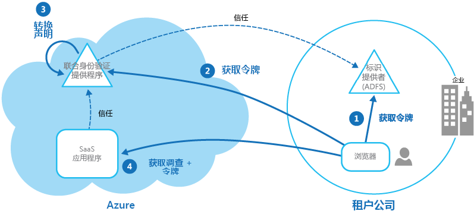

# 联合身份模式Federated Identity pattern

[!INCLUDE [header](../_includes/header.md)]

将身份验证委托给外部标识提供者。Delegate authentication to an external identity provider. 这可以简化开发、最小化对用户管理的要求，并改善应用程序的用户体验。This can simplify development, minimize the requirement for user administration, and improve the user experience of the application.

## 上下文和问题Context and problem

用户通常需要使用多个应用程序，这些应用程序由与用户有业务关系的不同组织提供和托管。Users typically need to work with multiple applications provided and hosted by different organizations they have a business relationship with. 这些用户可能需要使用每个应用程序的特定（和不同）的凭据。These users might be required to use specific (and different) credentials for each one. 这可能：This can:

- **导致用户体验不连贯**。**Cause a disjointed user experience**. 当用户拥有许多不同的凭据时，他们常常会忘记登录凭据。Users often forget sign-in credentials when they have many different ones.

- **暴露安全漏洞**。**Expose security vulnerabilities**. 当用户离开公司时，帐户必须立即取消设置。When a user leaves the company the account must immediately be deprovisioned. 在大型组织中尤为容易忽略这一点。It's easy to overlook this in large organizations.

- **使用户管理复杂化**。**Complicate user management**. 管理员必须管理所有用户的凭据，并执行其他任务，例如提供密码提醒。Administrators must manage credentials for all of the users, and perform additional tasks such as providing password reminders.

用户通常喜欢对所有这些应用程序使用同一凭据。Users typically prefer to use the same credentials for all these applications.

## 解决方案Solution

实现可以使用联合身份的身份验证机制。Implement an authentication mechanism that can use federated identity. 将用户身份验证与应用程序代码分离，并将身份验证委托给受信任的标识提供者。Separate user authentication from the application code, and delegate authentication to a trusted identity provider. 这可以简化开发，并允许用户使用更广泛的标识提供者 (IdP) 进行身份验证，同时最小化管理开销。This can simplify development and allow users to authenticate using a wider range of identity providers (IdP) while minimizing the administrative overhead. 它还允许明确地将身份验证与授权分离。It also allows you to clearly decouple authentication from authorization.

可信任的标识提供者包括公司目录、本地联合服务、由业务伙伴提供的其他安全令牌服务 (STS)，或可以对拥有 Microsoft、Google、Yahoo! 或 Facebook帐户的用户进行身份验证的社交标识提供者。The trusted identity providers include corporate directories, on-premises federation services, other security token services (STS) provided by business partners, or social identity providers that can authenticate users who have, for example, a Microsoft, Google, Yahoo!, or Facebook account.

该图说明了当客户端应用程序需要访问要求身份验证的服务时的联合身份模式。The figure illustrates the Federated Identity pattern when a client application needs to access a service that requires authentication. 身份验证由与 STS 协同工作的 IdP 执行。The authentication is performed by an IdP that works in concert with an STS. IdP 颁发安全令牌，该安全令牌提供已进行身份验证用户的信息。The IdP issues security tokens that provide information about the authenticated user. 该信息（又称为声明）包括用户的标识，并且还可包含其他信息（如角色成员资格和更具体的访问权限）。This information, referred to as claims, includes the user’s identity, and might also include other information such as role membership and more granular access rights.

此模型通常称为基于声明的访问控制。This model is often called claims-based access control. 应用程序和服务基于令牌中包含的声明授权访问功能。Applications and services authorize access to features and functionality based on the claims contained in the token. 需要身份验证的服务必须信任 IdP。The service that requires authentication must trust the IdP. 客户端应用程序联系执行身份验证的 IdP。The client application contacts the IdP that performs the authentication. 如果身份验证成功，IdP 将向 STS 返回包含标识用户的声明的令牌（请注意，IdP 和 STS 可以是同一服务）。If the authentication is successful, the IdP returns a token containing the claims that identify the user to the STS (note that the IdP and STS can be the same service). STS 可以基于预定义规则，在将其返回到客户端之前，转换和扩大令牌中的声明。The STS can transform and augment the claims in the token based on predefined rules, before returning it to the client. 然后，客户端应用程序可以将此令牌传递到服务，作为其标识的证明。The client application can then pass this token to the service as proof of its identity.

> 在信任链中可能有额外的 STS。There might be additional STSs in the chain of trust. 例如，在下面描述的方案中，本地 STS 信任负责访问标识提供者以对用户进行身份验证的另一 STS。For example, in the scenario described later, an on-premises STS trusts another STS that is responsible for accessing an identity provider to authenticate the user. 这是在企业方案中的常见方法，其中包含本地 STS 和目录。This approach is common in enterprise scenarios where there's an on-premises STS and directory.

联合身份验证为跨不同域的信任标识的问题提供了一个基于标准的解决方案，并且可以支持单一登录。Federated authentication provides a standards-based solution to the issue of trusting identities across diverse domains, and can support single sign-on. 它在所有类型的应用程序（尤其是云托管应用程序）中变得越来越普遍，因为它支持单一登录，无需与标识提供者的直接网络连接。It's becoming more common across all types of applications, especially cloud-hosted applications, because it supports single sign-on without requiring a direct network connection to identity providers. 用户不必为每个应用程序输入凭据。The user doesn't have to enter credentials for every application. 这增加了安全性，因为它可避免访问多个不同应用程序所需的凭据创建，并且它还对除原始标识提供者外的所有标识提供者隐藏用户凭据。This increases security because it prevents the creation of credentials required to access many different applications, and it also hides the user’s credentials from all but the original identity provider. 应用程序仅可查看令牌中包含的已经过身份验证的标识信息。Applications see just the authenticated identity information contained within the token.

联合身份还具有一大优点，即标识提供者负责管理标识和凭证。Federated identity also has the major advantage that management of the identity and credentials is the responsibility of the identity provider. 应用程序或服务不需要提供标识管理功能。The application or service doesn't need to provide identity management features. 此外，在公司方案中，如果公司目录信任标识提供者，则不需要知道用户。In addition, in corporate scenarios, the corporate directory doesn't need to know about the user if it trusts the identity provider. 这会免去在目录中管理用户标识的所有管理开销。This removes all the administrative overhead of managing the user identity within the directory.

## 问题和注意事项Issues and considerations

设计实现联合身份验证的应用程序时，请考虑以下事项：Consider the following when designing applications that implement federated authentication:

- 身份验证可以是单点故障。Authentication can be a single point of failure. 如果将应用程序部署到多个数据中心，请考虑将标识管理机制部署到同一数据中心，以维护应用程序的可靠性和可用性。If you deploy your application to multiple datacenters, consider deploying your identity management mechanism to the same datacenters to maintain application reliability and availability.

- 通过身份验证工具，可基于身份验证令牌中的角色声明配置访问控制。Authentication tools make it possible to configure access control based on role claims contained in the authentication token. 这通常称为基于角色的访问控制 (RBAC)，并且它允许对功能和资源的访问进行较具体级别的控制。This is often referred to as role-based access control (RBAC), and it can allow a more granular level of control over access to features and resources.

- 与公司目录不同，使用社交标识提供者的基于声明的身份验证通常不提供经过身份验证的用户的信息（电子邮件地址和名称除外）。Unlike a corporate directory, claims-based authentication using social identity providers doesn't usually provide information about the authenticated user other than an email address, and perhaps a name. 某些社交标识提供者（如 Microsoft 帐户）仅提供唯一标识符。Some social identity providers, such as a Microsoft account, provide only a unique identifier. 应用程序通常需要维护注册用户的一些信息，并能够将此信息与令牌中的声明中包含的标识符相匹配。The application usually needs to maintain some information on registered users, and be able to match this information to the identifier contained in the claims in the token. 这通常通过用户首次访问应用程序时的注册来完成，在每次身份验证之后，信息作为附加声明注入到令牌中。Typically this is done through registration when the user first accesses the application, and information is then injected into the token as additional claims after each authentication.

- 如果为 STS 配置了多个标识提供者，则它必须检测用户应重定向到哪个标识提供者（用于身份验证）。If there's more than one identity provider configured for the STS, it must detect which identity provider the user should be redirected to for authentication. 这个过程称为主页领域发现。This process is called home realm discovery. STS 可以基于用户提供的电子邮件地址或用户名、用户正在访问的应用程序的子域、用户的 IP 地址范围或存储在用户浏览器 cookie 中的内容来自动执行此操作。The STS might be able to do this automatically based on an email address or user name that the user provides, a subdomain of the application that the user is accessing, the user’s IP address scope, or on the contents of a cookie stored in the user’s browser. 例如，如果用户在 Microsoft 域中输入电子邮件地址（例如 user@live.com），则 STS 会将用户重定向到 Microsoft 帐户登录页面。For example, if the user entered an email address in the Microsoft domain, such as user@live.com, the STS will redirect the user to the Microsoft account sign-in page. 在以后的访问中，STS 可以使用 cookie 来指示最后的登录使用的是 Microsoft 帐户。On later visits, the STS could use a cookie to indicate that the last sign in was with a Microsoft account. 如果自动发现无法确定主页领域，则 STS 会显示列出受信标识提供者的主页领域发现页，用户必须选择其中之一来使用。If automatic discovery can't determine the home realm, the STS will display a home realm discovery page that lists the trusted identity providers, and the user must select the one they want to use.

## 何时使用此模式When to use this pattern

此模式适用于以下方案：This pattern is useful for scenarios such as:

- **企业中的单一登录**。**Single sign-on in the enterprise**. 在此方案中，需要对公司安全边界外的云托管的公司应用程序进行员工身份验证，而无需要求他们在每次访问应用程序时登录。In this scenario you need to authenticate employees for corporate applications that are hosted in the cloud outside the corporate security boundary, without requiring them to sign in every time they visit an application. 用户体验与使用本地应用程序时的用户体验相同，在登录到公司网络时进行身份验证，此后即可访问所有相关应用程序，无需再次登录。The user experience is the same as when using on-premises applications where they're authenticated when signing in to a corporate network, and from then on have access to all relevant applications without needing to sign in again.

- **与多个合作伙伴的联合身份**。**Federated identity with multiple partners**. 在此方案中，需要对公司员工以及在公司目录中没有帐户的业务合作伙伴进行身份验证。In this scenario you need to authenticate both corporate employees and business partners who don't have accounts in the corporate directory. 这在企业到企业应用程序、与第三方服务集成的应用程序，以及已合并或共享资源的具有不同 IT 系统的公司中很常见。This is common in business-to-business applications, applications that integrate with third-party services, and where companies with different IT systems have merged or shared resources.

- **SaaS 应用程序中的联合身份**。**Federated identity in SaaS applications**. 在此方案中，独立软件供应商为多个客户端或租户提供即用型服务。In this scenario independent software vendors provide a ready-to-use service for multiple clients or tenants. 每个租户使用合适的标识提供者进行身份验证。Each tenant authenticates using a suitable identity provider. 例如，公司用户将使用其公司凭据，而租户的使用者和客户将使用其社交标识凭据。For example, business users will use their corporate credentials, while consumers and clients of the tenant will use their social identity credentials.

此模式在以下情况中可能不起作用：This pattern might not be useful in the following situations:

- 应用程序的所有用户都可以由一个标识提供者进行身份验证，并且无需使用任何其他标识提供者进行身份验证。All users of the application can be authenticated by one identity provider, and there's no requirement to authenticate using any other identity provider. 这在使用公司目录（可在应用程序中访问）进行身份验证的业务应用程序中很典型，身份验证的方式是通过使用 VPN 或（在云托管方案中）通过本地目录与应用程序之间的虚拟网络连接。This is typical in business applications that use a corporate directory (accessible within the application) for authentication, by using a VPN, or (in a cloud-hosted scenario) through a virtual network connection between the on-premises directory and the application.

- 最初使用不同的身份验证机制构建应用程序，可能使用了自定义用户存储，或不具备处理基于声明的技术使用的协商标准的能力。The application was originally built using a different authentication mechanism, perhaps with custom user stores, or doesn't have the capability to handle the negotiation standards used by claims-based technologies. 将基于声明的身份验证和访问控制更新到现有应用程序可能很复杂，并且可能不具有成本效益。Retrofitting claims-based authentication and access control into existing applications can be complex, and probably not cost effective.

## 示例Example

组织在 Microsoft Azure 中托管多租户软件即服务 (SaaS) 应用程序。An organization hosts a multi-tenant software as a service (SaaS) application in Microsoft Azure. 该应用程序包括一个网站，租户可以使用该网站为自己的用户管理应用程序。The application includes a website that tenants can use to manage the application for their own users. 当通过组织自己的 Active Directory 对用户进行身份验证时，应用程序允许租户通过使用由 Active Directory 联合身份验证服务 (ADFS) 生成的联合身份访问网站。The application allows tenants to access the website by using a federated identity that is generated by Active Directory Federation Services (ADFS) when a user is authenticated by that organization’s own Active Directory.

该图显示了租户如何使用自己的标识提供者（步骤 1，在本例中为 ADFS）进行身份验证。The figure shows how tenants authenticate with their own identity provider (step 1), in this case ADFS. 对租户的身份验证成功后，ADFS 颁发一个令牌。After successfully authenticating a tenant, ADFS issues a token. 客户端浏览器将此令牌转发到 SaaS 应用程序的联合身份验证提供程序，该提供程序信任由租户的 ADFS 颁发的令牌，以便获取对 SaaS 联合身份验证提供程序有效的令牌（步骤 2）。The client browser forwards this token to the SaaS application’s federation provider, which trusts tokens issued by the tenant’s ADFS, in order to get back a token that is valid for the SaaS federation provider (step 2). 如果需要，在将新令牌返回到客户端浏览器之前，SaaS 联合身份验证提供程序将令牌中的声明转换为应用程序识别的声明（步骤 3）。If necessary, the SaaS federation provider performs a transformation on the claims in the token into claims that the application recognizes (step 3) before returning the new token to the client browser. 应用程序信任由 SaaS 联合身份验证提供程序颁发的令牌，并使用令牌中的声明来应用授权规则（步骤 4）。The application trusts tokens issued by the SaaS federation provider and uses the claims in the token to apply authorization rules (step 4).

租户无需记住单独的凭据来访问应用程序，并且租户公司的管理员可以在自己的 ADFS 中配置可以访问应用程序的用户列表。Tenants won't need to remember separate credentials to access the application, and an administrator at the tenant’s company can configure in its own ADFS the list of users that can access the application.

## 相关指南Related guidance

- [Microsoft Azure Active DirectoryMicrosoft Azure Active Directory](https://azure.microsoft.com/services/active-directory/)
- [Active Directory 域服务Active Directory Domain Services](https://msdn.microsoft.com/library/bb897402.aspx)
- [Active Directory 联合身份验证服务Active Directory Federation Services](https://msdn.microsoft.com/library/bb897402.aspx)
- [Microsoft Azure 中多租户应用程序的标识管理Identity management for multitenant applications in Microsoft Azure](https://azure.microsoft.com/documentation/articles/guidance-multitenant-identity/)
- [Azure 中的多租户应用程序Multitenant Applications in Azure](https://azure.microsoft.com/documentation/articles/dotnet-develop-multitenant-applications/)
