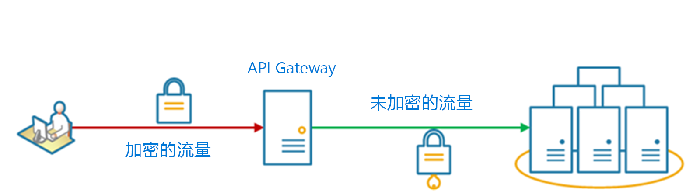

# <a name="gateway-offloading-pattern"></a>网关卸载模式

将共享或专用服务功能卸载到网关代理。 此模式可以通过将共享服务功能（如 SSL 证书的使用）从应用程序的其他部分移动到网关，简化应用程序开发。

## <a name="context-and-problem"></a>上下文和问题

一些功能通常跨多个服务使用，并且这些功能需要配置、管理和维护。 与每个应用程序部署一起分发的共享或特殊化服务会增加管理开支和部署错误的可能性。 对共享功能的任何更新必须跨共享该功能的所有服务部署。

正确处理安全问题（令牌验证、加密、SSL 证书管理）和其他复杂任务可能需要具备高度专业技能的团队成员。 例如，应用程序所需的证书必须在所有应用程序实例上配置和部署。 对于每个新部署，必须管理证书以确保它未过期。 任何即将到期的通用证书必须针对每个应用程序部署进行更新、测试和验证。

其他通用服务（如身份验证、授权、日志记录、监视或[限制](./throttling.md)）可能很难在大量部署中进行实施和管理。 可能更好的做法是合并此类型功能，以便减少开销和降低错误概率。

## <a name="solution"></a>解决方案

将一些功能卸载到 API 网关，尤其是横切关注点（如证书管理、身份验证、SSL 终端、监视、协议转换或限制）。 

下图显示终止入站 SSL 连接的 API 网关。 它代表 API 网关上游的 HTTP 服务器中的原始请求程序请求数据。

 
 
此模式的优点包括：

- 通过消除对分发和维护支持资源的需求，简化服务的部署，如 Web 服务器证书和安全网站的配置。 通过简化配置，简化管理、可伸缩性和服务升级。

- 允许专业团队实施需要专业技能的功能，如安全性。 这样一来，核心团队可专注于应用程序功能，而这些特殊化横切关注点可交给相关专家解决。

- 提供请求和响应记录和监视的一致性。 即使未正确检测服务，也可以通过配置网关来确保最低级别的监视和记录。

## <a name="issues-and-considerations"></a>问题和注意事项

- 确保 API 网关的高度可用性和应对故障的灵活性。 运行多个 API 网关实例以避免单一故障点。 
- 确保网关可满足应用程序和终结点的容量和缩放要求。 确保网关不会成为应用程序的瓶颈，并具有足够的可缩放性。
- 仅卸载由整个应用程序使用的功能，如安全性或数据传输。
- 请勿将业务逻辑卸载到 API 网关。 
- 如果需要跟踪事务，请考虑生成用于记录的关联 ID。

## <a name="when-to-use-this-pattern"></a>何时使用此模式

在以下情况下使用此模式：

- 应用程序部署具有共享关注点，如 SSL 证书或加密。
- 应用程序部署中的一个常用功能，可能具有不同的资源要求，例如内存资源、存储容量或网络连接。
- 希望将问题（如网络安全、限制或其他网络限制问题）的责任转移到一个更专业的团队。

如果此模式跨服务引入耦合度，则它可能不适合。

## <a name="example"></a>示例

将 Nginx 用作 SSL 卸载设备，以下配置将终止入站 SSL 连接，并将连接分布到三个上游 HTTP 服务器之一。

```
upstream iis {
        server  10.3.0.10    max_fails=3    fail_timeout=15s;
        server  10.3.0.20    max_fails=3    fail_timeout=15s;
        server  10.3.0.30    max_fails=3    fail_timeout=15s;
}

server {
        listen 443;
        ssl on;
        ssl_certificate /etc/nginx/ssl/domain.cer;
        ssl_certificate_key /etc/nginx/ssl/domain.key;

        location / {
                set $targ iis;
                proxy_pass http://$targ;
                proxy_set_header X-Forwarded-For $proxy_add_x_forwarded_for;
                proxy_set_header X-Forwarded-Proto https;
proxy_set_header X-Real-IP $remote_addr;
                proxy_set_header Host $host;
        }
}
```

## <a name="related-guidance"></a>相关指南

- [用于前端的后端模式](./backends-for-frontends.md)
- [网关聚合模式](./gateway-aggregation.md)
- [网关路由模式](./gateway-routing.md)

