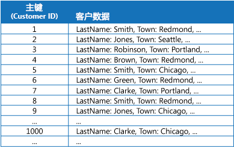
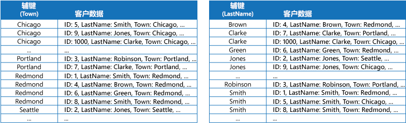
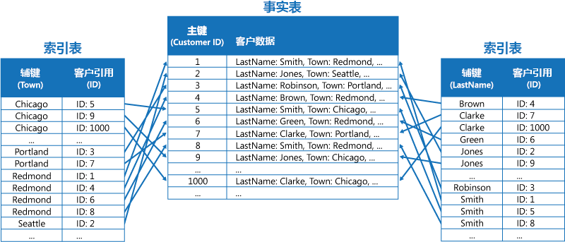

# 索引表模式Index Table pattern

[!INCLUDE [header](../_includes/header.md)]

基于数据存储中经常由查询引用的字段创建索引。Create indexes over the fields in data stores that are frequently referenced by queries. 此模式可让应用程序更快地找到要从数据存储中检索的数据，从而提高了查询性能。This pattern can improve query performance by allowing applications to more quickly locate the data to retrieve from a data store.

## 上下文和问题Context and problem

许多数据存储使用主键组织实体集合的数据。Many data stores organize the data for a collection of entities using the primary key. 应用程序可以使用此键来查找和检索数据。An application can use this key to locate and retrieve data. 下图显示了一个保存客户信息的数据存储示例。The figure shows an example of a data store holding customer information. 主键为“客户 ID”。The primary key is the Customer ID. 该图显示按主键（“客户 ID”）组织的客户信息。The figure shows customer information organized by the primary key (Customer ID).

尽管主键对于基于此键值提取数据的查询很有作用，但如果应用程序需要基于其他某个字段检索数据，则可能无法使用主键。While the primary key is valuable for queries that fetch data based on the value of this key, an application might not be able to use the primary key if it needs to retrieve data based on some other field. 在客户示例中，如果应用程序只是通过引用其他某个属性（例如，客户所在的城镇）的值查询数据，则无法使用“客户 ID”主键来检索客户。In the customers example, an application can't use the Customer ID primary key to retrieve customers if it queries data solely by referencing the value of some other attribute, such as the town in which the customer is located. 若要执行此类查询，应用程序可能需要提取并检查每条客户记录，而这是一个缓慢的过程。To perform a query such as this, the application might have to fetch and examine every customer record, which could be a slow process.

许多关系数据库管理系统支持辅助索引。Many relational database management systems support secondary indexes. 辅助索引是按一个或多个非主键（辅助键）字段组织的独立数据结构，指示每个索引值的数据的存储位置。A secondary index is a separate data structure that's organized by one or more nonprimary (secondary) key fields, and it indicates where the data for each indexed value is stored. 辅助索引中的项通常已按辅助键的值排序，以便快速查找数据。The items in a secondary index are typically sorted by the value of the secondary keys to enable fast lookup of data. 这些索引通常由数据库管理系统自动维护。These indexes are usually maintained automatically by the database management system.

可以根据需要创建任意数目的辅助索引来支持应用程序执行的不同查询。You can create as many secondary indexes as you need to support the different queries that your application performs. 例如，在关系数据库中“客户 ID”是主键的“客户”表中，如果应用程序经常根据客户所在的城镇查找客户，则基于城镇字段添加一个辅助索引会很有作用。For example, in a Customers table in a relational database where the Customer ID is the primary key, it's beneficial to add a secondary index over the town field if the application frequently looks up customers by the town where they reside.

尽管辅助索引在关系数据库系统中很常见，但云应用程序使用的大多数 NoSQL 数据存储并不提供等效的功能。However, although secondary indexes are common in relational systems, most NoSQL data stores used by cloud applications don't provide an equivalent feature.

## 解决方案Solution

如果数据存储不支持辅助索引，你可以通过创建自己的索引表来手动模拟辅助索引。If the data store doesn't support secondary indexes, you can emulate them manually by creating your own index tables. 索引表按指定的键组织数据。An index table organizes the data by a specified key. 根据所需的辅助索引数目以及应用程序执行的查询性质，我们通常可以使用三种策略来构建索引表。Three strategies are commonly used for structuring an index table, depending on the number of secondary indexes that are required and the nature of the queries that an application performs.

第一种策略是复制每个索引表中的数据，但按不同的键（完全非规范化）组织这些数据。The first strategy is to duplicate the data in each index table but organize it by different keys (complete denormalization). 下图显示了按“城镇”和“姓氏”组织相同客户信息的索引表。The next figure shows index tables that organize the same customer information by Town and LastName.

如果相对于使用每个键查询数据的次数而言数据较为静态，则此策略适用。This strategy is appropriate if the data is relatively static compared to the number of times it's queried using each key. 如果数据较为动态，则维护每个索引表所产生的处理开销会变得过大，因此，此方法并不有效。If the data is more dynamic, the processing overhead of maintaining each index table becomes too large for this approach to be useful. 此外，如果数据量极大，存储重复数据所需的空间量也很大。Also, if the volume of data is very large, the amount of space required to store the duplicate data is significant.

第二种策略是创建按不同键组织的规范化索引表，并使用主键来引用原始数据，而不是复制数据，如下图所示。The second strategy is to create normalized index tables organized by different keys and reference the original data by using the primary key rather than duplicating it, as shown in the following figure. 原始数据称为事实数据表。The original data is called a fact table.

此方法可节省空间，并减少维护重复数据所产生的开销。This technique saves space and reduces the overhead of maintaining duplicate data. 其缺点在于，应用程序必须使用辅助键执行两项查找操作才能找到数据。The disadvantage is that an application has to perform two lookup operations to find data using a secondary key. 应用程序必须在索引表中查找数据的主键，然后使用主键来查找事实数据表中的数据。It has to find the primary key for the data in the index table, and then use the primary key to look up the data in the fact table.

第三种策略是创建按不同键组织的、可复制经常检索的字段的部分规范化索引表。The third strategy is to create partially normalized index tables organized by different keys that duplicate frequently retrieved fields. 引用事实数据表即可访问不经常访问的字段。Reference the fact table to access less frequently accessed fields. 下图显示了如何在每个索引表中复制经常访问的数据。The next figure shows how commonly accessed data is duplicated in each index table.

如果使用此策略，可以在前两种方法之间取得平衡。With this strategy, you can strike a balance between the first two approaches. 可以使用单个查找操作快速检索用于常见查询的数据，同时，空间和维护开销不如复制整个数据集那么大。The data for common queries can be retrieved quickly by using a single lookup, while the space and maintenance overhead isn't as significant as duplicating the entire data set.

如果应用程序经常通过指定值的组合（例如，“查找居住在 Redmond，且姓氏为 Smith 的所有客户”）查询数据，则你可以针对索引表中的项实现“城镇”属性与“姓氏”属性串联形式的键。If an application frequently queries data by specifying a combination of values (for example, “Find all customers that live in Redmond and that have a last name of Smith”), you could implement the keys to the items in the index table as a concatenation of the Town attribute and the LastName attribute. 下图显示了基于组合键的索引表。The next figure shows an index table based on composite keys. 这些键先按“城镇”排序，然后，针对具有相同“城镇”值的记录按“姓氏”排序。The keys are sorted by Town, and then by LastName for records that have the same value for Town.

索引表可以加速分片数据的查询操作，当分片键已经过哈希处理时特别有用。Index tables can speed up query operations over sharded data, and are especially useful where the shard key is hashed. 下图显示了将“客户 ID”哈希用作分片键的示例。The next figure shows an example where the shard key is a hash of the Customer ID. 索引表可按未经哈希处理的值（“城镇”和“姓氏”）组织数据，并提供经过哈希处理的分片键作为查找数据。The index table can organize data by the nonhashed value (Town and LastName), and provide the hashed shard key as the lookup data. 这样，在应用程序需要检索处于某个范围内的数据，或者需要根据未经哈希处理的键的顺序提取数据时，就无需反复计算哈希键（此操作的开销较高）。This can save the application from repeatedly calculating hash keys (an expensive operation) if it needs to retrieve data that falls within a range, or it needs to fetch data in order of the nonhashed key. 例如，通过在索引表中找到匹配项（所有项存储在相邻的块中），可以快速解决类似于“查找居住在 Redmond 的所有客户”的查询。For example, a query such as “Find all customers that live in Redmond” can be quickly resolved by locating the matching items in the index table, where they're all stored in a contiguous block. 然后，可以使用索引表中存储的分片键，遵循对客户数据的引用进行操作。Then, follow the references to the customer data using the shard keys stored in the index table.

## 问题和注意事项Issues and considerations

在决定如何实现此模式时，请考虑以下几点：Consider the following points when deciding how to implement this pattern:

- 维护辅助索引所产生的开销可能很大。The overhead of maintaining secondary indexes can be significant. 必须分析并了解应用程序使用的查询。You must analyze and understand the queries that your application uses. 仅当应用程序定期使用索引表时，才创建索引表。Only create index tables when they're likely to be used regularly. 不要创建推理索引表来支持应用程序不会执行或只是偶尔执行的查询。Don't create speculative index tables to support queries that an application doesn't perform, or performs only occasionally.
- 复制索引表中的数据可能会明显增大存储成本方面的开销，以及维护多个数据副本所需的工作量。Duplicating data in an index table can add significant overhead in storage costs and the effort required to maintain multiple copies of data.
- 将索引表实现为引用原始数据的规范化结构需要应用程序执行两项查找操作才能找到数据。Implementing an index table as a normalized structure that references the original data requires an application to perform two lookup operations to find data. 第一项操作搜索索引表以检索主键，第二项操作使用主键提取数据。The first operation searches the index table to retrieve the primary key, and the second uses the primary key to fetch the data.
- 如果系统基于极大型数据集整合了许多索引表，则可能很难维持索引表与原始数据之间的一致性。If a system incorporates a number of index tables over very large data sets, it can be difficult to maintain consistency between index tables and the original data. 也许可以围绕最终一致性模型设计应用程序。It might be possible to design the application around the eventual consistency model. 例如，若要插入、更新或删除数据，应用程序可以向队列发布一条消息，让单独的任务执行该操作，并维护以异步方式引用此数据的索引表。For example, to insert, update, or delete data, an application could post a message to a queue and let a separate task perform the operation and maintain the index tables that reference this data asynchronously. 有关实施最终一致性的详细信息，请参阅[数据一致性入门](https://msdn.microsoft.com/library/dn589800.aspx)。For more information about implementing eventual consistency, see the [Data Consistency Primer](https://msdn.microsoft.com/library/dn589800.aspx).

   >  Microsoft Azure 存储表支持对同一个分区中保存的数据所发生的更改执行事务更新（称为实体组事务）。Microsoft Azure storage tables support transactional updates for changes made to data held in the same partition (referred to as entity group transactions). 如果可以在同一个分区中存储一个事实数据表以及一个或多个索引表的数据，则可以使用此功能来帮助确保一致性。If you can store the data for a fact table and one or more index tables in the same partition, you can use this feature to help ensure consistency.

- 索引表本身可能已分区或分片。Index tables might themselves be partitioned or sharded.

## 何时使用此模式When to use this pattern

如果应用程序经常需要使用除主键（或分片键）以外的某个键检索数据，则使用此模式可提高查询性能。Use this pattern to improve query performance when an application frequently needs to retrieve data by using a key other than the primary (or shard) key.

在以下情况下，此模式可能不起作用：This pattern might not be useful when:

- 数据是易失性的。Data is volatile. 索引表可能很快过时，因此变得低效，或者维护索引表所产生的开销超过了它所带来的成本节省。An index table can become out of date very quickly, making it ineffective or making the overhead of maintaining the index table greater than any savings made by using it.
- 选作索引表辅助键的字段没有辨别性，可能只包含少量的值（例如性别）。A field selected as the secondary key for an index table is nondiscriminating and can only have a small set of values (for example, gender).
- 选作索引表辅助键的字段的数据值平衡性极度偏斜。The balance of the data values for a field selected as the secondary key for an index table are highly skewed. 例如，如果 90% 的记录包含某个字段中的相同值，那么，基于此字段创建并维护用于查找数据的索引表所产生的开销，可能比依序搜索整个数据更高。For example, if 90% of the records contain the same value in a field, then creating and maintaining an index table to look up data based on this field might create more overhead than scanning sequentially through the data. 但是，如果查询经常性地以剩余 10% 的记录中的值为目标，则此索引可能非常有用。However, if queries very frequently target values that lie in the remaining 10%, this index can be useful. 应该了解应用程序执行的查询以及执行这些查询的频率。You should understand the queries that your application is performing, and how frequently they're performed.

## 示例Example

Azure 存储表针对云中运行的应用程序提供高度可缩放的键/值数据存储。Azure storage tables provide a highly scalable key/value data store for applications running in the cloud. 应用程序可以通过指定键来存储和检索数据值。Applications store and retrieve data values by specifying a key. 数据值可以包含多个字段，但数据项的结构对表存储不透明，而只是以字节数组的形式处理数据项。The data values can contain multiple fields, but the structure of a data item is opaque to table storage, which simply handles a data item as an array of bytes.

Azure 存储表还支持分片。Azure storage tables also support sharding. 分片键包括两个元素：分区键和行键。The sharding key includes two elements, a partition key and a row key. 具有相同分区键的项存储在同一个分区（分片）中，这些项根据行键顺序存储在分片中。Items that have the same partition key are stored in the same partition (shard), and the items are stored in row key order within a shard. 经过优化的表存储可以执行查询来提取处于分区中行键值相邻范围内的数据。Table storage is optimized for performing queries that fetch data falling within a contiguous range of row key values within a partition. 若要构建在 Azure 表中存储信息的云应用程序，应考虑使用此功能将数据结构化。If you're building cloud applications that store information in Azure tables, you should structure your data with this feature in mind.

例如，假设某个应用程序存储有关电影的信息。For example, consider an application that stores information about movies. 该应用程序经常按流派（动作片、纪录片、历史剧、喜剧、戏曲等等）查询电影。The application frequently queries movies by genre (action, documentary, historical, comedy, drama, and so on). 如下图所示，可以通过使用流派作为分区键，将电影名称指定为行键，来创建一个包含每个流派的分区的 Azure 表。You could create an Azure table with partitions for each genre by using the genre as the partition key, and specifying the movie name as the row key, as shown in the next figure.

如果应用程序还需要按男主角查询电影，则此方法不是很有效。This approach is less effective if the application also needs to query movies by starring actor. 在此情况下，可以单独创建一个充当索引表的 Azure 表。In this case, you can create a separate Azure table that acts as an index table. 分区键是男主角，行键是电影名称。The partition key is the actor and the row key is the movie name. 每个男主角的数据存储在单独的分区中。The data for each actor will be stored in separate partitions. 如果某部电影有多个男主角，则同一部电影将出现在多个分区中。If a movie stars more than one actor, the same movie will occur in multiple partitions.

可以通过改编前面“解决方案”部分中所述的第一种方法，复制每个分区保存的值中的电影数据。You can duplicate the movie data in the values held by each partition by adopting the first approach described in the Solution section above. 但是，每部电影可能会复制多次（针对每个男主角复制一次），因此，更有效的做法可能是部分性地非规范化数据，以支持最常见的查询（例如其他男主角的姓名），并让应用程序通过包含查找流派分区中整个信息所需的分区键，来检索所有剩余的详细信息。However, it's likely that each movie will be replicated several times (once for each actor), so it might be more efficient to partially denormalize the data to support the most common queries (such as the names of the other actors) and enable an application to retrieve any remaining details by including the partition key necessary to find the complete information in the genre partitions. “解决方案”部分中的第三个选项描述了此方法。This approach is described by the third option in the Solution section. 下图演示了此方法。The next figure shows this approach.

## 相关模式和指南Related patterns and guidance

实现此模式时可能，可能也会与以下模式和指南相关：The following patterns and guidance might also be relevant when implementing this pattern:

- [Data Consistency Primer](https://msdn.microsoft.com/library/dn589800.aspx)（数据一致性入门）。[Data Consistency Primer](https://msdn.microsoft.com/library/dn589800.aspx). 必须维护索引表，因为它编制索引的数据会发生更改。An index table must be maintained as the data that it indexes changes. 在云中执行修改数据的相同事务过程中，可能无法或者不适合执行更新索引的操作。In the cloud, it might not be possible or appropriate to perform operations that update an index as part of the same transaction that modifies the data. 在此情况下，最终一致性方法更合适。In that case, an eventually consistent approach is more suitable. 提供有关围绕最终一致性的问题的信息。Provides information on the issues surrounding eventual consistency.
- [分片模式](https://msdn.microsoft.com/library/dn589797.aspx)。[Sharding pattern](https://msdn.microsoft.com/library/dn589797.aspx). 索引表模式经常与通过分片分区的数据结合使用。The Index Table pattern is frequently used in conjunction with data partitioned by using shards. 分片模式提供有关如何将数据存储划分为分片集的更多信息。The Sharding pattern provides more information on how to divide a data store into a set of shards.
- [具体化视图模式](materialized-view.md)。[Materialized View pattern](materialized-view.md). 此模式不是通过编制数据的索引来支持汇总数据的查询，可能更适合用于创建数据的具体化视图。Instead of indexing data to support queries that summarize data, it might be more appropriate to create a materialized view of the data. 此文档介绍如何基于数据生成预先填充的视图来支持高效汇总查询。Describes how to support efficient summary queries by generating prepopulated views over data.
