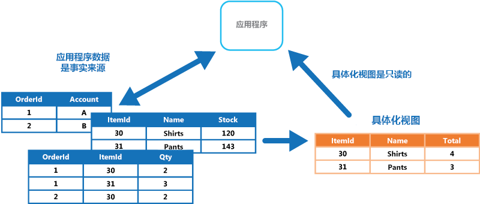
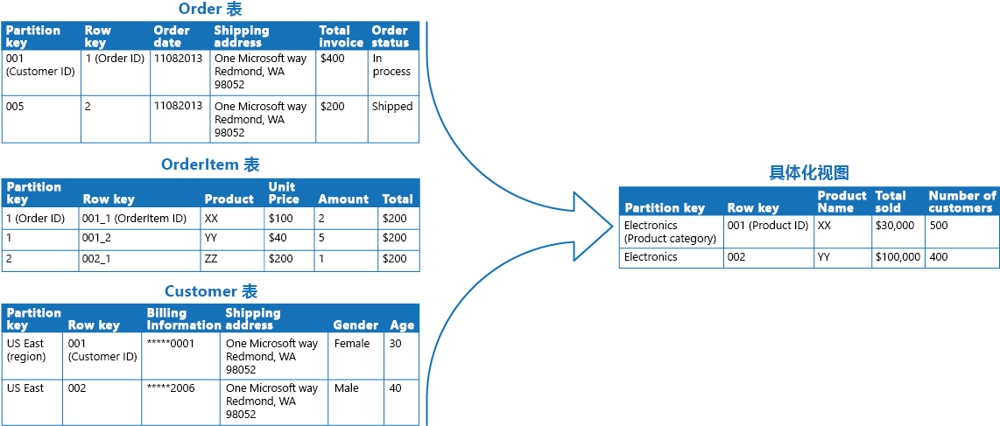

# 具体化视图模式

[!INCLUDE [header](../_includes/header.md)]

当未针对所需的查询操作完美设置数据的格式时，在一个或多个数据存储中基于数据生成预填充的视图。 这有助于支持高效查询和数据提取，并可提高应用程序性能。

## 上下文和问题

存储数据时，开发人员和数据管理员的首要任务通常是专注于数据的存储方式，而不是其读取方式。 所选的存储格式通常与以下内容紧密相关：数据格式、管理数据大小和数据完整性的需求以及正在使用的存储类型。 例如，使用 NoSQL 文档存储时，数据通常表示为一系列聚合，每个聚合包含该实体的所有信息。

但是，这可能对查询产生负面影响。 如果查询仅需要某些实体的数据子集（如多个客户的订单摘要，而不需要订单的所有详细信息），它必须从相关实体中提取所有数据，以便获取所需信息。

## 解决方案

若要支持高效查询，常见的解决方案是提前生成一个视图，该视图以适合所需结果集的格式将数据具体化。 具体化视图模式介绍如何在以下环境中生成预填充的数据视图：源数据的格式不适合进行查询、难以生成适合的查询或数据或数据存储的性质导致查询性能较差。

这些具体化视图（仅包含查询所需的数据）允许应用程序快速获取所需信息。 除了联接表格或合并数据实体外，具体化视图还可以包含计算列或数据项当前的值、对数据项合并值或执行转换的结果以及指定为查询的一部分的值。 甚至可以仅针对单个查询优化具体化视图。

关键点在于，具体化视图可从源数据存储完全重新生成，所以它及其包含的信息是完全可释放的。 具体化视图从不通过应用程序直接更新，因此它是专用缓存。

视图的源数据更改时，必须更新视图以使其包含新的信息。 可计划自动执行此操作，或在系统检测到原始数据发生更改时执行操作。 在某些情况下，可能需要手动重新生成视图。 下图中的示例演示了可以如何使用具体化视图模式。

## 问题和注意事项

在决定如何实现此模式时，请考虑以下几点：

视图更新的方式和时间。 理想情况下，当有事件指示源数据发生更改时，会重新生成视图（尽管源数据更改速度过快时会导致过度开销）。 或者，可以考虑使用计划的任务、外部触发器或通过手动操作重新生成视图。

在某些系统（例如，使用事件溯源模式维护仅含修改数据的事件的存储时）中，必须使用具体化视图。 通过检查所有事件确定当前状态来预填充视图，这可能是从事件存储获取信息的唯一方法。 如果没有使用事件溯源，则需考虑具体化视图对你而言是否有用。 具体化视图通常专门用于一个或少量查询的情况。 如果使用了大量查询，具体化视图会产生不可接受的存储容量需求和存储成本。

如果此情况定期出现，请在生成视图以及更新视图时考虑这对数据一致性的影响。 如果在生成视图时源数据发生更改，则此视图中的数据副本不会与原始数据完全一致。

请考虑视图的存储位置。 视图所在的存储或分区无需与原始数据的相同。 它可以是几个不同分区合并形成的子集。

如果视图丢失，可重新生成视图。 因此，如果视图是暂时性视图，且仅用于通过反映数据的当前状态提升查询性能或提高可伸缩性，则可将其存储在缓存或可靠性较低的位置。

定义具体化视图时，基于以下内容将数据项或列添加到具体化视图使值最大化：现有数据项的计算或转换、在查询中传递的值或这些值在适当情况下的组合。

如果存储机制支持，请考虑将具体化视图编制索引，进一步提高性能。 大多数关系数据库和基于 Apache Hadoop 的大数据解决方案都支持为视图编制索引。

## 何时使用此模式

此模式适合用于：
- 对难以直接查询的数据创建具体化视图，或查询必须十分复杂才能提取以规范化、半结构化或非结构化方式存储的数据。
- 创建的临时视图有以下作用时：可极大地提高查询性能，或可直接充当 UI、报告或显示的源视图或数据传输对象。
- 支持偶尔连接或断开的方案，其中不始终提供与数据存储的连接。 在此情况下可本地缓存视图。
- 简化查询，并以无需了解源数据格式的方式公开数据以进行试验。 例如，通过在一个或多个数据库或 NoSQL 存储中的一个或多个域中联接不同的表格，然后设置数据格式以满足其最终用途。
- 提供对源数据的特定子集的访问权限，出于安全性或隐私原因，这些子集不可公开访问、不可供修改或者不对用户完全公开。
- 桥接不同的数据存储，充分利用其各项功能。 例如，将写入效率高的云存储作为参考数据存储使用，并使用提供良好查询和读取性能的关系数据库来保存具体化视图。

此模式在以下情况中不起作用：
- 源数据十分简单且易于查询。
- 源数据更改速度很快，或可在不使用视图的情况下访问源数据。 在这些情况下，应避免创建视图时的处理开销。
- 一致性是重中之重。 视图可能无法始终与原始数据完全一致。

## 示例

下表中的示例演示了如何使用具体化视图模式生成销售摘要。 将 Azure 存储帐户中不同分区的“订单”、“订单项”和“客户”表格中的数据合并，生成一个视图，该视图在“电子”类别中包含了每个产品的总销售价值，还包含购买每一项的客户数量。

创建此具体化视图需要复杂的查询。 但是，通过具体化视图的方式公开查询结果，用户可以轻松获取结果并直接使用，或将结果纳入另一个查询。 此视图可能会用于报告系统或仪表板，也可以定期（如每周）更新。

>  虽然此示例利用了 Azure 表存储，但许多关系数据库管理系统还对具体化视图提供本机支持。

## 相关模式和指南

实现此模式时可能，可能也会与以下模式和指南相关：
- [Data Consistency Primer](https://msdn.microsoft.com/library/dn589800.aspx)（数据一致性入门）。 需要维护具体化视图中的摘要信息，以便其反映基础数据值。 数据值更改时，可能无法实时更新摘要数据，此时需要采用最终一致的方法。 总结了有关维护分布式数据一致性的问题，介绍了不同一致性模型的优点和权衡方案。
- [命令和查询责任分离 (CQRS) 模式](cqrs.md)。 用于在基础数据值更改时对发生的事件作出响应，从而更新具体化视图中的信息。
- [事件溯源模式](event-sourcing.md)。 与 CQRS 模式配合使用来维护具体化视图中的信息。 具体化视图所基于的数据值更改时，系统可以引发描述这些更改的事件并将其保存到事件存储中。
- [索引表模式](index-table.md)。 通常由主键整理具体化视图中的数据，但查询可能需要通过检查其他字段中的数据来从此视图检索信息。 用于对不支持本机辅助索引的数据存储的数据集创建辅助索引。
