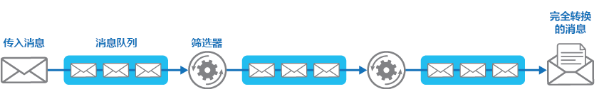

# <a name="pipes-and-filters-pattern"></a><span data-ttu-id="e2908-104">管道和筛选器模式</span><span class="sxs-lookup"><span data-stu-id="e2908-104">Pipes and Filters pattern</span></span>

[!INCLUDE [header](../_includes/header.md)]

<span data-ttu-id="e2908-105">将一个执行复杂处理的任务分解为一系列可重复使用的单个元素。</span><span class="sxs-lookup"><span data-stu-id="e2908-105">Decompose a task that performs complex processing into a series of separate elements that can be reused.</span></span> <span data-ttu-id="e2908-106">此模式允许单独部署和缩放执行处理的任务元素，从而可以提高性能、可扩展性和可重用性。</span><span class="sxs-lookup"><span data-stu-id="e2908-106">This can improve performance, scalability, and reusability by allowing task elements that perform the processing to be deployed and scaled independently.</span></span>

## <a name="context-and-problem"></a><span data-ttu-id="e2908-107">上下文和问题</span><span class="sxs-lookup"><span data-stu-id="e2908-107">Context and problem</span></span>

<span data-ttu-id="e2908-108">对于处理的信息，应用程序需要执行复杂性不一的各种任务。</span><span class="sxs-lookup"><span data-stu-id="e2908-108">An application is required to perform a variety of tasks of varying complexity on the information that it processes.</span></span> <span data-ttu-id="e2908-109">实施应用程序的一种直接但不灵活的方法是将这种处理当作单一模块来执行。</span><span class="sxs-lookup"><span data-stu-id="e2908-109">A straightforward but inflexible approach to implementing an application is to perform this processing as a monolithic module.</span></span> <span data-ttu-id="e2908-110">但是，这种方法可能会降低重构代码、优化代码或在应用程序的其他位置需要相同处理的部分时重复使用代码的机会。</span><span class="sxs-lookup"><span data-stu-id="e2908-110">However, this approach is likely to reduce the opportunities for refactoring the code, optimizing it, or reusing it if parts of the same processing are required elsewhere within the application.</span></span>

<span data-ttu-id="e2908-111">该图说明了使用单一方法处理数据时出现的问题。</span><span class="sxs-lookup"><span data-stu-id="e2908-111">The figure illustrates the issues with processing data using the monolithic approach.</span></span> <span data-ttu-id="e2908-112">应用程序接收并处理来自两个源的数据。</span><span class="sxs-lookup"><span data-stu-id="e2908-112">An application receives and processes data from two sources.</span></span> <span data-ttu-id="e2908-113">由单个模块处理来自每个源的数据，执行一系列的任务来传送这些数据，然后再将结果传递到应用程序的业务逻辑。</span><span class="sxs-lookup"><span data-stu-id="e2908-113">The data from each source is processed by a separate module that performs a series of tasks to transform this data, before passing the result to the business logic of the application.</span></span>


<span data-ttu-id="e2908-115">单个模块执行的某些任务在功能上非常相似，但这些模块已经过单独设计。</span><span class="sxs-lookup"><span data-stu-id="e2908-115">Some of the tasks that the monolithic modules perform are functionally very similar, but the modules have been designed separately.</span></span> <span data-ttu-id="e2908-116">实现任务的代码紧密组合在模块中，而且是在几乎没有考虑到重用和可伸缩性的情况下编写而成。</span><span class="sxs-lookup"><span data-stu-id="e2908-116">The code that implements the tasks is closely coupled in a module, and has been developed with little or no thought given to reuse or scalability.</span></span>

<span data-ttu-id="e2908-117">但是，随着业务需求的更新，由每个模块执行的处理任务或每个任务的部署要求都可能会更改。</span><span class="sxs-lookup"><span data-stu-id="e2908-117">However, the processing tasks performed by each module, or the deployment requirements for each task, could change as business requirements are updated.</span></span> <span data-ttu-id="e2908-118">某些任务可能是计算密集型的，最好是在功能强大的硬件上运行，而其他任务可能不需要此类昂贵的资源。</span><span class="sxs-lookup"><span data-stu-id="e2908-118">Some tasks might be compute intensive and could benefit from running on powerful hardware, while others might not require such expensive resources.</span></span> <span data-ttu-id="e2908-119">此外，将来可能还需要额外的处理，处理执行任务的顺序也可能更改。</span><span class="sxs-lookup"><span data-stu-id="e2908-119">Also, additional processing might be required in the future, or the order in which the tasks performed by the processing could change.</span></span> <span data-ttu-id="e2908-120">我们需要一种解决方案，它既能解决这些问题，又能增加代码重用的可能性。</span><span class="sxs-lookup"><span data-stu-id="e2908-120">A solution is required that addresses these issues, and increases the possibilities for code reuse.</span></span>

## <a name="solution"></a><span data-ttu-id="e2908-121">解决方案</span><span class="sxs-lookup"><span data-stu-id="e2908-121">Solution</span></span>

<span data-ttu-id="e2908-122">将每个流所需的处理分解为一组单独的组件（或筛选器），每个组件执行一项任务。</span><span class="sxs-lookup"><span data-stu-id="e2908-122">Break down the processing required for each stream into a set of separate components (or filters), each performing a single task.</span></span> <span data-ttu-id="e2908-123">通过标准化每个组件接收和发送的数据的格式，这些筛选器可以一起组合到管道中。</span><span class="sxs-lookup"><span data-stu-id="e2908-123">By standardizing the format of the data that each component receives and sends, these filters can be combined together into a pipeline.</span></span> <span data-ttu-id="e2908-124">这有助于避免代码重复，并在处理要求发生更改的情况下，还可以让删除、替换或集成其他组件的任务变得轻松。</span><span class="sxs-lookup"><span data-stu-id="e2908-124">This helps to avoid duplicating code, and makes it easy to remove, replace, or integrate additional components if the processing requirements change.</span></span> <span data-ttu-id="e2908-125">下图显示了使用管道和筛选器实现的解决方案。</span><span class="sxs-lookup"><span data-stu-id="e2908-125">The next figure shows a solution implemented using pipes and filters.</span></span>


<span data-ttu-id="e2908-127">处理单个请求所花的时间取决于管道中最慢筛选器的速度。</span><span class="sxs-lookup"><span data-stu-id="e2908-127">The time it takes to process a single request depends on the speed of the slowest filter in the pipeline.</span></span> <span data-ttu-id="e2908-128">一个或多个筛选器可能是瓶颈，尤其是在特定数据源的流中出现大量请求时。</span><span class="sxs-lookup"><span data-stu-id="e2908-128">One or more filters could be a bottleneck, especially if a large number of requests appear in a stream from a particular data source.</span></span> <span data-ttu-id="e2908-129">管道结构的主要优点是，它提供了为速度缓慢的筛选器运行并行实例的机会，使系统能够分散负载并提高吞吐量。</span><span class="sxs-lookup"><span data-stu-id="e2908-129">A key advantage of the pipeline structure is that it provides opportunities for running parallel instances of slow filters, enabling the system to spread the load and improve throughput.</span></span>

<span data-ttu-id="e2908-130">构成管道的筛选器可以在不同的计算机上运行，使其能够独立缩放并充分利用许多云环境提供的弹性。</span><span class="sxs-lookup"><span data-stu-id="e2908-130">The filters that make up a pipeline can run on different machines, enabling them to be scaled independently and take advantage of the elasticity that many cloud environments provide.</span></span> <span data-ttu-id="e2908-131">计算密集型筛选器可以在高性能硬件上运行，而其他要求较低的筛选器可以在成本较低的商用硬件上托管。</span><span class="sxs-lookup"><span data-stu-id="e2908-131">A filter that is computationally intensive can run on high performance hardware, while other less demanding filters can be hosted on less expensive commodity hardware.</span></span> <span data-ttu-id="e2908-132">筛选器甚至不一定要位于同一个数据中心或地理位置，这样管道中的每个元素都可以在靠近自己所需资源的环境中运行。</span><span class="sxs-lookup"><span data-stu-id="e2908-132">The filters don't even have to be in the same data center or geographical location, which allows each element in a pipeline to run in an environment that is close to the resources it requires.</span></span>  <span data-ttu-id="e2908-133">下图显示了应用于来源 1 的数据管道的示例。</span><span class="sxs-lookup"><span data-stu-id="e2908-133">The next figure shows an example applied to the pipeline for the data from Source 1.</span></span>


<span data-ttu-id="e2908-135">如果筛选器的输入和输出采用流结构，则可以为每个筛选器并行执行处理。</span><span class="sxs-lookup"><span data-stu-id="e2908-135">If the input and output of a filter are structured as a stream, it's possible to perform the processing for each filter in parallel.</span></span> <span data-ttu-id="e2908-136">管道中的第一个筛选器可以启动其工作并输出其结果，然后在第一个筛选器完成工作之前，按顺序将结果直接传递到下一筛选器。</span><span class="sxs-lookup"><span data-stu-id="e2908-136">The first filter in the pipeline can start its work and output its results, which are passed directly on to the next filter in the sequence before the first filter has completed its work.</span></span>

<span data-ttu-id="e2908-137">另一个好处是此模型可以提供复原能力。</span><span class="sxs-lookup"><span data-stu-id="e2908-137">Another benefit is the resiliency that this model can provide.</span></span> <span data-ttu-id="e2908-138">如果某一筛选器失败或运行它的计算机不再可用，管道可以重新计划执行筛选器的工作，并将这项工作定向到组件的另一个实例。</span><span class="sxs-lookup"><span data-stu-id="e2908-138">If a filter fails or the machine it's running on is no longer available, the pipeline can reschedule the work that the filter was performing and direct this work to another instance of the component.</span></span> <span data-ttu-id="e2908-139">一个筛选器失败不一定就会导致整个管道失败。</span><span class="sxs-lookup"><span data-stu-id="e2908-139">Failure of a single filter doesn't necessarily result in failure of the entire pipeline.</span></span>

<span data-ttu-id="e2908-140">将管道和筛选器模式与[补偿事务模式](compensating-transaction.md)结合使用，这是实现分布式事务的另一种方法。</span><span class="sxs-lookup"><span data-stu-id="e2908-140">Using the Pipes and Filters pattern in conjunction with the [Compensating Transaction pattern](compensating-transaction.md) is an alternative approach to implementing distributed transactions.</span></span> <span data-ttu-id="e2908-141">分布式事务可以分解为单独的、可补偿的任务，每个任务都可以通过使用筛选器来实现，而筛选器还能实现补偿事务模式。</span><span class="sxs-lookup"><span data-stu-id="e2908-141">A distributed transaction can be broken down into separate, compensable tasks, each of which can be implemented by using a filter that also implements the Compensating Transaction pattern.</span></span> <span data-ttu-id="e2908-142">管道中的筛选器可以作为单独的托管任务来实现，在靠近它们所维护数据的位置运行。</span><span class="sxs-lookup"><span data-stu-id="e2908-142">The filters in a pipeline can be implemented as separate hosted tasks running close to the data that they maintain.</span></span>

## <a name="issues-and-considerations"></a><span data-ttu-id="e2908-143">问题和注意事项</span><span class="sxs-lookup"><span data-stu-id="e2908-143">Issues and considerations</span></span>

<span data-ttu-id="e2908-144">在决定如何实现此模式时，应考虑以下几点：</span><span class="sxs-lookup"><span data-stu-id="e2908-144">You should consider the following points when deciding how to implement this pattern:</span></span>
- <span data-ttu-id="e2908-145">**复杂性**。</span><span class="sxs-lookup"><span data-stu-id="e2908-145">**Complexity**.</span></span> <span data-ttu-id="e2908-146">此模式提供的较高灵活性也可能会引入复杂性，尤其是管道中的筛选器分布在不同的服务器上时。</span><span class="sxs-lookup"><span data-stu-id="e2908-146">The increased flexibility that this pattern provides can also introduce complexity, especially if the filters in a pipeline are distributed across different servers.</span></span>

- <span data-ttu-id="e2908-147">**可靠性**。</span><span class="sxs-lookup"><span data-stu-id="e2908-147">**Reliability**.</span></span> <span data-ttu-id="e2908-148">使用基础结构来确保管道中的筛选器之间流动的数据不会丢失。</span><span class="sxs-lookup"><span data-stu-id="e2908-148">Use an infrastructure that ensures that data flowing between filters in a pipeline won't be lost.</span></span>

- <span data-ttu-id="e2908-149">**幂等性**。</span><span class="sxs-lookup"><span data-stu-id="e2908-149">**Idempotency**.</span></span> <span data-ttu-id="e2908-150">如果管道中的筛选器在接收消息后失败，并且将工作重新安排给筛选器的另一个实例，则部分工作可能已经完成。</span><span class="sxs-lookup"><span data-stu-id="e2908-150">If a filter in a pipeline fails after receiving a message and the work is rescheduled to another instance of the filter, part of the work might have already been completed.</span></span> <span data-ttu-id="e2908-151">如果这项工作仅更新全局状态的一些方面（例如存储在数据库中的信息），则可以重复相同的更新。</span><span class="sxs-lookup"><span data-stu-id="e2908-151">If this work updates some aspect of the global state (such as information stored in a database), the same update could be repeated.</span></span> <span data-ttu-id="e2908-152">如果筛选器在将其结果发布到管道中的下一个筛选器后失败，但在指示它已成功完成工作之前，则可能会发生类似的问题。</span><span class="sxs-lookup"><span data-stu-id="e2908-152">A similar issue might occur if a filter fails after posting its results to the next filter in the pipeline, but before indicating that it's completed its work successfully.</span></span> <span data-ttu-id="e2908-153">在这些情况下，相同的工作可能由筛选器的另一个实例重复执行，导致相同的结果发布两次。</span><span class="sxs-lookup"><span data-stu-id="e2908-153">In these cases, the same work could be repeated by another instance of the filter, causing the same results to be posted twice.</span></span> <span data-ttu-id="e2908-154">这可能会导致管道中的后续筛选器对相同数据处理两次。</span><span class="sxs-lookup"><span data-stu-id="e2908-154">This could result in subsequent filters in the pipeline processing the same data twice.</span></span> <span data-ttu-id="e2908-155">因此，应将管道中的筛选器设计为幂等的。</span><span class="sxs-lookup"><span data-stu-id="e2908-155">Therefore filters in a pipeline should be designed to be idempotent.</span></span> <span data-ttu-id="e2908-156">有关详细信息，请参阅 Jonathan Oliver 博客中的 [Idempotency Patterns](http://blog.jonathanoliver.com/idempotency-patterns/)（幂等模式）。</span><span class="sxs-lookup"><span data-stu-id="e2908-156">For more information see [Idempotency Patterns](http://blog.jonathanoliver.com/idempotency-patterns/) on Jonathan Oliver’s blog.</span></span>

- <span data-ttu-id="e2908-157">**重复消息**。</span><span class="sxs-lookup"><span data-stu-id="e2908-157">**Repeated messages**.</span></span> <span data-ttu-id="e2908-158">如果管道中的筛选器在将消息发布到管道的下一阶段后失败，则可能会运行筛选器的另一个实例，并且它会将相同消息的副本发布到管道。</span><span class="sxs-lookup"><span data-stu-id="e2908-158">If a filter in a pipeline fails after posting a message to the next stage of the pipeline, another instance of the filter might be run, and it'll post a copy of the same message to the pipeline.</span></span> <span data-ttu-id="e2908-159">这可能会导致将相同消息的两个实例传递到下一个筛选器。</span><span class="sxs-lookup"><span data-stu-id="e2908-159">This could cause two instances of the same message to be passed to the next filter.</span></span> <span data-ttu-id="e2908-160">为了避免这种情况，管道应该检测和消除重复的消息。</span><span class="sxs-lookup"><span data-stu-id="e2908-160">To avoid this, the pipeline should detect and eliminate duplicate messages.</span></span>

    >  <span data-ttu-id="e2908-161">如果通过使用消息队列（例如 Microsoft Azure 服务总线队列）实现管道，则消息队列基础结构可能会提供自动重复消息检测和删除功能。</span><span class="sxs-lookup"><span data-stu-id="e2908-161">If you're implementing the pipeline by using message queues (such as Microsoft Azure Service Bus queues), the message queuing infrastructure might provide automatic duplicate message detection and removal.</span></span>

- <span data-ttu-id="e2908-162">**上下文和状态**。</span><span class="sxs-lookup"><span data-stu-id="e2908-162">**Context and state**.</span></span> <span data-ttu-id="e2908-163">在管道中，每个筛选器基本上是分开运行的，不应对它的调用方式做任何假设。</span><span class="sxs-lookup"><span data-stu-id="e2908-163">In a pipeline, each filter essentially runs in isolation and shouldn't make any assumptions about how it was invoked.</span></span> <span data-ttu-id="e2908-164">这意味着应该为每个筛选器提供足够的上下文来执行其工作。</span><span class="sxs-lookup"><span data-stu-id="e2908-164">This means that each filter should be provided with sufficient context to perform its work.</span></span> <span data-ttu-id="e2908-165">上下文可以包括大量的状态信息。</span><span class="sxs-lookup"><span data-stu-id="e2908-165">This context could include a large amount of state information.</span></span>

## <a name="when-to-use-this-pattern"></a><span data-ttu-id="e2908-166">何时使用此模式</span><span class="sxs-lookup"><span data-stu-id="e2908-166">When to use this pattern</span></span>

<span data-ttu-id="e2908-167">在以下情况下使用此模式：</span><span class="sxs-lookup"><span data-stu-id="e2908-167">Use this pattern when:</span></span>
- <span data-ttu-id="e2908-168">应用程序所需的处理可以轻松分解为一组独立的步骤。</span><span class="sxs-lookup"><span data-stu-id="e2908-168">The processing required by an application can easily be broken down into a set of independent steps.</span></span>

- <span data-ttu-id="e2908-169">应用程序执行的处理步骤具有不同的可伸缩性要求。</span><span class="sxs-lookup"><span data-stu-id="e2908-169">The processing steps performed by an application have different scalability requirements.</span></span>

    >  <span data-ttu-id="e2908-170">可以将应一起缩放的筛选器分组到同一进程中。</span><span class="sxs-lookup"><span data-stu-id="e2908-170">It's possible to group filters that should scale together in the same process.</span></span> <span data-ttu-id="e2908-171">有关详细信息，请参阅[计算资源整合模式](compute-resource-consolidation.md)。</span><span class="sxs-lookup"><span data-stu-id="e2908-171">For more information, see the [Compute Resource Consolidation pattern](compute-resource-consolidation.md).</span></span>

- <span data-ttu-id="e2908-172">需要具备一定的灵活性，以便能够对应用程序执行的处理步骤重新排序；或需要具备添加和删除步骤的能力。</span><span class="sxs-lookup"><span data-stu-id="e2908-172">Flexibility is required to allow reordering of the processing steps performed by an application, or the capability to add and remove steps.</span></span>

- <span data-ttu-id="e2908-173">系统可以从将不同步骤的处理能力分配给不同的服务器中获益。</span><span class="sxs-lookup"><span data-stu-id="e2908-173">The system can benefit from distributing the processing for steps across different servers.</span></span>

- <span data-ttu-id="e2908-174">需要一种可靠的解决方案，在处理数据的同时，尽可能降低步骤失败带来的影响。</span><span class="sxs-lookup"><span data-stu-id="e2908-174">A reliable solution is required that minimizes the effects of failure in a step while data is being processed.</span></span>

<span data-ttu-id="e2908-175">在以下情况下，此模式可能不起作用：</span><span class="sxs-lookup"><span data-stu-id="e2908-175">This pattern might not be useful when:</span></span>
- <span data-ttu-id="e2908-176">应用程序执行的处理步骤不是独立的，或者它们必须作为同一事务的一部分一起执行。</span><span class="sxs-lookup"><span data-stu-id="e2908-176">The processing steps performed by an application aren't independent, or they have to be performed together as part of the same transaction.</span></span>

- <span data-ttu-id="e2908-177">步骤所需的上下文或状态信息量使得该方法效率低下。</span><span class="sxs-lookup"><span data-stu-id="e2908-177">The amount of context or state information required by a step makes this approach inefficient.</span></span> <span data-ttu-id="e2908-178">它可能会将状态信息保留到数据库，但如果数据库的额外负载导致过度争用资源，请勿使用此策略。</span><span class="sxs-lookup"><span data-stu-id="e2908-178">It might be possible to persist state information to a database instead, but don't use this strategy if the additional load on the database causes excessive contention.</span></span>

## <a name="example"></a><span data-ttu-id="e2908-179">示例</span><span class="sxs-lookup"><span data-stu-id="e2908-179">Example</span></span>

<span data-ttu-id="e2908-180">可以使用一系列消息队列来提供实现管道所需的基础结构。</span><span class="sxs-lookup"><span data-stu-id="e2908-180">You can use a sequence of message queues to provide the infrastructure required to implement a pipeline.</span></span> <span data-ttu-id="e2908-181">初始消息队列接收未处理的消息。</span><span class="sxs-lookup"><span data-stu-id="e2908-181">An initial message queue receives unprocessed messages.</span></span> <span data-ttu-id="e2908-182">作为筛选器任务实现的组件侦听此队列中的消息，执行其工作，然后将转换的消息发布到序列中的下一个队列。</span><span class="sxs-lookup"><span data-stu-id="e2908-182">A component implemented as a filter task listens for a message on this queue, performs its work, and then posts the transformed message to the next queue in the sequence.</span></span> <span data-ttu-id="e2908-183">另一个筛选器任务可以侦听此队列中的消息，处理它们，将结果发布到另一个队列等，直到完全转换的数据出现在队列中的最终消息中。</span><span class="sxs-lookup"><span data-stu-id="e2908-183">Another filter task can listen for messages on this queue, process them, post the results to another queue, and so on until the fully transformed data appears in the final message in the queue.</span></span> <span data-ttu-id="e2908-184">下图说明了如何使用消息队列实现管道。</span><span class="sxs-lookup"><span data-stu-id="e2908-184">The next figure illustrates implementing a pipeline using message queues.</span></span>




<span data-ttu-id="e2908-186">如果在 Azure 上构建解决方案，则可以使用服务总线队列来提供可靠和可扩展的排队机制。</span><span class="sxs-lookup"><span data-stu-id="e2908-186">If you're building a solution on Azure you can use Service Bus queues to provide a reliable and scalable queuing mechanism.</span></span> <span data-ttu-id="e2908-187">C# 中如下所示的 `ServiceBusPipeFilter` 类演示了如何实现从队列接收输入消息的筛选器，处理这些消息以及将结果发布到另一队列。</span><span class="sxs-lookup"><span data-stu-id="e2908-187">The `ServiceBusPipeFilter` class shown below in C# demonstrates how you can implement a filter that receives input messages from a queue, processes these messages, and posts the results to another queue.</span></span>

>  <span data-ttu-id="e2908-188">`ServiceBusPipeFilter` 类在可从 [GitHub](https://github.com/mspnp/cloud-design-patterns/tree/master/pipes-and-filters) 获取的 PipesAndFilters.Shared 项目中定义。</span><span class="sxs-lookup"><span data-stu-id="e2908-188">The `ServiceBusPipeFilter` class is defined in the PipesAndFilters.Shared project available from [GitHub](https://github.com/mspnp/cloud-design-patterns/tree/master/pipes-and-filters).</span></span>

```csharp
public class ServiceBusPipeFilter
{
  ...
  private readonly string inQueuePath;
  private readonly string outQueuePath;
  ...
  private QueueClient inQueue;
  private QueueClient outQueue;
  ...

  public ServiceBusPipeFilter(..., string inQueuePath, string outQueuePath = null)
  {
     ...
     this.inQueuePath = inQueuePath;
     this.outQueuePath = outQueuePath;
  }

  public void Start()
  {
    ...
    // Create the outbound filter queue if it doesn't exist.
    ...
    this.outQueue = QueueClient.CreateFromConnectionString(...);

    ...
    // Create the inbound and outbound queue clients.
    this.inQueue = QueueClient.CreateFromConnectionString(...);
  }

  public void OnPipeFilterMessageAsync(
    Func<BrokeredMessage, Task<BrokeredMessage>> asyncFilterTask, ...)
  {
    ...

    this.inQueue.OnMessageAsync(
      async (msg) =>
    {
      ...
      // Process the filter and send the output to the
      // next queue in the pipeline.
      var outMessage = await asyncFilterTask(msg);

      // Send the message from the filter processor
      // to the next queue in the pipeline.
      if (outQueue != null)
      {
        await outQueue.SendAsync(outMessage);
      }

      // Note: There's a chance that the same message could be sent twice
      // or that a message gets processed by an upstream or downstream
      // filter at the same time.
      // This would happen in a situation where processing of a message was
      // completed, it was sent to the next pipe/queue, and then failed
      // to complete when using the PeekLock method.
      // Idempotent message processing and concurrency should be considered
      // in a real-world implementation.
    },
    options);
  }

  public async Task Close(TimeSpan timespan)
  {
    // Pause the processing threads.
    this.pauseProcessingEvent.Reset();

    // There's no clean approach for waiting for the threads to complete
    // the processing. This example simply stops any new processing, waits
    // for the existing thread to complete, then closes the message pump
    // and finally returns.
    Thread.Sleep(timespan);

    this.inQueue.Close();
    ...
  }

  ...
}
```

<span data-ttu-id="e2908-189">`ServiceBusPipeFilter` 类中的 `Start` 方法连接到一对输入和输出队列，`Close` 方法从输入队列中断开连接。</span><span class="sxs-lookup"><span data-stu-id="e2908-189">The `Start` method in the `ServiceBusPipeFilter` class connects to a pair of input and output queues, and the `Close` method disconnects from the input queue.</span></span> <span data-ttu-id="e2908-190">`OnPipeFilterMessageAsync` 方法执行实际的消息处理，此方法的 `asyncFilterTask` 参数指定要执行的处理。</span><span class="sxs-lookup"><span data-stu-id="e2908-190">The `OnPipeFilterMessageAsync` method performs the actual processing of messages, the `asyncFilterTask` parameter to this method specifies the processing to be performed.</span></span> <span data-ttu-id="e2908-191">`OnPipeFilterMessageAsync` 方法等待输入队列中的传入消息，在每个消息到达时对其运行 `asyncFilterTask` 参数指定的代码，并将结果发布到输出队列。</span><span class="sxs-lookup"><span data-stu-id="e2908-191">The `OnPipeFilterMessageAsync` method waits for incoming messages on the input queue, runs the code specified by the `asyncFilterTask` parameter over each message as it arrives, and posts the results to the output queue.</span></span> <span data-ttu-id="e2908-192">队列本身由构造函数指定。</span><span class="sxs-lookup"><span data-stu-id="e2908-192">The queues themselves are specified by the constructor.</span></span>

<span data-ttu-id="e2908-193">示例解决方案在一组辅助角色中实现筛选器。</span><span class="sxs-lookup"><span data-stu-id="e2908-193">The sample solution implements filters in a set of worker roles.</span></span> <span data-ttu-id="e2908-194">每个辅助角色都可以单独缩放，具体取决于它执行的业务处理的复杂性或处理所需的资源。</span><span class="sxs-lookup"><span data-stu-id="e2908-194">Each worker role can be scaled independently, depending on the complexity of the business processing that it performs or the resources required for processing.</span></span> <span data-ttu-id="e2908-195">此外，可以并行运行每个辅助角色的多个实例以提高吞吐量。</span><span class="sxs-lookup"><span data-stu-id="e2908-195">Additionally, multiple instances of each worker role can be run in parallel to improve throughput.</span></span>

<span data-ttu-id="e2908-196">以下代码显示名为 `PipeFilterARoleEntry` 的 Azure 辅助角色，已在示例解决方案的 PipeFilterA 项目中定义。</span><span class="sxs-lookup"><span data-stu-id="e2908-196">The following code shows an Azure worker role named `PipeFilterARoleEntry`, defined in the PipeFilterA project in the sample solution.</span></span>

```csharp
public class PipeFilterARoleEntry : RoleEntryPoint
{
  ...
  private ServiceBusPipeFilter pipeFilterA;

  public override bool OnStart()
  {
    ...
    this.pipeFilterA = new ServiceBusPipeFilter(
      ...,
      Constants.QueueAPath,
      Constants.QueueBPath);

    this.pipeFilterA.Start();
    ...
  }

  public override void Run()
  {
    this.pipeFilterA.OnPipeFilterMessageAsync(async (msg) =>
    {
      // Clone the message and update it.
      // Properties set by the broker (Deliver count, enqueue time, ...)
      // aren't cloned and must be copied over if required.
      var newMsg = msg.Clone();

      await Task.Delay(500); // DOING WORK

      Trace.TraceInformation("Filter A processed message:{0} at {1}",
        msg.MessageId, DateTime.UtcNow);

      newMsg.Properties.Add(Constants.FilterAMessageKey, "Complete");

      return newMsg;
    });

    ...
  }

  ...
}
```

<span data-ttu-id="e2908-197">此角色包含 `ServiceBusPipeFilter` 对象。</span><span class="sxs-lookup"><span data-stu-id="e2908-197">This role contains a `ServiceBusPipeFilter` object.</span></span> <span data-ttu-id="e2908-198">此角色中的 `OnStart` 方法连接到接收输入消息和发布输出消息的队列（队列名称已在 `Constants` 类中定义）。</span><span class="sxs-lookup"><span data-stu-id="e2908-198">The `OnStart` method in the role connects to the queues for receiving input messages and posting output messages (the names of the queues are defined in the `Constants` class).</span></span> <span data-ttu-id="e2908-199">`Run` 方法调用 `OnPipeFilterMessagesAsync` 方法，以便对收到的每个消息执行一些处理（在本例中，通过等待一小段时间来模拟处理）。</span><span class="sxs-lookup"><span data-stu-id="e2908-199">The `Run` method invokes the `OnPipeFilterMessagesAsync` method to perform some processing on each message that's received (in this example, the processing is simulated by waiting for a short period of time).</span></span> <span data-ttu-id="e2908-200">处理完成时，构造包含结果的新消息（在这种情况下，输入消息已添加自定义属性），并且该消息已被发布到输出队列。</span><span class="sxs-lookup"><span data-stu-id="e2908-200">When processing is complete, a new message is constructed containing the results (in this case, the input message has a custom property added), and this message is posted to the output queue.</span></span>

<span data-ttu-id="e2908-201">示例代码在 PipeFilterB 项目中包含另一个名为 `PipeFilterBRoleEntry` 的辅助角色。</span><span class="sxs-lookup"><span data-stu-id="e2908-201">The sample code contains another worker role named `PipeFilterBRoleEntry` in the PipeFilterB project.</span></span> <span data-ttu-id="e2908-202">此角色与 `PipeFilterARoleEntry` 类似，只是它在 `Run` 方法中执行不同的处理。</span><span class="sxs-lookup"><span data-stu-id="e2908-202">This role is similar to `PipeFilterARoleEntry` except that it performs different processing in the `Run` method.</span></span> <span data-ttu-id="e2908-203">在示例解决方案中，这两个角色组合构成一个管道，`PipeFilterARoleEntry` 角色的输出队列是 `PipeFilterBRoleEntry` 角色的输入队列。</span><span class="sxs-lookup"><span data-stu-id="e2908-203">In the example solution, these two roles are combined to construct a pipeline, the output queue for the `PipeFilterARoleEntry` role is the input queue for the `PipeFilterBRoleEntry` role.</span></span>

<span data-ttu-id="e2908-204">示例解决方案还提供了两个名为 `InitialSenderRoleEntry`（在 InitialSender 项目中）和 `FinalReceiverRoleEntry`（在 FinalReceiver 项目中）的其他角色。</span><span class="sxs-lookup"><span data-stu-id="e2908-204">The sample solution also provides two additional roles named `InitialSenderRoleEntry` (in the InitialSender project) and `FinalReceiverRoleEntry` (in the FinalReceiver project).</span></span> <span data-ttu-id="e2908-205">`InitialSenderRoleEntry` 角色在管道中提供初始消息。</span><span class="sxs-lookup"><span data-stu-id="e2908-205">The `InitialSenderRoleEntry` role provides the initial message in the pipeline.</span></span> <span data-ttu-id="e2908-206">`OnStart` 方法连接到单个队列，`Run` 方法将方法发布到此队列。</span><span class="sxs-lookup"><span data-stu-id="e2908-206">The `OnStart` method connects to a single queue and the `Run` method posts a method to this queue.</span></span> <span data-ttu-id="e2908-207">此队列是 `PipeFilterARoleEntry` 角色使用的输入队列，因此向其发布消息将使该消息由 `PipeFilterARoleEntry` 角色接收和处理。</span><span class="sxs-lookup"><span data-stu-id="e2908-207">This queue is the input queue used by the `PipeFilterARoleEntry` role, so posting a message to it causes the message to be received and processed by the `PipeFilterARoleEntry` role.</span></span> <span data-ttu-id="e2908-208">然后，处理后的消息将通过 `PipeFilterBRoleEntry` 角色。</span><span class="sxs-lookup"><span data-stu-id="e2908-208">The processed message then passes through the `PipeFilterBRoleEntry` role.</span></span>

<span data-ttu-id="e2908-209">`FinalReceiveRoleEntry` 角色的输入队列是 `PipeFilterBRoleEntry` 角色的输出队列。</span><span class="sxs-lookup"><span data-stu-id="e2908-209">The input queue for the `FinalReceiveRoleEntry` role is the output queue for the `PipeFilterBRoleEntry` role.</span></span> <span data-ttu-id="e2908-210">`FinalReceiveRoleEntry` 角色中的 `Run` 方法（如下所示）接收消息并执行一些最终处理。</span><span class="sxs-lookup"><span data-stu-id="e2908-210">The `Run` method in the `FinalReceiveRoleEntry` role, shown below, receives the message and performs some final processing.</span></span> <span data-ttu-id="e2908-211">然后，它将管道中的筛选器添加的自定义属性值写入到跟踪输出。</span><span class="sxs-lookup"><span data-stu-id="e2908-211">Then it writes the values of the custom properties added by the filters in the pipeline to the trace output.</span></span>

```csharp
public class FinalReceiverRoleEntry : RoleEntryPoint
{
  ...
  // Final queue/pipe in the pipeline to process data from.
  private ServiceBusPipeFilter queueFinal;

  public override bool OnStart()
  {
    ...
    // Set up the queue.
    this.queueFinal = new ServiceBusPipeFilter(...,Constants.QueueFinalPath);
    this.queueFinal.Start();
    ...
  }

  public override void Run()
  {
    this.queueFinal.OnPipeFilterMessageAsync(
      async (msg) =>
      {
        await Task.Delay(500); // DOING WORK

        // The pipeline message was received.
        Trace.TraceInformation(
          "Pipeline Message Complete - FilterA:{0} FilterB:{1}",
          msg.Properties[Constants.FilterAMessageKey],
          msg.Properties[Constants.FilterBMessageKey]);

        return null;
      });
    ...
  }

  ...
}
```

## <a name="related-patterns-and-guidance"></a><span data-ttu-id="e2908-212">相关模式和指南</span><span class="sxs-lookup"><span data-stu-id="e2908-212">Related patterns and guidance</span></span>

<span data-ttu-id="e2908-213">实现此模式时，可能也会与以下模式和指南相关：</span><span class="sxs-lookup"><span data-stu-id="e2908-213">The following patterns and guidance might also be relevant when implementing this pattern:</span></span>
- <span data-ttu-id="e2908-214">演示此模式的示例可在 [GitHub](https://github.com/mspnp/cloud-design-patterns/tree/master/pipes-and-filters) 上找到。</span><span class="sxs-lookup"><span data-stu-id="e2908-214">A sample that demonstrates this pattern is available on [GitHub](https://github.com/mspnp/cloud-design-patterns/tree/master/pipes-and-filters).</span></span>
- <span data-ttu-id="e2908-215">[使用者竞争模式](competing-consumers.md)。</span><span class="sxs-lookup"><span data-stu-id="e2908-215">[Competing Consumers pattern](competing-consumers.md).</span></span> <span data-ttu-id="e2908-216">管道可以包含一个或多个筛选器的多个实例。</span><span class="sxs-lookup"><span data-stu-id="e2908-216">A pipeline can contain multiple instances of one or more filters.</span></span> <span data-ttu-id="e2908-217">此方法可用于为速度缓慢的筛选器运行并行实例，使系统能够分散负载并提高吞吐量。</span><span class="sxs-lookup"><span data-stu-id="e2908-217">This approach is useful for running parallel instances of slow filters, enabling the system to spread the load and improve throughput.</span></span> <span data-ttu-id="e2908-218">每个筛选器实例将与其他实例争用输入，筛选器的两个实例不能处理相同的数据。</span><span class="sxs-lookup"><span data-stu-id="e2908-218">Each instance of a filter will compete for input with the other instances, two instances of a filter shouldn't be able to process the same data.</span></span> <span data-ttu-id="e2908-219">提供此方法的说明。</span><span class="sxs-lookup"><span data-stu-id="e2908-219">Provides an explanation of this approach.</span></span>
- <span data-ttu-id="e2908-220">[计算资源整合模式](compute-resource-consolidation.md)。</span><span class="sxs-lookup"><span data-stu-id="e2908-220">[Compute Resource Consolidation pattern](compute-resource-consolidation.md).</span></span> <span data-ttu-id="e2908-221">可以将应一起缩放的筛选器分组到同一进程中。</span><span class="sxs-lookup"><span data-stu-id="e2908-221">It might be possible to group filters that should scale together into the same process.</span></span> <span data-ttu-id="e2908-222">提供有关此策略的优点和缺点的详细信息。</span><span class="sxs-lookup"><span data-stu-id="e2908-222">Provides more information about the benefits and tradeoffs of this strategy.</span></span>
- <span data-ttu-id="e2908-223">[补偿事务模式](compensating-transaction.md)。</span><span class="sxs-lookup"><span data-stu-id="e2908-223">[Compensating Transaction pattern](compensating-transaction.md).</span></span> <span data-ttu-id="e2908-224">筛选器可以作为可逆转的操作、或在发生故障时会状态还原到先前版本的补偿操作来实现。</span><span class="sxs-lookup"><span data-stu-id="e2908-224">A filter can be implemented as an operation that can be reversed, or that has a compensating operation that restores the state to a previous version in the event of a failure.</span></span> <span data-ttu-id="e2908-225">解释如何实现上述目的来维持或达到最终的一致性。</span><span class="sxs-lookup"><span data-stu-id="e2908-225">Explains how this can be implemented to maintain or achieve eventual consistency.</span></span>
- <span data-ttu-id="e2908-226">Jonathan Oliver 博客中的 [Idempotency Patterns](http://blog.jonathanoliver.com/idempotency-patterns/)（幂等模式）。</span><span class="sxs-lookup"><span data-stu-id="e2908-226">[Idempotency Patterns](http://blog.jonathanoliver.com/idempotency-patterns/) on Jonathan Oliver’s blog.</span></span>
