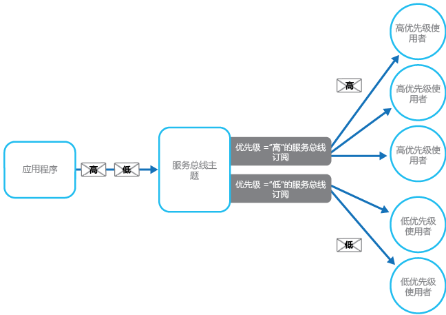

# <a name="priority-queue-pattern"></a><span data-ttu-id="199ec-104">优先级队列模式</span><span class="sxs-lookup"><span data-stu-id="199ec-104">Priority Queue pattern</span></span>

[!INCLUDE [header](../_includes/header.md)]

<span data-ttu-id="199ec-105">为发送到服务的请求确定优先级，以便高优先级请求能够得到比低优先级请求更快速地接收和处理。</span><span class="sxs-lookup"><span data-stu-id="199ec-105">Prioritize requests sent to services so that requests with a higher priority are received and processed more quickly than those with a lower priority.</span></span> <span data-ttu-id="199ec-106">在向各个客户端提供不同服务级别保障的应用程序中，此模式非常有用。</span><span class="sxs-lookup"><span data-stu-id="199ec-106">This pattern is useful in applications that offer different service level guarantees to individual clients.</span></span>

## <a name="context-and-problem"></a><span data-ttu-id="199ec-107">上下文和问题</span><span class="sxs-lookup"><span data-stu-id="199ec-107">Context and Problem</span></span>

<span data-ttu-id="199ec-108">应用程序可以将特定任务委托给其他服务，例如执行后台处理，或与其他应用程序、服务集成。</span><span class="sxs-lookup"><span data-stu-id="199ec-108">Applications can delegate specific tasks to other services, for example, to perform background processing or to integrate with other applications or services.</span></span> <span data-ttu-id="199ec-109">在云中，消息队列通常用于将任务委托给后台处理。</span><span class="sxs-lookup"><span data-stu-id="199ec-109">In the cloud, a message queue is typically used to delegate tasks to background processing.</span></span> <span data-ttu-id="199ec-110">在许多情况下，服务接收请求的顺序并不重要。</span><span class="sxs-lookup"><span data-stu-id="199ec-110">In many cases the order requests are received in by a service isn't important.</span></span> <span data-ttu-id="199ec-111">但在某些情况下，必须确定特定请求的优先级。</span><span class="sxs-lookup"><span data-stu-id="199ec-111">In some cases, though, it's necessary to prioritize specific requests.</span></span> <span data-ttu-id="199ec-112">相对于应用程序以前发送的优先级较低的请求，这些请求应先于得到处理。</span><span class="sxs-lookup"><span data-stu-id="199ec-112">These requests should be processed earlier than lower priority requests that were sent previously by the application.</span></span>

## <a name="solution"></a><span data-ttu-id="199ec-113">解决方案</span><span class="sxs-lookup"><span data-stu-id="199ec-113">Solution</span></span>

<span data-ttu-id="199ec-114">队列通常是先入先出 (FIFO) 结构，使用者通常是按将消息发布到队列的相同顺序接收的。</span><span class="sxs-lookup"><span data-stu-id="199ec-114">A queue is usually a first-in, first-out (FIFO) structure, and consumers typically receive messages in the same order that they were posted to the queue.</span></span> <span data-ttu-id="199ec-115">但是，某些消息队列支持优先级消息传送。</span><span class="sxs-lookup"><span data-stu-id="199ec-115">However, some message queues support priority messaging.</span></span> <span data-ttu-id="199ec-116">发布消息的应用程序可以分配优先级，并且队列中的消息自动重新排序，以便优先级高的消息先于优先级较低的消息收到。</span><span class="sxs-lookup"><span data-stu-id="199ec-116">The application posting a message can assign a priority and the messages in the queue are automatically reordered so that those with a higher priority will be received before those with a lower priority.</span></span> <span data-ttu-id="199ec-117">该图显示具有优先级消息传送的队列。</span><span class="sxs-lookup"><span data-stu-id="199ec-117">The figure illustrates a queue with priority messaging.</span></span>


> <span data-ttu-id="199ec-119">大多数消息队列实现都支持多个使用者（遵照[使用者竞争模式](https://msdn.microsoft.com/library/dn568101.aspx)），使用者进程数可以根据需要增加或减少。</span><span class="sxs-lookup"><span data-stu-id="199ec-119">Most message queue implementations support multiple consumers (following the [Competing Consumers pattern](https://msdn.microsoft.com/library/dn568101.aspx)), and the number of consumer processes can be scaled up or down depending on demand.</span></span>

<span data-ttu-id="199ec-120">在不支持基于优先级的消息队列的系统中，替代解决方法是将每个优先级的消息保持一个单独队列。</span><span class="sxs-lookup"><span data-stu-id="199ec-120">In systems that don't support priority-based message queues, an alternative solution is to maintain a separate queue for each priority.</span></span> <span data-ttu-id="199ec-121">应用程序负责将消息发布到相应的队列。</span><span class="sxs-lookup"><span data-stu-id="199ec-121">The application is responsible for posting messages to the appropriate queue.</span></span> <span data-ttu-id="199ec-122">每个队列可以有单独的使用者池。</span><span class="sxs-lookup"><span data-stu-id="199ec-122">Each queue can have a separate pool of consumers.</span></span> <span data-ttu-id="199ec-123">优先级较高的队列可以有比优先级较低的队列更大的使用者池，并且在速度更快的硬件上运行。</span><span class="sxs-lookup"><span data-stu-id="199ec-123">Higher priority queues can have a larger pool of consumers running on faster hardware than lower priority queues.</span></span> <span data-ttu-id="199ec-124">下图显示了对每个优先级使用单独的消息队列。</span><span class="sxs-lookup"><span data-stu-id="199ec-124">The next figure illustrates using separate message queues for each priority.</span></span>


<span data-ttu-id="199ec-126">此策略的变体是使用单个使用者池，这些使用者首先检查高优先级队列中是否有消息，然后才从优先级较低的队列中提取消息。</span><span class="sxs-lookup"><span data-stu-id="199ec-126">A variation on this strategy is to have a single pool of consumers that check for messages on high priority queues first, and only then start to fetch messages from lower priority queues.</span></span> <span data-ttu-id="199ec-127">使用单个使用者进程池的解决方案与使用多个队列的解决方案存在一些语义上的差异：前者使用单个队列支持具有不同优先级的消息，或使用多个队列，每个队列处理一种优先级的消息；而后者对每个队列使用一个单独池。</span><span class="sxs-lookup"><span data-stu-id="199ec-127">There are some semantic differences between a solution that uses a single pool of consumer processes (either with a single queue that supports messages with different priorities or with multiple queues that each handle messages of a single priority), and a solution that uses multiple queues with a separate pool for each queue.</span></span>

<span data-ttu-id="199ec-128">在单个池方法中，优先级较高的消息始终先于优先级较低的消息得到接收和处理。</span><span class="sxs-lookup"><span data-stu-id="199ec-128">In the single pool approach, higher priority messages are always received and processed before lower priority messages.</span></span> <span data-ttu-id="199ec-129">理论上，可以不断取代并且可能永远不会处理优先级非常低的消息。</span><span class="sxs-lookup"><span data-stu-id="199ec-129">In theory, messages that have a very low priority could be continually superseded and might never be processed.</span></span> <span data-ttu-id="199ec-130">在多个池方法中，始终都会处理优先级较低的消息，只不过不会像优先级较高的消息那样快（具体要取决于它们具有的可用池和资源的相对大小）。</span><span class="sxs-lookup"><span data-stu-id="199ec-130">In the multiple pool approach, lower priority messages will always be processed, just not as quickly as those of a higher priority (depending on the relative size of the pools and the resources that they have available).</span></span>

<span data-ttu-id="199ec-131">使用优先级排队机制可以提供以下好处：</span><span class="sxs-lookup"><span data-stu-id="199ec-131">Using a priority queuing mechanism can provide the following advantages:</span></span>

- <span data-ttu-id="199ec-132">它能让应用程序满足需要确定可用性或性能优先级的业务需求，比如为特定的客户群提供不同的服务级别。</span><span class="sxs-lookup"><span data-stu-id="199ec-132">It allows applications to meet business requirements that require prioritization of availability or performance, such as offering different levels of service to specific groups of customers.</span></span>

- <span data-ttu-id="199ec-133">它有助于最大程度地减少运营成本。</span><span class="sxs-lookup"><span data-stu-id="199ec-133">It can help to minimize operational costs.</span></span> <span data-ttu-id="199ec-134">在单个队列方法中，可以根据需要按比例缩减使用者数量。</span><span class="sxs-lookup"><span data-stu-id="199ec-134">In the single queue approach, you can scale back the number of consumers if necessary.</span></span> <span data-ttu-id="199ec-135">仍然会先处理高优先级的消息（但速度可能较慢），较低优先级的消息可能会延迟更长时间。</span><span class="sxs-lookup"><span data-stu-id="199ec-135">High priority messages will still be processed first (although possibly more slowly), and lower priority messages might be delayed for longer.</span></span> <span data-ttu-id="199ec-136">如果已实施对每个队列使用单个使用者池的多个消息队列方法，则可以减少较低优先级队列的使用者池，或者甚至通过阻止侦听这些队列消息的所有使用者来暂停处理某些极低优先级的队列。</span><span class="sxs-lookup"><span data-stu-id="199ec-136">If you've implemented the multiple message queue approach with separate pools of consumers for each queue, you can reduce the pool of consumers for lower priority queues, or even suspend processing for some very low priority queues by stopping all the consumers that listen for messages on those queues.</span></span>

- <span data-ttu-id="199ec-137">多个消息队列方法可以基于处理要求为消息分区，从而帮助最大程度地提高应用程序性能和可伸缩性。</span><span class="sxs-lookup"><span data-stu-id="199ec-137">The multiple message queue approach can help maximize application performance and scalability by partitioning messages based on processing requirements.</span></span> <span data-ttu-id="199ec-138">例如，重要任务可以由立即运行的接收方优先处理，而不太重要的后台任务可以由计划在相对空闲期间运行的接收方处理。</span><span class="sxs-lookup"><span data-stu-id="199ec-138">For example, vital tasks can be prioritized to be handled by receivers that run immediately while less important background tasks can be handled by receivers that are scheduled to run at less busy periods.</span></span>

## <a name="issues-and-considerations"></a><span data-ttu-id="199ec-139">问题和注意事项</span><span class="sxs-lookup"><span data-stu-id="199ec-139">Issues and Considerations</span></span>

<span data-ttu-id="199ec-140">在决定如何实现此模式时，请考虑以下几点：</span><span class="sxs-lookup"><span data-stu-id="199ec-140">Consider the following points when deciding how to implement this pattern:</span></span>

<span data-ttu-id="199ec-141">在解决方案的上下文中定义优先级。</span><span class="sxs-lookup"><span data-stu-id="199ec-141">Define the priorities in the context of the solution.</span></span> <span data-ttu-id="199ec-142">例如，高优先级可能表示消息应在 10 秒内处理。</span><span class="sxs-lookup"><span data-stu-id="199ec-142">For example, high priority could mean that messages should be processed within ten seconds.</span></span> <span data-ttu-id="199ec-143">确定处理高优先级项目的要求，以及应分配以满足这些条件的其他资源。</span><span class="sxs-lookup"><span data-stu-id="199ec-143">Identify the requirements for handling high priority items, and the other resources that should be allocated to meet these criteria.</span></span>

<span data-ttu-id="199ec-144">决定是否必须在任何低优先级项目之前处理所有的高优先级项目。</span><span class="sxs-lookup"><span data-stu-id="199ec-144">Decide if all high priority items must be processed before any lower priority items.</span></span> <span data-ttu-id="199ec-145">如果消息由单个使用者池处理，则必须提供这样一种机制：如果较高优先级的消息出现，该机制可以取代和暂停正在处理低优先级消息的任务。</span><span class="sxs-lookup"><span data-stu-id="199ec-145">If the messages are being processed by a single pool of consumers, you have to provide a mechanism that can preempt and suspend a task that's handling a low priority message if a higher priority message becomes available.</span></span>

<span data-ttu-id="199ec-146">在多队列方法中，使用单个使用者进程池侦听所有队列，而不是每个队列都有专用的使用者池时，使用者必须应用一种算法，以确保始终都先为较高优先级队列中的消息提供服务，之后才是较低优先级队列中的消息。</span><span class="sxs-lookup"><span data-stu-id="199ec-146">In the multiple queue approach, when using a single pool of consumer processes that listen on all queues rather than a dedicated consumer pool for each queue, the consumer must apply an algorithm that ensures it always services messages from higher priority queues before those from lower priority queues.</span></span>

<span data-ttu-id="199ec-147">监控高优先级和低优先级队列的处理速度，确保这些队列中的消息按照预期速度进行处理。</span><span class="sxs-lookup"><span data-stu-id="199ec-147">Monitor the processing speed on high and low priority queues to ensure that messages in these queues are processed at the expected rates.</span></span>

<span data-ttu-id="199ec-148">如果需要保证低优先级的消息得到处理，则必须实施具有多个使用者池的多消息队列方法。</span><span class="sxs-lookup"><span data-stu-id="199ec-148">If you need to guarantee that low priority messages will be processed, it's necessary to implement the multiple message queue approach with multiple pools of consumers.</span></span> <span data-ttu-id="199ec-149">或者，在支持消息优先级的队列中，可以随时间的推移动态提高已排队消息的优先级。</span><span class="sxs-lookup"><span data-stu-id="199ec-149">Alternatively, in a queue that supports message prioritization, it's possible to dynamically increase the priority of a queued message as it ages.</span></span> <span data-ttu-id="199ec-150">但是，这种方法取决于提供上述功能的消息队列。</span><span class="sxs-lookup"><span data-stu-id="199ec-150">However, this approach depends on the message queue providing this feature.</span></span>

<span data-ttu-id="199ec-151">对每个消息优先级使用单独的队列，这种方法最适用于具有少量定义完善的优先级的系统。</span><span class="sxs-lookup"><span data-stu-id="199ec-151">Using a separate queue for each message priority works best for systems that have a small number of well-defined priorities.</span></span>

<span data-ttu-id="199ec-152">消息优先级可以由系统按逻辑方式确定。</span><span class="sxs-lookup"><span data-stu-id="199ec-152">Message priorities can be determined logically by the system.</span></span> <span data-ttu-id="199ec-153">例如，可以将它们指定为“付费客户”或“非费付费客户”，而不是采用显式高和低优先级消息。</span><span class="sxs-lookup"><span data-stu-id="199ec-153">For example, rather than having explicit high and low priority messages, they could be designated as “fee paying customer,” or “non-fee paying customer.”</span></span> <span data-ttu-id="199ec-154">相对于非费付费客户的消息，系统可以分配更多的资源来处理付费客户的消息，具体要取决于业务模型。</span><span class="sxs-lookup"><span data-stu-id="199ec-154">Depending on your business model, your system can allocate more resources to processing messages from fee paying customers than non-fee paying ones.</span></span>

<span data-ttu-id="199ec-155">可能会有与检查队列消息相关的财务和处理成本（每次发布或检索消息时，以及每次查询队列中的消息时，某些商业消息传递系统都会收取少量费用）。</span><span class="sxs-lookup"><span data-stu-id="199ec-155">There might be a financial and processing cost associated with checking a queue for a message (some commercial messaging systems charge a small fee each time a message is posted or retrieved, and each time a queue is queried for messages).</span></span> <span data-ttu-id="199ec-156">上述成本会在检查多个队列时增加。</span><span class="sxs-lookup"><span data-stu-id="199ec-156">This cost increases when checking multiple queues.</span></span>

<span data-ttu-id="199ec-157">可以基于池所服务的队列长度动态调整使用者池的大小。</span><span class="sxs-lookup"><span data-stu-id="199ec-157">It's possible to dynamically adjust the size of a pool of consumers based on the length of the queue that the pool is servicing.</span></span> <span data-ttu-id="199ec-158">有关详细信息，请参阅[自动缩放指南](https://msdn.microsoft.com/library/dn589774.aspx)。</span><span class="sxs-lookup"><span data-stu-id="199ec-158">For more information, see the [Autoscaling Guidance](https://msdn.microsoft.com/library/dn589774.aspx).</span></span>

## <a name="when-to-use-this-pattern"></a><span data-ttu-id="199ec-159">何时使用此模式</span><span class="sxs-lookup"><span data-stu-id="199ec-159">When to use this pattern</span></span>

<span data-ttu-id="199ec-160">此模式在以下情况非常有用：</span><span class="sxs-lookup"><span data-stu-id="199ec-160">This pattern is useful in scenarios where:</span></span>

- <span data-ttu-id="199ec-161">系统必须处理具有不同优先级的多个任务。</span><span class="sxs-lookup"><span data-stu-id="199ec-161">The system must handle multiple tasks that have different priorities.</span></span>

- <span data-ttu-id="199ec-162">应为不同的用户或租户提供不同优先级。</span><span class="sxs-lookup"><span data-stu-id="199ec-162">Different users or tenants should be served with different priority.</span></span>

## <a name="example"></a><span data-ttu-id="199ec-163">示例</span><span class="sxs-lookup"><span data-stu-id="199ec-163">Example</span></span>

<span data-ttu-id="199ec-164">Microsoft Azure 不提供本身支持通过排序自动确定消息优先级的排队机制。</span><span class="sxs-lookup"><span data-stu-id="199ec-164">Microsoft Azure doesn't provide a queuing mechanism that natively supports automatic prioritization of messages through sorting.</span></span> <span data-ttu-id="199ec-165">但是，Microsoft Azure 提供的 Azure 服务总线主题和订阅支持这样的一种排队机制 - 提供消息筛选以及各种灵活功能，使它最适用于大多数的优先级队列实现。</span><span class="sxs-lookup"><span data-stu-id="199ec-165">However, it does provide Azure Service Bus topics and subscriptions that support a queuing mechanism that provides message filtering, together with a wide range of flexible capabilities that make it ideal for use in most priority queue implementations.</span></span>

<span data-ttu-id="199ec-166">Azure 解决方案可以实施服务总线主题，应用程序可以按照与队列相同的方式将消息发布到该主题。</span><span class="sxs-lookup"><span data-stu-id="199ec-166">An Azure solution can implement a Service Bus topic an application can post messages to, in the same way as a queue.</span></span> <span data-ttu-id="199ec-167">消息可以包含应用程序定义的自定义属性形式的元数据。</span><span class="sxs-lookup"><span data-stu-id="199ec-167">Messages can contain metadata in the form of application-defined custom properties.</span></span> <span data-ttu-id="199ec-168">服务总线订阅可以与该主题相关联，并且这些订阅可以基于属性筛选消息。</span><span class="sxs-lookup"><span data-stu-id="199ec-168">Service Bus subscriptions can be associated with the topic, and these subscriptions can filter messages based on their properties.</span></span> <span data-ttu-id="199ec-169">应用程序将消息发送到主题时，消息被定向到可由使用者读取的相应订阅中。</span><span class="sxs-lookup"><span data-stu-id="199ec-169">When an application sends a message to a topic, the message is directed to the appropriate subscription where it can be read by a consumer.</span></span> <span data-ttu-id="199ec-170">使用者进程可以使用与消息队列相同的语义从订阅中检索消息（订阅是一个逻辑队列）。</span><span class="sxs-lookup"><span data-stu-id="199ec-170">Consumer processes can retrieve messages from a subscription using the same semantics as a message queue (a subscription is a logical queue).</span></span> <span data-ttu-id="199ec-171">下图展示了如何通过 Azure 服务总线主题和订阅实施优先级队列。</span><span class="sxs-lookup"><span data-stu-id="199ec-171">The following figure illustrates implementing a priority queue with Azure Service Bus topics and subscriptions.</span></span>




<span data-ttu-id="199ec-173">在上图中，应用程序创建了多条消息，并且在每个消息中分配一个名为 `Priority`、具有值 `High` 或 `Low` 的自定义属性。</span><span class="sxs-lookup"><span data-stu-id="199ec-173">In the figure above, the application creates several messages and assigns a custom property called `Priority` in each message with a value, either `High` or `Low`.</span></span> <span data-ttu-id="199ec-174">应用程序将这些消息发布到主题。</span><span class="sxs-lookup"><span data-stu-id="199ec-174">The application posts these messages to a topic.</span></span> <span data-ttu-id="199ec-175">主题包含两个相关联的订阅，都用于通过检查 `Priority` 属性筛选消息。</span><span class="sxs-lookup"><span data-stu-id="199ec-175">The topic has two associated subscriptions that both filter messages by examining the `Priority` property.</span></span> <span data-ttu-id="199ec-176">一个订阅接受 `Priority` 属性设置为 `High` 的消息，另一个接受 `Priority` 属性设置为 `Low` 的消息。</span><span class="sxs-lookup"><span data-stu-id="199ec-176">One subscription accepts messages where the `Priority` property is set to `High`, and the other accepts messages where the `Priority` property is set to `Low`.</span></span> <span data-ttu-id="199ec-177">使用者池从每个订阅中读取消息。</span><span class="sxs-lookup"><span data-stu-id="199ec-177">A pool of consumers reads messages from each subscription.</span></span> <span data-ttu-id="199ec-178">高优先级的订阅具有更大的池，与低优先级池中的使用者相比，这些高优先级池中的使用者可能在功能更强大、可用资源更多的计算机上运行。</span><span class="sxs-lookup"><span data-stu-id="199ec-178">The high priority subscription has a larger pool, and these consumers might be running on more powerful computers with more resources available than the consumers in the low priority pool.</span></span>

<span data-ttu-id="199ec-179">请注意，本例中指定的高优先级和低优先级消息没有什么特别的。</span><span class="sxs-lookup"><span data-stu-id="199ec-179">Note that there's nothing special about the designation of high and low priority messages in this example.</span></span> <span data-ttu-id="199ec-180">它们只是每个消息中指定为属性的标签，用于将消息定向到特定订阅。</span><span class="sxs-lookup"><span data-stu-id="199ec-180">They're simply labels specified as properties in each message, and are used to direct messages to a specific subscription.</span></span> <span data-ttu-id="199ec-181">如果需要其他优先级，相对容易的做法是创建更多订阅和使用者进程池来处理这些优先级。</span><span class="sxs-lookup"><span data-stu-id="199ec-181">If additional priorities are required, it's relatively easy to create further subscriptions and pools of consumer processes to handle these priorities.</span></span>

<span data-ttu-id="199ec-182">[GitHub](https://github.com/mspnp/cloud-design-patterns/tree/master/priority-queue) 上提供的 PriorityQueue 解决方案包含了该方法的实现。</span><span class="sxs-lookup"><span data-stu-id="199ec-182">The PriorityQueue solution available on [GitHub](https://github.com/mspnp/cloud-design-patterns/tree/master/priority-queue) contains an implementation of this approach.</span></span> <span data-ttu-id="199ec-183">该解决方案包含两个名为 `PriorityQueue.High` 和 `PriorityQueue.Low` 的辅助角色项目。</span><span class="sxs-lookup"><span data-stu-id="199ec-183">This solution contains two worker role projects named `PriorityQueue.High` and `PriorityQueue.Low`.</span></span> <span data-ttu-id="199ec-184">这些辅助角色继承自 `PriorityWorkerRole` 类，包含用于连接 `OnStart` 方法中指定的订阅的功能。</span><span class="sxs-lookup"><span data-stu-id="199ec-184">These worker roles inherit from the `PriorityWorkerRole` class that contains the functionality for connecting to a specified subscription in the `OnStart` method.</span></span>

<span data-ttu-id="199ec-185">`PriorityQueue.High` 和 `PriorityQueue.Low` 辅助角色连接到由其配置设置定义的不同订阅。</span><span class="sxs-lookup"><span data-stu-id="199ec-185">The `PriorityQueue.High` and `PriorityQueue.Low` worker roles connect to different subscriptions, defined by their configuration settings.</span></span> <span data-ttu-id="199ec-186">管理员可以为要运行的每个角色配置不同的数量。</span><span class="sxs-lookup"><span data-stu-id="199ec-186">An administrator can configure different numbers of each role to be run.</span></span> <span data-ttu-id="199ec-187">通常辅助角色 `PriorityQueue.High` 会比辅助角色 `PriorityQueue.Low` 有更多实例。</span><span class="sxs-lookup"><span data-stu-id="199ec-187">Typically there'll be more instances of the `PriorityQueue.High` worker role than the `PriorityQueue.Low` worker role.</span></span>

<span data-ttu-id="199ec-188">`PriorityWorkerRole` 类中的 `Run` 方法将安排要为队列中收到的每条消息运行的虚拟 `ProcessMessage` 方法（也在 `PriorityWorkerRole` 类中定义）。</span><span class="sxs-lookup"><span data-stu-id="199ec-188">The `Run` method in the `PriorityWorkerRole` class arranges for the virtual `ProcessMessage` method (also defined in the `PriorityWorkerRole` class) to be run for each message received on the queue.</span></span> <span data-ttu-id="199ec-189">以下代码显示了 `Run` 和 `ProcessMessage` 方法。</span><span class="sxs-lookup"><span data-stu-id="199ec-189">The following code shows the `Run` and `ProcessMessage` methods.</span></span> <span data-ttu-id="199ec-190">PriorityQueue.Shared 项目中定义的 `QueueManager` 类提供了使用 Azure 服务总线队列的帮助程序方法。</span><span class="sxs-lookup"><span data-stu-id="199ec-190">The `QueueManager` class, defined in the PriorityQueue.Shared project, provides helper methods for using Azure Service Bus queues.</span></span>

```csharp
public class PriorityWorkerRole : RoleEntryPoint
{
  private QueueManager queueManager;
  ...

  public override void Run()
  {
    // Start listening for messages on the subscription.
    var subscriptionName = CloudConfigurationManager.GetSetting("SubscriptionName");
    this.queueManager.ReceiveMessages(subscriptionName, this.ProcessMessage);
    ...;
  }
  ...

  protected virtual async Task ProcessMessage(BrokeredMessage message)
  {
    // Simulating processing.
    await Task.Delay(TimeSpan.FromSeconds(2));
  }
}
```
<span data-ttu-id="199ec-191">`PriorityQueue.High` 和 `PriorityQueue.Low` 辅助角色都会替代 `ProcessMessage` 方法的默认功能。</span><span class="sxs-lookup"><span data-stu-id="199ec-191">The `PriorityQueue.High` and `PriorityQueue.Low` worker roles both override the default functionality of the `ProcessMessage` method.</span></span> <span data-ttu-id="199ec-192">下面的代码显示 `PriorityQueue.High` 辅助角色的 `ProcessMessage` 方法。</span><span class="sxs-lookup"><span data-stu-id="199ec-192">The code below shows the `ProcessMessage` method for the `PriorityQueue.High` worker role.</span></span>

```csharp
protected override async Task ProcessMessage(BrokeredMessage message)
{
  // Simulate message processing for High priority messages.
  await base.ProcessMessage(message);
  Trace.TraceInformation("High priority message processed by " +
    RoleEnvironment.CurrentRoleInstance.Id + " MessageId: " + message.MessageId);
}
```

<span data-ttu-id="199ec-193">应用程序将消息发布到与 `PriorityQueue.High` 和 `PriorityQueue.Low` 辅助角色使用的订阅相关的主题时，它通过使用如下面的代码示例中所示的 `Priority` 自定义属性指定优先级。</span><span class="sxs-lookup"><span data-stu-id="199ec-193">When an application posts messages to the topic associated with the subscriptions used by the `PriorityQueue.High` and `PriorityQueue.Low` worker roles, it specifies the priority by using the `Priority` custom property, as shown in the following code example.</span></span> <span data-ttu-id="199ec-194">此代码（在 PriorityQueue.Sender 项目的 `WorkerRole` 类中实施）使用 `QueueManager` 类的 `SendBatchAsync` 帮助程序方法将消息分批发布到主题。</span><span class="sxs-lookup"><span data-stu-id="199ec-194">This code (implemented in the `WorkerRole` class in the PriorityQueue.Sender project), uses the `SendBatchAsync` helper method of the `QueueManager` class to post messages to a topic in batches.</span></span>

```csharp
// Send a low priority batch.
var lowMessages = new List<BrokeredMessage>();

for (int i = 0; i < 10; i++)
{
  var message = new BrokeredMessage() { MessageId = Guid.NewGuid().ToString() };
  message.Properties["Priority"] = Priority.Low;
  lowMessages.Add(message);
}

this.queueManager.SendBatchAsync(lowMessages).Wait();
...

// Send a high priority batch.
var highMessages = new List<BrokeredMessage>();

for (int i = 0; i < 10; i++)
{
  var message = new BrokeredMessage() { MessageId = Guid.NewGuid().ToString() };
  message.Properties["Priority"] = Priority.High;
  highMessages.Add(message);
}

this.queueManager.SendBatchAsync(highMessages).Wait();
```

## <a name="related-patterns-and-guidance"></a><span data-ttu-id="199ec-195">相关模式和指南</span><span class="sxs-lookup"><span data-stu-id="199ec-195">Related patterns and guidance</span></span>

<span data-ttu-id="199ec-196">实现此模式时，可能也会与以下模式和指南相关：</span><span class="sxs-lookup"><span data-stu-id="199ec-196">The following patterns and guidance might also be relevant when implementing this pattern:</span></span>

- <span data-ttu-id="199ec-197">演示此模式的示例可在 [GitHub](https://github.com/mspnp/cloud-design-patterns/tree/master/priority-queue) 上找到。</span><span class="sxs-lookup"><span data-stu-id="199ec-197">A sample that demonstrates this pattern is available on [GitHub](https://github.com/mspnp/cloud-design-patterns/tree/master/priority-queue).</span></span>

- <span data-ttu-id="199ec-198">[异步消息传送入门](https://msdn.microsoft.com/library/dn589781.aspx)。</span><span class="sxs-lookup"><span data-stu-id="199ec-198">[Asynchronous Messaging Primer](https://msdn.microsoft.com/library/dn589781.aspx).</span></span> <span data-ttu-id="199ec-199">处理请求的使用者服务可能需要将回复发送到发布请求的应用程序的实例。</span><span class="sxs-lookup"><span data-stu-id="199ec-199">A consumer service that processes a request might need to send a reply to the instance of the application that posted the request.</span></span> <span data-ttu-id="199ec-200">提供可用于实现请求/响应消息传递的策略的相关信息。</span><span class="sxs-lookup"><span data-stu-id="199ec-200">Provides information on the strategies that you can use to implement request/response messaging.</span></span>

- <span data-ttu-id="199ec-201">[使用者竞争模式](competing-consumers.md)。</span><span class="sxs-lookup"><span data-stu-id="199ec-201">[Competing Consumers pattern](competing-consumers.md).</span></span> <span data-ttu-id="199ec-202">若要增加队列的吞吐量，可以让多个使用者侦听同一个队列以及并行处理任务。</span><span class="sxs-lookup"><span data-stu-id="199ec-202">To increase the throughput of the queues, it’s possible to have multiple consumers that listen on the same queue, and process the tasks in parallel.</span></span> <span data-ttu-id="199ec-203">使用者会争用消息，但应只有一个使用者能够处理每条消息。</span><span class="sxs-lookup"><span data-stu-id="199ec-203">These consumers will compete for messages, but only one should be able to process each message.</span></span> <span data-ttu-id="199ec-204">提供有关实现此方法的优点和缺点的详细信息。</span><span class="sxs-lookup"><span data-stu-id="199ec-204">Provides more information on the benefits and tradeoffs of implementing this approach.</span></span>

- <span data-ttu-id="199ec-205">[限制模式](throttling.md)。</span><span class="sxs-lookup"><span data-stu-id="199ec-205">[Throttling pattern](throttling.md).</span></span> <span data-ttu-id="199ec-206">可以通过使用队列实现限制。</span><span class="sxs-lookup"><span data-stu-id="199ec-206">You can implement throttling by using queues.</span></span> <span data-ttu-id="199ec-207">优先级消息传递可用于确保来自重要应用程序、或正由高价值客户运行的应用程序的请求优先于来自不太重要的应用程序的请求。</span><span class="sxs-lookup"><span data-stu-id="199ec-207">Priority messaging can be used to ensure that requests from critical applications, or applications being run by high-value customers, are given priority over requests from less important applications.</span></span>

- <span data-ttu-id="199ec-208">[自动缩放指南](https://msdn.microsoft.com/library/dn589774.aspx)。</span><span class="sxs-lookup"><span data-stu-id="199ec-208">[Autoscaling Guidance](https://msdn.microsoft.com/library/dn589774.aspx).</span></span> <span data-ttu-id="199ec-209">可以根据队列长度，扩展处理队列的使用者进程池的大小。</span><span class="sxs-lookup"><span data-stu-id="199ec-209">It might be possible to scale the size of the pool of consumer processes handling a queue depending on the length of the queue.</span></span> <span data-ttu-id="199ec-210">此策略可以帮助提高性能，尤其适用于处理高优先级消息的池。</span><span class="sxs-lookup"><span data-stu-id="199ec-210">This strategy can help to improve performance, especially for pools handling high priority messages.</span></span>

- <span data-ttu-id="199ec-211">Abhishek Lal 博客上的 [Enterprise Integration Patterns with Service Bus](http://abhishekrlal.com/2013/01/11/enterprise-integration-patterns-with-service-bus-part-2/)（使用服务总线的企业集成模式）。</span><span class="sxs-lookup"><span data-stu-id="199ec-211">[Enterprise Integration Patterns with Service Bus](http://abhishekrlal.com/2013/01/11/enterprise-integration-patterns-with-service-bus-part-2/) on Abhishek Lal’s blog.</span></span>

