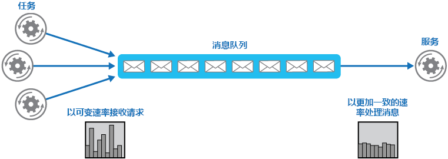
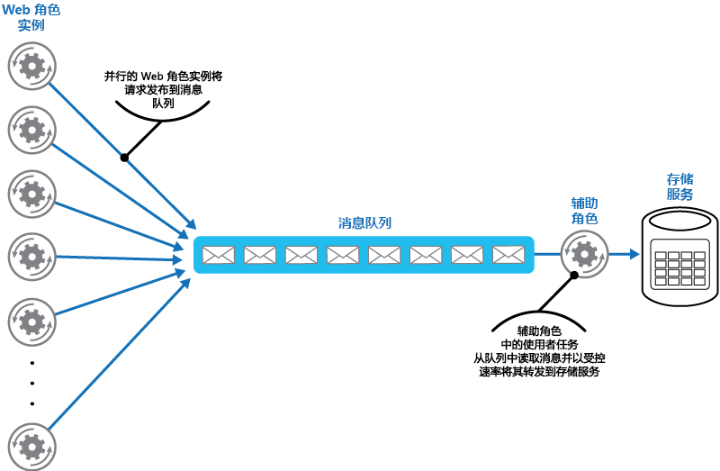

# 基于队列的负载调节模式Queue-Based Load Leveling pattern

[!INCLUDE [header](../_includes/header.md)]

使用队列在任务与所调用的服务之间充当缓冲，从而缓解间歇性负载过大现象，否则会导致服务故障或任务超时。这样可以将需求高峰对任务和服务的可用性和响应能力的影响降至最低。Use a queue that acts as a buffer between a task and a service it invokes in order to smooth intermittent heavy loads that can cause the service to fail or the task to time out. This can help to minimize the impact of peaks in demand on availability and responsiveness for both the task and the service.

## 上下文和问题Context and problem

云中的许多解决方案涉及运行那些调用服务的任务。Many solutions in the cloud involve running tasks that invoke services. 在这样的环境中，如果某个服务出现间歇性负载过大现象，则可能导致性能或可靠性问题。In this environment, if a service is subjected to intermittent heavy loads, it can cause performance or reliability issues.

服务可能与使用服务的任务同属一个解决方案；服务也可能是提供常用资源访问权限的第三方服务，例如缓存或存储服务。A service could be part of the same solution as the tasks that use it, or it could be a third-party service providing access to frequently used resources such as a cache or a storage service. 如果多个同时运行的任务使用同一服务，则可能难以预测任意时刻向服务发出的请求的数量。If the same service is used by a number of tasks running concurrently, it can be difficult to predict the volume of requests to the service at any time.

服务可能因需求高峰而过载，无法及时响应请求。A service might experience peaks in demand that cause it to overload and be unable to respond to requests in a timely manner. 向服务提交大量并发请求时，如果服务无法处理这些请求导致的争用，则也可能导致服务故障。Flooding a service with a large number of concurrent requests can also result in the service failing if it's unable to handle the contention these requests cause.

## 解决方案Solution

重构解决方案，在任务和服务之间引入队列。Refactor the solution and introduce a queue between the task and the service. 任务和服务异步运行。The task and the service run asynchronously. 任务将包含服务所需数据的消息发布到队列。The task posts a message containing the data required by the service to a queue. 队列充当缓冲区来存储消息，直至消息被服务检索出去。The queue acts as a buffer, storing the message until it's retrieved by the service. 服务从队列检索消息并对其进行处理。The service retrieves the messages from the queue and processes them. 多个任务提交的请求（其生成速度可能差异很大）可以通过同一消息队列传递给服务。Requests from a number of tasks, which can be generated at a highly variable rate, can be passed to the service through the same message queue. 下图显示如何使用队列调节服务的负载。This figure shows using a queue to level the load on a service.

队列使得任务与服务分离，服务可以按自己的速度处理消息，不管并发任务提供的请求数量如何。The queue decouples the tasks from the service, and the service can handle the messages at its own pace regardless of the volume of requests from concurrent tasks. 另外，即使在任务向队列发布消息时服务不可用，也不会对任务造成延迟。Additionally, there's no delay to a task if the service isn't available at the time it posts a message to the queue.

此模式具有以下优点：This pattern provides the following benefits:

- 可以最大程度地提高可用性，因为服务出现延迟时，不会立即和直接影响应用程序，后者仍可继续向队列发布消息，即使服务不可用或者当前不处理消息。It can help to maximize availability because delays arising in services won't have an immediate and direct impact on the application, which can continue to post messages to the queue even when the service isn't available or isn't currently processing messages.
- 可以最大程度地提高可伸缩性，因为队列数和服务数均可按需改变。It can help to maximize scalability because both the number of queues and the number of services can be varied to meet demand.
- 可以控制成本，因为部署的服务实例数只需满足平均负载而非高峰负载。It can help to control costs because the number of service instances deployed only have to be adequate to meet average load rather than the peak load.

    >  当需求达到某个阈值，超出该阈值就可能导致系统故障时，某些服务会实施限制。Some services implement throttling when demand reaches a threshold beyond which the system could fail. 限制可能导致可用功能减少。Throttling can reduce the functionality available. 可以对这些服务实施负载调节，确保不会达到该阈值。You can implement load leveling with these services to ensure that this threshold isn't reached.

## 问题和注意事项Issues and considerations

在决定如何实现此模式时，请考虑以下几点：Consider the following points when deciding how to implement this pattern:

- 必须实施应用程序逻辑，对服务处理消息的速度进行控制，避免目标资源过载。It's necessary to implement application logic that controls the rate at which services handle messages to avoid overwhelming the target resource. 避免将需求高峰带到系统的下一阶段。Avoid passing spikes in demand to the next stage of the system. 对系统进行负载测试，确保实现所需的均衡，并相应地调整队列数和处理消息的服务实例数。Test the system under load to ensure that it provides the required leveling, and adjust the number of queues and the number of service instances that handle messages to achieve this.
- 消息队列是一种单向通信机制。Message queues are a one-way communication mechanism. 如果任务期望从服务获得答复，则可能需要实施一种供服务用来发送响应的机制。If a task expects a reply from a service, it might be necessary to implement a mechanism that the service can use to send a response. 有关详细信息，请参阅 [Asynchronous Messaging Primer](https://msdn.microsoft.com/library/dn589781.aspx)（异步消息传送入门）。For more information, see the [Asynchronous Messaging Primer](https://msdn.microsoft.com/library/dn589781.aspx).
- 如果向服务应用自动缩放，而服务正在侦听队列中的请求，请谨慎操作。Be careful if you apply autoscaling to services that are listening for requests on the queue. 如果这些服务共享特定的资源，上述操作可能导致资源争用加剧，降低使用队列来均衡负载的有效性。This can result in increased contention for any resources that these services share and diminish the effectiveness of using the queue to level the load.

## 何时使用此模式When to use this pattern

此模式适用于其使用的服务可能发生过载的任何应用程序。This pattern is useful to any application that uses services that are subject to overloading.

如果应用程序需要尽量降低从服务收到响应时的延迟，则此模式不适用。This pattern isn't useful if the application expects a response from the service with minimal latency.

## 示例Example

一个 Microsoft Azure Web 角色使用单独的存储服务来存储数据。A Microsoft Azure web role stores data using a separate storage service. 如果该 Web 角色的大量实例同时运行，则存储服务在响应请求时，其速度可能过慢，导致这些请求超时或发生故障。If a large number of instances of the web role run concurrently, it's possible that the storage service will be unable to respond to requests quickly enough to prevent these requests from timing out or failing. 下图突出显示了一个服务因来自 Web 角色实例的并发请求过多而出现过载的情况。This figure highlights a service being overwhelmed by a large number of concurrent requests from instances of a web role.

若要解决此问题，可以使用一个队列，在 Web 角色实例和存储服务之间实现负载均衡。To resolve this, you can use a queue to level the load between the web role instances and the storage service. 但根据设计，存储服务是接受同步请求的，不能为了读取消息和管理吞吐量方便而轻易进行修改。However, the storage service is designed to accept synchronous requests and can't be easily modified to read messages and manage throughput. 可以引入一个充当代理服务的辅助角色，让其在接收来自队列的请求后再转发给存储服务。You can introduce a worker role to act as a proxy service that receives requests from the queue and forwards them to the storage service. 辅助角色中的应用程序逻辑可以控制该角色将请求传递给存储服务的速度，防止存储服务过载。The application logic in the worker role can control the rate at which it passes requests to the storage service to prevent the storage service from being overwhelmed. 下图演示了如何通过队列和辅助角色在 Web 角色实例和服务之间实现负载均衡。This figure illustrates using a queue and a worker role to level the load between instances of the web role and the service.

## 相关模式和指南Related patterns and guidance

实施此模式时，可能也会与以下模式和指南相关：The following patterns and guidance might also be relevant when implementing this pattern:

- [异步消息传送入门](https://msdn.microsoft.com/library/dn589781.aspx)。[Asynchronous Messaging Primer](https://msdn.microsoft.com/library/dn589781.aspx). 消息队列本质上是异步的。Message queues are inherently asynchronous. 如果已将任务中的应用程序逻辑从直接与服务通信修改为使用消息队列，则可能需要重新设计该逻辑。It might be necessary to redesign the application logic in a task if it's adapted from communicating directly with a service to using a message queue. 同样，可能需要重构服务才能接受来自消息队列的请求。Similarly, it might be necessary to refactor a service to accept requests from a message queue. 也可以实施代理服务，如示例中所述。Alternatively, it might be possible to implement a proxy service, as described in the example.
- [使用者竞争模式](competing-consumers.md)。[Competing Consumers pattern](competing-consumers.md). 可以运行多个服务实例，每一个都充当负载均衡队列中消息的使用者。It might be possible to run multiple instances of a service, each acting as a message consumer from the load-leveling queue. 可以使用此方法来调整接收消息并将其传给给服务的速度。You can use this approach to adjust the rate at which messages are received and passed to a service.
- [限制模式](throttling.md)。[Throttling pattern](throttling.md). 若要对服务实施限制，一种简单的方式是进行基于队列的负载均衡，通过消息队列将所有请求路由到服务。A simple way to implement throttling with a service is to use queue-based load leveling and route all requests to a service through a message queue. 服务可以按适当速度处理请求，确保服务所需资源不会耗竭，并缓解可能会发生的争用情况。The service can process requests at a rate that ensures that resources required by the service aren't exhausted, and to reduce the amount of contention that could occur.
- [Queue Service Concepts](https://msdn.microsoft.com/library/azure/dd179353.aspx)（队列服务概念）。[Queue Service Concepts](https://msdn.microsoft.com/library/azure/dd179353.aspx). 介绍如何在 Azure 应用程序中选择消息传送和排队机制。Information about choosing a messaging and queuing mechanism in Azure applications.
