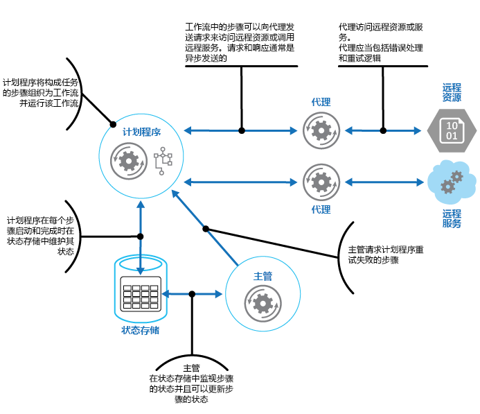

# 计划程序代理监督程序模式Scheduler Agent Supervisor pattern

[!INCLUDE [header](../_includes/header.md)]

以单项操作的形式协调一组分布式操作。Coordinate a set of distributed actions as a single operation. 如果任一操作失败，将尝试以透明方式处理故障，如果故障处理失败，则撤消已执行的工作，从而使整个操作作为一个整体成功或失败。If any of the actions fail, try to handle the failures transparently, or else undo the work that was performed, so the entire operation succeeds or fails as a whole. 这使分布式系统可以恢复并重试因暂时性异常、长期故障和进程故障而失败的操作，从而提高自身的复原能力。This can add resiliency to a distributed system, by enabling it to recover and retry actions that fail due to transient exceptions, long-lasting faults, and process failures.

## 上下文和问题Context and problem

应用程序执行包含多个步骤的任务，其中有些步骤可能调用远程服务或访问远程资源。An application performs tasks that include a number of steps, some of which might invoke remote services or access remote resources. 各个步骤可以彼此独立，但它们由实施任务的应用程序逻辑进行协调。The individual steps might be independent of each other, but they are orchestrated by the application logic that implements the task.

应用程序应尽可能确保任务完成运行，并解决访问远程服务或资源时可能发生的任何故障。Whenever possible, the application should ensure that the task runs to completion and resolve any failures that might occur when accessing remote services or resources. 导致故障的原因有很多。Failures can occur for many reasons. 例如，网络可能关闭，通信可能中断，远程服务可能停止响应或处于不稳定状态，或者可能因为资源约束而暂时无法访问某个远程资源。For example, the network might be down, communications could be interrupted, a remote service might be unresponsive or in an unstable state, or a remote resource might be temporarily inaccessible, perhaps due to resource constraints. 在许多情况下，故障是暂时的，可使用[重试模式][retry-pattern]处理。In many cases the failures will be transient and can be handled by using the [Retry pattern][retry-pattern].

如果应用程序检测到一个更持久的故障且无法轻松地从中恢复，则它必须能够将系统还原到一致状态，并确保整个操作的完整性。If the application detects a more permanent fault it can't easily recover from, it must be able to restore the system to a consistent state and ensure integrity of the entire operation.

## 解决方案Solution

计划程序代理监督程序模式定义了以下参与者。The Scheduler Agent Supervisor pattern defines the following actors. 这些参与者对各个步骤进行协调，使其作为整个任务的一部分执行。These actors orchestrate the steps to be performed as part of the overall task.

- **计划程序**安排执行构成任务的各个步骤并协调其操作。The **Scheduler** arranges for the steps that make up the task to be executed and orchestrates their operation. 这些步骤可以合并到管道或工作流中。These steps can be combined into a pipeline or workflow. 计划程序负责确保按正确顺序执行此工作流中的步骤。The Scheduler is responsible for ensuring that the steps in this workflow are performed in the right order. 执行每个步骤时，计划程序会记录工作流的状态，比如“步骤尚未启动”、“步骤正在运行”或“步骤已完成”。As each step is performed, the Scheduler records the state of the workflow, such as "step not yet started," "step running," or "step completed." 状态信息还应包括完成该步骤所允许的时间上限，即最迟完成时间。The state information should also include an upper limit of the time allowed for the step to finish, called the complete-by time. 如果某个步骤要求访问远程服务或资源，计划程序会调用相应的代理，向其传递要执行的工作的详细信息。If a step requires access to a remote service or resource, the Scheduler invokes the appropriate Agent, passing it the details of the work to be performed. 计划程序通常使用异步请求/响应消息传送与代理通信。The Scheduler typically communicates with an Agent using asynchronous request/response messaging. 这可以使用队列实现，不过也可改用其他分布式消息传送技术。This can be implemented using queues, although other distributed messaging technologies could be used instead.

    > 计划程序执行的功能与[进程管理器模式](http://www.enterpriseintegrationpatterns.com/patterns/messaging/ProcessManager.html)下的进程管理器相似。The Scheduler performs a similar function to the Process Manager in the [Process Manager pattern](http://www.enterpriseintegrationpatterns.com/patterns/messaging/ProcessManager.html). 实际的工作流通常由计划程序所控制的工作流引擎来定义和实施。The actual workflow is typically defined and implemented by a workflow engine that's controlled by the Scheduler. 此方法将工作流中的业务逻辑与计划程序相分离。This approach decouples the business logic in the workflow from the Scheduler.

- **代理**包含一种逻辑，该逻辑封装对任务中某个步骤引用的远程服务的调用或远程资源的访问。The **Agent** contains logic that encapsulates a call to a remote service, or access to a remote resource referenced by a step in a task. 通常，每个代理均包装对单个服务或资源的调用，并实现相应的错误处理和重试逻辑（受后面所述的超时约束限制）。Each Agent typically wraps calls to a single service or resource, implementing the appropriate error handling and retry logic (subject to a timeout constraint, described later). 如果计划程序正在运行的工作流中的步骤跨不同步骤使用多个服务和资源，则每个步骤可能引用一个不同的代理（这是此模式的实现细节）。If the steps in the workflow being run by the Scheduler use several services and resources across different steps, each step might reference a different Agent (this is an implementation detail of the pattern).

- **监督程序**监视由计划程序执行的任务中步骤的状态。The **Supervisor** monitors the status of the steps in the task being performed by the Scheduler. 它定期运行（频率因系统而异），并检查由计划程序维护的步骤的状态。It runs periodically (the frequency will be system specific), and examines the status of steps maintained by the Scheduler. 如果它检测到任何超时或失败的步骤，则会安排相应的代理来恢复该步骤或执行相应的更正措施（这可能涉及修改步骤的状态）。If it detects any that have timed out or failed, it arranges for the appropriate Agent to recover the step or execute the appropriate remedial action (this might involve modifying the status of a step). 请注意，恢复或更正操作由计划程序和代理实施。Note that the recovery or remedial actions are implemented by the Scheduler and Agents. 监督程序应只请求执行这些操作。The Supervisor should simply request that these actions be performed.

计划程序、代理和监督程序都是逻辑组件，其物理实现依赖于所采用的技术。The Scheduler, Agent, and Supervisor are logical components and their physical implementation depends on the technology being used. 例如，多个逻辑代理可能作为单个 Web 服务的一部分实现。For example, several logical agents might be implemented as part of a single web service.

计划程序在一个名为状态存储的持久数据存储中维护有关任务进度和各步骤的状态的信息。The Scheduler maintains information about the progress of the task and the state of each step in a durable data store, called the state store. 监督程序可以使用此信息帮助确定某个步骤是否失败。The Supervisor can use this information to help determine whether a step has failed. 下图阐释了计划程序、代理、监督程序和状态存储之间的关系。The figure illustrates the relationship between the Scheduler, the Agents, the Supervisor, and the state store.

> 此图展示了该模式的简化版本。This diagram shows a simplified version of the pattern. 在实际实施中，可能会同时运行计划程序的多个实例，每个任务子集一个实例。In a real implementation, there might be many instances of the Scheduler running concurrently, each a subset of tasks. 同样，系统也可以运行每个代理的多个实例，甚至运行多个监督程序。Similarly, the system could run multiple instances of each Agent, or even multiple Supervisors. 在这种情况下，各监督程序之间必须谨慎协调工作，确保它们不会争相恢复相同的失败步骤和任务。In this case, Supervisors must coordinate their work with each other carefully to ensure that they don’t compete to recover the same failed steps and tasks. [领导选拔模式](leader-election.md)为此问题提供了一个可行的解决方案。The [Leader Election pattern](leader-election.md) provides one possible solution to this problem.

当应用程序准备好运行某个任务时，它会向计划程序提交请求。When the application is ready to run a task, it submits a request to the Scheduler. 计划程序在状态存储中记录有关该任务及其步骤的初始状态信息（例如，步骤尚未启动），然后开始执行工作流定义的操作。The Scheduler records initial state information about the task and its steps (for example, step not yet started) in the state store and then starts performing the operations defined by the workflow. 在计划程序启动每个步骤时，它会更新状态存储中有关该步骤状态的信息（例如，步骤正在运行）。As the Scheduler starts each step, it updates the information about the state of that step in the state store (for example, step running).

如果步骤引用远程服务或资源，计划程序会将消息发送到相应的代理。If a step references a remote service or resource, the Scheduler sends a message to the appropriate Agent. 除了操作的最迟完成时间外，该消息还包含代理传递到服务或访问资源所需的信息。The message contains the information that the Agent needs to pass to the service or access the resource, in addition to the complete-by time for the operation. 如果代理成功完成其操作，则向计划程序返回一个响应。If the Agent completes its operation successfully, it returns a response to the Scheduler. 接着，计划程序可以更新状态存储中的状态信息（例如，步骤已完成），并执行下一个步骤。The Scheduler can then update the state information in the state store (for example, step completed) and perform the next step. 此过程会一直持续到整个任务完成。This process continues until the entire task is complete.

代理可以实现执行其工作所需的任何重试逻辑。An Agent can implement any retry logic that's necessary to perform its work. 但是，如果在最迟完成时间到期前，代理未完成其工作，计划程序将假定该操作失败。However, if the Agent doesn't complete its work before the complete-by period expires, the Scheduler will assume that the operation has failed. 在这种情况下，代理应停止其工作，不再尝试向计划程序返回任何信息（甚至包括错误消息）或尝试执行任何形式的恢复。In this case, the Agent should stop its work and not try to return anything to the Scheduler (not even an error message), or try any form of recovery. 设置此限制的原因是，某个步骤超时或失败后，可能会安排代理的另一个实例来运行失败的步骤（后面介绍了此过程）。The reason for this restriction is that, after a step has timed out or failed, another instance of the Agent might be scheduled to run the failing step (this process is described later).

如果代理失败，计划程序不会收到响应。If the Agent fails, the Scheduler won't receive a response. 该模式不会区分超时的步骤和真正失败的步骤。The pattern doesn't make a distinction between a step that has timed out and one that has genuinely failed.

如果某个步骤超时或失败，状态存储将包含一条记录，指示该步骤正在运行，但已超过最迟完成时间。If a step times out or fails, the state store will contain a record that indicates that the step is running, but the complete-by time will have passed. 监督程序会查找类似的步骤，并尝试恢复它们。The Supervisor looks for steps like this and tries to recover them. 一个可行的策略是让监督程序更新最迟完成时间值，将时间延长到足够完成该步骤，然后将消息发送到确定该步骤已超时的计划程序。接着，计划程序可以尝试重复此步骤。One possible strategy is for the Supervisor to update the complete-by value to extend the time available to complete the step, and then send a message to the Scheduler identifying the step that has timed out. The Scheduler can then try to repeat this step. 但是，此设计要求任务是幂等的。However, this design requires the tasks to be idempotent.

如果同一步骤不断失败或超时，监督程序可能需要阻止重试该步骤。为此，监督程序可以在状态存储中为每个步骤维护重试计数和状态信息。The Supervisor might need to prevent the same step from being retried if it continually fails or times out. To do this, the Supervisor could maintain a retry count for each step, along with the state information, in the state store. 如果此计数超过预定义的阈值，监督程序可以采取以下策略：在通知计划程序应重试该步骤前，再多等一段时间，以期故障在这段时间内得到解决。If this count exceeds a predefined threshold the Supervisor can adopt a strategy of waiting for an extended period before notifying the Scheduler that it should retry the step, in the expectation that the fault will be resolved during this period. 或者，监督程序也可以向计划程序发送消息，请求通过实施[补偿事务模式](compensating-transaction.md)来撤消整个任务。Alternatively, the Supervisor can send a message to the Scheduler to request the entire task be undone by implementing a [Compensating Transaction pattern](compensating-transaction.md). 此方法依赖于计划程序和代理提供必要的信息，为成功完成的每个步骤实施补偿操作。This approach will depend on the Scheduler and Agents providing the information necessary to implement the compensating operations for each step that completed successfully.

> 它不靠监督程序来监视计划程序和代理并在它们失败时将其重新启动。It isn't the purpose of the Supervisor to monitor the Scheduler and Agents, and restart them if they fail. 系统这一块应由运行这些组件的基础结构处理。This aspect of the system should be handled by the infrastructure these components are running in. 同样，监督程序不应当去了解计划程序所执行的任务正在运行的业务操作（包括这些任务失败时如何补偿）。Similarly, the Supervisor shouldn't have knowledge of the actual business operations that the tasks being performed by the Scheduler are running (including how to compensate should these tasks fail). 这是由计划程序实现的工作流逻辑的职责。This is the purpose of the workflow logic implemented by the Scheduler. 监督程序的唯一职责是确定某个步骤是否失败，并安排重试该步骤或撤消包含该失败步骤的整个任务。The sole responsibility of the Supervisor is to determine whether a step has failed and arrange either for it to be repeated or for the entire task containing the failed step to be undone.

如果计划程序在发生故障后重新启动，或计划程序执行的工作流意外终止，计划程序应能够确定它发生故障时正在处理的任何即时任务的状态，并准备好从该点继续处理此任务。If the Scheduler is restarted after a failure, or the workflow being performed by the Scheduler terminates unexpectedly, the Scheduler should be able to determine the status of any inflight task that it was handling when it failed, and be prepared to resume this task from that point. 此过程的实现细节可能因系统而异。The implementation details of this process are likely to be system specific. 如果无法恢复该任务，则可能需要撤消该任务已执行的工作。If the task can't be recovered, it might be necessary to undo the work already performed by the task. 这可能还需要实施[补偿事务](compensating-transaction.md)。This might also require implementing a [compensating transaction](compensating-transaction.md).

此模式的主要优点是，系统能够从意外发生的临时故障或不可恢复的故障中复原。The key advantage of this pattern is that the system is resilient in the event of unexpected temporary or unrecoverable failures. 系统可构造为自我修复。The system can be constructed to be self healing. 例如，如果代理或计划程序失败，则可以启动一个新的代理或计划程序，监督程序可以安排继续执行任务。For example, if an Agent or the Scheduler fails, a new one can be started and the Supervisor can arrange for a task to be resumed. 如果监督程序失败，则可以启动另一个实例，该实例可以从发生故障处开始接管。If the Supervisor fails, another instance can be started and can take over from where the failure occurred. 如果监督程序计划为定期运行，新实例可在预定义的时间间隔后自动启动。If the Supervisor is scheduled to run periodically, a new instance can be automatically started after a predefined interval. 可以复制状态存储，以实现更强的复原能力。The state store can be replicated to reach an even greater degree of resiliency.

## 问题和注意事项Issues and considerations

在决定如何实现此模式时，应考虑以下几点：You should consider the following points when deciding how to implement this pattern:

- 此模式很难实施，并且要求仔细测试系统每种可能的故障模式。This pattern can be difficult to implement and requires thorough testing of each possible failure mode of the system.

- 计划程序所实现的恢复/重试逻辑非常复杂，且依赖于保存在状态存储中的状态信息。The recovery/retry logic implemented by the Scheduler is complex and dependent on state information held in the state store. 可能还需要在持久数据存储中记录实施补偿事务所需的信息。It might also be necessary to record the information required to implement a compensating transaction in a durable data store.

- 监督程序的运行频率非常重要。How often the Supervisor runs will be important. 它的运行频率应足够高，以防止任何失败的步骤长时间阻止应用程序运行，但又不能太高，以至于成为一项开销。It should run often enough to prevent any failed steps from blocking an application for an extended period, but it shouldn't run so often that it becomes an overhead.

- 代理执行的步骤可能运行多次。The steps performed by an Agent could be run more than once. 用于实施这些步骤的逻辑应是幂等的。The logic that implements these steps should be idempotent.

## 何时使用此模式When to use this pattern

当分布式环境（比如云）中运行的进程必须能够从通信故障和/或操作失败中复原时，可使用此模式。Use this pattern when a process that runs in a distributed environment, such as the cloud, must be resilient to communications failure and/or operational failure.

此模式可能不适用于不调用远程服务或访问远程资源的任务。This pattern might not be suitable for tasks that don't invoke remote services or access remote resources.

## 示例Example

Microsoft Azure 上部署了一个用于实现电子商务系统的 Web 应用程序。A web application that implements an ecommerce system has been deployed on Microsoft Azure. 用户可以运行此应用程序，以浏览现有产品和下订单。Users can run this application to browse the available products and to place orders. 其用户界面以 Web 角色运行，应用程序的订单处理元素作为一组辅助角色实现。The user interface runs as a web role, and the order processing elements of the application are implemented as a set of worker roles. 订单处理逻辑的一部分涉及到访问远程服务，并且系统的这一块可能很容易出现暂时性故障或更持久的故障。Part of the order processing logic involves accessing a remote service, and this aspect of the system could be prone to transient or more long-lasting faults. 为此，设计人员使用计划程序代理监督程序模式来实现系统的订单处理元素。For this reason, the designers used the Scheduler Agent Supervisor pattern to implement the order processing elements of the system.

客户下订单时，应用程序会构造一条描述该订单的消息，并将此消息发布到队列中。When a customer places an order, the application constructs a message that describes the order and posts this message to a queue. 一个在辅助角色中运行的独立提交进程检索到该消息后，将订单详细信息插入订单数据库中，并在状态存储中为订单进程创建一条记录。A separate submission process, running in a worker role, retrieves the message, inserts the order details into the orders database, and creates a record for the order process in the state store. 请注意，针对订单数据库和状态存储的插入作为同一操作的一部分执行。Note that the inserts into the orders database and the state store are performed as part of the same operation. 提交进程旨在确保两次插入一起完成。The submission process is designed to ensure that both inserts complete together.

提交进程为订单创建的状态信息包括：The state information that the submission process creates for the order includes:

- **OrderID**。**OrderID**. 订单在订单数据库中的 ID。The ID of the order in the orders database.

- **LockedBy**。**LockedBy**. 处理订单的辅助角色的实例 ID。The instance ID of the worker role handling the order. 运行计划程序的当前辅助角色实例可能有多个，但每个订单只能由单个实例处理。There might be multiple current instances of the worker role running the Scheduler, but each order should only be handled by a single instance.

- **CompleteBy**。**CompleteBy**. 订单的最迟处理时间。The time the order should be processed by.

- **ProcessState**。**ProcessState**. 处理订单的任务的当前状态。The current state of the task handling the order. 可能的状态包括：The possible states are:

    - **挂起**。**Pending**. 已创建订单，但尚未开始处理。The order has been created but processing hasn't yet been started.
    - **正在处理**。**Processing**. 当前正在处理订单。The order is currently being processed.
    - **已处理**。**Processed**. 已成功处理订单。The order has been processed successfully.
    - **错误**。**Error**. 订单处理失败。The order processing has failed.

- **FailureCount**。**FailureCount**. 尝试处理订单的次数。The number of times that processing has been tried for the order.

在此状态信息中，`OrderID` 字段从新订单的订单 ID 复制而来。In this state information, the `OrderID` field is copied from the order ID of the new order. `LockedBy` 和 `CompleteBy` 字段设置为 `null`，`ProcessState` 字段设置为 `Pending`，`FailureCount` 字段设置为 0。The `LockedBy` and `CompleteBy` fields are set to `null`, the `ProcessState` field is set to `Pending`, and the `FailureCount` field is set to 0.

> 在此示例中，订单处理逻辑相对简单，并且只有一个调用远程服务的步骤。In this example, the order handling logic is relatively simple and only has a single step that invokes a remote service. 在更复杂的多步骤方案中，提交进程可能涉及多个步骤，因此会在状态存储中创建多条记录，每条记录描述单个步骤的状态。In a more complex multistep scenario, the submission process would likely involve several steps, and so several records would be created in the state store—each one describing the state of an individual step.

计划程序也作为辅助角色的一部分运行，并实现用于处理订单的业务逻辑。The Scheduler also runs as part of a worker role and implements the business logic that handles the order. 轮询新订单的计划程序实例会在状态存储中检查 `LockedBy` 字段为 NULL 且 `ProcessState` 字段为挂起的记录。An instance of the Scheduler polling for new orders examines the state store for records where the `LockedBy` field is null and the `ProcessState` field is pending. 当计划程序发现新订单时，会立即使用自己的实例 ID 填充 `LockedBy` 字段，并将 `CompleteBy` 字段设置为适当的时间，将 `ProcessState` 字段设置为正在处理。When the Scheduler finds a new order, it immediately populates the `LockedBy` field with its own instance ID, sets the `CompleteBy` field to an appropriate time, and sets the `ProcessState` field to processing. 该代码设计为具有独占性和原子性，以确保计划程序的两个并发实例不能尝试同时处理同一个订单。The code is designed to be exclusive and atomic to ensure that two concurrent instances of the Scheduler can't try to handle the same order simultaneously.

接着，计划程序运行业务工作流，以异步方式处理订单，并向其传递状态存储中 `OrderID` 字段的值。The Scheduler then runs the business workflow to process the order asynchronously, passing it the value in the `OrderID` field from the state store. 处理订单的工作流从订单数据库中检索订单的详细信息，并执行其工作。The workflow handling the order retrieves the details of the order from the orders database and performs its work. 如果订单处理工作流中的某个步骤需要调用远程服务，它会使用代理。When a step in the order processing workflow needs to invoke the remote service, it uses an Agent. 该工作流步骤通过将一对 Azure 服务总线消息队列作为请求/响应通道，与代理通信。The workflow step communicates with the Agent using a pair of Azure Service Bus message queues acting as a request/response channel. 下图高度概括了该解决方案。The figure shows a high level view of the solution.

从工作流步骤发送到代理的消息描述了订单，并包含最迟完成时间。The message sent to the Agent from a workflow step describes the order and includes the complete-by time. 如果代理在最迟完成时间到期前从远程服务收到响应，它会在工作流侦听的服务总线队列上发布回复消息。If the Agent receives a response from the remote service before the complete-by time expires, it posts a reply message on the Service Bus queue on which the workflow is listening. 工作流步骤收到有效的回复消息后，会完成其处理，计划程序则将订单状态的“ProcessState”字段设置为已处理。When the workflow step receives the valid reply message, it completes its processing and the Scheduler sets the \`ProcessState field of the order state to processed. 此时，订单处理已成功完成。At this point, the order processing has completed successfully.

如果在代理从远程服务收到响应前，最迟完成时间就已到期，代理只需暂停其处理，并终止订单处理。If the complete-by time expires before the Agent receives a response from the remote service, the Agent simply halts its processing and terminates handling the order. 同样，如果处理订单的工作流超过最迟完成时间，它也会终止。Similarly, if the workflow handling the order exceeds the complete-by time, it also terminates. 在这两种情况下，状态存储中订单的状态仍设置为正在处理，但最迟完成时间指示订单处理时间已过，该过程被视为已失败。In both cases, the state of the order in the state store remains set to processing, but the complete-by time indicates that the time for processing the order has passed and the process is deemed to have failed. 请注意，如果访问远程服务的代理或处理订单的工作流（或两者同时）意外终止，状态存储中的信息也仍然设置为正在处理，并且最终将具有到期的最迟完成时间值。Note that if the Agent that's accessing the remote service, or the workflow that's handling the order (or both) terminate unexpectedly, the information in the state store will again remain set to processing and eventually will have an expired complete-by value.

如果代理在尝试联系远程服务时检测到一个不可恢复的非暂时性故障，它可以向工作流发回错误响应。If the Agent detects an unrecoverable, nontransient fault while it's trying to contact the remote service, it can send an error response back to the workflow. 计划程序可以将订单状态设置为错误，并引发一个事件以向操作员发出警报。The Scheduler can set the status of the order to error and raise an event that alerts an operator. 操作员随后可以尝试手动解决故障原因，并重新提交处理失败的步骤。The operator can then try to resolve the reason for the failure manually and resubmit the failed processing step.

监督程序定期检查状态存储，寻找具有到期的最迟完成时间值的订单。The Supervisor periodically examines the state store looking for orders with an expired complete-by value. 如果监督程序发现一条记录，则会递增 `FailureCount` 字段的值。If the Supervisor finds a record, it increments the `FailureCount` field. 如果失败计数值低于指定阈值，监督程序会将 `LockedBy` 字段重置为 NULL，将 `CompleteBy` 字段更新为新的到期时间，并将 `ProcessState` 字段设置为挂起。If the failure count value is below a specified threshold value, the Supervisor resets the `LockedBy` field to null, updates the `CompleteBy` field with a new expiration time, and sets the `ProcessState` field to pending. 计划程序的某个实例可以选取此订单，像以前一样执行其处理。An instance of the Scheduler can pick up this order and perform its processing as before. 如果失败计数值超过指定阈值，失败的原因会被视为非暂时性。If the failure count value exceeds a specified threshold, the reason for the failure is assumed to be nontransient. 监督程序会将订单状态设置为错误，并引发一个事件以向操作员发出警报。The Supervisor sets the status of the order to error and raises an event that alerts an operator.

> 在此示例中，监督程序以单独的辅助角色实现。In this example, the Supervisor is implemented in a separate worker role. 用户可使用各种策略来安排监督程序任务的运行，包括使用 Azure 计划程序服务（不要与此模式中的计划程序组件混淆）。You can use a variety of strategies to arrange for the Supervisor task to be run, including using the Azure Scheduler service (not to be confused with the Scheduler component in this pattern). 有关 Azure 计划程序服务的详细信息，请访问[计划程序](https://azure.microsoft.com/services/scheduler/)页。For more information about the Azure Scheduler service, visit the [Scheduler](https://azure.microsoft.com/services/scheduler/) page.

虽然未在此示例中加以说明，但计划程序可能需要让提交订单的应用程序及时了解订单的进度和状态。Although it isn't shown in this example, the Scheduler might need to keep the application that submitted the order informed about the progress and status of the order. 应用程序和计划程序彼此独立，以消除两者之间的任何依赖关系。The application and the Scheduler are isolated from each other to eliminate any dependencies between them. 应用程序不知道处理订单的是哪个计划程序实例，计划程序也不清楚发布订单的是哪个特定的应用程序实例。The application has no knowledge of which instance of the Scheduler is handling the order, and the Scheduler is unaware of which specific application instance posted the order.

若要允许报告订单状态，应用程序可以使用自己的私有响应队列。To allow the order status to be reported, the application could use its own private response queue. 此响应队列的详细信息会作为请求的一部分发送至提交进程，提交进程则将此信息添加到状态存储中。The details of this response queue would be included as part of the request sent to the submission process, which would include this information in the state store. 接着，计划程序向此队列发布消息，指明订单的状态（已收到请求、订单已完成、订单失败等等）。The Scheduler would then post messages to this queue indicating the status of the order (request received, order completed, order failed, and so on). 它应在这些消息中包含订单 ID，以使它们与应用程序发出的原始请求相关联。It should include the order ID in these messages so they can be correlated with the original request by the application.

## 相关模式和指南Related patterns and guidance

实施此模式时，可能也会与以下模式和指南相关：The following patterns and guidance might also be relevant when implementing this pattern:
- [重试模式][retry-pattern]。[Retry pattern][retry-pattern]. 代理可以使用此模式，以透明方式重试之前失败的访问远程服务或资源的操作。An Agent can use this pattern to transparently retry an operation that accesses a remote service or resource that has previously failed. 此模式在预计失败原因是暂时性的并且能够纠正时使用。Use when the expectation is that the cause of the failure is transient and can be corrected.
- [断路器模式](circuit-breaker.md)。[Circuit Breaker pattern](circuit-breaker.md). 代理可以在连接到远程服务或资源时，使用此模式处理所需纠正时间不定的故障。An Agent can use this pattern to handle faults that take a variable amount of time to correct when connecting to a remote service or resource.
- [补偿事务模式](compensating-transaction.md)。[Compensating Transaction pattern](compensating-transaction.md). 如果由计划程序执行的工作流无法成功完成，则可能需要撤消之前执行的所有工作。If the workflow being performed by a Scheduler can't be completed successfully, it might be necessary to undo any work it's previously performed. 补偿事务模式描述如何为采用最终一致性模型的操作实现这一点。The Compensating Transaction pattern describes how this can be achieved for operations that follow the eventual consistency model. 此类操作通常由执行复杂业务流程和工作流的计划程序实施。These types of operations are commonly implemented by a Scheduler that performs complex business processes and workflows.
- [异步消息传送入门](https://msdn.microsoft.com/library/dn589781.aspx)。[Asynchronous Messaging Primer](https://msdn.microsoft.com/library/dn589781.aspx). 计划程序代理监督程序模式中的组件在运行时通常相互分离，并以异步方式通信。The components in the Scheduler Agent Supervisor pattern typically run decoupled from each other and communicate asynchronously. 该模式介绍了一些可用来基于消息队列实现异步通信的方法。Describes some of the approaches that can be used to implement asynchronous communication based on message queues.
- [领导选拔模式](leader-election.md)。[Leader Election pattern](leader-election.md). 可能必须协调监督程序多个实例的操作，防止它们试图恢复同一失败过程。It might be necessary to coordinate the actions of multiple instances of a Supervisor to prevent them from attempting to recover the same failed process. 领导选拔模式描述如何实现这一点。The Leader Election pattern describes how to do this.
- Clemens Vasters 博客上的 [Cloud Architecture: The Scheduler-Agent-Supervisor Pattern](https://blogs.msdn.microsoft.com/clemensv/2010/09/27/cloud-architecture-the-scheduler-agent-supervisor-pattern/)（云体系结构：计划程序代理监督程序模式）[Cloud Architecture: The Scheduler-Agent-Supervisor Pattern](https://blogs.msdn.microsoft.com/clemensv/2010/09/27/cloud-architecture-the-scheduler-agent-supervisor-pattern/) on Clemens Vasters' blog
- [进程管理器模式Process Manager pattern](http://www.enterpriseintegrationpatterns.com/patterns/messaging/ProcessManager.html)
- [参考 6：Sagas 上的 Saga](https://msdn.microsoft.com/library/jj591569.aspx)。[Reference 6: A Saga on Sagas](https://msdn.microsoft.com/library/jj591569.aspx). 提供了一个示例，展示 CQRS 模式如何使用进程管理器（CQRS 旅程指南的一部分）。An example showing how the CQRS pattern uses a process manager (part of the CQRS Journey guidance).
- [Microsoft Azure 计划程序Microsoft Azure Scheduler](https://azure.microsoft.com/services/scheduler/)

[retry-pattern]: ./retry.md
