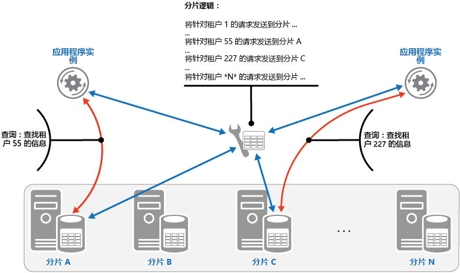
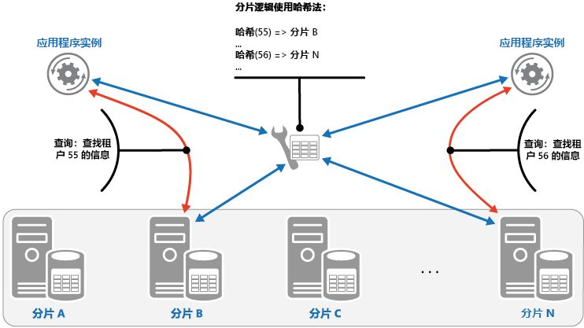

# <a name="sharding-pattern"></a>分片模式

[!INCLUDE [header](../_includes/header.md)]

将数据存储划分为一组水平分区或分片。 这样可存储和访问大量数据时提高可伸缩性。

## <a name="context-and-problem"></a>上下文和问题

由单个服务器托管的数据存储会受到以下限制：

- **存储空间**。 用于大规模云应用程序的数据存储预期包含可随时间显着增加的大量数据。 服务器通常仅提供有限的磁盘存储，但可以将现有磁盘替换为存储控件更大的磁盘，或随着数据量的增长向计算机添加更多磁盘。 但是，系统将最终达到上限，而在给定服务器上无法轻松地增加存储容量。

- **计算资源**。 云应用程序时需要支持大量并发用户，其中每个用户均运行从数据存储检索信息的查询。 使用单个服务器托管数据存储无法提供支持此负载所需的计算能力，从而因应用程序存储和检索数据超时而导致用户和频发故障的响应时间延长。可以添加内存或升级处理器，但在无法增加更多的任何计算资源时，表示系统已达到上限。

- **网络带宽**。 从根本上讲，在单个服务器上运行的数据存储的性能将受制于服务器可以接收请求和发送答复的速率。 网络流量可能会超过用于连接到服务器的网络容量，从而导致请求失败。

- **地理位置**。 由于法律，合规性或性能原因或出于降低数据访问延迟的目的，有必要将特定用户生成的数据与这些用户存储在同一区域中。 如果用户分布在不同的国家/地区或区域，它可能无法在单个数据存储中存储应用程序的全部数据。

通过添加更多磁盘容量、处理能力、内存和网络连接进行垂直缩放可推迟其中某些限制的影响，但这只是一种临时解决方案。 能够支持大量用户和大量数据的商业云应用程序必须能够接近无限缩放，因此垂直缩放并不一定是最佳解决方案。

## <a name="solution"></a>解决方案

将数据存储划分为水平分区或分片。 每个分片具有相同的架构，但保存其自己数据的不同子集。 分片是自己权限内的数据存储（可以包含不同类型的许多实体的数据），在服务器上作为存储节点运行。

此模式具有以下优点：

- 通过添加在其他存储节点上运行的更多分片，可以向外扩展系统。

- 系统可以为每个存储节点使用现成的硬件，而不是专用且昂贵的计算机。

- 通过在分片间平衡工作负荷可减少争用并提高性能。

- 在云中，分片可位于靠近将访问数据的用户的位置。

将数据存储分割成分片时，决定每个分片中应放置哪些数据。 一个分片通常包含属于由数据的一个或多个属性决定的指定范围内的项。 这些属性构成分片键（有时称为分区键）。 分片键应为静态。 它不应基于可能会更改的数据。

分片以物理方式组织数据。 应用程序存储和检索数据时，分片逻辑将应用程序定向到相应分片。 可以将此分片逻辑实现为应用程序中数据访问代码的一部分，或者如果它以透明方式支持分片，则可由数据存储系统实现它。

提取分片逻辑中数据的物理位置可提供哪些分片包含哪些数据的高级控制。 此外，如果分片中的数据稍后需要进行重新分配（例如，分片变得不平衡的情况），则还可以在无需重新处理应用程序的业务逻辑情况下，使数据在分片间进行迁移。 权衡是在确定每个数据项被检索时的位置所需的附加数据访问开销。

若要确保获得最佳性能和可伸缩性，以适合于应用程序执行查询的类型方式拆分数据至关重要。 在许多情况下，分片方案不可能完全匹配每个查询的要求。 例如，在多租户系统中，应用程序可能需要使用租户 ID 检索租户数据，但还可能需要根据其他某些属性（例如租户的名称或位置）查找此数据。 若要处理这些情况，请使用支持最常执行的查询的分片键实现分片策略。

如果查询定期使用属性值结合检索数据，则可以通过将属性链接在一起定义复合分片键。 或者，如使用模式（例如[索引表](index-table.md)）来提供针对基于分片键未覆盖属性的数据的快速查找。

## <a name="sharding-strategies"></a>分片策略

选择分片键并决定如何在分片之间分发数据时，通常使用三种策略。 注意，分片和托管它们的服务器之间并不一定是一一对应关系&mdash;单个服务器可以托管多个分片。 策略包括：

**查找策略**。 在此策略中，分片逻辑实现了一个映射，可使用分片键将对数据的请求路由到包含该数据的分片。 在多租户应用程序中，将租户 ID 用作分片键，可将某个租户的所有数据一同存储在该分片中。 多个租户可以共享同一分片，但是单个租户的数据不会分布于多个分片中。 下图说明了基于租户 ID 的分片租户数据。

   


   分片键和物理存储之间的映射可基于每个分片键映射到物理分区的物理分片。 或者，用于重新平衡分片的更灵活方法是虚拟分区，其中分片键映射到同一编号的虚拟分片，这样依次映射到更少的物理分区。 在此方法中，应用程序使用引用虚拟分片的分片键查找数据，且以透明方式将虚拟分片映射到物理分区。 无需修改应用程序代码，虚拟分片和物理分区之间的映射既可以更改为使用一组不同的分片键。

**范围策略**。 此策略将相关项目组合在同一分片中，并通过分片键对其进行排序 &mdash; 分片键是连续的。 它对于经常使用范围查询检索项集的应用程序很有用（返回一组属于给定范围内的分片键的数据项的查询）。 例如，如果应用程序经常需要查在给定月份中的所有订单，如果某月的全部订单以日期和时间顺序存储在同一分片中，则此数据可以更快地检索所有订单。 如果每个订单存储在不同分片中，则需要将通过执行大量的点查询（返回单个数据项的查询）单独提取订单。 下一个图说明了分片中数据的存储顺序集（范围）。

   

在此示例中，分片键是包含将订购月份作为最重要元素（后面是订单日期和时间）的复合键。 新建订单并将其添加到分片时，订单数据按自然顺序排序。 一些数据存储支持分片中的两部分分片键，包含可标识分片的分区键元素和唯一标识某个项的行键。 数据通常会以行键顺序保留在分片中。 受范围查询支配并需要组合在一起的项可以使用具有同一分区键值的分片键，但行键值是唯一的。

**哈希策略**。 此策略的目的是降低形成热点的可能性（接收不成比例的负载的分片）。 它以在每个分片的大小和每个分片将承载的平均负载之间取得平衡的方式在分片间分发数据。 分片逻辑基于数据的一个或多个属性的哈希来计算用于存储项目的分片。 所选的哈希函数应在分片间平均分发数据，可能将某些随机元素引入计算。 下一个图说明了基于租户 ID 哈希的分片租户数据。

   

要通过其他分片策略了解哈希策略的优势，请考虑按顺序注册新租户的多租户应用程序如何将租户分配到数据存储区中的分片。 使用范围策略时，租户 1 到 n 的数据都将存储在分片 A 中，租户 n+1 到 m 的数据都存储在分片 B 上，依次类推。 如果最近注册的租户也是最活跃的租户，则多数数据活动将发生在少数分片中，这会导致热点。 与此相反，哈希策略根据租户 ID 的哈希将租户分配到分片中。 这意味着连续的租户最有可能被分配到不同的分片，这会在分片间分发负载。 上图展示了为租户 55 和 56 分发负载的过程。

者三个分片策略的优势和注意事项如下：

- **查找**。 提供了分片配置和使用方式的更多控制权限。 重新平衡数据时，使用虚拟分片可减少影响，因为可添加新的物理分区来平摊工作负荷。 无需影响使用分片键来存储和检索数据的应用程序代码，即可修改虚拟分片和实现分片的物理分区之间的映射。 查找分片位置会产生额外开销。

- **范围**。 该策略很容易实现，并且适用于范围查询，因为它们通常可以在单个操作中从单个分片中提取多个数据项。 此策略提供更简单的数据管理。 例如，如果同一区域中的用户位于同一分片中，则可以基于本地负载和需求模式在每个时区中调度更新。 但此策略不提供分片间的最佳平衡。 如果大多数活动适用于毗邻的分片键，则重新平衡分片很困难并且可能无法解析负载不均的问题。

- **哈希**。 此策略提供了可更平均的分配数据和负载的方式。 请求路由可直接通过使用哈希函数来完成。 无需维护映射。 注意：计算哈希值可能会产生额外开销。 此外，重新平衡分片会很困难。

最常见的分片系统会实现上述方法之一，但是你还应考虑应用程序的业务要求及其数据使用模式。 例如，在多租户应用程序中：

- 可以根据工作负载分片数据。 可以在单独的分片中分离高度易失性租户的数据。 因此，可能会提高其他租户的数据访问速度。

- 可以根据租户位置分片数据。 可以脱机获取特定地理区域中的租户的数据，以便在该区域的非高峰时段进行备份和维护，而其他区域中的租户的数据保持在线并可在其工作时间访问。

- 为高值租户分配他们自己的私有、高性能、负载较轻的分片，而低值租户可能分享排列更密集的、繁忙的分片。

- 需要高度数据隔离和隐私的租户的数据可以存储在完全独立的服务器上。

## <a name="scaling-and-data-movement-operations"></a>缩放和数据移动操作

每个分片策略表示用于管理缩小、扩大、数据移动和维护状态的不同能力和复杂性水平。

查找策略允许在联机或脱机时，在用户级别执行缩放和数据移动操作。 该技术可以暂停某些或所有用户活动（可能在非高峰时段）、将数据移动到新的虚拟分区或物理分片、更改映射、使保存此数据的任何缓存无效或重新刷新这些缓存，然后允许用户活动恢复。 通常可以集中管理此类型的操作。 查找策略要求高度可缓存及可友好复制的状态。

范围策略对缩放和数据移动操作施加了一些限制，这些限制通常必须在部分或全部数据存储脱机时执行，因为数据必须在分片间进行拆分和合并。 如果大多数活动是针对相同范围内的相邻分片键或数据标识符，则将数据移动到重新平衡分片可能无法解决负载不均的问题。 范围策略还可能需要维护一些状态，以便将范围映射到物理分区。

哈希策略使缩放和数据移动操作更复杂，因为分区键是分片键或数据标识符的哈希。 必须从哈希函数或经修改以提供正确映射的函数中确定每个分片的新位置。 但是，哈希策略不需要状态维护。

## <a name="issues-and-considerations"></a>问题和注意事项

在决定如何实现此模式时，请考虑以下几点：

- 分片是其他形式的分区的补充（如垂直分区和功能分区）。 例如，单个分片可包含已垂直分区的实体，且功能分区可实现为多个分片。 有关分区的详细信息，请参阅 [数据分区指导](https://msdn.microsoft.com/library/dn589795.aspx)。

- 保持分片平衡，这样它们就可处理类似的 I/O 卷。 随着插入和删除数据，需要定期重新平衡分片，以保证均匀分布并降低形成成热点的可能性。 重新平衡是一项昂贵的操作。 若要减少重新平衡的需要，请通过确保每个分片包含足够的可用空间来处理预期的卷变化来规划存储增长。 还应开发可以在必要时用于快速重新平衡分片的策略和脚本。

- 将稳定数据用于分片键。 如果分片键发生更改，则相应的数据项目可能需要在分片间移动，从而增加更新操作所执行的工作量。 为此，避免使分片键基于潜在不稳定信息。 相反，查找不变的或自然形成键的属性。

- 确保分片键是唯一的。 例如，避免使用自动递增字段作为分片键。 在某些系统中，自动递增字段无法跨分片进行协调，从而可能会导致不同分片中的项具有相同分片键。

    >  不是分片键的其他字段中的自动递增值也可能会导致问题。 例如，如果使用自动递增字段生成唯一 ID，则位于不同分片中的两个不同项可能会分配有相同 ID。

- 可能无法设计出符合针对数据的每个可能查询要求的分片键。 对数据进行分片以支持执行最频繁的查询，并且在必要时创建辅助索引表，以支持使用基于不属于分片键一部分的属性的条件检索数据的查询。 有关详细信息，请参阅[索引表模式](index-table.md)。

- 仅访问单个分片的查询比从多个分片检索数据的查询更加高效，因此实现的分片系统应避免导致应用程序执行大量对保存在不同分片中的数据进行联接的查询。 请记住，单个分片可以包含多种类型的实体的数据。 请考虑使非规范化数据以便将经常查询的相关实体（如客户和他们已下订单的详细信息）一起保留在相同分区中，从而减少应用程序执行的单独读取数。

    >  如果一个分片中的实体引用另一个分片中存储的实体，请将第二个实体的分片键包含在第一个实体的架构中。 这可以帮助提高跨分片引用相关数据的查询的性能。

- 如果应用程序必须执行从多个分片检索数据的查询，则可以使用并行任务提取此数据。 示例包括扇出查询，其中来自多个分片的数据会并行进行检索，然后聚合到单个结果中。 但是，此方法不可避免地会在一定程度上增加解决方案数据访问逻辑的复杂性。

- 对于许多应用程序，创建更多小分片可能比使用少量大分片更加高效，因为它们可以为负载均衡提供更多机会。 如果预计需要将分片从一个物理位置迁移到另一个位置，则也可能十分有用。 移动小分片比移动大分片更快。

- 确保每个分片存储节点的可用资源充足，在数据大小和吞吐量方面可以应对可伸缩性要求。 有关详细信息，请参阅[数据分区指南](https://msdn.microsoft.com/library/dn589795.aspx)中的“针对可伸缩性设计分区”部分。

- 请考虑将引用数据复制到所有分片。 如果从分片检索数据的操作还在相同查询中引用静态或缓慢移动的数据，请将此数据添加到分片。 应用程序随后可以方便地提取所有数据进行查询，而不必对单独的数据存储进行额外往返。

    >  如果保存在多个分片中的引用数据更改，则系统必须在所有分片之间同步这些更改。 进行此同步时，系统可能会遇到一定程度的不一致。 如果执行此操作，应将应用程序设计为能够处理它。

- 可能难以在分片之间保持引用完整性和一致性，因此应尽量减少会影响多个分片中的数据的操作。 如果应用程序必须跨分片修改数据，请评估是否实际需要完全数据一致性。 云中的常见方法是实施最终一致性。 每个分区中的数据会单独进行更新，应用程序逻辑必须负责确保所有更新成功完成，以及在最终一致的操作运行时处理可能由数据查询引起的不一致性。 有关实施最终一致性的详细信息，请参阅[数据一致性入门](https://msdn.microsoft.com/library/dn589800.aspx)。

- 配置和管理大量分片可能是一个挑战。 诸如监视、备份、检查一致性以及日志记录或审核这类任务必须在可能位于多个位置的多个分片和服务器上完成。 这些任务可能使用脚本或其他自动化解决方案来实现，但是这可能无法完全消除额外的管理要求。

- 可以将分片放置在使它们所包含的数据接近于使用它的应用程序实例的地理位置处。 此方法可以显著提高性能，但是需要额外考虑必须访问不同位置的多个分片的任务。

## <a name="when-to-use-this-pattern"></a>何时使用此模式

当数据存储可能需要扩展超过单个存储节点可用的资源，或通过减少数据存储中的争用来提高性能时，可使用此模式。

>  分片的主要重点是提高系统的性能和可伸缩性，不过作为副产品，它还可以由于将数据划分到单独分区中的方式而提高可用性。 一个分区中的故障不一定会阻止应用程序访问其他分区中保存的数据，操作员可以执行一个或多个分区的维护或恢复，而不会使应用程序的整个数据不可访问。 有关详细信息，请参阅[数据分区指南](https://msdn.microsoft.com/library/dn589795.aspx)。

## <a name="example"></a>示例

以下 C# 示例使用一组充当分片的 SQL Server 数据库。 每个数据库都保存应用程序使用的数据的子集。 应用程序使用自己的分片逻辑检索跨分片分布的数据（这是扇出查询的示例）。 一个名为 `GetShards` 的方法会返回位于每个分片中的数据的详细信息。 此方法返回 `ShardInformation` 对象的可枚举列表，其中 `ShardInformation` 类型包含每个分片的标识符和应用程序应用于连接到分片的 SQL Server 连接字符串（连接字符串未显示在代码示例中）。

```csharp
private IEnumerable<ShardInformation> GetShards()
{
  // This retrieves the connection information from a shard store
  // (commonly a root database).
  return new[]
  {
    new ShardInformation
    {
      Id = 1,
      ConnectionString = ...
    },
    new ShardInformation
    {
      Id = 2,
      ConnectionString = ...
    }
  };
}
```

以下代码演示应用程序如何使用 `ShardInformation` 对象的列表执行从每个分片并行提取数据的查询。 查询的详细信息未显示，但是在此示例中，检索的数据包含一个可以保存信息的字符串（例如在分片包含客户的详细信息时保存客户的名称）。 结果会聚合到 `ConcurrentBag` 集合中以便由应用程序进行处理。

```csharp
// Retrieve the shards as a ShardInformation[] instance.
var shards = GetShards();

var results = new ConcurrentBag<string>();

// Execute the query against each shard in the shard list.
// This list would typically be retrieved from configuration
// or from a root/master shard store.
Parallel.ForEach(shards, shard =>
{
  // NOTE: Transient fault handling isn't included,
  // but should be incorporated when used in a real world application.
  using (var con = new SqlConnection(shard.ConnectionString))
  {
    con.Open();
    var cmd = new SqlCommand("SELECT ... FROM ...", con);

    Trace.TraceInformation("Executing command against shard: {0}", shard.Id);

    var reader = cmd.ExecuteReader();
    // Read the results in to a thread-safe data structure.
    while (reader.Read())
    {
      results.Add(reader.GetString(0));
    }
  }
});

Trace.TraceInformation("Fanout query complete - Record Count: {0}",
                        results.Count);
```

## <a name="related-patterns-and-guidance"></a>相关模式和指南

实现此模式时可能，可能也会与以下模式和指南相关：
- [Data Consistency Primer](https://msdn.microsoft.com/library/dn589800.aspx)（数据一致性入门）。 可能需要对跨不同分片分布的数据保持一致性。 总结了有关维护分布式数据一致性的问题，介绍了不同一致性模型的优点和权衡方案。
- [Data Partitioning Guidance](https://msdn.microsoft.com/library/dn589795.aspx)（数据分区指南）。 对数据存储进行分片可能会引入一系列其他问题。 介绍与在云中对数据存储进行分区相关的这些问题，以提高可伸缩性、减少争用以及优化性能。
- [索引表模式](index-table.md)。 有时无法只通过分片键的设计来完全支持查询。 通过指定分片键以外的键，使应用程序可以快速从大型数据存储检索数据。
- [具体化视图模式](materialized-view.md)。 为了保持某些查询操作的性能，创建聚合和汇总数据的具体化视图会十分有用，尤其是在此摘要数据基于跨分片分布的信息时。 介绍如何生成和填充这些视图。
- “提高简单性”博客上的[分片课程](http://www.addsimplicity.com/adding_simplicity_an_engi/2008/08/shard-lessons.html)。
- CodeFutures 网站上的[数据库分片](http://dbshards.com/database-sharding/)。
- Max Indelicato 博客上的[可伸缩性策略入门：数据库分片](http://blog.maxindelicato.com/2008/12/scalability-strategies-primer-database-sharding.html)。
- Dare Obasanjo 博客上的[构建可缩放数据库：各种数据库分片方案的优缺点](http://www.25hoursaday.com/weblog/2009/01/16/BuildingScalableDatabasesProsAndConsOfVariousDatabaseShardingSchemes.aspx)。
