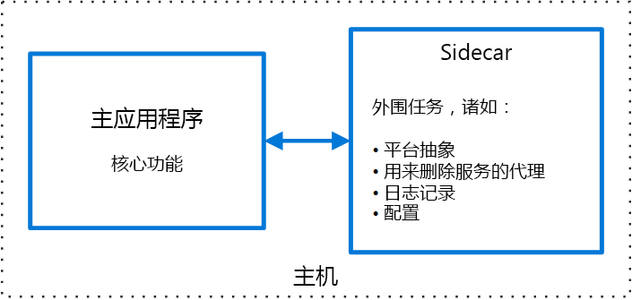

# 挎斗模式Sidecar pattern

将应用程序的组件部署到单独的进程或容器中，以提供隔离和封装。Deploy components of an application into a separate process or container to provide isolation and encapsulation. 使用此模式还可以使用异构组件和技术来构建应用程序。This pattern can also enable applications to be composed of heterogeneous components and technologies.

此模式之所以称作“挎斗”(Sidecar)，是因为它类似于三轮摩托车上的挎斗。This pattern is named *Sidecar* because it resembles a sidecar attached to a motorcycle. 在此模式中，挎斗附加到父应用程序，为应用程序提供支持性功能。In the pattern, the sidecar is attached to a parent application and provides supporting features for the application. 此外，挎斗与父应用程序具有相同的生命周期：与父应用程序一起创建，一起停用。The sidecar also shares the same lifecycle as the parent application, being created and retired alongside the parent. 挎斗模式有时也称为搭档模式，这是一种分解模式。The sidecar pattern is sometimes referred to as the sidekick pattern and is a decomposition pattern.

## 上下文和问题Context and Problem

应用程序和服务通常需要相关的功能，例如监视、日志记录、配置和网络服务。Applications and services often require related functionality, such as monitoring, logging, configuration, and networking services. 可以作为单独的组件或服务实现这些外围任务。These peripheral tasks can be implemented as separate components or services. 

如果这些功能已紧密集成到应用程序中，则可以在运行应用程序的同一个进程中运行这些功能，从而有效利用共享资源。If they are tightly integrated into the application, they can run in the same process as the application, making efficient use of shared resources. 但是，这也意味着无法对它们进行适当的隔离，其中一个组件发生故障就可能影响到其他组件甚至整个应用程序。However, this also means they are not well isolated, and an outage in one of these components can affect other components or the entire application. 此外，通常需要使用与父应用程序相同的语言来实现这些功能。Also, they usually need to be implemented using the same language as the parent application. 因此，组件和应用程序之间保持着密切的相互依赖关系。As a result, the component and the application have close interdependence on each other.

如果应用程序已分解为服务，则可以使用不同的语言和技术构建每个服务。If the application is decomposed into services, then each service can be built using different languages and technologies. 尽管这提高了灵活性，但同时也意味着，每个组件具有自身的依赖关系，需要使用特定于语言的库来访问底层平台，以及与父应用程序共享的所有资源。While this gives more flexibility, it means that each component has its own dependencies and requires language-specific libraries to access the underlying platform and any resources shared with the parent application. 此外，将这些功能部署为单独的服务可能会增大应用程序的延迟。In addition, deploying these features as separate services can add latency to the application. 管理这些特定于语言的接口的代码和依赖关系还可能会显著增大复杂性，尤其是托管、部署和管理的复杂性。Managing the code and dependencies for these language-specific interfaces can also add considerable complexity, especially for hosting, deployment, and management.

## 解决方案Solution

将一组内聚性的任务与主应用程序放在一起，不过，要将它们放在其自身的进程或容器内，以便为跨语言的平台服务提供同构接口。Co-locate a cohesive set of tasks with the primary application, but place them inside their own process or container, providing a homogeneous interface for platform services across languages. 

挎斗服务不一定要属于应用程序的一部分，而只是与应用程序相连接。A sidecar service is not necessarily part of the application, but is connected to it. 不管它位于哪个位置，父应用程序都会跟随。It goes wherever the parent application goes. 挎斗是连同主应用程序一起部署的支持性进程或服务。Sidecars are supporting processes or services that are deployed with the primary application. 以三轮摩托车为例，挎斗附加在一辆三轮摩托车上，每辆三轮摩托车有自身的挎斗。On a motorcycle, the sidecar is attached to one motorcycle, and each motorcycle can have its own sidecar. 同样，挎斗服务与其父应用程序具有相同的生命周期。In the same way, a sidecar service shares the fate of its parent application. 对于应用程序的每个实例，都会部署一个挎斗实例，并连同应用程序实例一起托管该挎斗实例。For each instance of the application, an instance of the sidecar is deployed and hosted alongside it. 

使用挎斗模式的好处包括：Advantages of using a sidecar pattern include:

- 在运行时环境和编程语言方面，挎斗与其主应用程序相互独立，因此，无需为每种语言开发一个挎斗。A sidecar is independent from its primary application in terms of runtime environment and programming language, so you don't need to develop one sidecar per language. 

- 挎斗可以访问主应用程序所能访问的资源。The sidecar can access the same resources as the primary application. 例如，一个挎斗可以监视该挎斗和主应用程序使用的系统资源。For example, a sidecar can monitor system resources used by both the sidecar and the primary application. 

- 挎斗与主应用程序保持密切的距离，因此两者之间的通信不存在明显的延迟。Because of its proximity to the primary application, there’s no significant latency when communicating between them.

- 即使是对于不提供扩展性机制的应用程序，也仍可以使用挎斗来扩展功能，只需在主应用程序所用的同一主机或子容器中，将挎斗附加为自身的进程即可。Even for applications that don’t provide an extensibility mechanism, you can use a sidecar to extend functionality by attaching it as own process in the same host or sub-container as the primary application.

挎斗模式通常与容器一起使用，因而称作挎斗容器或搭档容器。The sidecar pattern is often used with containers and referred to as a sidecar container or sidekick container. 

## 问题和注意事项Issues and Considerations

- 请考虑部署服务、进程或容器时所用的部署和打包格式。Consider the deployment and packaging format you will use to deploy services, processes, or containers. 容器特别适合用于挎斗模式。Containers are particularly well suited to the sidecar pattern.
- 在设计挎斗服务时，请慎重决定进程间通信机制。When designing a sidecar service, carefully decide on the interprocess communication mechanism. 除非达不到性能要求，否则请尽量使用不区分语言或框架的技术。Try to use language- or framework-agnostic technologies unless performance requirements make that impractical.
- 在将功能放入挎斗之前，请考虑该功能是作为独立的服务还是更传统的守护程序运行更有利。Before putting functionality into a sidecar, consider whether it would work better as a separate service or a more traditional daemon.
- 此外，请考虑是否能够以库的形式或使用传统扩展机制实现功能。Also consider whether the functionality could be implemented as a library or using a traditional extension mechanism. 特定于语言的库可能提供更深度的集成和更少的网络开销。Language-specific libraries may have a deeper level of integration and less network overhead.

## 何时使用此模式When to Use this Pattern

在以下情况下使用此模式：Use this pattern when:

- 主应用程序使用一组异类语言和框架。Your primary application uses a heterogenous set of languages and frameworks. 使用不同框架以不同语言编写的应用程序可以使用挎斗服务中的某个组件。A component located in a sidecar service can be consumed by applications written in different languages using different frameworks.
- 某个组件由远程团队或不同的组织拥有。A component is owned by a remote team or a different organization.
- 某个组件或功能必须共置在应用程序所在的同一台主机上A component or feature must be co-located on the same host as the application
- 希望某个服务与主应用程序具有相同的整体生命周期，但同时又能独立更新该服务。You need a service that shares the overall lifecycle of your main application, but can be independently updated.
- 需要精细控制特定资源或组件的资源限制。You need fine-grained control over resource limits for a particular resource or component. 例如，想要限制特定组件使用的内存量。For example, you may want to restrict the amount of memory a specific component uses. 可将组件部署为挎斗，然后独立于主应用程序管理内存用量。You can deploy the component as a sidecar and manage memory usage independently of the main application.

此模式可能不适用于以下情况：This pattern may not be suitable:

- 当进程间通信需要优化时。When interprocess communication needs to be optimized. 父应用程序与挎斗服务之间的通信会产生一定的开销，执行调用时存在明显的延迟。Communication between a parent application and sidecar services includes some overhead, notably latency in the calls. 频繁通信的接口可能无法接受这种弊端。This may not be an acceptable trade-off for chatty interfaces.
- 在某些小型应用程序中，为每个实例部署挎斗服务所产生的资源开销会抵消隔离所带来的优势。For small applications where the resource cost of deploying a sidecar service for each instance is not worth the advantage of isolation.
- 当服务需要以不同于或独立于主应用程序的方式缩放时。When the service needs to scale differently than or independently from the main applications. 如果存在这种情况，将功能部署为独立的服务可能更好。If so, it may be better to deploy the feature as a separate service.

## 示例Example

挎斗模式适用于许多方案。The sidecar pattern is applicable to many scenarios. 一些常见示例：Some common examples:

- 基础结构 API。Infrastructure API. 基础结构开发团队创建了一个连同每个应用程序一起部署的服务，而不是特定于语言的客户端库，来访问基础结构。The infrastructure development team creates a service that's deployed alongside each application, instead of a language-specific client library to access the infrastructure. 该服务作为挎斗加载，为基础结构服务（包括日志记录、环境数据、配置存储、发现、运行状况检查和监视程序服务）提供一个公用层。The service is loaded as a sidecar and provides a common layer for infrastructure services, including logging, environment data, configuration store, discovery, health checks, and watchdog services. 挎斗还监视父应用程序的主机环境和进程（或容器），并将信息记录到集中式服务。The sidecar also monitors the parent application's host environment and process (or container) and logs the information to a centralized service.
- 管理 NGINX/HAProxy。Manage NGINX/HAProxy. 将 NGINX 与用于监视环境状态的挎斗服务一起部署，然后，在需要更改状态时更新 NGINX 配置文件并回收进程。Deploy NGINX with a sidecar service that monitors environment state, then updates the NGINX configuration file and recycles the process when a change in state is needed.
- 代表挎斗。Ambassador sidecar. 将[代表][ambassador]服务部署为挎斗。Deploy an [ambassador][ambassador] service as a sidecar. 应用程序通过代表发出调用，后者可处理日志记录、路由、断路、和其他连接相关功能。The application calls through the ambassador, which handles request logging, routing, circuit breaking, and other connectivity related features.
- 卸载代理。Offload proxy. 将 NGINX 代理放在 node.js 服务实例的前面，以便为服务提供静态文件内容。Place an NGINX proxy in front of a node.js service instance, to handle serving static file content for the service.

## 相关指南Related guidance

- [代表模式][ambassador][Ambassador pattern][ambassador]

[ambassador]: ./ambassador.md

