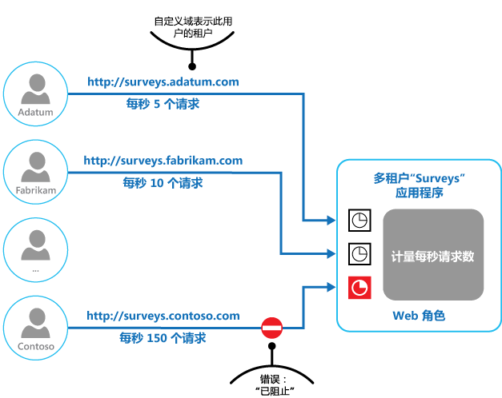

# 限制模式Throttling pattern

[!INCLUDE [header](../_includes/header.md)]

控制应用程序实例、单个租户或整个服务使用的资源的消耗。Control the consumption of resources used by an instance of an application, an individual tenant, or an entire service. 这样，即使需求增加给资源带来了极大的负载，系统也可以继续运行以满足服务级别协议。This can allow the system to continue to function and meet service level agreements, even when an increase in demand places an extreme load on resources.

## 上下文和问题Context and problem

云应用程序上的负载通常根据活动用户的数目或其执行的活动的类型随时间而变。The load on a cloud application typically varies over time based on the number of active users or the types of activities they are performing. 例如，在营业时间内可能有更多用户处于活动状态，而系统在每个月末可能需要执行计算成本高昂的分析。For example, more users are likely to be active during business hours, or the system might be required to perform computationally expensive analytics at the end of each month. 还可能会突然出现意外的活动量激增。There might also be sudden and unanticipated bursts in activity. 如果系统的处理要求超出了可用资源的容量，则系统性能将降低甚至会失败。If the processing requirements of the system exceed the capacity of the resources that are available, it'll suffer from poor performance and can even fail. 如果系统必须满足约定的服务级别，则这样的故障可能不可接受。If the system has to meet an agreed level of service, such failure could be unacceptable.

有许多策略可用于处理云中的各种负载，具体取决于应用程序的业务目标。There're many strategies available for handling varying load in the cloud, depending on the business goals for the application. 其中一个策略是使用自动缩放随时将预配的资源与用户需求进行匹配。One strategy is to use autoscaling to match the provisioned resources to the user needs at any given time. 这可以持续满足用户需求，同时优化运行成本。This has the potential to consistently meet user demand, while optimizing running costs. 不过，虽然自动缩放可以触发附加资源的预配，但此预配不是即时的。However, while autoscaling can trigger the provisioning of additional resources, this provisioning isn't immediate. 如果需求增长快速，则可能有一段时间会出现资源不足。If demand grows quickly, there can be a window of time where there's a resource deficit.

## 解决方案Solution

自动缩放的一个替代策略是仅允许应用程序使用某个限制内的资源，当达到该限制时会对资源进行限制。An alternative strategy to autoscaling is to allow applications to use resources only up to a limit, and then throttle them when this limit is reached. 系统应当监视其对资源的使用情况，以便在使用量超出阈值时可以限制来自一个或多个用户的请求。The system should monitor how it's using resources so that, when usage exceeds the threshold, it can throttle requests from one or more users. 这将使系统可以继续正常工作并满足所实施的所有服务级别协议 (SLA)。This will enable the system to continue functioning and meet any service level agreements (SLAs) that are in place. 有关监视资源使用情况的详细信息，请参阅[检测和遥测指南](https://msdn.microsoft.com/library/dn589775.aspx)。For more information on monitoring resource usage, see the [Instrumentation and Telemetry Guidance](https://msdn.microsoft.com/library/dn589775.aspx).

系统可以实现多个限制策略，包括：The system could implement several throttling strategies, including:

- 如果用户在给定时间段内访问系统 API 的频率超过了每秒 n 次，则拒绝来自该用户的请求。Rejecting requests from an individual user who's already accessed system APIs more than n times per second over a given period of time. 这要求系统对运行应用程序的每个租户或用户使用的资源量进行计量。This requires the system to meter the use of resources for each tenant or user running an application. 有关详细信息，请参阅 [Service Metering Guidance](https://msdn.microsoft.com/library/dn589796.aspx)（服务计量指南）。For more information, see the [Service Metering Guidance](https://msdn.microsoft.com/library/dn589796.aspx).

- 禁用所选非基本服务的功能或将其降级，以便基本服务可以使用充足的资源畅通运行。Disabling or degrading the functionality of selected nonessential services so that essential services can run unimpeded with sufficient resources. 例如，如果应用程序对视频输出进行流式处理，则可以切换到较低的分辨率。For example, if the application is streaming video output, it could switch to a lower resolution.

- 使用负载调节来均衡活动量（[基于队列的负载调节模式](queue-based-load-leveling.md)中更详细地介绍了此方法）。Using load leveling to smooth the volume of activity (this approach is covered in more detail by the [Queue-based Load Leveling pattern](queue-based-load-leveling.md)). 在多租户环境中，此方法会降低每个租户的性能。In a multi-tenant environment, this approach will reduce the performance for every tenant. 如果系统必须支持混合使用具有不同 SLA 的租户，则高值租户的工作可以立即执行。If the system must support a mix of tenants with different SLAs, the work for high-value tenants might be performed immediately. 其他租户的请求可以推迟，并在积压工作得到缓解时再进行处理。Requests for other tenants can be held back, and handled when the backlog has eased. 可以使用[优先级队列模式][]来帮助实现此方法。The [Priority Queue pattern][] could be used to help implement this approach.

- 推迟以低优先级应用程序或租户的身份执行的操作。Deferring operations being performed on behalf of lower priority applications or tenants. 可以暂停或限制这些操作，但是要生成一个异常来通知租户系统正忙并且应当稍后重试该操作。These operations can be suspended or limited, with an exception generated to inform the tenant that the system is busy and that the operation should be retried later.

下图显示了一个面积图，其中显示了使用三项功能的应用程序在一段时间内的资源使用情况（包括内存、CPU、带宽和其他因素）。The figure shows an area graph for resource use (a combination of memory, CPU, bandwidth, and other factors) against time for applications that are making use of three features. 一项功能是一个功能区域，例如，执行一组特定任务的组件、执行复杂计算的代码段，或者提供内存中缓存等服务的元素。A feature is an area of functionality, such as a component that performs a specific set of tasks, a piece of code that performs a complex calculation, or an element that provides a service such as an in-memory cache. 这些功能的标签为 A、B 和 C。These features are labeled A, B, and C.

> 代表某项功能的线条正下方的区域表示应用程序在调用此功能时使用的资源。The area immediately below the line for a feature indicates the resources that are used by applications when they invoke this feature. 例如，代表功能 A 的线条下方的区域显示了使用功能 A 的应用程序使用的资源，代表功能 A 和功能 B 的线条之间的区域表示调用功能 B 的应用程序使用的资源。将每个功能的区域聚合起来将显示系统的资源使用总量。For example, the area below the line for Feature A shows the resources used by applications that are making use of Feature A, and the area between the lines for Feature A and Feature B indicates the resources used by applications invoking Feature B. Aggregating the areas for each feature shows the total resource use of the system.

上图阐释了推迟操作的效果。The previous figure illustrates the effects of deferring operations. 恰好在时间 T1 之前，分配给使用这些功能的所有应用程序的资源达到了阈值（资源使用量限制）。Just prior to time T1, the total resources allocated to all applications using these features reach a threshold (the limit of resource use). 此时，这些应用程序处于耗尽可用资源的危险中。At this point, the applications are in danger of exhausting the resources available. 在此系统中，功能 B 没有功能 A 或功能 C 重要，因此已暂时将其禁用并释放其使用的资源。In this system, Feature B is less critical than Feature A or Feature C, so it's temporarily disabled and the resources that it was using are released. 在时间 T1 和 T2 之间，使用功能 A 和功能 C 的应用程序继续正常运行。Between times T1 and T2, the applications using Feature A and Feature C continue running as normal. 最终，这两项功能的资源使用量降低，到时间 T2 时已有足够的容量使功能 B 重新运行。Eventually, the resource use of these two features diminishes to the point when, at time T2, there is sufficient capacity to enable Feature B again.

还可以组合使用自动缩放和限制方法来帮助保持应用程序的响应能力并满足 SLA。The autoscaling and throttling approaches can also be combined to help keep the applications responsive and within SLAs. 如果预计需求会保持在高位，则在系统横向扩展期间，限制是一种临时解决方案。此时，可以还原系统的完整功能。If the demand is expected to remain high, throttling provides a temporary solution while the system scales out. At this point, the full functionality of the system can be restored.

下图显示了一个面积图，其中显示了在系统中运行的所有应用程序在一段时间内使用的总体资源，并且展示了可以如何将限制与自动缩放组合使用。The next figure shows an area graph of the overall resource use by all applications running in a system against time, and illustrates how throttling can be combined with autoscaling.

在时间 T1，达到了指定了资源使用量软限制的阈值。At time T1, the threshold specifying the soft limit of resource use is reached. 此时，系统可以开始横向扩展。不过，如果新资源没有足够快速地变得可用，则可能会耗尽现有资源，并且系统可能会失败。At this point, the system can start to scale out. However, if the new resources don't become available quickly enough, then the existing resources might be exhausted and the system could fail. 为防止发生此情况，会暂时对系统进行限制，如上文所述。To prevent this from occurring, the system is temporarily throttled, as described earlier. 当自动缩放已完成并且附加的资源可用时，可以放宽限制。When autoscaling has completed and the additional resources are available, throttling can be relaxed.

## 问题和注意事项Issues and considerations

在决定如何实现此模式时，应考虑以下几点：You should consider the following points when deciding how to implement this pattern:

- 限制应用程序和要使用的策略是一个体系结构决策，它影响系统的整体设计。Throttling an application, and the strategy to use, is an architectural decision that impacts the entire design of a system. 在应用程序设计过程中应尽早考虑采用限制功能，因为在实施系统后不容易添加此功能。Throttling should be considered early in the application design process because it isn't easy to add once a system has been implemented.

- 限制必须快速执行。Throttling must be performed quickly. 系统必须能够检测活动量增加并相应地作出反应。The system must be capable of detecting an increase in activity and react accordingly. 在负载减轻后，系统还必须能够快速恢复其原始状态。The system must also be able to revert to its original state quickly after the load has eased. 这需要持续捕获并监视相应的性能数据。This requires that the appropriate performance data is continually captured and monitored.

- 如果某个服务需要暂时拒绝用户请求，则它应当返回一个特定的错误代码，以便客户端应用程序能够了解拒绝执行操作的原因是由于受到限制。If a service needs to temporarily deny a user request, it should return a specific error code so the client application understands that the reason for the refusal to perform an operation is due to throttling. 客户端应用程序可以等待一段时间，然后重试请求。The client application can wait for a period before retrying the request.

- 在系统进行自动缩放期间，可以使用限制作为临时措施。Throttling can be used as a temporary measure while a system autoscales. 在某些情况下，如果活动量激增是突发性的并且预计不会持续太长时间，则仅进行限制而不进行缩放会更好，因为缩放可能会大大增加运行成本。In some cases it's better to simply throttle, rather than to scale, if a burst in activity is sudden and isn't expected to be long lived because scaling can add considerably to running costs.

- 如果在系统进行自动缩放期间使用限制作为临时措施，并且资源需求增长非常快速，则&mdash;即使在受限制模式下运行，系统也可能无法继续正常工作。If throttling is being used as a temporary measure while a system autoscales, and if resource demands grow very quickly, the system might not be able to continue functioning&mdash;even when operating in a throttled mode. 如果这不可接受，请考虑维护更大的容量预留并配置更积极的自动缩放。If this isn't acceptable, consider maintaining larger capacity reserves and configuring more aggressive autoscaling.

## 何时使用此模式When to use this pattern

使用此模式：Use this pattern:

- 确保系统继续满足服务级别协议。To ensure that a system continues to meet service level agreements.

- 防止单个租户独占应用程序提供的资源。To prevent a single tenant from monopolizing the resources provided by an application.

- 处理活动量激增。To handle bursts in activity.

- 通过限制使系统保持正常运行所需的最大资源级别，帮助对系统进行成本优化。To help cost-optimize a system by limiting the maximum resource levels needed to keep it functioning.

## 示例Example

最后一图展示了如何在多租户系统中实现限制。The final figure illustrates how throttling can be implemented in a multi-tenant system. 每个租户组织中的用户访问云托管的应用程序，并且在其中填写并提交调查。Users from each of the tenant organizations access a cloud-hosted application where they fill out and submit surveys. 应用程序包含检测机制，用以监视这些用户向应用程序提交请求的速率。The application contains instrumentation that monitors the rate at which these users are submitting requests to the application.

为了防止一个租户中的用户影响应用程序对所有其他用户的响应能力和可用性，可以针对任何一个租户中的用户每秒可以提交的请求数施加限制。In order to prevent the users from one tenant affecting the responsiveness and availability of the application for all other users, a limit is applied to the number of requests per second the users from any one tenant can submit. 应用程序会阻止超出了此限制的请求。The application blocks requests that exceed this limit.

## 相关模式和指南Related patterns and guidance

实现此模式时，以下模式和指南也可能相关：The following patterns and guidance may also be relevant when implementing this pattern:
- [检测和遥测指南](https://msdn.microsoft.com/library/dn589775.aspx)。[Instrumentation and Telemetry Guidance](https://msdn.microsoft.com/library/dn589775.aspx). 若要进行限制，需要收集关于服务使用程度的信息。Throttling depends on gathering information about how heavily a service is being used. 介绍了如何生成和捕获自定义监视信息。Describes how to generate and capture custom monitoring information.
- [服务计量指南](https://msdn.microsoft.com/library/dn589796.aspx)。[Service Metering Guidance](https://msdn.microsoft.com/library/dn589796.aspx). 介绍了如何计量服务使用量以便了解它们的使用情况。Describes how to meter the use of services in order to gain an understanding of how they are used. 此信息可以用于确定如何对服务进行限制。This information can be useful in determining how to throttle a service.
- [自动缩放指南](https://msdn.microsoft.com/library/dn589774.aspx)。[Autoscaling Guidance](https://msdn.microsoft.com/library/dn589774.aspx). 可以将限制用作系统进行自动缩放期间的临时措施，或者使用它消除系统进行自动缩放的需求。Throttling can be used as an interim measure while a system autoscales, or to remove the need for a system to autoscale. 包含了关于自动缩放策略的信息。Contains information on autoscaling strategies.
- [基于队列的负载调节模式](queue-based-load-leveling.md)。[Queue-based Load Leveling pattern](queue-based-load-leveling.md). 基于队列的负载调节是用于实现限制的常用机制。Queue-based load leveling is a commonly used mechanism for implementing throttling. 队列可以充当缓冲区，用以帮助稳定将应用程序发送的请求提交到服务的速率。A queue can act as a buffer that helps to even out the rate at which requests sent by an application are delivered to a service.
- [优先级队列模式][]。[Priority Queue pattern][]. 系统可以使用优先级队列作为其限制策略的一部分来保持关键或高值应用程序的性能，同时降低不太重要的应用程序的性能。A system can use priority queuing as part of its throttling strategy to maintain performance for critical or higher value applications, while reducing the performance of less important applications.

[优先级队列模式]: priority-queue.md