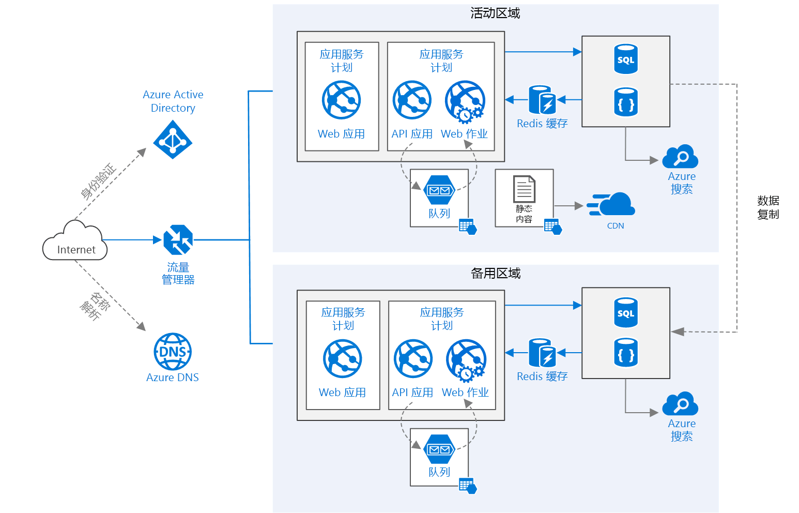

# <a name="run-a-web-application-in-multiple-regions"></a>在多个区域中运行 Web 应用程序
[!INCLUDE [header](../../_includes/header.md)]

此参考体系结构展示了如何在多个区域中运行 Azure 应用服务应用程序以实现高可用性。 

 

下载此体系结构的 [Visio 文件][visio-download]。

## <a name="architecture"></a>体系结构 

此体系结构基于[提高 Web 应用程序中的可伸缩性][guidance-web-apps-scalability]中显示的体系结构。 它们的主要区别包括：

* **主要和次要区域**。 此体系结构使用两个区域来实现更高的可用性。 应用程序部署到每个区域。 在正常运行期间，网络流量被路由到主要区域。 如果主要区域变得不可用，则流量将被路由到次要区域。 
* **Azure DNS**。 [Azure DNS][azure-dns] 是 DNS 域的托管服务，它使用 Microsoft Azure 基础结构提供名称解析。 通过在 Azure 中托管域，可以使用与其他 Azure 服务相同的凭据、API、工具和计费来管理 DNS 记录。
* **Azure 流量管理器**。 [流量管理器][traffic-manager]将传入请求路由到主要区域。 如果在该区域中运行的应用程序变得不可用，则流量管理器将故障转移到次要区域。
* SQL 数据库和 Cosmos DB 的**异地复制**。 

与部署到单个区域相比，多区域体系结构可以提供更高的可用性。 如果区域性故障影响了主要区域，则可以使用[流量管理器][traffic-manager]故障转移到次要区域。 当应用程序的单个子系统出现故障时，此体系结构可能也比较有用。

有多种常规方法可跨区域实现高可用性： 

* 主动/被动（采用热备用模式）。 流量将前往一个区域，而另一个区域将以热备用模式等待。 “热备用模式”意味着次要区域中的 VM 已被分配并总是处于运行状态。
* 主动/被动（采用冷备用模式）。 流量将前往一个区域，而另一个区域将以冷备用模式等待。 “冷备用模式”意味着次要区域中的 VM 不会被分配，直到故障转移需要它们。 此方法的运行成本较低，但是当发生故障时通常需要花费更长时间才能联机。
* 主动/主动。 两个区域都处于活动状态，并且会在它们之间对请求进行负载均衡。 如果一个区域变得不可用，则不再使其参与轮换。 

此参考体系结构侧重于“主动/被动（采用热备用模式）”，使用流量管理器进行故障转移。 


## <a name="recommendations"></a>建议

你的要求可能不同于此处描述的体系结构。 请使用本部分中的建议作为入手点。

### <a name="regional-pairing"></a>区域配对
每个 Azure 区域都与同一地域内的另一个区域配对。 通常，请选择同一区域对中的区域（例如“美国东部 2”和“美国中部”）。 这样做的好处包括：

* 如果发生大范围的故障，会优先恢复每个区域对中的至少一个区域。
* 计划内 Azure 系统更新会按顺序提供给配对的区域，以尽可能减少停机时间。
* 在多数情况下，区域对位于同一地域内以满足数据驻留要求。

但请确保两个区域都支持应用程序所需的所有 Azure 服务。 请参阅[每个区域的服务][services-by-region]。 有关区域对的详细信息，请参阅[业务连续性和灾难恢复 (BCDR)：Azure 配对区域][regional-pairs]。

### <a name="resource-groups"></a>资源组
考虑将主要区域、次要区域和流量管理器放置到单独的[资源组][resource groups]中。 这允许你将部署到每个区域的资源作为单个集合进行管理。

### <a name="traffic-manager-configuration"></a>流量管理器配置 

**路由**。 流量管理器支持多个[路由算法][tm-routing]。 对于本文中所述的情况，请使用“优先级”路由（以前称为“故障转移”路由）。 使用此设置时，流量管理器将所有请求都发送到主要区域，除非该区域的终结点变得无法访问。 那时，它将自动故障转移到次要区域。 请参阅[配置故障转移路由方法][tm-configure-failover]。

**运行状况探测**。 流量管理器使用 HTTP（或 HTTPS）探测来监视每个终结点的可用性。 探测为流量管理器提供了一个通过/失败测试以用于故障转移到次要区域。 它通过将请求发送到指定的 URL 路径来执行工作。 如果它在超时期间内收到一个非-200 响应，则探测失败。 在出现四个失败的请求后，流量管理器会将该终结点标记为已降级并故障转移到另一终结点。 有关详细信息，请参阅[流量管理器终结点监视和故障转移][tm-monitoring]。

作为最佳做法，请创建一个运行状况探测终结点，用以报告应用程序的整体运行状况，并使用此终结点进行运行状况探测。 此终结点应当检查关键依赖项，例如应用服务应用、存储队列和 SQL 数据库。 否则，探测可能会在应用程序的关键部分实际上已出现故障时报告终结点运行状况正常。

另一方面，请不要使用运行状况探测来检查较低优先级的服务。 例如，如果某个电子邮件服务发生故障，则应用程序可以切换到辅助提供程序或者只是稍后再发送电子邮件。 这不是一个足够高的优先级，不会导致应用程序进行故障转移。 有关详细信息，请参阅[运行状况终结点监视模式][health-endpoint-monitoring-pattern]。
 
### <a name="sql-database"></a>SQL 数据库
使用[活动异地复制][sql-replication]在一个不同的区域中创建可读取的次要副本。 最多可以有四个可读取的次要副本。 如果主数据库失败或者需要使其脱机，请故障转移到辅助数据库。 可以为任何弹性数据库池中的任何数据库配置活动异地复制。

### <a name="cosmos-db"></a>Cosmos DB
Cosmos DB 支持跨区域的异地复制。 一个区域被指定为可写入的，其他区域是只读副本。

如果发生区域性中断，可以通过选择另一个区域作为写入区域来进行故障转移。 客户端 SDK 会自动将写入请求发送到当前写入区域，因此，在故障转移后不需要更新客户端配置。 有关详细信息，请参阅[如何使用 Azure Cosmos DB 进行全局数据分配][cosmosdb-geo]。

> [!NOTE]
> 所有副本都属于同一资源组。
>
>

### <a name="storage"></a>存储
对于 Azure 存储，请使用[读取访问异地冗余存储][ra-grs] (RA-GRS)。 使用 RA-GRS 存储时，数据被复制到次要区域。 你可以通过一个单独的终结点以只读方式访问次要区域中的数据。 如果发生区域性中断或灾难，则 Azure 存储团队可以决定执行到次要区域的异地故障转移。 客户不需要为此故障转移执行任何操作。

对于队列存储，请在次要区域中创建一个备份队列。 在故障转移期间，应用可以使用备份队列，直到主要区域变得重新可用。 这样，应用程序仍可处理新请求。

## <a name="availability-considerations"></a>可用性注意事项


### <a name="traffic-manager"></a>流量管理器

如果主要区域变得不可用，则流量管理器将自动进行故障转移。 当流量管理器进行故障转移时，一段时间内客户端无法访问应用程序。 持续时间受以下因素影响：

* 运行状况探测必须检测主数据中心是否已变得无法访问。
* 域名服务 (DNS) 服务器必须更新 IP 地址的已缓存 DNS 记录，这取决于 DNS 生存时间 (TTL)。 默认 TTL 为 300 秒（5 分钟），但可以在创建流量管理器配置文件时配置此值。

相关详细信息，请参阅[关于流量管理器监视][tm-monitoring]。

流量管理器是系统中的一个潜在故障点。 如果服务出现故障，则客户端在停机期间无法访问应用程序。 查看[流量管理器服务级别协议 (SLA)][tm-sla]，然后确定仅使用流量管理器是否能满足业务对高可用性的需求。 如果不能，请考虑添加另一个流量管理解决方案作为故障回复机制。 如果 Azure 流量管理器服务出现故障，请将 DNS 中的规范名称 (CNAME) 记录更改为指向另一个流量管理服务。 此步骤必须手动执行，并且在 DNS 更改被传播之前，应用程序将不可用。

### <a name="sql-database"></a>SQL 数据库
[使用 Azure SQL 数据库确保业务连续性的相关概述][sql-rpo]中介绍了 SQL 数据库的恢复点目标 (RPO) 和估计恢复时间 (ERT)。 

### <a name="storage"></a>存储
RA-GRS 存储提供了持久性存储，但请务必了解在中断期间可能会发生什么情况：

* 如果发生存储中断，则在一段时间内无法对数据进行写入访问。 在中断期间，仍然可以从辅助终结点读取数据。
* 如果区域性故障或灾难影响了主位置并且无法从那里恢复数据，则 Azure 存储团队可以决定执行到次要区域的异地故障转移。
* 到次要区域的数据复制是以异步方式执行的。 因此，如果执行异地故障转移，并且无法从主要区域中恢复数据，则可能会丢失一些数据。
* 暂时性故障（例如网络中断）不会触发存储故障转移。 设计应用程序时请使其能够在发生暂时性故障时进行复原。 可能的缓解措施：
  
  * 从次要区域中进行读取。
  * 临时切换到另一存储帐户来执行新的写入操作（例如将消息排入队列）。
  * 将数据从次要区域复制到另一个存储帐户。
  * 提供降低的功能，直到系统完成故障回复。

有关详细信息，请参阅[在 Azure 存储中断时该怎么办][storage-outage]。

## <a name="manageability-considerations"></a>可管理性注意事项

### <a name="traffic-manager"></a>流量管理器

如果流量管理器进行故障转移，我们建议执行手动故障回复，而不是实施自动故障回复。 否则，可能会造成应用程序在区域之间来回转移的情况。 在进行故障回复之前，请验证是否所有应用程序子系统的运行状况都正常。

请注意，默认情况下，流量管理器会自动进行故障回复。 若要禁止此操作，请在发生故障转移事件后手动降低主要区域的优先级。 例如，假设主要区域的优先级为 1，次要区域的优先级为 2。 在故障转移后，请将主要区域的优先级设置为 3，以禁止自动故障回复。 当准备好切换回来时，请将优先级更新为 1。

以下命令用于更新优先级。

**PowerShell**

```bat
$endpoint = Get-AzureRmTrafficManagerEndpoint -Name <endpoint> -ProfileName <profile> -ResourceGroupName <resource-group> -Type AzureEndpoints
$endpoint.Priority = 3
Set-AzureRmTrafficManagerEndpoint -TrafficManagerEndpoint $endpoint
```

有关详细信息，请参阅 [Azure 流量管理器 Cmdlet][tm-ps]。

**Azure 命令行界面 (CLI)**

```bat
azure network traffic-manager endpoint set --name <endpoint> --profile-name <profile> --resource-group <resource-group> --type AzureEndpoints --priority 3
```    

### <a name="sql-database"></a>SQL 数据库
如果主数据库发生故障，请执行到辅助数据库的手动故障转移。 请参阅[还原 Azure SQL 数据库或故障转移到辅助数据库][sql-failover]。 在进行故障转移之前，辅助数据库将保持只读状态。


<!-- links -->

[azure-sql-db]: https://azure.microsoft.com/documentation/services/sql-database/
[azure-dns]: /azure/dns/dns-overview
[cosmosdb-geo]: /azure/cosmos-db/distribute-data-globally
[guidance-web-apps-scalability]: ./scalable-web-app.md
[health-endpoint-monitoring-pattern]: https://msdn.microsoft.com/library/dn589789.aspx
[ra-grs]: /azure/storage/storage-redundancy#read-access-geo-redundant-storage
[regional-pairs]: /azure/best-practices-availability-paired-regions
[resource groups]: /azure/azure-resource-manager/resource-group-overview#resource-groups
[services-by-region]: https://azure.microsoft.com/regions/#services
[sql-failover]: /azure/sql-database/sql-database-disaster-recovery
[sql-replication]: /azure/sql-database/sql-database-geo-replication-overview
[sql-rpo]: /azure/sql-database/sql-database-business-continuity#sql-database-features-that-you-can-use-to-provide-business-continuity
[storage-outage]: /azure/storage/storage-disaster-recovery-guidance
[tm-configure-failover]: /azure/traffic-manager/traffic-manager-configure-failover-routing-method
[tm-monitoring]: /azure/traffic-manager/traffic-manager-monitoring
[tm-ps]: https://msdn.microsoft.com/library/mt125941.aspx
[tm-routing]: /azure/traffic-manager/traffic-manager-routing-methods
[tm-sla]: https://azure.microsoft.com/support/legal/sla/traffic-manager/v1_0/
[traffic-manager]: https://azure.microsoft.com/services/traffic-manager/
[visio-download]: https://archcenter.azureedge.net/cdn/app-service-reference-architectures.vsdx
