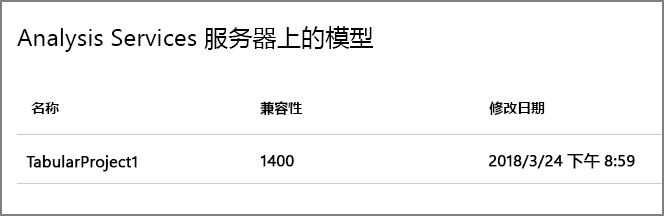
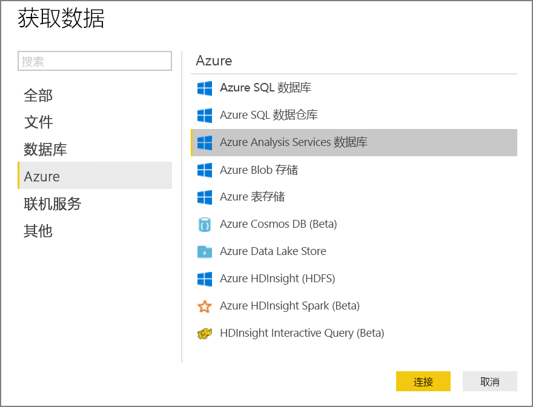

# <a name="automated-enterprise-bi-with-sql-data-warehouse-and-azure-data-factory"></a>将自动化企业 BI 与 SQL 数据仓库和 Azure 数据工厂配合使用

此参考体系结构演示如何在 [ELT](../../data-guide/relational-data/etl.md#extract-load-and-transform-elt)（提取-加载-转换）管道中执行增量加载。 它使用 Azure 数据工厂将 ELT 管道自动化。 该管道以增量方式将最新的 OLTP 数据从本地 SQL Server 数据库移入 SQL 数据仓库。 事务数据将转换为表格模型以供分析。 [**部署此解决方案**。](#deploy-the-solution)


此体系结构构建在[企业 BI 与 SQL 数据仓库](./enterprise-bi-sqldw.md)中所述的体系结构基础之上，但添加了一些对企业数据仓库方案而言非常重要的功能。

-   使用数据工厂将管道自动化。
-   增量加载。
-   集成多个数据源。
-   加载地理空间数据和图像等二进制数据。

## <a name="architecture"></a>体系结构

该体系结构包括以下组件。

### <a name="data-sources"></a>数据源

**本地 SQL Server**。 源数据位于本地的 SQL Server 数据库中。 为了模拟本地环境，此体系结构的部署脚本将在 Azure 中预配一个装有 SQL Server 的虚拟机。 [Wide World Importers OLTP 示例数据库][wwi] 用作源数据库。

**外部数据**。 数据仓库的常见方案是集成多个数据源。 此参考体系结构加载一个包含不同年份的城市人口的外部数据集，并将它与 OLTP 数据库中的数据集成。 可以使用此数据获取如下所述的见解：“每个区域的销量增长率是否达到或超过人口增长率？”

### <a name="ingestion-and-data-storage"></a>引入和数据存储

**Blob 存储**。 Blob 存储用作临时区域，在将源数据载入 SQL 数据仓库之前，会在此区域中存储这些数据。

**Azure SQL 数据仓库**。 [SQL 数据仓库](/azure/sql-data-warehouse/)是分布式系统，旨在对大型数据执行分析。 它支持大规模并行处理 (MPP)，因此很适合用于运行高性能分析。 

**Azure 数据工厂** [数据工厂][adf] 是一个托管服务，用于协调和自动化数据的移动与转换。 在此体系结构中，数据工厂协调 ELT 过程的各个阶段。

### <a name="analysis-and-reporting"></a>分析和报告

**Azure Analysis Services**。 [Analysis Services](/azure/analysis-services/) 是提供数据建模功能的完全托管服务。 语义模型将载入 Analysis Services。

**Power BI**。 Power BI 是一套商业分析工具，用于分析数据以获取商业见解。 在此体系结构中，Power BI 查询 Analysis Services 中存储的语义模型。

### <a name="authentication"></a>身份验证

**Azure Active Directory** (Azure AD) 通过 Power BI 对连接到 Analysis Services 服务器的用户进行身份验证。

数据工厂还可以使用服务主体或托管服务标识 (MSI)，通过 Azure AD 对 SQL 数据仓库进行身份验证。 为简单起见，示例部署使用了 SQL Server 身份验证。

## <a name="data-pipeline"></a>数据管道

在 [Azure 数据工厂][adf] 中，管道是用于协调某个任务的活动的逻辑分组 &mdash; 在本例中，该任务是将数据载入 SQL 数据仓库并对其进行转换。 

此参考体系结构定义一个运行一系列子管道的主管道。 每个子管道将数据载入一个或多个数据仓库表。


## <a name="incremental-loading"></a>增量加载

运行自动化的 ETL 或 ELT 过程时，最有效的做法是仅加载自上次运行以来已发生更改的数据。 这称为“增量加载”，相对于加载所有数据的“完全加载”。 若要执行增量加载，需要通过某种方式来识别哪些数据已更改。 最常用的方法是使用高水印值，即，跟踪源表中某个列的最新值：日期时间列，或唯一整数列。 

从 SQL Server 2016 开始，可以使用[时态表](/sql/relational-databases/tables/temporal-tables)。 这些表的版本受系统控制，可保留数据更改的完整历史记录。 数据库引擎会在单独的历史记录表中自动记录每项更改的历史记录。 可以通过将 FOR SYSTEM_TIME 子句添加到查询，来查询历史数据。 在内部，数据库引擎会查询历史记录表，但此操作对于应用程序而言是透明的。 

> [!NOTE]
> 对于早期版本的 SQL Server，可以使用[变更数据捕获](/sql/relational-databases/track-changes/about-change-data-capture-sql-server) (CDC)。 与时态表相比，此方法不够方便，因为必须查询单独的更改表，而更改是按日志序列号而不是时间戳跟踪的。 

时态表适用于随时可能更改的维度数据。 事实数据表通常代表不可变的事务（例如销量），在这种情况下，保留系统版本历史记录没有意义。 相反，事务通常具有一个表示事务日期的列，该日期可用作水印值。 例如，在 Wide World Importers OLTP 数据库中，Sales.Invoices 和 Sales.InvoiceLines 表具有一个默认值为 `sysdatetime()` 的 `LastEditedWhen` 字段。 

下面是 ELT 管道的常规流：

1. 针对源数据库中的每个表，跟踪最后一个 ELT 作业的运行截止时间。 将此信息存储在数据仓库中。 （在初始设置时，所有时间设置为“1-1-1900”。）

2. 在执行数据导出步骤期间，截止时间作为参数传递给源数据库中的一组存储过程。 这些存储过程会查询截止时间之后更改或创建的所有记录。 对于 Sales 事实数据表，使用 `LastEditedWhen` 列。 对于维度数据，使用版本由系统控制的时态表。

3. 完成数据迁移后，更新存储截止时间的表。

该表也可用于记录每个 ELT 轮次的沿袭。 对于给定的记录，该沿袭会将该记录与生成数据的 ELT 轮次相关联。 对于每个 ETL 轮次，将为每个表创建新的沿袭记录，其中显示起始和结束加载时间。 每个记录的沿袭键存储在维度表和事实数据表中。


将一批新数据载入仓库后，刷新 Analysis Services 表格模型。 请参阅[使用 REST API 执行异步刷新](/azure/analysis-services/analysis-services-async-refresh)。

## <a name="data-cleansing"></a>数据清理

数据清理应是 ELT 过程的一部分。 在此参考体系结构中，一个错误数据源是城市人口表，其中的某些城市人口为零，可能的原因是没有可用的数据。 在处理期间，ELT 管道会从城市人口表中删除这些城市。 针对临时表而不是外部表执行数据清理。

以下存储过程从城市人口表中删除人口为零的城市。 （可在[此处](https://github.com/mspnp/reference-architectures/blob/master/data/enterprise_bi_sqldw_advanced/azure/sqldw_scripts/citypopulation/%5BIntegration%5D.%5BMigrateExternalCityPopulationData%5D.sql)找到源文件。） 

```sql
DELETE FROM [Integration].[CityPopulation_Staging]
WHERE RowNumber in (SELECT DISTINCT RowNumber
FROM [Integration].[CityPopulation_Staging]
WHERE POPULATION = 0
GROUP BY RowNumber
HAVING COUNT(RowNumber) = 4)
```

## <a name="external-data-sources"></a>外部数据源

数据仓库通常合并多个源的数据。 此参考体系结构加载包含人口统计数据的外部数据源。 此数据集在 Azure Blob 存储中作为 [WorldWideImportersDW](https://github.com/Microsoft/sql-server-samples/tree/master/samples/databases/wide-world-importers/sample-scripts/polybase) 示例的一部分提供。

Azure 数据工厂可以使用 [Blob 存储连接器](/azure/data-factory/connector-azure-blob-storage)直接从 Blob 存储复制。 但是，连接器需要连接字符串或共享访问签名，因此它无法用于复制具有公共读取访问权限的 Blob。 解决方法之一是使用 PolyBase 创建基于 Blob 存储的外部表，然后将外部表复制到 SQL 数据仓库中。 

## <a name="handling-large-binary-data"></a>处理大型二进制数据 

在源数据库中，Cities 表包含一个 Location 列，该列保存了 [geography](/sql/t-sql/spatial-geography/spatial-types-geography) 空间数据类型。 SQL 数据仓库原生并不支持 **geography** 类型，因此，在加载期间，此字段将转换为 **varbinary** 类型。 （请参阅[适用于不支持的数据类型的解决方法](/azure/sql-data-warehouse/sql-data-warehouse-tables-data-types#unsupported-data-types)。）

但是，PolyBase 支持的最大列大小为 `varbinary(8000)`，这意味着某些数据可能会截断。 此问题的解决方法之一是在导出期间将数据分解为多个区块，然后重新汇编区块，如下所示：

1. 为 Location 列创建临时表。

2. 对于每个城市，将位置数据拆分为 8000 字节的区块，使每个城市具有 1 &ndash; N 行。

3. 若要重新汇编区块，请使用 T-SQL [PIVOT](/sql/t-sql/queries/from-using-pivot-and-unpivot) 运算符将行转换为列，然后连接每个城市的列值。

难点在于，需要根据地理数据的大小，将每个城市拆分为不同数量的行。 若要正常使用 PIVOT 运算符，每个城市的行数必须相同。 为此，T-SQL 查询（请查看 [此主题][MergeLocation]）会通过一些技法在行中填充空值，以便在透视后，每个城市的行数相同。 生成的查询比每次循环访问一行要快得多。

可对图像数据使用相同的方法。

## <a name="slowly-changing-dimensions"></a>缓慢变化的维度

维度数据相对而言是静态的，但仍可能发生变化。 例如，某个产品可能会重新分配到不同的产品类别。 可通过多种方法来处理缓慢变化的维度。 常用的方法称为[类型 2](https://wikipedia.org/wiki/Slowly_changing_dimension#Type_2:_add_new_row)，即，每当维度发生变化，就添加一条新记录。 

若要实现“类型 2”方法，维度表中需要包含附加的列，用于指定给定记录的有效日期范围。 此外，源数据库中的主键将会复制，因此，维度表必须包含一个人造主键。

下图显示了 Dimension.City 表。 `WWI City ID` 列是源数据库中的主键。 `City Key` 列是在运行 ETL 管道期间生成的人造键。 另请注意，该表包含 `Valid From` 和 `Valid To` 列，这些列定义每个行的有效时间范围。 当前值包含等于“9999-12-31”的 `Valid To`。


此方法的优势在于，它会保留历史数据，而这些数据对于分析可能非常有用。 但是，这也意味着，同一个实体存在多个行。 例如，以下记录与 `WWI City ID` = 28561 相匹配：


对于每个销售事实，需要将该事实与 City 维度表中对应于发票日期的单个行相关联。 在执行 ETL 过程期间，创建一个附加列 

以下 T-SQL 查询创建一个临时表，用于将每份发票与 City 维度表中的正确 City 键相关联。

```sql
CREATE TABLE CityHolder
WITH (HEAP , DISTRIBUTION = HASH([WWI Invoice ID]))
AS
SELECT DISTINCT s1.[WWI Invoice ID] AS [WWI Invoice ID],
                c.[City Key] AS [City Key]
    FROM [Integration].[Sale_Staging] s1
    CROSS APPLY (
                SELECT TOP 1 [City Key]
                    FROM [Dimension].[City]
                WHERE [WWI City ID] = s1.[WWI City ID]
                    AND s1.[Last Modified When] > [Valid From]
                    AND s1.[Last Modified When] <= [Valid To]
                ORDER BY [Valid From], [City Key] DESC
                ) c

```

此表用于填充 Sales 事实数据表中的列：

```sql
UPDATE [Integration].[Sale_Staging]
SET [Integration].[Sale_Staging].[WWI Customer ID] =  CustomerHolder.[WWI Customer ID]
```

Power BI 查询可以使用此列找到给定销售发票的正确 City 记录。

## <a name="security-considerations"></a>安全注意事项

为了提高安全性，可以使用[虚拟网络服务终结点](/azure/virtual-network/virtual-network-service-endpoints-overview)来保护 Azure 服务资源：只允许在你的虚拟网络中访问这些资源。 这可以完全避免通过公共 Internet 访问这些资源，只允许来自该虚拟网络的流量。

如果使用此方法，请在 Azure 中创建 VNet，并为 Azure 服务创建专用服务终结点。 然后，将这些服务限制为来自该虚拟网络的流量。 也可以通过网关从本地网络访问这些资源。

注意以下限制：

- 在创建此参考体系结构时，Azure 存储和 Azure SQL 数据仓库支持 VNet 服务终结点，但 Azure Analysis Service 则不支持此类终结点。 请在[此处](https://azure.microsoft.com/updates/?product=virtual-network)查看最新状态。 

- 如果为 Azure 存储启用了服务终结点，PolyBase 无法将数据从存储复制到 SQL 数据仓库。 此问题有一种缓解方法。 有关详细信息，请参阅[将 VNet 服务终结点与 Azure 存储配合使用的影响](/azure/sql-database/sql-database-vnet-service-endpoint-rule-overview?toc=%2fazure%2fvirtual-network%2ftoc.json#impact-of-using-vnet-service-endpoints-with-azure-storage)。 

- 若要将数据从本地移入 Azure 存储，需要将本地或 ExpressRoute 中的公共 IP 地址加入允许列表。 有关详细信息，请参阅[在虚拟网络中保护 Azure 服务](/azure/virtual-network/virtual-network-service-endpoints-overview#securing-azure-services-to-virtual-networks)。

- 若要允许 Analysis Services 从 SQL 数据仓库读取数据，请将一个 Windows VM 部署到包含 SQL 数据仓库服务终结点的虚拟网络。 在此 VM 上安装 [Azure 本地数据网关](/azure/analysis-services/analysis-services-gateway)。 然后将 Azure Analysis Services 连接到数据网关。

## <a name="deploy-the-solution"></a>部署解决方案

[GitHub][ref-arch-repo-folder] 中提供了此参考体系结构的部署。 它将部署以下部分：

  * 一个用于模拟本地数据库服务器的 Windows VM。 该 VM 包含 SQL Server 2017 和相关工具以及 Power BI Desktop。
  * 一个 Azure 存储帐户。该帐户提供 Blob 存储用于保存从 SQL Server 数据库导出的数据。
  * 一个 Azure SQL 数据仓库实例。
  * 一个 Azure Analysis Services 实例。
  * Azure 数据工厂和 ELT 作业的数据工厂管道。

### <a name="prerequisites"></a>先决条件

[!INCLUDE [ref-arch-prerequisites.md](../../../includes/ref-arch-prerequisites.md)]

### <a name="variables"></a>变量

以下步骤包括一些用户定义的变量。 需要将这些变量替换为定义的值。

- `<data_factory_name>`。 数据工厂名称。
- `<analysis_server_name>`。 Analysis Services 服务器名称。
- `<active_directory_upn>`。 Azure Active Directory 用户主体名称 (UPN)。 例如，`user@contoso.com`。
- `<data_warehouse_server_name>`。 SQL 数据仓库服务器名称。
- `<data_warehouse_password>`。 SQL 数据仓库管理员密码。
- `<resource_group_name>`。 资源组的名称。
- `<region>`。 部署资源的 Azure 区域。
- `<storage_account_name>`。 存储帐户名称。 必须遵循存储帐户的[命名规则](../../best-practices/naming-conventions.md#naming-rules-and-restrictions)。
- `<sql-db-password>`。 SQL Server 登录密码。

### <a name="deploy-azure-data-factory"></a>部署 Azure 数据工厂

1. 导航到 [GitHub 存储库][ref-arch-repo] 的 `data\enterprise_bi_sqldw_advanced\azure\templates` 文件夹。

2. 运行以下 Azure CLI 命令创建资源组。  

    ```bash
    az group create --name <resource_group_name> --location <region>  
    ```

    指定支持 SQL 数据仓库、Azure Analysis Services 和数据工厂 v2 的区域。 参阅 [Azure 产品（按区域）](https://azure.microsoft.com/global-infrastructure/services/)。

3. 运行以下命令

    ```
    az group deployment create --resource-group <resource_group_name> \
        --template-file adf-create-deploy.json \
        --parameters factoryName=<data_factory_name> location=<location>
    ```

接下来，使用 Azure 门户获取 Azure 数据工厂[集成运行时](/azure/data-factory/concepts-integration-runtime)的身份验证密钥，如下所示：

1. 在 [Azure 门户](https://portal.azure.com/)中，导航到数据工厂实例。

2. 在“数据工厂”边栏选项卡中，单击“创作和监视”。 此时会在另一个浏览器窗口中打开 Azure 数据工厂门户。

    

3. 在 Azure 数据工厂门户中，选择铅笔图标（“创作”）。 

4. 单击“连接”，然后选择“集成运行时”。

5. 在“sourceIntegrationRuntime”下，单击铅笔图标（“编辑”）。

    > [!NOTE]
    > 门户将显示“不可用”状态。 在部署本地服务器之前，这是预期的状态。

6. 找到“密钥 1”并复制身份验证密钥的值。

下一步骤需要用到此身份验证密钥。

### <a name="deploy-the-simulated-on-premises-server"></a>部署模拟的本地服务器

此步骤将 VM 部署为包含 SQL Server 2017 和相关工具的模拟本地服务器。 它还会将 [Wide World Importers OLTP 数据库][wwi] 载入 SQL Server。

1. 导航到存储库的 `data\enterprise_bi_sqldw_advanced\onprem\templates` 文件夹。

2. 在 `onprem.parameters.json` 文件中，搜索 `adminPassword`。 这是用于登录 SQL Server VM 的密码。 将值替换为另一个密码。

3. 在同一文件中，搜索 `SqlUserCredentials`。 此属性指定 SQL Server 帐户凭据。 将密码替换为其他值。

4. 在同一文件中，将 Integration Runtime 身份验证密钥粘贴到 `IntegrationRuntimeGatewayKey` 参数中，如下所示：

    ```json
    "protectedSettings": {
        "configurationArguments": {
            "SqlUserCredentials": {
                "userName": ".\\adminUser",
                "password": "<sql-db-password>"
            },
            "IntegrationRuntimeGatewayKey": "<authentication key>"
        }
    ```

5. 运行以下命令。

    ```bash
    azbb -s <subscription_id> -g <resource_group_name> -l <region> -p onprem.parameters.json --deploy
    ```

此步骤可能需要 20 到 30 分钟才能完成。 整个过程包括运行 [DSC](/powershell/dsc/overview) 脚本来安装工具和还原数据库。 

### <a name="deploy-azure-resources"></a>部署 Azure 资源

此步骤预配 SQL 数据仓库、Azure Analysis Services 和数据工厂。

1. 导航到 [GitHub 存储库][ref-arch-repo] 的 `data\enterprise_bi_sqldw_advanced\azure\templates` 文件夹。

2. 运行以下 Azure CLI 命令。 替换尖括号中显示的参数值。

    ```bash
    az group deployment create --resource-group <resource_group_name> \
     --template-file azure-resources-deploy.json \
     --parameters "dwServerName"="<data_warehouse_server_name>" \
     "dwAdminLogin"="adminuser" "dwAdminPassword"="<data_warehouse_password>" \ 
     "storageAccountName"="<storage_account_name>" \
     "analysisServerName"="<analysis_server_name>" \
     "analysisServerAdmin"="<user@contoso.com>"
    ```

    - `storageAccountName` 参数必须后接存储帐户的[命名规则](../../best-practices/naming-conventions.md#naming-rules-and-restrictions)。 
    - 对于 `analysisServerAdmin` 参数，请使用 Azure Active Directory 用户主体名称 (UPN)。

3. 运行以下 Azure CLI 命令，获取存储帐户的访问密钥。 下一步骤中将会用到此密钥。

    ```bash
    az storage account keys list -n <storage_account_name> -g <resource_group_name> --query [0].value
    ```

4. 运行以下 Azure CLI 命令。 替换尖括号中显示的参数值。 

    ```bash
    az group deployment create --resource-group <resource_group_name> \
    --template-file adf-pipeline-deploy.json \
    --parameters "factoryName"="<data_factory_name>" \
    "sinkDWConnectionString"="Server=tcp:<data_warehouse_server_name>.database.windows.net,1433;Initial Catalog=wwi;Persist Security Info=False;User ID=adminuser;Password=<data_warehouse_password>;MultipleActiveResultSets=False;Encrypt=True;TrustServerCertificate=False;Connection Timeout=30;" \
    "blobConnectionString"="DefaultEndpointsProtocol=https;AccountName=<storage_account_name>;AccountKey=<storage_account_key>;EndpointSuffix=core.windows.net" \
    "sourceDBConnectionString"="Server=sql1;Database=WideWorldImporters;User Id=adminuser;Password=<sql-db-password>;Trusted_Connection=True;"
    ```

    连接字符串包含尖括号中所示的子字符串，必须替换这些子字符串。 对于 `<storage_account_key>`，请使用上一步骤中获取的密钥。 对于 `<sql-db-password>`，请使用前面在 `onprem.parameters.json` 文件中指定的 SQL Server 帐户密码。

### <a name="run-the-data-warehouse-scripts"></a>运行数据仓库脚本

1. 在 [Azure 门户](https://portal.azure.com/)中，找到名为 `sql-vm1` 的本地 VM。 VM 的用户名和密码已在 `onprem.parameters.json` 文件中指定。

2. 单击“连接”，使用远程桌面连接到 VM。

3. 在远程桌面会话中打开命令提示符，并导航到 VM 上的以下文件夹：

    ```
    cd C:\SampleDataFiles\reference-architectures\data\enterprise_bi_sqldw_advanced\azure\sqldw_scripts
    ```

4. 运行以下命令：

    ```
    deploy_database.cmd -S <data_warehouse_server_name>.database.windows.net -d wwi -U adminuser -P <data_warehouse_password> -N -I
    ```

    对于 `<data_warehouse_server_name>` 和 `<data_warehouse_password>`，请使用前面指定的数据仓库服务器名称和密码。

若要验证此步骤，可以使用 SQL Server Management Studio (SSMS) 连接到 SQL 数据仓库数据库。 应会看到数据库表架构。

### <a name="run-the-data-factory-pipeline"></a>运行数据工厂管道

1. 在同一远程桌面会话中，打开 PowerShell 窗口。

2. 运行以下 PowerShell 命令。 出现提示时选择“是”。

    ```powershell
    Install-Module -Name AzureRM -AllowClobber
    ```

3. 运行以下 PowerShell 命令。 在系统提示时输入 Azure 凭据。

    ```powershell
    Connect-AzureRmAccount 
    ```

4. 运行以下 PowerShell 命令。 替换尖括号中的值。

    ```powershell
    Set-AzureRmContext -SubscriptionId <subscription id>

    Invoke-AzureRmDataFactoryV2Pipeline -DataFactory <data-factory-name> -PipelineName "MasterPipeline" -ResourceGroupName <resource_group_name>

5. In the Azure Portal, navigate to the Data Factory instance that was created earlier.

6. In the Data Factory blade, click **Author & Monitor**. This opens the Azure Data Factory portal in another browser window.

    

7. In the Azure Data Factory portal, click the **Monitor** icon. 

8. Verify that the pipeline completes successfully. It can take a few minutes.

    


## Build the Analysis Services model

In this step, you will create a tabular model that imports data from the data warehouse. Then you will deploy the model to Azure Analysis Services.

**Create a new tabular project**

1. From your Remote Desktop session, launch SQL Server Data Tools 2015.

2. Select **File** > **New** > **Project**.

3. In the **New Project** dialog, under **Templates**, select  **Business Intelligence** > **Analysis Services** > **Analysis Services Tabular Project**. 

4. Name the project and click **OK**.

5. In the **Tabular model designer** dialog, select **Integrated workspace**  and set **Compatibility level** to `SQL Server 2017 / Azure Analysis Services (1400)`. 

6. Click **OK**.


**Import data**

1. In the **Tabular Model Explorer** window, right-click the project and select **Import from Data Source**.

2. Select **Azure SQL Data Warehouse** and click **Connect**.

3. For **Server**, enter the fully qualified name of your Azure SQL Data Warehouse server. You can get this value from the Azure Portal. For **Database**, enter `wwi`. Click **OK**.

4. In the next dialog, choose **Database** authentication and enter your Azure SQL Data Warehouse user name and password, and click **OK**.

5. In the **Navigator** dialog, select the checkboxes for the **Fact.\*** and **Dimension.\*** tables.

    

6. Click **Load**. When processing is complete, click **Close**. You should now see a tabular view of the data.

**Create measures**

1. In the model designer, select the **Fact Sale** table.

2. Click a cell in the the measure grid. By default, the measure grid is displayed below the table. 

    

3. In the formula bar, enter the following and press ENTER:

    ```
    Total Sales:=SUM('Fact Sale'[Total Including Tax])
    ```

4. Repeat these steps to create the following measures:

    ```
    Number of Years:=(MAX('Fact CityPopulation'[YearNumber])-MIN('Fact CityPopulation'[YearNumber]))+1
    
    Beginning Population:=CALCULATE(SUM('Fact CityPopulation'[Population]),FILTER('Fact CityPopulation','Fact CityPopulation'[YearNumber]=MIN('Fact CityPopulation'[YearNumber])))
    
    Ending Population:=CALCULATE(SUM('Fact CityPopulation'[Population]),FILTER('Fact CityPopulation','Fact CityPopulation'[YearNumber]=MAX('Fact CityPopulation'[YearNumber])))
    
    CAGR:=IFERROR((([Ending Population]/[Beginning Population])^(1/[Number of Years]))-1,0)
    ```

    

For more information about creating measures in SQL Server Data Tools, see [Measures](/sql/analysis-services/tabular-models/measures-ssas-tabular).

**Create relationships**

1. In the **Tabular Model Explorer** window, right-click the project and select **Model View** > **Diagram View**.

2. Drag the **[Fact Sale].[City Key]** field to the **[Dimension City].[City Key]** field to create a relationship.  

3. Drag the **[Face CityPopulation].[City Key]** field to the **[Dimension City].[City Key]** field.  

    

**Deploy the model**

1. From the **File** menu, choose **Save All**.

2. In **Solution Explorer**, right-click the project and select **Properties**. 

3. Under **Server**, enter the URL of your Azure Analysis Services instance. You can get this value from the Azure Portal. In the portal, select the Analysis Services resource, click the Overview pane, and look for the **Server Name** property. It will be similar to `asazure://westus.asazure.windows.net/contoso`. Click **OK**.

    

4. In **Solution Explorer**, right-click the project and select **Deploy**. Sign into Azure if prompted. When processing is complete, click **Close**.

5. In the Azure portal, view the details for your Azure Analysis Services instance. Verify that your model appears in the list of models.

    

## Analyze the data in Power BI Desktop

In this step, you will use Power BI to create a report from the data in Analysis Services.

1. From your Remote Desktop session, launch Power BI Desktop.

2. In the Welcome Scren, click **Get Data**.

3. Select **Azure** > **Azure Analysis Services database**. Click **Connect**

    

4. Enter the URL of your Analysis Services instance, then click **OK**. Sign into Azure if prompted.

5. In the **Navigator** dialog, expand the tabular project, select the model, and click **OK**.

2. In the **Visualizations** pane, select the **Table** icon. In the Report view, resize the visualization to make it larger.

6. In the **Fields** pane, expand **Dimension City**.

7. From **Dimension City**, drag **City** and **State Province** to the **Values** well.

9. In the **Fields** pane, expand **Fact Sale**.

10. From **Fact Sale**, drag **CAGR**, **Ending Population**,  and **Total Sales** to the **Value** well.

11. Under **Visual Level Filters**, select **Ending Population**. Set the filter to "is greater than 100000" and click **Apply filter**.

12. Under **Visual Level Filters**, select **Total Sales**. Set the filter to "is 0" and click **Apply filter**.


The table now shows cities with population greater than 100,000 and zero sales. CAGR  stands for Compounded Annual Growth Rate and measures the rate of population growth per city. You could use this value to find cities with high growth rates, for example. However, note that the values for CAGR in the model aren't accurate, because they are derived from sample data.

To learn more about Power BI Desktop, see [Getting started with Power BI Desktop](/power-bi/desktop-getting-started).


[adf]: //azure/data-factory
[azure-cli-2]: //azure/install-azure-cli
[azbb-repo]: https://github.com/mspnp/template-building-blocks
[azbb-wiki]: https://github.com/mspnp/template-building-blocks/wiki/Install-Azure-Building-Blocks
[MergeLocation]: https://github.com/mspnp/reference-architectures/blob/master/data/enterprise_bi_sqldw_advanced/azure/sqldw_scripts/city/%5BIntegration%5D.%5BMergeLocation%5D.sql
[ref-arch-repo]: https://github.com/mspnp/reference-architectures
[ref-arch-repo-folder]: https://github.com/mspnp/reference-architectures/tree/master/data/enterprise_bi_sqldw_advanced
[wwi]: //sql/sample/world-wide-importers/wide-world-importers-oltp-database
