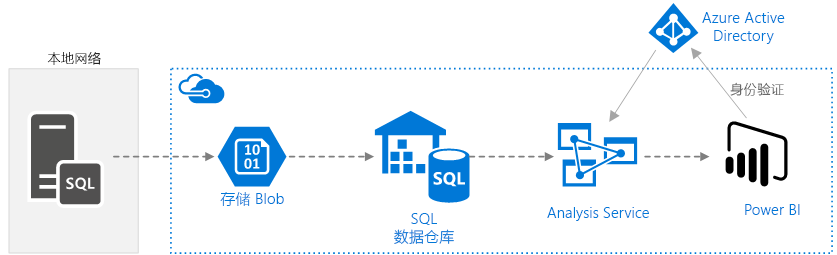
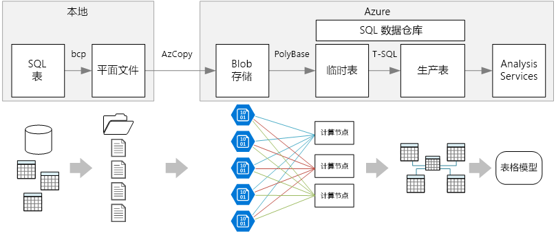
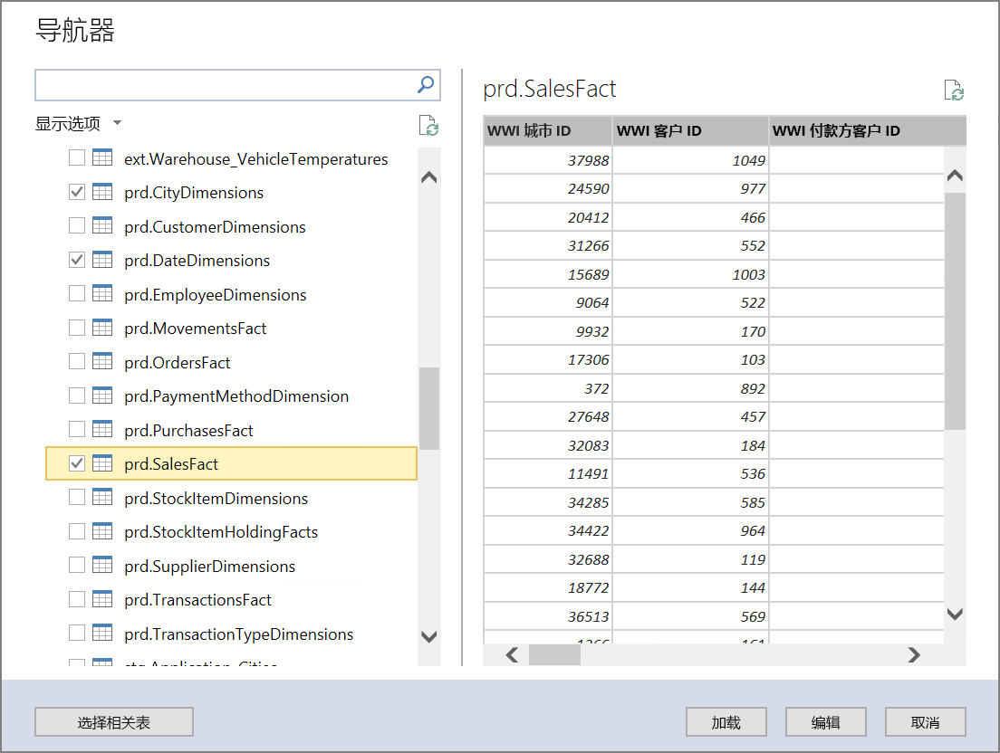
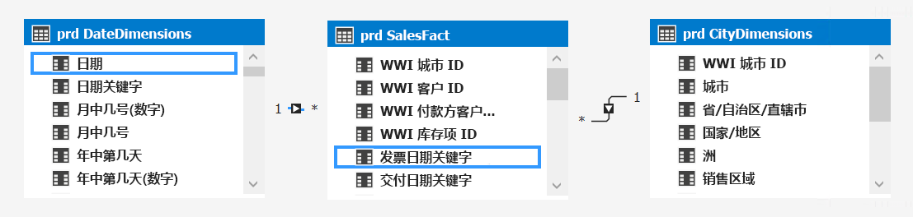
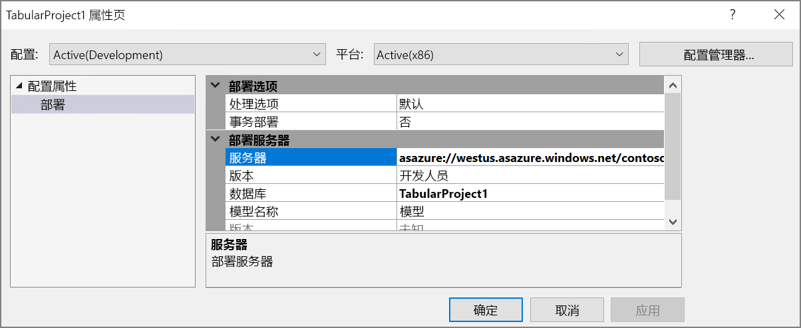
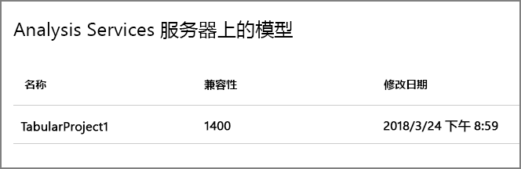
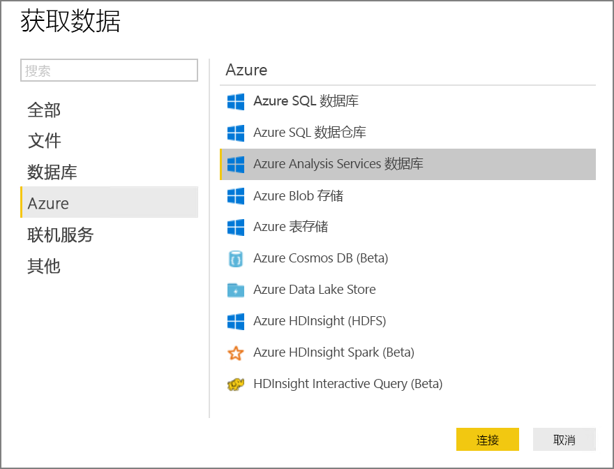
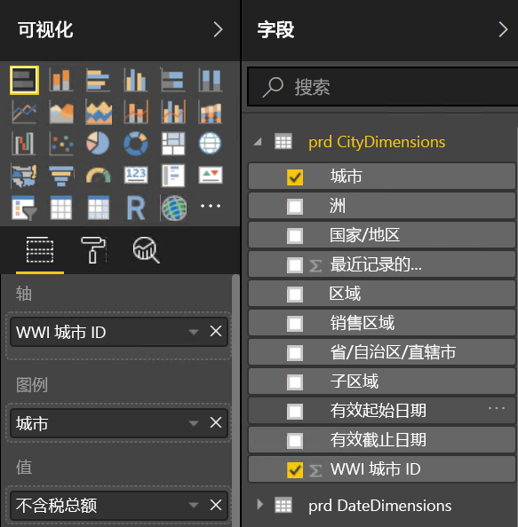
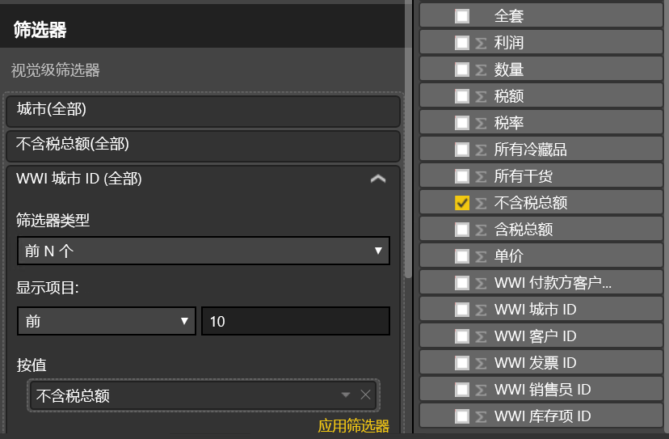
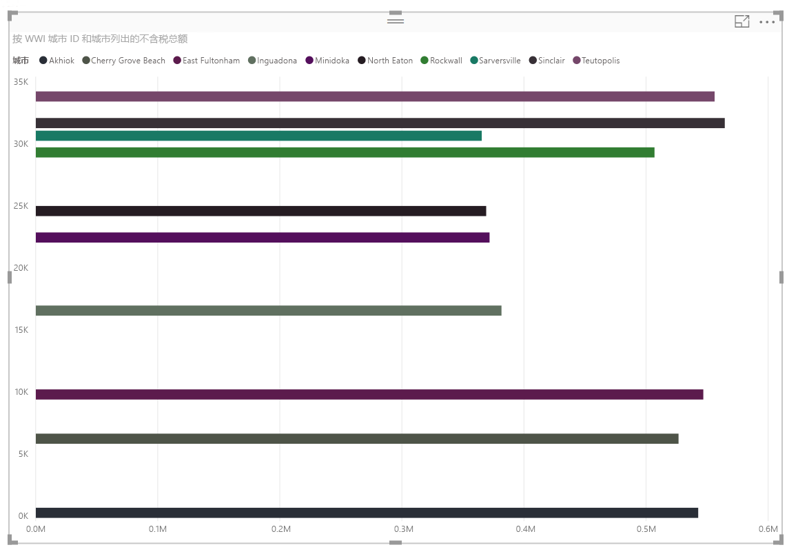

# <a name="enterprise-bi-with-sql-data-warehouse"></a>将 Enterprise BI 与 SQL 数据仓库配合使用

此参考体系结构实现 [ELT](../../data-guide/relational-data/etl.md#extract-load-and-transform-elt)（提取-加载-转换）管道，该管道可将数据从本地 SQL Server 数据库移到 SQL 数据仓库，并转换数据以进行分析。 [**部署此解决方案**。](#deploy-the-solution)



**场景**：某个组织在本地的 SQL Server 数据库中存储了大型 OLTP 数据集。 该组织想要使用 SQL 数据仓库通过 Power BI 执行分析。 

此参考体系结构是针对一次性或按需作业设计的。 如果需要持续移动数据（每小时或每日），我们建议使用 Azure 数据工厂来定义自动化工作流。 有关使用数据工厂的参考体系结构，请参阅[将自动化企业 BI 与 SQL 数据仓库和 Azure 数据工厂配合使用](./enterprise-bi-adf.md)。

## <a name="architecture"></a>体系结构

该体系结构包括以下组件。

### <a name="data-source"></a>数据源

**SQL Server**。 源数据位于本地的 SQL Server 数据库中。 为了模拟本地环境，此体系结构的部署脚本将在 Azure 中预配一个装有 SQL Server 的 VM。 [Wide World Importers OLTP 示例数据库][wwi]用作源数据库。

### <a name="ingestion-and-data-storage"></a>引入和数据存储

**Blob 存储**。 Blob 存储用作临时区域，在将数据载入 SQL 数据仓库之前，会先将数据复制到该区域。

**Azure SQL 数据仓库**。 [SQL 数据仓库](/azure/sql-data-warehouse/)是分布式系统，旨在对大型数据执行分析。 它支持大规模并行处理 (MPP)，因此很适合用于运行高性能分析。 

### <a name="analysis-and-reporting"></a>分析和报告

**Azure Analysis Services**。 [Analysis Services](/azure/analysis-services/) 是提供数据建模功能的完全托管服务。 使用 Analysis Services 能够创建用户可查询的语义模型。 Analysis Services 在 BI 仪表板场景中尤其有用。 在此体系结构中，Analysis Services 从数据仓库读取数据以处理语义模型，并有效地为仪表板查询提供服务。 它还通过横向扩展副本来加快查询处理的速度，以支持弹性并发性。

目前，Azure Analysis Services 支持表格模型，但不支持多维模型。 表格模型使用关系建模构造（表和列），而多维模型使用 OLAP 建模构造（多维数据集、维度和度量值）。 如果需要多维模型，请使用 SQL Server Analysis Services (SSAS)。 有关详细信息，请参阅[表格和多维解决方案的比较](/sql/analysis-services/comparing-tabular-and-multidimensional-solutions-ssas)。

**Power BI**。 Power BI 是一套商业分析工具，用于分析数据以获取商业见解。 在此体系结构中，Power BI 查询 Analysis Services 中存储的语义模型。

### <a name="authentication"></a>身份验证

**Azure Active Directory** (Azure AD) 通过 Power BI 对连接到 Analysis Services 服务器的用户进行身份验证。

## <a name="data-pipeline"></a>数据管道
 
此参考体系结构使用 [WorldWideImporters](/sql/sample/world-wide-importers/wide-world-importers-oltp-database) 示例数据库作为数据源。 数据管道具有以下阶段：

1. 将数据从 SQL Server 导出到平面文件（bcp 实用工具）。
2. 将平面文件复制到 Azure Blob 存储 (AzCopy)。
3. 将数据载入 SQL 数据仓库 (PolyBase)。
4. 将数据转换为星型架构 (T-SQL)。
5. 将语义模型载入 Analysis Services (SQL Server Data Tools)。


 
> [!NOTE]
> 对于步骤 1 &ndash; 3，请考虑使用 Redgate Data Platform Studio。 Data Platform Studio 应用了适当的兼容性修补程序和优化措施，可以快速启动 SQL 数据仓库操作。 有关详细信息，请参阅[使用 Redgate Data Platform Studio 加载数据](/azure/sql-data-warehouse/sql-data-warehouse-load-with-redgate)。 

后续部分将会更详细地介绍这些阶段。

### <a name="export-data-from-sql-server"></a>从 SQL Server 导出数据

使用 [bcp](/sql/tools/bcp-utility)（批量复制程序）实用工具可以从 SQL 表快速创建平面文本文件。 在此步骤中，请选择想要导出的列，但不要转换数据。 所有数据转换应在 SQL 数据仓库中进行。

**建议**

请尽量将数据提取安排在非高峰期，以最大程度地减少生产环境中的资源争用情况。 

避免在数据库服务器上运行 bcp， 应该从另一台计算机运行 bcp。 将文件写入本地驱动器。 确保有足够的 I/O 资源用于处理并发写入。 为获得最佳性能，请将文件导出到专用的高速存储驱动器。

以 Gzip 压缩格式保存导出的数据可以加速网络传输。 但是，将压缩文件载入仓库的速度比加载非压缩文件要慢，因此，加快网络传输速度与加快加载速度之间各有利弊。 如果决定使用 Gzip 压缩，请不要创建单个 Gzip 文件， 而是将数据拆分为多个压缩文件。

### <a name="copy-flat-files-into-blob-storage"></a>将平面文件复制到 Blob 存储中

[AzCopy](/azure/storage/common/storage-use-azcopy) 实用工具旨在以较高的性能将数据复制到 Azure Blob 存储。

**建议**

在靠近源数据位置的区域中创建存储帐户。 在同一区域中部署存储帐户和 SQL 数据仓库实例。 

不要在运行生产工作负荷的同一台计算机上运行 AzCopy，因为 CPU 和 I/O 消耗可能会干扰生产工作负荷。 

首先测试上传，以确定大致的上传速度。 可以在 AzCopy 中使用 /NC 选项来指定并发复制操作的数目。 使用默认值启动，然后使用此设置进行试验，以优化性能。 在低带宽环境中，过多的并发操作可能会使网络连接瘫痪，并导致操作无法彻底完成。  

AzCopy 通过公共 Internet 将数据移到存储中。 如果速度不够快，请考虑设置 [ExpressRoute](/azure/expressroute/) 线路。 ExpressRoute 是通过专用连接将数据路由到 Azure 的服务。 如果网络连接速度太慢，可以采用另一种做法，即以物理方式将磁盘上的数据传送到 Azure 数据中心。 有关详细信息，请参阅[将数据传入和传出 Azure](/azure/architecture/data-guide/scenarios/data-transfer)。

在执行复制操作期间，AzCopy 将创建一个临时日记文件，使 AzCopy 在操作中断（例如，由于网络错误）时重启操作。 确保有足够的磁盘空间用于存储日记文件。 可以使用 /Z 选项指定日记文件的写入位置。

### <a name="load-data-into-sql-data-warehouse"></a>将数据载入 SQL 数据仓库

使用 [PolyBase](/sql/relational-databases/polybase/polybase-guide) 将文件从 Blob 存储载入数据仓库。 PolyBase 利用 SQL 数据仓库的 MPP（大规模并行处理）体系结构，因此是将数据载入 Azure SQL 数据仓库的最快方式。 

加载数据的过程包括两个步骤：

1. 为数据创建一组外部表。 外部表是指向仓库外部存储的数据（在本例中，为 Blob 存储中的平面文件）的表定义。 此步骤不会将任何数据移入仓库。
2. 创建临时表，并将数据载入临时表。 此步骤将数据复制到仓库中。

**建议**

如果有大量的数据（超过 1 TB），并在运行受益于并行度的分析工作负荷，请考虑使用 SQL 数据仓库。 SQL 数据仓库并不很适合 OLTP 工作负荷或较小的数据集（小于 250 GB）。 对于小于 250 GB 的数据集，请考虑使用 Azure SQL 数据库或 SQL Server。 有关详细信息，请参阅[数据仓库](../../data-guide/relational-data/data-warehousing.md)。

将临时表创建为未编制索引的堆表。 创建生产表的查询将导致全表扫描，因此没有理由为临时表编制索引。

PolyBase 自动利用仓库中的并行度。 负载性能会随着 DWU 的增加而扩展。 为获得最佳性能，请使用单个加载操作。 将输入数据分解为区块和运行多个并发负载不会带来任何性能优势。

PolyBase 可以读取 Gzip 压缩文件。 但是，只会对每个压缩文件使用单个读取器，因为解压缩文件是单线程操作。 因此，请避免加载单个大型压缩文件。 应该将数据拆分为多个压缩文件，以利用并行度。 

注意以下限制：

- PolyBase 支持的最大列大小为 `varchar(8000)`、`nvarchar(4000)` 或 `varbinary(8000)`。 如果数据超过这些限制，一种做法是在导出数据时将数据分解为区块，然后在导入后重新汇编区块。 

- PolyBase 使用固定行终止符 \n 或换行符。 如果源数据中显示换行符，则可能会导致问题。

- 源数据架构可能包含 SQL 数据仓库中不支持的数据类型。

若要解决这些限制，可以创建一个执行所需转换的存储过程。 运行 bcp 时引用此存储过程。 或者，使用 [Redgate Data Platform Studio](/azure/sql-data-warehouse/sql-data-warehouse-load-with-redgate) 自动转换 SQL 数据仓库中不支持的数据类型。

有关详细信息，请参阅以下文章：

- [将数据载入 Azure SQL 数据仓库的最佳做法](/azure/sql-data-warehouse/guidance-for-loading-data)
- [将架构迁移到 SQL 数据仓库](/azure/sql-data-warehouse/sql-data-warehouse-migrate-schema)
- [有关为 SQL 数据仓库中的表定义数据类型的指南](/azure/sql-data-warehouse/sql-data-warehouse-tables-data-types)

### <a name="transform-the-data"></a>转换数据

转换数据，并将其移入生产表。 在此步骤中，数据将转换为包含维度表和事实数据表且适用于语义建模的星型架构。

创建具有聚集列存储索引并提供最佳整体查询性能的生产表。 列存储索引已针对扫描大量记录的查询进行优化。 列存储索引并不是很适合用于单一实例查找（即，查找单个行）。 如果需要执行频繁的单一实例查找，可以在表中添加非聚集索引。 使用非聚集索引能够明显加快单一实例查找的运行速度。 但是，与在 OLTP 工作负荷中相比，单一实例查找在数据仓库场景中通常不太常见。 有关详细信息，请参阅[为 SQL 数据仓库中的表编制索引](/azure/sql-data-warehouse/sql-data-warehouse-tables-index)。

> [!NOTE]
> 聚集列存储表不支持 `varchar(max)`、`nvarchar(max)` 或 `varbinary(max)` 数据类型。 在这种情况下，请考虑堆或聚集索引。 可将这些列放入单独的表中。

由于示例数据库不是很大，因此我们创建了不带分区的复制表。 对于生产工作负荷，使用分布式表可能会提高查询性能。 请参阅[有关在 Azure SQL 数据仓库中设计分布式表的指南](/azure/sql-data-warehouse/sql-data-warehouse-tables-distribute)。 示例脚本使用静态[资源类](/azure/sql-data-warehouse/resource-classes-for-workload-management)运行查询。

### <a name="load-the-semantic-model"></a>加载语义模型

将数据载入 Azure Analysis Services 中的表格模型。 在此步骤中，我们将使用 SQL Server Data Tools (SSDT) 创建语义数据模型。 也可以通过从 Power BI Desktop 文件导入一个模型来创建该模型。 由于 SQL 数据仓库不支持外键，因为必须将关系添加到语义模型，以便可以跨表联接。

### <a name="use-power-bi-to-visualize-the-data"></a>使用 Power BI 将数据可视化

Power BI 支持使用两个选项连接到 Azure Analysis Services：

- 导入。 将数据导入 Power BI 模型。
- 实时连接。 直接从 Analysis Services 提取数据。

我们建议使用“实时连接”，因为此选项不需要将数据复制到 Power BI 模型中。 此外，使用 DirectQuery 可确保结果始终与最新源数据保持一致。 有关详细信息，请参阅[使用 Power BI 进行连接](/azure/analysis-services/analysis-services-connect-pbi)。

**建议**

避免直接对数据仓库运行 BI 仪表板查询。 BI 仪表板要求的响应时间很短，针对仓库直接运行查询可能无法满足该要求。 此外，刷新仪表板的操作将计入并发查询次数，这可能会影响性能。 

Azure Analysis Services 旨在处理 BI 仪表板的查询要求，因此建议的做法是从 Power BI 查询 Analysis Services。

## <a name="scalability-considerations"></a>可伸缩性注意事项

### <a name="sql-data-warehouse"></a>SQL 数据仓库

使用 SQL 数据仓库可以按需横向扩展计算资源。 查询引擎基于计算节点数目优化并行处理的查询，并按需在节点之间移动数据。 有关详细信息，请参阅[管理 Azure SQL 数据仓库中的计算资源](/azure/sql-data-warehouse/sql-data-warehouse-manage-compute-overview)。

### <a name="analysis-services"></a>Analysis Services

对于生产工作负荷，我们建议使用 Azure Analysis Services 的标准层，因为该层支持分区和 DirectQuery。 在层中，实例大小确定内存和处理能力。 处理能力以查询处理单位 (QPU) 来计量。 请监视 QPU 使用率以选择适当的大小。 有关详细信息，请参阅[监视服务器指标](/azure/analysis-services/analysis-services-monitor)。

在负载较高的情况下，查询性能可能因查询并发性而下降。 可以通过创建副本池来处理查询，以横向扩展 Analysis Services，从而能够并行执行更多的查询。 处理数据模型的工作始终在主服务器上进行。 默认情况下，主服务器也会处理查询。 （可选）可以指定以独占方式运行处理的主服务器，让查询池处理所有查询。 如果处理要求较高，应将处理负载与查询池隔离开来。 如果查询负载较高，而处理负载相对较低，则可以在查询池中包含主服务器。 有关详细信息，请参阅 [Azure Analysis Services 横向扩展](/azure/analysis-services/analysis-services-scale-out)。 

若要减少不必要的处理量，请考虑使用分区将表格模型划分为逻辑部分。 可以单独处理每个分区。 有关详细信息，请参阅[分区](/sql/analysis-services/tabular-models/partitions-ssas-tabular)。

## <a name="security-considerations"></a>安全注意事项

### <a name="ip-whitelisting-of-analysis-services-clients"></a>Analysis Services 客户端的 IP 白名单

考虑使用 Analysis Services 防火墙功能将客户端 IP 地址加入白名单。 如果已启用防火墙，防火墙会阻止其规则中指定的连接以外的所有客户端连接。 默认规则会将 Power BI 服务加入白名单，但你可以根据需要禁用此规则。 有关详细信息，请参阅[使用新防火墙功能强化 Azure Analysis Services](https://azure.microsoft.com/blog/hardening-azure-analysis-services-with-the-new-firewall-capability/)。

### <a name="authorization"></a>授权

Azure Analysis Services 使用 Azure Active Directory (Azure AD) 对连接到 Analysis Services 服务器的用户进行身份验证。 可以通过创建角色，然后将 Azure AD 用户或组分配到这些角色，来限制特定的用户可以查看哪些数据。 对于每个角色，可以： 

- 保护表或单个列。 
- 基于筛选表达式保护单个行。 

有关详细信息，请参阅[管理数据库角色和用户](/azure/analysis-services/analysis-services-database-users)。

## <a name="deploy-the-solution"></a>部署解决方案

[GitHub][ref-arch-repo-folder] 中提供了此参考体系结构的部署。 它将部署以下部分：

  * 一个用于模拟本地数据库服务器的 Windows VM。 该 VM 包含 SQL Server 2017 和相关工具以及 Power BI Desktop。
  * 一个 Azure 存储帐户。该帐户提供 Blob 存储用于保存从 SQL Server 数据库导出的数据。
  * 一个 Azure SQL 数据仓库实例。
  * 一个 Azure Analysis Services 实例。

### <a name="prerequisites"></a>先决条件

[!INCLUDE [ref-arch-prerequisites.md](../../../includes/ref-arch-prerequisites.md)]

### <a name="deploy-the-simulated-on-premises-server"></a>部署模拟的本地服务器

首先，将 VM 部署为包含 SQL Server 2017 和相关工具的模拟本地服务器。 此步骤还会将 [Wide World Importers OLTP 数据库][wwi]载入 SQL Server。

1. 导航到存储库的 `data\enterprise_bi_sqldw\onprem\templates` 文件夹。

2. 在 `onprem.parameters.json` 文件中，替换 `adminUsername` 和 `adminPassword` 的值。 另外，请更改 `SqlUserCredentials` 节中的值，使之与用户名和密码匹配。 记下 userName 属性中的 `.\\` 前缀。
    
    ```bash
    "SqlUserCredentials": {
      "userName": ".\\username",
      "password": "password"
    }
    ```

3. 运行如下所示的 `azbb` 以部署本地服务器。

    ```bash
    azbb -s <subscription_id> -g <resource_group_name> -l <region> -p onprem.parameters.json --deploy
    ```

    指定支持 SQL 数据仓库和 Azure Analysis Services 的区域。 参阅 [Azure 产品（按区域）](https://azure.microsoft.com/global-infrastructure/services/)。

4. 部署过程可能需要 20 到 30 分钟才能完成，其中包括运行 [DSC](/powershell/dsc/overview) 脚本来安装工具和还原数据库。 在 Azure 门户中通过查看资源组中的资源来验证部署。 应会看到 `sql-vm1` 虚拟机及其关联的资源。

### <a name="deploy-the-azure-resources"></a>部署 Azure 资源

此步骤预配 SQL 数据仓库和 Azure Analysis Services 以及存储帐户。 如果需要，可与上一步骤一同运行此步骤。

1. 导航到存储库的 `data\enterprise_bi_sqldw\azure\templates` 文件夹。

2. 运行以下 Azure CLI 命令创建资源组。 可以部署到与上一步骤中所述资源组不同的资源组，但要选择相同的区域。 

    ```bash
    az group create --name <resource_group_name> --location <region>  
    ```

3. 运行以下 Azure CLI 命令部署 Azure 资源。 替换尖括号中显示的参数值。 

    ```bash
    az group deployment create --resource-group <resource_group_name> \
     --template-file azure-resources-deploy.json \
     --parameters "dwServerName"="<server_name>" \
     "dwAdminLogin"="<admin_username>" "dwAdminPassword"="<password>" \ 
     "storageAccountName"="<storage_account_name>" \
     "analysisServerName"="<analysis_server_name>" \
     "analysisServerAdmin"="user@contoso.com"
    ```

    - `storageAccountName` 参数必须后接存储帐户的[命名规则](../../best-practices/naming-conventions.md#naming-rules-and-restrictions)。
    - 对于 `analysisServerAdmin` 参数，请使用 Azure Active Directory 用户主体名称 (UPN)。

4. 在 Azure 门户中通过查看资源组中的资源来验证部署。 应会看到一个存储帐户、Azure SQL 数据仓库实例和 Analysis Services 实例。

5. 使用 Azure 门户获取存储帐户的访问密钥。 选择存储帐户以将其打开。 在“设置”下，选择“访问密钥”。 复制主密钥值。 在下一步骤中将要使用该值。

### <a name="export-the-source-data-to-azure-blob-storage"></a>将源数据导出到 Azure Blob 存储 

此步骤将运行一个 PowerShell 脚本，该脚本使用 bcp 将 SQL 数据库导出到 VM 上的平面文件，然后使用 AzCopy 将这些文件复制到 Azure Blob 存储中。

1. 使用远程桌面连接到模拟的本地 VM。

2. 登录到 VM 后，从 PowerShell 窗口运行以下命令。  

    ```powershell
    cd 'C:\SampleDataFiles\reference-architectures\data\enterprise_bi_sqldw\onprem'

    .\Load_SourceData_To_Blob.ps1 -File .\sql_scripts\db_objects.txt -Destination 'https://<storage_account_name>.blob.core.windows.net/wwi' -StorageAccountKey '<storage_account_key>'
    ```

    对于 `Destination` 参数，请将 `<storage_account_name>` 替换为前面创建的存储帐户的名称。 对于 `StorageAccountKey` 参数，请使用该存储帐户的访问密钥。

3. 在 Azure 门户中导航到存储帐户，选择 Blob 服务并打开 `wwi` 容器，以验证源数据是否已复制到 Blob 存储。 应会看到以 `WorldWideImporters_Application_*` 开头的表列表。

### <a name="run-the-data-warehouse-scripts"></a>运行数据仓库脚本

1. 通过远程桌面会话启动 SQL Server Management Studio (SSMS)。 

2. 连接到 SQL 数据仓库

    - 服务器类型：数据库引擎
    
    - 服务器名称：`<dwServerName>.database.windows.net`，其中，`<dwServerName>` 是部署 Azure 资源时指定的名称。 可以从 Azure 门户获取此名称。
    
    - 身份验证：SQL Server 身份验证。 在 `dwAdminLogin` 和 `dwAdminPassword` 参数中使用部署 Azure 资源时指定的凭据。

2. 导航到 VM 上的 `C:\SampleDataFiles\reference-architectures\data\enterprise_bi_sqldw\azure\sqldw_scripts` 文件夹。 将在此文件夹中按数字顺序 `STEP_1` 至 `STEP_7` 执行脚本。

3. 在 SSMS 中选择 `master` 数据库并打开 `STEP_1` 脚本。 更改以下行中的密码值，然后执行脚本。

    ```sql
    CREATE LOGIN LoaderRC20 WITH PASSWORD = '<change this value>';
    ```

4. 在 SSMS 中选择 `wwi` 数据库。 打开 `STEP_2` 脚本并执行该脚本。 如果遇到错误，请确保针对 `wwi` 数据库而不是 `master` 运行脚本。

5. 使用 `STEP_1` 脚本中指定的 `LoaderRC20` 用户和密码来与 SQL 数据仓库建立新连接。

6. 使用此连接打开 `STEP_3` 脚本。 在脚本中设置以下值：

    - SECRET：使用存储帐户的访问密钥。
    - LOCATION：使用存储帐户的名称，如下所示：`wasbs://wwi@<storage_account_name>.blob.core.windows.net`。

7. 使用相同的连接按顺序执行脚本 `STEP_4` 至 `STEP_7`。 验证每个脚本是否成功完成，然后再运行下一个脚本。

在 SMSS 中，应会看到 `wwi` 数据库中的一组 `prd.*` 表。 若要验证是否已生成数据，请运行以下查询： 

```sql
SELECT TOP 10 * FROM prd.CityDimensions
```

## <a name="build-the-analysis-services-model"></a>生成 Analysis Services 模型

此步骤将创建一个用于从数据仓库导入数据的表格模型。 然后，将该模型部署到 Azure Analysis Services。

1. 通过远程桌面会话启动 SQL Server Data Tools 2015。

2. 选择“文件” > “新建” > “项目”。

3. 在“新建项目”对话框中的“模板”下，选择“商业智能” > “Analysis Services” > “Analysis Services 表格项目”。 

4. 为项目命名，并单击“确定”。

5. 在“表格模型设计器”对话框中，选择“集成的工作区”，并将“兼容性级别”设置为 `SQL Server 2017 / Azure Analysis Services (1400)`。 单击“确定”。

6. 在“表格模型资源管理器”窗口中，右键单击该项目并选择“从数据源导入”。

7. 选择“Azure SQL 数据仓库”并单击“连接”。

8. 对于“服务器”，请输入 Azure SQL 数据仓库服务器的完全限定名称。 对于“数据库”，请输入 `wwi`。 单击“确定”。

9. 在下一个对话框中，选择“数据库”身份验证并输入 Azure SQL 数据仓库用户名和密码，然后单击“确定”。

10. 在“导航器”对话框中，选中“prd.CityDimensions”、“prd.DateDimensions”和“prd.SalesFact”对应的复选框。 

    

11. 单击“加载”。 处理完成后，单击“关闭”。 现在应会看到数据的表格视图。

12. 在“表格模型资源管理器”窗口中，右键单击该项目并选择“模型视图” > “图示视图”。

13. 将“[prd.SalesFact].[WWI City ID]”字段拖到“[prd.CityDimensions].[WWI City ID]”字段，以创建关系。  

14. 将“[prd.SalesFact].[Invoice Date Key]”字段拖到“[prd.DateDimensions].[Date]”字段。  
    

15. 在“文件”菜单中，选择“全部保存”。  

16. 在“解决方案资源管理器”中，右键单击该项目并选择“属性”。 

17. 在“服务器”下，输入 Azure Analysis Services 实例的 URL。 可从 Azure 门户获取此值。 在门户中选择 Analysis Services 资源，单击“概述”窗格，并找到“服务器名称”属性。 该属性类似于 `asazure://westus.asazure.windows.net/contoso`。 单击“确定”。

    

18. 在“解决方案资源管理器”中，右键单击该项目并选择“部署”。 根据提示登录到 Azure。 处理完成后，单击“关闭”。

19. 在 Azure 门户中，查看 Azure Analysis Services 实例的详细信息。 检查上述模型是否出现在模型列表中。

    

## <a name="analyze-the-data-in-power-bi-desktop"></a>在 Power BI Desktop 中分析数据

此步骤使用 Power BI 基于 Analysis Services 中的数据创建报告。

1. 通过远程桌面会话启动 Power BI Desktop。

2. 在“欢迎”屏幕中单击“获取数据”。

3. 选择“Azure” > “Azure Analysis Services 数据库”。 单击“连接”

    

4. 输入 Analysis Services 实例的 URL，并单击“确定”。 根据提示登录到 Azure。

5. 在“导航器”对话框中展开部署的表格项目，选择创建的模型，并单击“确定”。

2. 在“可视化效果”窗格中，选择“堆积条形图”图标。 在“报告”视图中，调整可视化效果的大小以将其放大。

6. 在“字段”窗格中，展开“prd.CityDimensions”。

7. 将“prd.CityDimensions” > “WWI 城市 ID”适当地拖到“Axis”。

8. 将“prd.CityDimensions” > “城市”适当地拖到“图例”。

9. 在“字段”窗格中，展开“prd.SalesFact”。

10. 将“prd.SalesFact” > “总计(不含税)”适当地拖到“值”。

    

11. 在“视觉级筛选器”下，选择“WWI 城市 ID”。

12. 将“筛选器类型”设置为 `Top N`，将“显示项”设置为 `Top 10`。

13. 将“prd.SalesFact” > “总计(不含税)”适当地拖到“依据值”

    

14. 单击“应用筛选器”。 可视化效果将按城市显示排名靠前的 10 项总销售额。

    

若要详细了解 Power BI Desktop，请参阅 [Power BI Desktop 入门](/power-bi/desktop-getting-started)。

## <a name="next-steps"></a>后续步骤

- 有关此参考体系结构的详细信息，请访问 [GitHub 存储库][ref-arch-repo-folder]。
- 了解 [Azure 构建基块][azbb-repo]。

<!-- links -->

[azure-cli-2]: /azure/install-azure-cli
[azbb-repo]: https://github.com/mspnp/template-building-blocks
[azbb-wiki]: https://github.com/mspnp/template-building-blocks/wiki/Install-Azure-Building-Blocks
[github-folder]: https://github.com/mspnp/reference-architectures/tree/master/data/enterprise_bi_sqldw
[ref-arch-repo]: https://github.com/mspnp/reference-architectures
[ref-arch-repo-folder]: https://github.com/mspnp/reference-architectures/tree/master/data/enterprise_bi_sqldw
[wwi]: /sql/sample/world-wide-importers/wide-world-importers-oltp-database
