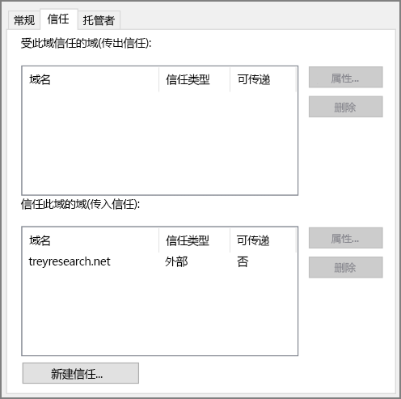

# <a name="create-an-active-directory-domain-services-ad-ds-resource-forest-in-azure"></a>在 Azure 中创建 Active Directory 域服务 (AD DS) 资源林

此参考体系结构展示了如何在 Azure 中创建本地 AD 林中的域信任的一个单独 Active Directory 域。 [**部署此解决方案**。](#deploy-the-solution)

[![0]][0] 

下载此体系结构的 [Visio 文件][visio-download]。

Active Directory 域服务 (AD DS) 以分层结构存储标识信息。 分层结构中的顶层节点称为林。 林包含域，域包含其他类型的对象。 此参考体系结构在 Azure 中创建与本地域之间具有单向传出信任关系的 AD DS 林。 Azure 中的林包含本地不存在的一个域。 由于信任关系，将信任针对本地域的登录，允许其访问该单独 Azure 域中的资源。 

此体系结构的典型用途包括为云中拥有的对象和标识维护安全隔离，以及将各个域从本地迁移到云。 

有关其他注意事项，请参阅[选择用于将本地 Active Directory 与 Azure 相集成的解决方案][considerations]。 

## <a name="architecture"></a>体系结构

该体系结构具有以下组件。

* **本地网络**。 本地网络包含其自己的 Active Directory 林和域。
* **Active Directory 服务器**。 它们是域控制器，用于实现在云中作为 VM 运行的域服务。 这些服务器托管的林中包含独立于本地域的一个或多个域。
* **单向信任关系**。 关系图中的示例显示了从 Azure 中的域到本地域的单向信任。 此关系允许本地用户访问 Azure 中的域的资源，但无法反向访问。 如果云用户也需要访问本地资源，则可以创建双向信任。
* **Active Directory 子网**。 AD DS 服务器托管在一个单独的子网中。 网络安全组 (NSG) 规则对 AD DS 服务器进行保护，并提供防火墙以阻止来自意外来源的流量。
* **Azure 网关**。 Azure 网关在本地网络与 Azure VNet 之间提供连接。 这可以是 [VPN 连接][azure-vpn-gateway]，也可以是 [Azure ExpressRoute][azure-expressroute]。 有关详细信息，请参阅[在 Azure 中实现安全的混合网络体系结构][implementing-a-secure-hybrid-network-architecture]。

## <a name="recommendations"></a>建议

有关在 Azure 中实施 Active Directory 的具体建议，请参阅以下文章：

- [将 Active Directory 域服务 (AD DS) 扩展到 Azure][adds-extend-domain]。 
- [在 Azure 虚拟机上部署 Windows Server Active Directory 的指南][ad-azure-guidelines]。

### <a name="trust"></a>信任

本地域包含在与云中的域不同的林中。 若要在云中启用对本地用户的身份验证，Azure 中的域必须信任本地林中的登录域。 同样，如果云为外部用户提供了登录域，则本地林可能需要信任云域。

可以通过[创建林信任][creating-forest-trusts]在林级别建立信任，或者通过[创建外部信任][creating-external-trusts]在域级别建立信任。 林级别信任在两个林中的所有域之间创建关系。 外部域级别信任仅在两个指定的域之间创建关系。 只应当在不同林中的域之间创建外部域级别信任。

信任可以是单向的，也可以是双向的：

* 单向信任允许一个域或林（称为*传入*域或林）中的用户访问另一个域或林（*传出*域或林）中拥有的资源。
* 双向信任允许任一域或林中的用户访问另一个域或林中拥有的资源。

下表总结了一些简单方案的信任配置：

| 场景 | 本地信任 | 云信任 |
| --- | --- | --- |
| 本地用户需要访问云中的资源，但云中的用户不需要访问本地资源 |单向、传入 |单向、传出 |
| 云中的用户需要访问本地资源，本地用户不需要访问云中的资源 |单向、传出 |单向、传入 |
| 云中的和本地用户都需要访问云中和本地拥有的资源。 |双向、传入和传出 |双向、传入和传出 |

## <a name="scalability-considerations"></a>可伸缩性注意事项

Active Directory 能够针对属于同一域的域控制器自动进行缩放。 请求被分布到域中的所有控制器中。 可以添加另一个域控制器，并且它将与该域自动同步。 不要配置单独的负载均衡器来将流量定向到该域中的控制器。 确保所有域控制器都有足够的内存和存储资源来处理域数据库。 使所有域控制器 VM 具有相同的大小。

## <a name="availability-considerations"></a>可用性注意事项

请至少为每个域预配两个域控制器。 这可以在服务器之间实现自动复制。 为充当 Active Directory 服务器（用于处理每个域）的 VM 创建一个可用性集。 至少在此可用性集中放置两个服务器。

另外，请考虑将每个域中的一个或多个服务器指定为[备用操作主机][standby-operations-masters]，以应对作为灵活单一主机操作 (FSMO) 角色连接到服务器时失败的情况。

## <a name="manageability-considerations"></a>可管理性注意事项

有关管理和监视注意事项的详细信息，请参阅[将 Active Directory 扩展到 Azure][adds-extend-domain]。 
 
有关详细信息，请参阅[监视 Active Directory][monitoring_ad]。 可以在管理子网中的监视服务器上安装 [Microsoft Systems Center][microsoft_systems_center] 之类的工具来帮助执行这些任务。

## <a name="security-considerations"></a>安全注意事项

林级别信任是可传递的。 如果在一个本地林与云中的一个林之间建立了林级别信任，则此信任将扩展到在任一林中创建的其他新域。 如果出于安全目的而使用域提供隔离，请考虑仅在域级别创建信任。 域级别信任是不可传递的。

有关特定于 Active Directory 的安全注意事项，请参阅[将 Active Directory 扩展到 Azure][adds-extend-domain] 中的安全注意事项部分。

## <a name="deploy-the-solution"></a>部署解决方案

[GitHub][github] 上提供了此体系结构的部署。 请注意，整个部署最长可能需要花费两个小时，包括创建 VPN 网关和运行配置 AD DS 的脚本。

### <a name="prerequisites"></a>先决条件

1. 克隆、下载[参考体系结构][github] GitHub 存储库的 zip 文件或创建其分支。

2. 安装 [Azure CLI 2.0][azure-cli-2]。

3. 安装 [Azure 构建基块][azbb] npm 包。

4. 在命令提示符、bash 提示符或 PowerShell 提示符下使用以下命令登录到 Azure 帐户。

   ```bash
   az login
   ```

### <a name="deploy-the-simulated-on-premises-datacenter"></a>部署模拟的本地数据中心

1. 导航到 GitHub 存储库的 `identity/adds-forest` 文件夹。

2. 打开 `onprem.json` 文件。 搜索 `adminPassword` 和 `Password` 的实例并添加密码值。

3. 运行以下命令，并等待部署完成：

    ```bash
    azbb -s <subscription_id> -g <resource group> -l <location> -p onprem.json --deploy
    ```

### <a name="deploy-the-azure-vnet"></a>部署 Azure VNet

1. 打开 `azure.json` 文件。 搜索 `adminPassword` 和 `Password` 的实例并添加密码值。

2. 在同一文件中，搜索 `sharedKey` 的实例并输入 VPN 连接的共享密钥。 

    ```bash
    "sharedKey": "",
    ```

3. 运行以下命令并等待部署完成。

    ```bash
    azbb -s <subscription_id> -g <resource group> -l <location> -p onoprem.json --deploy
    ```

   部署到本地 VNet 所在的同一个资源组。


### <a name="test-the-ad-trust-relation"></a>测试 AD 信任关系

1. 使用 Azure 门户导航到已创建的资源组。

2. 使用 Azure 门户找到名为 `ra-adt-mgmt-vm1` 的 VM。

2. 单击 `Connect` 来与 VM 建立远程桌面会话。 用户名为 `contoso\testuser`，密码为 `onprem.json` 参数文件中指定的密码。

3. 在远程桌面会话中，与 192.168.0.4（名为 `ra-adtrust-onpremise-ad-vm1` 的 VM 的 IP 地址）建立另一个远程桌面会话。 用户名为 `contoso\testuser`，密码为 `azure.json` 参数文件中指定的密码。

4. 在 `ra-adtrust-onpremise-ad-vm1` 的远程桌面会话中转到“服务器管理器”，然后单击“工具” > “Active Directory 域和信任”。 

5. 在左窗格中右键单击“contoso.com”，然后选择“属性”。

6. 单击“信任”选项卡。此时会看到 treyresearch.net 作为传入信任列出。




## <a name="next-steps"></a>后续步骤

* 了解[将本地 AD DS 域扩展到 Azure][adds-extend-domain] 的最佳做法
* 了解在 Azure 中[创建 AD FS 基础结构][adfs]的最佳做法。

<!-- links -->
[adds-extend-domain]: adds-extend-domain.md
[adfs]: adfs.md
[azure-cli-2]: /azure/install-azure-cli
[azbb]: https://github.com/mspnp/template-building-blocks/wiki/Install-Azure-Building-Blocks

[implementing-a-secure-hybrid-network-architecture]: ../dmz/secure-vnet-hybrid.md
[implementing-a-secure-hybrid-network-architecture-with-internet-access]: ../dmz/secure-vnet-dmz.md

[running-VMs-for-an-N-tier-architecture-on-Azure]: ../virtual-machines-windows/n-tier.md

[ad-azure-guidelines]: https://msdn.microsoft.com/library/azure/jj156090.aspx
[azure-expressroute]: https://azure.microsoft.com/documentation/articles/expressroute-introduction/
[azure-vpn-gateway]: https://azure.microsoft.com/documentation/articles/vpn-gateway-about-vpngateways/
[considerations]: ./considerations.md
[creating-external-trusts]: https://technet.microsoft.com/library/cc816837(v=ws.10).aspx
[creating-forest-trusts]: https://technet.microsoft.com/library/cc816810(v=ws.10).aspx
[github]: https://github.com/mspnp/reference-architectures/tree/master/identity/adds-forest
[incoming-trust]: https://raw.githubusercontent.com/mspnp/reference-architectures/master/identity/adds-forest/extensions/incoming-trust.ps1
[microsoft_systems_center]: https://www.microsoft.com/server-cloud/products/system-center-2016/
[monitoring_ad]: https://msdn.microsoft.com/library/bb727046.aspx
[resource-manager-overview]: /azure/azure-resource-manager/resource-group-overview
[solution-script]: https://raw.githubusercontent.com/mspnp/reference-architectures/master/identity/adds-forest/Deploy-ReferenceArchitecture.ps1
[standby-operations-masters]: https://technet.microsoft.com/library/cc794737(v=ws.10).aspx
[outgoing-trust]: https://raw.githubusercontent.com/mspnp/reference-architectures/master/identity/adds-forest/extensions/outgoing-trust.ps1
[verify-a-trust]: https://technet.microsoft.com/library/cc753821.aspx
[visio-download]: https://archcenter.blob.core.windows.net/cdn/identity-architectures.vsdx
[0]: ./images/adds-forest.png "使用独立的 Active Directory 域保护混合网络体系结构的安全"