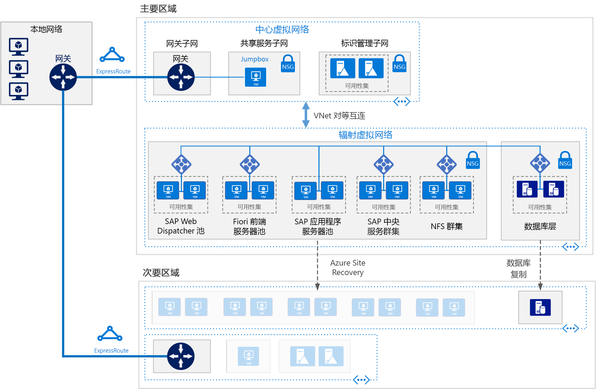

# 适用于 Azure 上 Linux 虚拟机的 SAP S/4HANA

此参考体系结构演示有关在 Azure 上支持灾难恢复的高可用性环境中运行 S/4HANA 的一套成熟做法。 将使用可根据组织需求更改的特定虚拟机 (VM) 大小部署此体系结构。 

下载此体系结构的 [Visio 文件][visio-download]。

> [!NOTE] 
> 部署此参考体系结构需要获取 SAP 产品和其他非 Microsoft 技术的相应许可。

## 体系结构
 
此参考体系结构描述一个企业规模的生产级系统。 可根据业务需求，将此配置缩减为单个虚拟机。 但是，以下组件是必需的：

虚拟网络。 [Azure 虚拟网络](/azure/virtual-network/virtual-networks-overview)服务在 Azure 资源之间建立安全连接。 在此体系结构中，虚拟网络将通过[中心-分支拓扑](../hybrid-networking/hub-spoke.md)的中心内部署的网关连接到本地环境。 分支是用于 SAP 应用程序的虚拟网络。

**子网**。 虚拟网络针对以下每个层划分为单独的[子网](/azure/virtual-network/virtual-network-manage-subnet)：网关、应用、数据库和共享服务。 

**虚拟机**。 此体系结构对应用层和数据库层使用运行 Linux 的虚拟机。这些层划分为：

- **应用层**。 包括 Fiori 前端服务器池、SAP Web 调度程序池、应用程序服务器池和 SAP Central Services 群集。 要在 Azure Linux 虚拟机上实现 Central Services 的高可用性，需要一个高度可用的网络文件系统 (NFS) 服务。
- **NFS 群集**。 此体系结构使用 Linux 群集上运行的 [NFS](/azure/virtual-machines/workloads/sap/high-availability-guide-suse-nfs) 服务器来存储 SAP 系统之间共享的数据。 可在多个 SAP 系统之间共享此集中式群集。 为实现 NFS 服务的高可用性，使用了所选 Linux 分发版的相应高可用性扩展。
- **SAP HANA**。 数据库层使用群集中的两个或更多个 Linux 虚拟机来实现高可用性。 HANA 系统复制 (HSR) 用于在主要和辅助 HANA 系统之间复制内容。 Linux 群集用于检测系统故障，以及方便自动故障转移。 基于存储或基于云的隔离机制可用于确保有故障的系统被隔离或关闭，以避免群集出现裂脑状态。
- **Jumpbox**。 也称为守护主机。 这是网络中的一个安全虚拟机，管理员使用它来连接其他虚拟机。 该虚拟机可以运行 Windows 或 Linux。 使用 HANA Cockpit 或 HANA Studio 管理工具时，可以使用 Windows Jumpbox 以方便进行 Web 浏览。

**负载均衡器**。 使用内置的 SAP 负载均衡器和 [Azure 负载均衡器](/azure/load-balancer/load-balancer-overview)来实现高可用性。 Azure 负载均衡器实例用于将流量分配到应用层子网中的虚拟机。

**可用性集**。 用于所有池和群集（Web 调度程序、SAP 应用程序服务器、Central Services、NFS 和 HANA）的虚拟机已分组到单独的[可用性集](/azure/virtual-machines/windows/tutorial-availability-sets)，并为每个角色至少预配两个虚拟机。 这样，虚拟机便可以满足更高的[服务级别协议 (SLA)](https://azure.microsoft.com/support/legal/sla/virtual-machines)。 

**NIC**。 [网络接口卡](/azure/virtual-network/virtual-network-network-interface) (NIC) 使虚拟网络中的虚拟机能够实现各种通信。

**网络安全组**。 若要限制虚拟网络中的传入、传出和子网内部流量，可以使用[网络安全组](/azure/virtual-network/virtual-networks-nsg) (NSG)。

**网关**。 网关将本地网络扩展到 Azure 虚拟网络。 建议使用 [ExpressRoute](/azure/architecture/reference-architectures/hybrid-networking/expressroute) Azure 服务来创建不必经由公共 Internet 的专用连接，但也可以使用[站点到站点](/azure/vpn-gateway/vpn-gateway-howto-site-to-site-resource-manager-portal)连接。 

**Azure 存储**。 若要提供虚拟机的虚拟硬盘 (VHD) 持久存储，必须使用 [Azure 存储](/azure/storage/)。 

## 建议

此体系结构描述一个小型的生产级企业部署。 部署根据业务要求的不同而异。 请使用以下建议作为入手点。

### 虚拟机

在应用程序服务器池和群集中，根据要求调整虚拟机数目。 [Azure 虚拟机规划和实施指南](/azure/virtual-machines/workloads/sap/planning-guide)中包含了有关在虚拟机上运行 SAP NetWeaver 的详细信息，但这些信息同样适用于 SAP S/4HANA。

有关 SAP 支持的 Azure 虚拟机类型和吞吐量指标 (SAPS) 的详细信息，请参阅 [SAP 说明 1928533](https://launchpad.support.sap.com/#/notes/1928533)。 

### SAP Web 调度程序池

Web 调度程序组件用作 SAP 应用程序服务器之间的 SAP 流量的负载均衡器。 为了实现 Web 调度程序组件的高可用性，在轮循机制配置中使用了 Azure 负载均衡器来实施并行 Web 调度程序设置，以便在均衡器后端池中的可用 Web 调度程序之间分配 HTTP(S) 流量。 

### Fiori 前端服务器

Fiori 前端服务器使用 [NetWeaver 网关](https://help.sap.com/doc/saphelp_gateway20sp12/2.0/en-US/76/08828d832e4aa78748e9f82204a864/content.htm?no_cache=true)。 对于小型部署，可以在 Fiori 服务器上加载该网关。 对于大型部署，可将 NetWeaver 网关的独立服务器部署在 Fiori 前端服务器池的前面。

### 应用程序服务器池

若要管理 ABAP 应用程序服务器的登录组，需使用 SMLG 事务。 该事务使用 Central Services 的消息服务器中的负载均衡功能，在 SAPGUI 的 SAP 应用程序服务器池之间分配工作负荷，以及分配 RFC 流量。 与高可用性 Central Services 的应用程序服务器连接通过群集虚拟网络名称来建立。 因此，在完成本地故障转移后，无需更改 Central Services 连接的应用程序服务器配置文件。 

### SAP Central Services 群集

当高可用性不是一项要求时，可将 Central Services 部署到单个虚拟机。 但是，单个虚拟机在 SAP 环境中会成为潜在的单一故障点 (SPOF)。 对于高可用性 Central Services 部署，可以使用高可用性 NFS 群集和高可用性 Central Services 群集。

### NFS 群集

DRBD（分布式复制块设备）用于在 NFS 群集的节点之间复制。

### 可用性集

可用性集将服务器分配到不同的物理基础结构，并更新组以提高服务可用性。 将执行相同角色的虚拟机放入某个可用性集有助于避免 Azure 基础结构维护工作造成的停机，并有助于满足 [SLA](https://azure.microsoft.com/support/legal/sla/virtual-machines)。 建议为每个可用性集配置两个或更多个虚拟机。

一个集内的所有虚拟机必须执行相同的角色。 不要在同一个可用性集中混合不同角色的服务器。 例如，不要将 ASCS 节点放到应用程序服务器所在的同一个可用性集中。

### NIC

传统的本地 SAP 布局为每个计算机实施多个网络接口卡 (NIC)，以便将管理流量与业务流量相分离。 在 Azure 上，虚拟网络是软件定义的网络，它通过同一网络结构发送所有流量。 因此，没有必要使用多个 NIC。 但是，如果组织需要分离流量，则可为每个 VM 部署多个 NIC，将每个 NIC 连接到不同的子网，然后使用 NSG 强制实施不同的访问控制策略。

### 子网和 NSG

此体系结构将虚拟网络地址空间划分为子网。 每个子网可与定义子网访问策略的 NSG 相关联。 请将应用程序服务器放在单独的子网中，以便可以通过管理子网安全策略而不是单个服务器，更轻松地为服务器提供保护。

NSG 在与某个子网关联后，将应用到该子网中的所有服务器。 有关使用 NSG 对子网中的服务器进行精细控制的详细信息，请参阅[使用网络安全组筛选网络流量](https://azure.microsoft.com/blog/multiple-vm-nics-and-network-virtual-appliances-in-azure/)。

另请参阅[规划和设计 VPN 网关](/azure/vpn-gateway/vpn-gateway-plan-design)。

### 负载均衡器

[SAP Web 调度程序](https://help.sap.com/doc/saphelp_nw73ehp1/7.31.19/en-US/48/8fe37933114e6fe10000000a421937/frameset.htm)处理 HTTP(S) 流量的负载均衡（包括 Fiori 式应用程序发往 SAP 应用程序服务器池的流量）。 

对于通过 DIAG 或远程函数调用 (RFC) 连接 SAP 服务器的 SAP GUI 客户端发出的流量，Central Service 消息服务器会通过 SAP 应用程序服务器[登录组](https://wiki.scn.sap.com/wiki/display/SI/ABAP+Logon+Group+based+Load+Balancing)进行负载均衡，因此，无需额外的负载均衡器。 

### Azure 存储

对于数据库服务器虚拟机，我们建议使用 Azure 高级存储。 高级存储提供一致的读/写延迟。 有关对单一实例虚拟机的操作系统磁盘和数据磁盘使用高级存储的详细信息，请参阅[虚拟机的 SLA](https://azure.microsoft.com/support/legal/sla/virtual-machines/)。 

对于所有 SAP 生产系统，我们建议使用高级 [Azure 托管磁盘](/azure/storage/storage-managed-disks-overview)。 托管磁盘用于管理磁盘的 VHD 文件，以提高可靠性。 托管磁盘还可确保隔离可用性集中虚拟机的磁盘，以避免单一故障点。

对于 SAP 应用程序服务器，包括 Central Services 虚拟机，可以使用标准 Azure 存储来降低成本，因为应用程序执行在内存中发生，只将磁盘用于日志记录。 但是，目前只有标准存储才通过了非托管存储的认证。 由于应用程序服务器不会托管任何数据，因此你可以借助较小的 P4 和 P6 高级存储磁盘来尽量降低成本。

对于备份数据存储，我们建议使用 Azure [冷访问层存储和/或存档访问层存储](/azure/storage/storage-blob-storage-tiers)。 这些存储层的性价比较高，适合用于存储不经常访问的长久留存数据。

## 性能注意事项

SAP 应用程序服务器与数据库服务器不断通信。 对于 HANA 数据库虚拟机，请考虑启用[写入加速器](/azure/virtual-machines/linux/how-to-enable-write-accelerator)来改善日志写入延迟。 若要优化服务器间的通信，请使用[加速网络](https://azure.microsoft.com/blog/linux-and-windows-networking-performance-enhancements-accelerated-networking/)。 请注意，这些加速器仅适用于某些 VM 系列。

若要实现较高的 IOPS 和磁盘带宽吞吐量，可向 Azure 存储布局应用[优化存储卷性能](/azure/virtual-machines/linux/premium-storage-performance)时采用的常见做法。 例如，将多个磁盘合并在一起以创建条带化磁盘卷可以提高 IO 性能。 针对不经常更改的存储内容启用读取缓存可增强数据检索的速度。 有关性能要求的详细信息，请参阅 [SAP 说明 1943937 - 硬件配置检查工具](https://launchpad.support.sap.com/#/notes/1943937)（需要创建 SAP Service Marketplace 帐户进行访问）。

## 可伸缩性注意事项

在 SAP 应用程序层，Azure 提供多种虚拟机大小供纵向和横向扩展。有关详尽列表，请参阅 [SAP 说明 1928533](https://launchpad.support.sap.com/#/notes/1928533) - Azure 上的 SAP 应用程序：支持的产品和 Azure VM 类型（需要创建 SAP Service Marketplace 帐户进行访问）。 随着我们不断地认证更多的虚拟机类型，你可以在同一个云部署中进行纵向扩展或缩减。 

在数据库层中，此体系结构在 VM 上运行 HANA。 如果工作负荷超过了最大 VM 大小，Microsoft 还为 SAP HANA 提供 [Azure 大型实例](/azure/virtual-machines/workloads/sap/hana-overview-architecture)。 这些物理服务器共置在 Microsoft Azure 认证的数据中心，截至本文发布时，最多为单个实例提供 20 TB 的内存容量。 凭借多达 60 TB 的总内存容量，还可以实现多节点配置。

## 可用性注意事项

资源冗余是高可用性基础结构解决方案中的常见话题。 对于 SLA 不太苛刻的组织而言，单一实例 Azure VM 可以保障运行时间 SLA。 有关详细信息，请参阅 [Azure 服务级别协议](https://azure.microsoft.com/support/legal/sla/)。

在这种 SAP 应用程序分布式安装中，将会复制基本安装以实现高可用性。 对于体系结构的每个层，高可用性设计各不相同。 

### 应用层

- Web 调度程序。 高可用性是通过冗余的 Web 调度程序实例实现的。 请参阅 SAP 文档中的 [SAP Web 调度程序](https://help.sap.com/doc/saphelp_nw70ehp2/7.02.16/en-us/48/8fe37933114e6fe10000000a421937/frameset.htm)。
- Fiori 服务器。 高可用性是通过对服务器池中的流量进行负载均衡实现的。
- Central Services。 为实现 Azure Linux 虚拟机上 Central Services 的高可用性，使用了所选 Linux 分发版的相应高可用性扩展；高可用性 NFS 群集托管 DRBD 存储。
- 应用程序服务器。 可通过对应用程序服务器池中的流量进行负载均衡来实现高可用性。

### 数据库层

此参考体系结构描述包括两个 Azure 虚拟机的高可用性 SAP HANA 数据库系统。 数据库层的本机系统复制功能在复制的节点之间提供手动或自动故障转移。

- 若要手动故障转移，请部署多个实例，并使用 HANA 系统复制 (HSR)。
- 若要自动故障转移，请使用适用于 Linux 分发版的 HSR 和 Linux 高可用性扩展 (HAE)。 Linux HAE 为 HANA 资源提供群集服务、检测故障事件，并协调将出错服务故障转移到正常节点的过程。 

请参阅[在 Microsoft Azure 上运行的 SAP 认证和配置](/azure/virtual-machines/workloads/sap/sap-certifications)。

### 灾难恢复注意事项
每个层使用不同的策略提供灾难恢复 (DR) 保护。

- **应用程序服务器层**。 SAP 应用程序服务器不包含业务数据。 在 Azure 上，简单的 DR 策略是在次要区域中创建 SAP 应用程序服务器，然后关闭这些服务器。 在主要应用程序服务器上进行任何配置更改或内核更新后，必须将相同的更改应用到次要区域中的虚拟机。 例如，将 SAP 内核可执行文件复制到 DR 虚拟机。 要将应用程序服务器自动复制到次要区域，建议使用 [Azure Site Recovery](/azure/site-recovery/site-recovery-overview) 解决方案。 截至本文编写时，ASR 尚不支持复制 Azure VM 中的加速网络配置设置。

- **Central Services**。 SAP 应用程序堆栈的此组件也不会保存业务数据。 可以在次要区域中构建一个 VM 来运行 Central Services 角色。 在主要 Central Services 节点中，要同步的唯一内容是 /sapmnt 共享内容。 此外，如果主要 Central Services 服务器上发生配置更改或内核更新，必须在次要区域中运行 Central Services 的 VM 上重复这些操作。 若要同步两个服务器，可以使用 Azure Site Recovery 复制群集节点，或只需使用定期计划的复制作业将 /sapmnt 复制到 DR 端。 有关生成、复制和测试故障转移过程的详细信息，请下载[ SAP NetWeaver：生成基于 Hyper-V 和 Microsoft Azure 的灾难恢复解决方案](http://download.microsoft.com/download/9/5/6/956FEDC3-702D-4EFB-A7D3-2DB7505566B6/SAP%20NetWeaver%20-%20Building%20an%20Azure%20based%20Disaster%20Recovery%20Solution%20V1_5%20.docx)，并参阅第 4.3 部分“SAP SPOF 层 (ASCS)”。 此文章适用于 Windows 上运行的 NetWeaver，但可为 Linux 创建等效的配置。 对于 Central Services，请使用 [Azure Site Recovery](/en-us/azure/site-recovery/site-recovery-overview) 来复制群集节点和存储。 对于 Linux，请使用高可用性扩展创建三节点地理群集。 

- **SAP 数据库层**。 使用 HSR 执行 HANA 支持的复制。 除了本地的双节点高可用性设置以外，HSR 还支持多层复制，其中，独立 Azure 区域中的第三个节点充当外部实体而不是群集的一部分，它会注册到 HSR 群集对的辅助副本（复制目标）。 这就构成了复制菊花链。 故障转移到 DR 节点是一个手动过程。

若要使用 Azure Site Recovery 自动构建原始站点的完整复制生产站点，必须运行自定义的[部署脚本](/azure/site-recovery/site-recovery-runbook-automation)。 Site Recovery 首先在可用性集中部署虚拟机，然后运行脚本来添加负载均衡器等资源。 

## 可管理性注意事项

SAP HANA 提供一个使用底层 Azure 基础结构的备份功能。 若要备份 Azure 虚拟机上运行的 SAP HANA 数据库，可同时使用 SAP HANA 快照和 Azure 存储快照，以确保备份文件的一致性。 有关详细信息，请参阅 [Azure 虚拟机上的 SAP HANA 备份指南](/azure/virtual-machines/workloads/sap/sap-hana-backup-guide)和 [Azure 备份服务常见问题解答](/azure/backup/backup-azure-backup-faq)。 只有 HANA 单容器部署支持 Azure 存储快照。

### 身份管理

在所有级别上使用集中式标识管理系统来控制对资源的访问：

- 通过[基于角色的访问控制](/azure/active-directory/role-based-access-control-what-is) (RBAC) 提供对 Azure 资源的访问。 
- 通过 LDAP、Azure Active Directory、Kerberos 或其他系统授予 Azure VM 的访问权限。 
- 通过 SAP 提供的服务或使用 [OAuth 2.0 和 Azure Active Directory](/azure/active-directory/develop/active-directory-protocols-oauth-code)，在应用本身内部支持访问。 

### 监视

Azure 提供多种功能用于[监视和诊断](/azure/architecture/best-practices/monitoring)整个基础结构。 此外，Azure Operations Management Suite (OMS) 可处理 Azure 虚拟机（Linux 或 Windows）的增强型监视。 

若要针对 SAP 基础结构的资源和服务性能提供基于 SAP 的监视，可使用 [Azure SAP 增强型监视](/azure/virtual-machines/workloads/sap/deployment-guide#d98edcd3-f2a1-49f7-b26a-07448ceb60ca)扩展。 此扩展会将 Azure 监视统计信息馈送到 SAP 应用程序，以执行操作系统监视和 DBA Cockpit 功能。 SAP 增强型监视是在 Azure 上运行 SAP 的必要先决条件。 有关详细信息，请参阅 [SAP 说明 2191498](https://launchpad.support.sap.com/#/notes/2191498) –“Azure 上的 Linux 版 SAP：增强型监视”。

## 安全注意事项

SAP 具有自身的用户管理引擎 (UME)，可在 SAP 应用程序中控制基于角色的访问和授权。 有关详细信息，请参阅 [SAP HANA 安全性 - 概述](https://archive.sap.com/documents/docs/DOC-62943)（需要创建 SAP Service Marketplace 帐户进行访问。）

在其他网络安全性方面，请考虑实施[外围网络](/azure/architecture/reference-architectures/dmz/secure-vnet-hybrid)。外围网络使用网络虚拟设备在 Web 调度程序子网和 Fiori 前端服务器池的前面创建防火墙。

在基础结构安全性方面，传输中数据和静态数据会加密。 可参考 [Azure 虚拟机上的 SAP NetWeaver - 规划和实施指南](/azure/virtual-machines/workloads/sap/planning-guide)的“安全注意事项”部分解决网络安全问题，其内容也适用于 S/4HANA。 该指南还指定了为使应用程序能够通信，而必须在防火墙中打开的网络端口。 

若要加密 Linux IaaS 虚拟机磁盘，可以使用 [Azure 磁盘加密](/azure/security/azure-security-disk-encryption)。 磁盘加密使用 Linux 的 DM-Crypt 功能，为操作系统和数据磁盘提供卷加密。 该解决方案还可与 Azure Key Vault 配合工作，帮助管理 Key Vault 订阅中的磁盘加密密钥和机密。 虚拟机磁盘上的数据将在 Azure 存储中静态加密。

对于 SAP HANA 静态数据加密，我们建议使用 SAP HANA 本机加密技术。 

> [!NOTE]
> 请不要在同一台服务器上同时使用 HANA 静态数据加密和 Azure 磁盘加密。 对于 HANA，请仅使用 HANA 数据加密。

## 社区

社区可以解答问题，并帮助设置成功的部署。 请注意以下几点：

- [在 Microsoft 平台上运行 SAP 应用程序（博客）](https://blogs.msdn.microsoft.com/saponsqlserver/2017/05/04/sap-on-azure-general-update-for-customers-partners-april-2017/)
- [Azure 社区支持](https://azure.microsoft.com/support/community/)
- [SAP 社区](https://www.sap.com/community.html)
- [堆栈溢出](https://stackoverflow.com/tags/sap/)

[visio-download]: https://archcenter.blob.core.windows.net/cdn/sap-reference-architectures.vsdx
