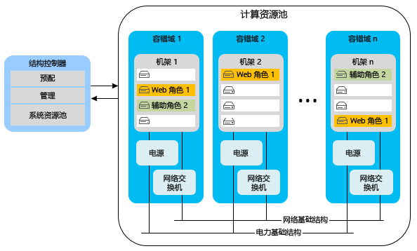
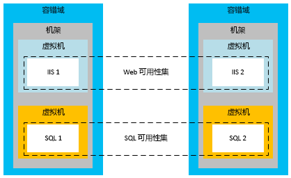
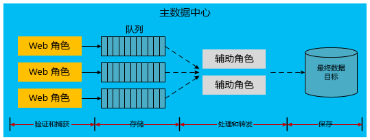

[!INCLUDE [header](../_includes/header.md)]

# 构建在 Microsoft Azure 基础之上的应用程序高可用性
高度可用的应用程序可消减依赖的服务和硬件在可用性、负载和临时故障方面的波动。 应用程序以可接受的性能继续运行，如业务要求或应用程序服务级别协议 (SLA) 所定义。

## Azure 高可用性功能
Azure 在平台中内置了多种功能，用于支持高度可用的应用程序。 本部分介绍其中一些重要功能。

### 结构控制器
Azure 结构控制器负责预配和监视 Azure 计算实例的状况。 结构控制器监视主机和来宾计算机实例的硬件和软件的状态。 检测到故障后，它通过自动重新定位 VM 实例来维持 SLA。 容错域和升级域的概念进一步为计算 SLA 提供支持。

部署多个云服务角色实例时，Azure 将这些实例部署到不同的容错域。 容错域边界本质上就是同一区域内的其他硬件机架。 容错域可降低局部硬件故障将中断应用程序服务的可能性。 无法管理辅助角色或 Web 角色的容错域的数量。 结构控制器采用与 Azure 托管的应用程序分离的专用资源。 由于它充当 Azure 系统的核心，因此其运行时间需要是 100%。 它监视和管理各个容错域中的角色实例。

以下示意图显示了结构控制器在各个容错域中部署和管理的 Azure 共享资源。

虽然容错域是用于缓解故障的物理分隔，但升级域是实例分隔的逻辑单元，它们决定了将在特定的时间升级服务的哪些实例。 默认情况下会为托管服务部署定义五个升级域。 不过，可以在服务定义文件中更改该值。 例如，如果你的 web 角色有八个实例，则三个升级域中分别有两个实例，一个升级域中有两个实例。 Azure 基于升级域的数量定义更新序列。 有关详细信息，请参阅[更新云服务](/azure/cloud-services/cloud-services-update-azure-service/)。

### 其他服务中的功能
除了这些支持计算资源高可用性的平台功能之外，Azure 还将高可用性功能嵌入到它的其他服务中。 例如，Azure 存储会维护 Azure 存储帐户中所有数据的至少三个副本。 它还启用了异地复制来将数据副本存储在次要区域中。 通过 Azure 内容交付网络，可在世界各地缓存 Blob 以实现冗余、可伸缩性和更低的延迟。 Azure SQL 数据库也保留多个副本。

有关 Azure 平台可用性功能的更深入讨论，请参阅[复原技术指南](index.md)。 另请参阅 [Best practices for designing large-scale services on Windows Azure](https://azure.microsoft.com/blog/best-practices-for-designing-large-scale-services-on-windows-azure/)（在 Windows Azure 上设计大型服务的最佳做法）。

尽管 Azure 提供多项支持高可用性的功能，但了解其限制也很重要：

* 对于计算，Azure 保证角色可用并正在运行，但它无法检测应用程序是否正在运行或过载。
* 对于 Azure SQL 数据库，在区域内同步复制数据。 可以选择活动异地复制，以便在同一个区域（或不同的区域中）最多创建四个附加的数据库副本。 虽然这些数据库副本不是时间点备份，但 SQL 数据库提供了时间点备份功能。 有关详细信息，请参阅[使用自动化数据备份恢复 Azure SQL 数据库：时间点还原](/azure/sql-database/sql-database-recovery-using-backups#point-in-time-restore)。
* 对于 Azure 存储，默认情况下会将表数据和 Blob 数据复制到备用区域。 但是，直到 Microsoft 选择将故障转移到备用站点，才能访问这些副本。 通常只有在发生区域范围的长时间服务中断时才执行区域故障转移，并且不存在针对异地故障转移时间的 SLA。 另外，必须注意，任何数据损坏将迅速扩散到副本。 由于这些原因，你必须使用特定于应用程序的可用性功能补充平台可用性功能，包括用来创建 blob 数据的时间点备份的 blob 快照功能。

### Azure 虚拟机的可用性集
本文档重点介绍了云服务，这些服务使用平台即服务 (PaaS) 模型。 Azure 虚拟机也有一些特定的可用性功能，它们使用基础结构即服务 (IaaS) 模型。 若要实现虚拟机的高可用性，必须使用可用性集，它们提供与容错域和升级域相似的功能。 在可用性集中，Azure 会以某种方式定位虚拟机，避免局部硬件错误和维护活动导致该组的所有虚拟机停机。 可用性集必须达到针对虚拟机可用性的 Azure SLA。

下图显示了分别适用于 Web 和 SQL Server 虚拟机的两个可用性集。

> [!NOTE]
> 在上图中，SQL Server 安装并运行在虚拟机上。 这不同于 Azure SQL 数据库，后者将数据库作为托管服务提供。
> 
> 

## 高可用性的应用程序策略
高可用性的大多数应用程序策略均涉及冗余或消除应用程序组件之间的硬性依赖。 应用程序设计应在 Azure 或第三方服务偶发的停机时间内支持容错。 以下各部分介绍了几种用于提高云服务可用性的应用程序模式。

### 异步通信和持久队列
若要提高 Azure 应用程序的可用性，请考虑在松散耦合的服务之间使用异步通信。 在此模式下，会将消息写入到存储队列或 Azure 服务总线队列供以后处理。 将消息写入到队列后，控制权会立即归还给发送者。 应用程序的另一项服务（通常实现为辅助角色）对消息进行处理。 如果处理服务停止工作，则消息会累积在队列中，直到处理服务得以还原。 前端发送者与消息处理程序之间不存在直接的依赖关系。 这消除了在分布式应用程序中可能会导致瓶颈的同步服务调用。

此模式的一种变体在 Azure 存储（Blob、表或队列）或服务总线队列中存储关于失败的数据库调用的信息。 例如，在应用程序中同步调用另一个服务（如 Azure SQL 数据库）反复失败。 可以将该请求以序列化方式存储到持久存储中。 以后在服务或数据库恢复联机时，应用程序可重新提交来自存储的请求。 此模型中的区别在于中间位置仅在发生故障期间使用，不是应用程序工作流的常规部分。

在两种方案中，异步通信和中间存储均可防止后端服务中断导致整个应用程序停止运行。 队列充当逻辑中介。 有关在队列服务之间进行选择的详细信息，请参阅 [Azure 队列和 Azure 服务总线队列 &mdash; 比较与对照](/azure/service-bus-messaging/service-bus-azure-and-service-bus-queues-compared-contrasted/)。

### 故障检测和重试逻辑
高度可用的应用程序设计的一个关键方面是在代码中使用重试逻辑来正常处理暂时不可用的服务。 适用于 Azure 存储和 Azure 服务总线的最新 SDK 版本本身就支持重试。 有关为应用程序提供自定义重试逻辑的详细信息，请参阅[重试模式](../patterns/retry.md)。

### 高可用性的引用数据模式
引用数据是应用程序的只读数据。 此数据提供一个业务上下文，应用程序在业务运行期间将在其中生成事务数据。 事务数据的完整性依赖于在事务完成时引用数据的快照。

引用数据是应用程序正确操作所必需的。 各种应用程序创建并维护引用数据；主控数据管理 (MDM) 系统通常负责执行此功能。 这些系统对引用数据的整个生命周期负责。 引用数据的示例包括产品目录、雇员主控数据、部件主控数据和设备主控数据。 引用数据也可来自组织以外，如邮政编码或税率。 提高引用数据可用性的策略之外通常要比提高事务数据可用性的策略简单。 引用数据具有最为持久的优点。

通过将引用数据连同应用程序一起部署，可以让使用引用数据的 Azure Web 角色和辅助角色在运行时成为自治的。 如果本地存储的大小允许这样的部署，则此方法最理想。 在本地部署的嵌入式 SQL 数据库、NoSQL 数据库或 XML 文件有助于实现 Azure 计算缩放单位的自治。 但是，应该制定一种机制，以便无需重新部署即可更新每个角色中的数据。 为此，请将对引用数据的任何更新放置到云存储终结点（例如，Azure Blob 存储或 SQL 数据库）。 向每个角色添加在角色启动时会数据更新下载到计算节点中的代码。 或者添加使管理员可在角色实例中执行强制下载的代码。

若要提高可用性，角色还应包含一组引用数据以防存储失灵。 角色可以先使用一组基本的引用数据，直到有存储资源可供更新使用。

在此模式下，如果部署或下载大量的引用数据，则新部署或角色实例可能需要花费更长时间才能启动。 要在每个角色上立即有引用数据可用而不依赖于外部存储服务，此折衷也许是可接受的。

### 高可用性的事务数据模式
事务数据是应用程序在某种业务上下文中生成的数据。 事务数据由应用程序实现的一组业务流程与支持这些流程的引用数据组合而成。 事务数据的示例包括订单、预先发货通知、发票和客户关系管理 (CRM) 机会。 事务数据将被提供到外部系统进行记录保留或进一步处理。

引用数据在负责这些数据的系统中可能会发生更改。 因此，事务数据必须保存时间点引用数据上下文，以使其对外部的依赖程度降至最低，保持其语义一致性。 例如，可以在履行订单几个月后从目录中删除某个产品。 建议随事务存储尽可能多的引用数据上下文。 此方法可保留与事务相关的语义，即使要在捕获事务之后更改引用数据也是如此。

如前所述，使用松散耦合和异步通信的体系结构可以提供更高级别的可用性。 对于事务数据也是这样，但实现起来更为复杂。 传统的事务模式通常依靠数据库来确保事务的正确处理。 引入中间层后，应用程序代码必须在各层正确处理数据，以确保足够的一致性和持久性。

以下序列描述了一个工作流，其中将事务数据的捕获与其处理相分离：

1. Web 计算节点：提供引用数据。
2. 外部存储：保存中间事务数据。
3. Web 计算节点：完成最终用户事务。
4. Web 计算节点：将完成的事务数据及其引用数据上下文一起发送到可保证做出可预测响应的临时持久存储。
5. Web 计算节点：通知最终用户事务已完成。
6. 后台计算节点：提取事务数据，如有必要，进一步处理这些数据，然后将其发送到它在当前系统中的最终存储位置。

下图显示了在 Azure 云服务中实现这种设计的一种可行方式。

上图中的虚线箭头表示异步处理。 前端 Web 角色不了解这种异步处理。 这样导致将事务存储在其最终目标，并引用当前系统。 由于此异步模型会导致延迟，因此无法立即查询事务数据。 因此，需要将事务数据的每个单位保存在缓存或用户会话中，以满足即时 UI 的需要。

Web 角色将脱离基础结构的其余部分进行自治。 其可用性配置文件是 Web 角色与 Azure 队列而非整个基础结构的结合。 除了高可用性之外，这种方法还使 Web 角色可独立于后端存储进行水平缩放。 这种高可用性模型可能会影响运营的经济状况。 Azure 队列和辅助角色等其他组件可能影响到每月的使用成本。

上图显示了针对事务数据的这种去耦方法的一种实现。 还有许多其他实现可用。 以下列表提供一些备用的变化形式：

* 可在 Web 角色与队列存储之间放置辅助角色。
* 可使用服务总线队列代替 Azure 存储队列。
* 最终目标可能是 Azure 存储或其他数据库提供商。
* 可在 Web 层使用 Azure 缓存满足完成事务后的立即缓存要求。

### 伸缩性模式
请务必注意，云服务的伸缩性会直接影响到可用性。 如果负载增加导致服务无法响应，则给用户的感觉就是应用程序故障。 根据预期的应用程序负载和未来的预期，遵照用于实现可伸缩性的经验证做法进行操作。 最大程度地扩大规模需要考虑许多因素，如使用单个还是多个存储帐户、在多个数据库之间共享以及缓存策略。 有关这些模式的详细信息，请参阅 [Best practices for designing large-scale services on Microsoft Azure](https://azure.microsoft.com/blog/best-practices-for-designing-large-scale-services-on-windows-azure/)（在 Microsoft Azure 上设计大型服务的最佳做法）。

## 后续步骤
此系列文档包括了在 Microsoft Azure 上构建的应用程序的灾难恢复和高可用性。 此系列文档的下一篇文章是[在 Microsoft Azure 上构建的应用程序的灾难恢复](disaster-recovery-azure-applications.md)。

