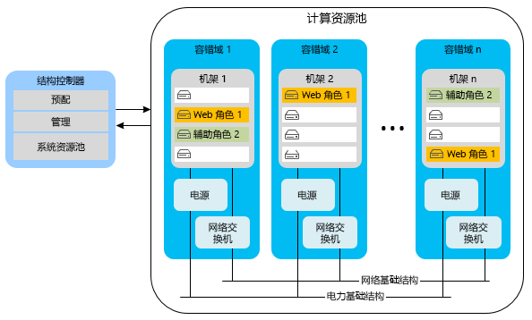
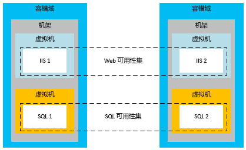
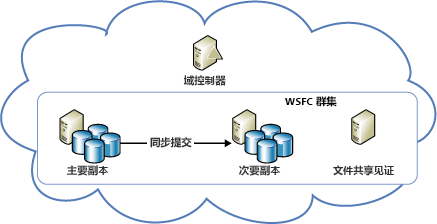
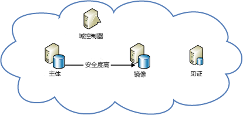

[!INCLUDE [header](../_includes/header.md)]

# Azure 复原技术指南：Azure 中发生局部故障后进行恢复Azure resiliency technical guidance: Recovery from local failures in Azure

应用程序可用性主要面临两大威胁：There are two primary threats to application availability:

* 设备（如驱动器和服务器）故障The failure of devices, such as drives and servers
* 在高峰负载情况下关键资源（如计算资源）耗尽The exhaustion of critical resources, such as compute under peak load conditions

Azure 组合提供一套资源管理、弹性、负载均衡和分区功能，可在这些情况下实现高可用性。Azure provides a combination of resource management, elasticity, load balancing, and partitioning to enable high availability under these circumstances. 上述某些功能会对所有 Azure 服务自动执行。Some of these features are performed automatically for all Azure services. 但在某些情况下，应用程序开发人员必须完成额外的工作，方可从这些功能中获益。However, in some cases, the application developer must do some additional work to benefit from them.

## 云服务Cloud Services
Azure 云服务由包含一个或多个 Web 角色或辅助角色的集合组成。Azure Cloud Services consists of collections of one or more web or worker roles. 角色的一个或多个实例可以并发运行。One or more instances of a role can run concurrently. 实例的数量由配置决定。The configuration determines the number of instances. 角色实例由名为结构控制器的组件进行监视和管理。Role instances are monitored and managed through a component called the fabric controller. 结构控制器会自动检测并响应软件和硬件故障。The fabric controller detects and responds to both software and hardware failures automatically.

每个角色实例都在自已的虚拟机 (VM) 中运行，并通过来宾代理与其结构控制器通信。Every role instance runs in its own virtual machine (VM) and communicates with its fabric controller through a guest agent. 来宾代理收集资源和节点指标，包括 VM 使用状况、状态、日志、资源使用状况、异常和故障情况。The guest agent collects resource and node metrics, including VM usage, status, logs, resource usage, exceptions, and failure conditions. 结构控制器将按照可配置的间隔查询来宾代理，并在来宾代理未能响应时重新启动 VM。The fabric controller queries the guest agent at configurable intervals, and it restarts the VM if the guest agent fails to respond. 如果发生硬件故障，关联的结构控制器会将所有受影响的角色实例移到新的硬件节点，并重新配置网络以将流量路由到该节点。In the event of hardware failure, the associated fabric controller moves all affected role instances to a new hardware node and reconfigures the network to route traffic there.

若要从这些功能中受益，开发人员应确保所有服务都不在角色实例上存储状态。To benefit from these features, developers should ensure that all service roles avoid storing state on the role instances. 相反，所有永久性数据都应从持久存储访问，如 Azure 存储或 SQL 数据库。Instead, all persistent data should be accessed from durable storage, such as Azure Storage or Azure SQL Database. 这样，任何角色都能对请求进行处理。This allows any roles to handle requests. 这也意味着，角色实例可以随时停止，却不会造成服务暂时状态或永久状态的不一致。It also means that role instances can go down at any time without creating inconsistencies in the transient or persistent state of the service.

将状态存储在角色外部的要求具有几个含义。The requirement to store state externally to the roles has several implications. 例如，这意味着对 Azure 存储表的所有相关更改，如果可能，会在单一实体组事务中进行。It implies, for example, that all related changes to an Azure Storage table should be changed in a single entity-group transaction, if possible. 当然，在单一事务中进行所有更改并非始终都可能。Of course, it isn't always possible to make all changes in a single transaction. 请务必多加留心，确保在角色实例故障中断长期运行的操作、而这种操作包括两个或多个对服务永久状态的更新时，这些故障不会产生问题。You must take special care to ensure that role instance failures do not cause problems when they interrupt long-running operations that span two or more updates to the persistent state of the service. 如果另一个角色尝试重新执行此类操作，它应预期并处理只有部分工作完成的情况。If another role attempts to retry such an operation, it should anticipate and handle the case where the work was partially completed.

例如，有一项服务将数据分区存储在多个存储中。For example, consider a service that partitions data across multiple stores. 如果辅助角色在重定位分片时关闭，则分片重定位可能不会完成。If a worker role goes down while it's relocating a shard, the relocation of the shard might not finish. 或者重定位可能由另一个辅助角色重复，而这可能引起数据孤立或数据损坏。Or the relocation might be repeated from its inception by a different worker role, potentially causing orphaned data or data corruption. 为防止出现问题，长期运行的操作必须是以下一种或两种类型：To prevent problems, long-running operations must be one or both of the following:

* *幂等*：可重复且无副作用。*Idempotent*: Repeatable without side effects. 要成为幂等操作，长期运行的操作无论执行多少次都应具有相同的效果，即使在执行过程中中断也是如此。To be idempotent, a long-running operation should have the same effect no matter how many times it's executed, even when it's interrupted during execution.
* *以增量方式重新启动*：可从最近的故障点继续。*Incrementally restartable*: Able to continue from the most recent point of failure. 要能以增量方式重新启动，长期运行的操作必须由一连串小型的原子操作组成。To be incrementally restartable, a long-running operation should consist of a sequence of smaller atomic operations. 此外，该操作应在持久存储中记录其进度，从而使每个后续调用能够从其前任停止的位置接续。It should also record its progress in durable storage, so that each subsequent invocation picks up where its predecessor stopped.

最后，所有长期运行的操作都应被重复调用，直到操作成功为止。Finally, all long-running operations should be invoked repeatedly until they succeed. 例如，辅助角色可能会将预配操作放入 Azure 队列中，并且只有在操作成功时才能将它从队列中删除。For example, a provisioning operation might be placed in an Azure queue, and then removed from the queue by a worker role only when it succeeds. 可能有必要进行垃圾收集，来清理已中断操作创建的数据。Garbage collection might be necessary to clean up data that interrupted operations create.

### 弹性Elasticity
为每个角色运行的初始实例数量由每个角色的配置决定。The initial number of instances running for each role is determined in each role’s configuration. 管理员应根据预期负载，将每个角色初始配置为运行两个或多个实例。Administrators should initially configure each role to run with two or more instances based on expected load. 但是，角色实例数可以随着使用模式的更改轻松扩展或缩减。But you can easily scale role instances up or down as usage patterns change. 可以在 Azure 门户中手动执行此操作，或者使用 Windows PowerShell、服务管理 API 或第三方工具来自动完成该过程。You can do this manually in the Azure portal, or you can automate the process by using Windows PowerShell, the Service Management API, or third-party tools. 有关详细信息，请参阅[如何自动缩放应用程序](/azure/cloud-services/cloud-services-how-to-scale/)。For more information, see [How to autoscale an application](/azure/cloud-services/cloud-services-how-to-scale/).

### 分区Partitioning
Azure 结构控制器使用两种类型的分区：The Azure fabric controller uses two types of partitions:

* *更新域*用于以组的方式升级服务的角色实例。An *update domain* is used to upgrade a service’s role instances in groups. Azure 将服务实例部署到多个更新域中。Azure deploys service instances into multiple update domains. 对于就地更新，结构控制器会停止一个更新域中的所有实例，更新这些实例，然后重新启动这些实例，接下来将它们移到下一个更新域中。For an in-place update, the fabric controller brings down all the instances in one update domain, updates them, and then restarts them before moving to the next update domain. 这种方法能够避免整个服务在更新期间无法使用。This approach prevents the entire service from being unavailable during the update process.
* *容错域*定义硬件或网络的潜在故障点。A *fault domain* defines potential points of hardware or network failure. 对于任何角实例数超过一个的角色，结构控制器会确保这些实例分布在多个容错域上，从而防止孤立的硬件故障中断服务。For any role that has more than one instance, the fabric controller ensures that the instances are distributed across multiple fault domains, to prevent isolated hardware failures from disrupting service. 所有服务器和群集故障风险都由容错域管理。Fault domains govern all exposure to server and cluster failures.

[Azure 服务级别协议 (SLA)](https://azure.microsoft.com/support/legal/sla/) 保证在有两个或更多个 Web 角色实例部署到不同的容错域和升级域时，它们将有至少 99.95% 的时间具有外部连接性。The [Azure service-level agreement (SLA)](https://azure.microsoft.com/support/legal/sla/) guarantees that when two or more web role instances are deployed to different fault and upgrade domains, they'll have external connectivity at least 99.95 percent of the time. 与更新域不同的是，没有办法控制容错域的数量。Unlike update domains, there's no way to control the number of fault domains. Azure 会自动分配容错域，并将角色实例分布到这些容错域中。Azure automatically allocates fault domains and distributes role instances across them. 至少应将每个角色的前两个实例放在不同的容错域和升级域中，以确保至少有两个实例的任何角色都能满足 SLA。At least the first two instances of every role are placed in different fault and upgrade domains to ensure that any role with at least two instances will satisfy the SLA. 下图对此做了演示。This is represented in the following diagram.

### 负载均衡Load balancing
某个 Web 角色的所有入站流量都会通过无状态负载均衡器，由负载均衡器将客户请求在角色实例间分配。All inbound traffic to a web role passes through a stateless load balancer, which distributes client requests among the role instances. 单个角色实例没有公共 IP 地址，无法直接从 Internet 访问。Individual role instances do not have public IP addresses, and they are not directly addressable from the Internet. Web 角色是无状态角色，所以可将任何客户端请求路由到任何角色实例。Web roles are stateless so that any client request can be routed to any role instance. 每隔 15 秒会引发一次 [StatusCheck](https://msdn.microsoft.com/library/microsoft.windowsazure.serviceruntime.roleenvironment.statuscheck.aspx) 事件。A [StatusCheck](https://msdn.microsoft.com/library/microsoft.windowsazure.serviceruntime.roleenvironment.statuscheck.aspx) event is raised every 15 seconds. 这可用来指示角色是已准备好接收流量，还是仍在忙碌，因而应从负载均衡器轮换中取出。You can use this to indicate whether the role is ready to receive traffic, or whether it's busy and should be taken out of the load-balancer rotation.

## 虚拟机Virtual Machines
就高可用性而言，Azure 虚拟机在许多方面与平台即服务 (PaaS) 计算角色有所不同。Azure Virtual Machines differs from platform as a service (PaaS) compute roles in several respects in relation to high availability. 在某些情况下，必须完成额外的工作才能确保高可用性。In some instances, you must do additional work to ensure high availability.

### 磁盘持久性Disk durability
与 PaaS 角色实例不同，即使虚拟机位置改变，虚拟机驱动器中存储的数据仍会保存下来。Unlike PaaS role instances, data stored on virtual machine drives is persistent even when the virtual machine is relocated. Azure 虚拟机使用以 Blob 形式存在于 Azure 存储中的 VM 磁盘。Azure virtual machines use VM disks that exist as blobs in Azure Storage. 由于 Azure 存储的可用性特征，存储在虚拟机驱动器上的数据也具有高度的可用性。Because of the availability characteristics of Azure Storage, the data stored on a virtual machine’s drives is also highly available.

请注意，D 驱动器（Windows VM 中）是此项规则的例外。Note that drive D (in Windows VMs) is the exception to this rule. D 驱动器实际上是托管 VM 的机架服务器的物理存储，如果回收 VM，其中的数据就会丢失。Drive D is actually physical storage on the rack server that hosts the VM, and its data will be lost if the VM is recycled. D 驱动器只能用作临时存储。Drive D is intended for temporary storage only. Linux 中，Azure“通常”（但不总是）将本地临时磁盘公开为 /dev/sdb 块设备。In Linux, Azure “usually” (but not always) exposes the local temporary disk as /dev/sdb block device. Azure Linux 代理通常将其作为 /mnt/resource 或 /mnt 装入点进行装载（可通过 /etc/waagent.conf 进行配置）。It is often mounted by the Azure Linux Agent as /mnt/resource or /mnt mount points (configurable via /etc/waagent.conf).

### 分区Partitioning
Azure 原本就能识别 PaaS 应用程序（Web 角色和辅助角色）中的各个层，因此能够正确地将它们分布在容错域和更新域上。Azure natively understands the tiers in a PaaS application (web role and worker role) and thus can properly distribute them across fault and update domains. 相反，必须使用可用性集手动定义基础结构即服务 (IaaS) 应用程序中的层。In contrast, the tiers in an infrastructure as a service (IaaS) application must be manually defined through availability sets. IaaS 需要使用可用性集来符合 SLA 要求。Availability sets are required for an SLA under IaaS.

在上图中，Internet Information Services (IIS) 层（充当 Web 应用层）和 SQL 层（充当数据层）分配给不同的可用性集。In the preceding diagram, the Internet Information Services (IIS) tier (which works as a web app tier) and the SQL tier (which works as a data tier) are assigned to different availability sets. 这可确保通过将虚拟机分布在多个容错域中，使每一层的所有实例获得硬件冗余，并且整个层在更新期间不会关闭。This ensures that all instances of each tier have hardware redundancy by distributing virtual machines across fault domains, and that entire tiers are not taken down during an update.

### 负载均衡Load balancing
如果应在各 VM 间分布流量，必须将应用程序中的 VM 分组，并对特定的 TCP 或 UDP 终结点进行负载均衡。If the VMs should have traffic distributed across them, you must group the VMs in an application and load balance across a specific TCP or UDP endpoint. 有关详细信息，请参阅[对虚拟机进行负载均衡](/azure/virtual-machines/virtual-machines-linux-load-balance/?toc=%2fazure%2fvirtual-machines%2flinux%2ftoc.json)。For more information, see [Load balancing virtual machines](/azure/virtual-machines/virtual-machines-linux-load-balance/?toc=%2fazure%2fvirtual-machines%2flinux%2ftoc.json). 如果 VM 接收来自其他来源（如排队机制）的输入，则不需要负载均衡器。If the VMs receive input from another source (for example, a queuing mechanism), a load balancer is not required. 负载均衡器使用基本运行状况检查来确定是否应将流量发送到节点。The load balancer uses a basic health check to determine whether traffic should be sent to the node. 也可以创建自己的探测，实现应用程序特定的运行状况指标，以确定 VM 是否应接收流量。It's also possible to create your own probes to implement application-specific health metrics that determine whether the VM should receive traffic.

## 存储Storage
Azure 存储是 Azure 的基准持久数据服务。Azure Storage is the baseline durable data service for Azure. 它提供 Blob、表、队列和 VM 磁盘存储。It provides blob, table, queue, and VM disk storage. 它使用复制与资源管理的组合，在单个数据中心内提供高可用性。It uses a combination of replication and resource management to provide high availability within a single datacenter. Azure 存储可用性 SLA 保证至少 99.9% 的时间内可以：The Azure Storage availability SLA guarantees that at least 99.9 percent of the time:

* 成功且正确地处理格式正确的请求，以添加、更新、读取和删除数据。Correctly formatted requests to add, update, read, and delete data will be successfully and correctly processed.
* 存储帐户将与 Internet 网关建立连接。Storage accounts will have connectivity to the Internet gateway.

### 复制Replication
Azure 存储数据持久性形成的方式，是在区域内完全独立的物理存储子系统中的不同驱动器上维护所有数据的多个副本。Azure Storage facilitates data durability by maintaining multiple copies of all data on different drives across fully independent physical storage subsystems within the region. 数据是同步复制的，所有副本均在写入操作被确认前提交。Data is replicated synchronously, and all copies are committed before the write is acknowledged. Azure 存储具有坚实的一致性，保证读取会反映最新写入的内容。Azure Storage is strongly consistent, meaning that reads are guaranteed to reflect the most recent writes. 此外，系统会对数据副本进行连续扫描，以检测和修复位衰减，在所存储数据的完整性方面，这是一种经常会被忽略的威胁。In addition, copies of data are continually scanned to detect and repair bit rot, an often overlooked threat to the integrity of stored data.

服务只要使用 Azure 存储，便会因复制而受益。Services benefit from replication just by using Azure Storage. 服务开发人员不需要完成任何额外工作，即可从局部故障恢复。The service developer doesn't need to do additional work to recover from a local failure.

### 资源管理Resource management
2014 年 5 月之后创建的存储帐户最高可以增长至 500 TB（以前的最大值为 200 TB）。Storage accounts created after May 2014, can grow to up to 500 TB (the previous maximum was 200 TB). 如果需要额外的空间，必须将应用程序设计为利用多个存储帐户。If additional space is required, applications must be designed to use multiple storage accounts.

### 虚拟机磁盘Virtual machine disks
虚拟机的磁盘作为页 Blob 存储在 Azure 存储中，因此它与 Blob 存储具有完全相同的持久性和伸缩性。A virtual machine’s disk is stored as a page blob in Azure Storage, giving it all the same durability and scalability properties as Blob storage. 采用这种设计，即使运行 VM 的服务器故障，必须在另一台服务器上重新启动该 VM，虚拟机磁盘上的数据仍会得以保存。This design makes the data on a virtual machine’s disk persistent, even if the server running the VM fails and the VM must be restarted on another server.

## 数据库Database
### SQL 数据库SQL Database
Azure SQL 数据库提供数据库即服务。Azure SQL Database provides database as a service. 它使应用程序可以快速预配和查询关系数据库，并在数据库中插入数据。It allows applications to quickly provision, insert data into, and query relational databases. 它提供许多熟悉的 SQL Server 特性与功能，同时减少了硬件、配置、修补和复原方面的负担。It provides many of the familiar SQL Server features and functionality, while abstracting the burden of hardware, configuration, patching, and resiliency.

> [!NOTE]
> Azure SQL 数据库并不提供与 SQL Server 一一对应的功能。Azure SQL Database does not provide one-to-one feature parity with SQL Server. 其目的在于满足专门适用于云应用程序的一套不同的要求（通过弹性扩展、数据库即服务来降低维护成本等）。It's intended to fulfill a different set of requirements--one that's uniquely suited to cloud applications (elastic scale, database as a service to reduce maintenance costs, and so on). 有关详细信息，请参阅[选择云 SQL Server 选项：Azure SQL (PaaS) 数据库或 Azure VM 上的 SQL Server (IaaS)](/azure/sql-database/sql-database-paas-vs-sql-server-iaas/)。For more information, see [Choose a cloud SQL Server option: Azure SQL (PaaS) Database or SQL Server on Azure VMs (IaaS)](/azure/sql-database/sql-database-paas-vs-sql-server-iaas/).
> 
> 

#### 复制Replication
Azure SQL 数据库对节点级故障提供内置的复原功能。Azure SQL Database provides built-in resiliency to node-level failure. 所有写入数据库的内容会使用仲裁提交技术自动复制到两个或更多个后台节点。All writes into a database are automatically replicated to two or more background nodes through a quorum commit technique. （主要副本和至少一个辅助副本必须先确认活动写入事务日志，然后才将事务视为成功并返回。）在节点发生故障时，数据库会自动故障转移到其中一个辅助副本。(The primary and at least one secondary must confirm that the activity is written to the transaction log before the transaction is deemed successful and returns.) In the case of node failure, the database automatically fails over to one of the secondary replicas. 这会造成客户端应用程序的暂时连接中断。This causes a transient connection interruption for client applications. 因此，所有 Azure SQL 数据库客户端都必须实现某种形式的暂时连接处理。For this reason, all Azure SQL Database clients must implement some form of transient connection handling. 有关详细信息，请参阅[重试服务特定指南](/azure/best-practices-retry-service-specific/)。For more information, see [Retry service specific guidance](/azure/best-practices-retry-service-specific/).

#### 资源管理Resource management
每个数据库在创建时，都配置了大小上限。Each database, when created, is configured with an upper size limit. 当前可用的最大大小为 1 TB（大小限制随服务层而定），请参阅 [Azure SQL 数据库的服务层和性能级别](/azure/sql-database/sql-database-resource-limits/#service-tiers-and-performance-levels)。The currently available maximum size is 1 TB (size limits vary based on your service tier, see [service tiers and performance levels of Azure SQL Databases](/azure/sql-database/sql-database-resource-limits/#service-tiers-and-performance-levels). 当数据库达到大小限制时，它会拒绝其他 INSERT 或 UPDATE 命令。When a database hits its upper size limit, it rejects additional INSERT or UPDATE commands. （仍可查询和删除数据。）(Querying and deleting data is still possible.)

在数据库内，Azure SQL 数据库使用结构来管理资源。Within a database, Azure SQL Database uses a fabric to manage resources. 但是，它不使用结构控制器，而是使用环形拓扑来检测故障。However, instead of a fabric controller, it uses a ring topology to detect failures. 群集中的每个副本都有两个相邻副本，并负责检测这两个副本何时停止。Every replica in a cluster has two neighbors and is responsible for detecting when they go down. 当某个副本停止时，它的相邻副本便会触发重新配置代理，在另一台计算机上重新创建该副本。When a replica goes down, its neighbors trigger a reconfiguration agent to re-create it on another machine. 引擎限制可确保逻辑服务器不会在一台计算机上使用过多资源，或超过计算机的物理限制。Engine throttling is provided to ensure that a logical server doesn't use too many resources on a machine or exceed the machine’s physical limits.

### 弹性Elasticity
如果应用程序需要超过 1 TB 的数据库，必须实现扩展方法。If the application requires more than the 1 TB database limit, it must implement a scale-out approach. 使用 Azure SQL 数据库扩展的方法是在多个 SQL 数据库上手动分区（也称为分片）数据。You scale out with Azure SQL Database by manually partitioning, also known as sharding, data across multiple SQL databases. 这种扩展方法提供了实现成本随扩展呈线性增长的机会。This scale-out approach provides the opportunity to achieve nearly linear cost growth with scale. 弹性增长（或按需容量）可以根据需求随成本的增加而增长，因为数据库是根据每天实际使用的大小来进行收费，而不是根据最大的可用大小来收费。Elastic growth or capacity on demand can grow with incremental costs as needed because databases are billed based on the average actual size used per day, not based on maximum possible size.

## 虚拟机上的 SQL ServerSQL Server on Virtual Machines
通过在 Azure 虚拟机上安装 SQL Server（2014 或更高版本），可以利用 SQL Server 的传统可用性功能。By installing SQL Server (version 2014 or later) on Azure Virtual Machines, you can take advantage of the traditional availability features of SQL Server. 这些功能包括 AlwaysOn 可用性组或数据库镜像。These features include AlwaysOn Availability Groups and database mirroring. 请注意，Azure VM、存储和网络的运行特征与本地非虚拟化的 IT 基础结构不同。Note that Azure VMs, storage, and networking have different operational characteristics than an on-premises, non-virtualized IT infrastructure. 需要了解这些区别并设计可适应这些区别的解决方案，才能成功地在 Azure 中实现高可用性/灾难恢复 (HA/DR) SQL Server 解决方案A successful implementation of a high availability/disaster recovery (HA/DR) SQL Server solution in Azure requires that you understand these differences and design your solution to accommodate them.

### 可用性集中的高可用性节点High-availability nodes in an availability set
在 Azure 中实现高可用性解决方案时，通过 Azure 中的可用性集，可将高可用性节点放入单独的容错域和升级域。When you implement a high-availability solution in Azure, you can use the availability set in Azure to place the high-availability nodes into separate fault domains and upgrade domains. 具体而言，可用性集是 Azure 中的一个概念。To be clear, the availability set is an Azure concept. 应遵循的最佳实践是确保数据库确实为高度可用，无论使用 AlwaysOn 可用性组、数据库镜像还是其他方法。It's a best practice that you should follow to make sure that your databases are indeed highly available, whether you're using AlwaysOn Availability Groups, database mirroring, or something else. 如果不遵循此最佳实践，则可能会错误地假设系统为高度可用。If you don't follow this best practice, you might be under the false assumption that your system is highly available. 但实际上，节点可能会因碰巧被放置在 Azure 区域内的同一容错域中而同时全部出现故障。But in reality, your nodes can all fail simultaneously because they happen to be placed in the same fault domain in the Azure region.

此项建议不适用于日志传送。This recommendation is not as applicable with log shipping. 作为灾难恢复功能，应确保服务器在单独的 Azure 区域中运行。As a disaster recovery feature, you should ensure that the servers are running in separate Azure regions. 根据定义，这些区域是不同的容错域。By definition, these regions are separate fault domains.

对于同一可用性集中通过经典门户部署的 Azure 云服务 VM，必须将它们部署在同一个云服务中。For Azure Cloud Services VMs deployed through the classic portal to be in the same availability set, you must deploy them in the same Cloud Service. 通过 Azure 资源管理器（当前门户）部署的 VM 不具有这种限制。VMs deployed through Azure Resource Manager (the current portal) do not have this limitation. 对于在 Azure 云服务中部署 VM 的经典门户，只有同一云服务中的节点可加入同一可用性集。For classic portal deployed VMs in Azure Cloud Service, only nodes in the same Cloud Service can participate in the same availability set. 此外，云服务 VM 应位于同一虚拟网络中，以确保它们在服务修复后仍能保持其 IP。In addition, the Cloud Services VMs should be in the same virtual network to ensure that they maintain their IPs even after service healing. 这可以避免 DNS 更新中断。This avoids DNS update disruptions.

### 仅限 Azure：高可用性解决方案Azure-only: High-availability solutions
可使用 AlwaysOn 可用性组或数据库镜像，为 Azure 中的 SQL Server 数据库提供高可用性解决方案。You can have a high-availability solution for your SQL Server databases in Azure by using AlwaysOn Availability Groups or database mirroring.

下图演示了 Azure 虚拟机中运行的 AlwaysOn 可用性组的体系架构。The following diagram demonstrates the architecture of AlwaysOn Availability Groups running on Azure Virtual Machines. 此图摘自有关本主题的深入文章，即 [Azure 虚拟机中的 SQL Server 的高可用性和灾难恢复](/azure/virtual-machines/windows/sql/virtual-machines-windows-sql-high-availability-dr/)。This diagram was taken from the in-depth article on this subject, [High availability and disaster recovery for SQL Server on Azure Virtual Machines](/azure/virtual-machines/windows/sql/virtual-machines-windows-sql-high-availability-dr/).

也可以在 Azure 门户中使用 AlwaysOn 模板在 Azure VM 上自动预配 AlwaysOn 可用性组的端到端部署。You can also automatically provision an AlwaysOn Availability Groups deployment end-to-end on Azure VMs by using the AlwaysOn template in the Azure portal. 有关详细信息，请参阅 [Microsoft Azure 门户库中的 SQL Server AlwaysOn 产品](https://blogs.technet.microsoft.com/dataplatforminsider/2014/08/25/sql-server-alwayson-offering-in-microsoft-azure-portal-gallery/)。For more information, see [SQL Server AlwaysOn Offering in Microsoft Azure Portal Gallery](https://blogs.technet.microsoft.com/dataplatforminsider/2014/08/25/sql-server-alwayson-offering-in-microsoft-azure-portal-gallery/).

下图演示了在 Azure 虚拟机上使用数据库镜像的情况。The following diagram demonstrates the use of database mirroring on Azure Virtual Machines. 该图同样摘自深入主题文章（[Azure 虚拟机中的 SQL Server 的高可用性和灾难恢复](/azure/virtual-machines/windows/sql/virtual-machines-windows-sql-high-availability-dr/)）。It was also taken from the in-depth topic [High availability and disaster recovery for SQL Server on Azure Virtual Machines](/azure/virtual-machines/windows/sql/virtual-machines-windows-sql-high-availability-dr/).

> [!NOTE]
> 这两种体系结构都需要域控制器。Both architectures require a domain controller. 但是，数据库镜像也可以使用服务器证书，从而不再需要域控制器。However, with database mirroring, it's possible to use server certificates to eliminate the need for a domain controller.
> 
> 

## 其他 Azure 平台服务Other Azure platform services
在 Azure 基础之上构建的应用程序可以利用平台功能从局部故障中恢复。Applications that are built on Azure benefit from platform capabilities to recover from local failures. 在某些情况下，可以采取某些特定操作来增加特定情况下的可用性。In some cases, you can take specific actions to increase availability for your specific scenario.

### 服务总线Service Bus
为了防范 Azure 服务总线的临时中断，请考虑创建一个持久的客户端队列。To mitigate against a temporary outage of Azure Service Bus, consider creating a durable client-side queue. 这会临时使用备用的本地存储机制，来存储无法添加到服务总线队列的消息。This temporarily uses an alternate, local storage mechanism to store messages that cannot be added to the Service Bus queue. 应用程序可以在还原服务后再决定如何处理临时存储的消息。The application can decide how to handle the temporarily stored messages after the service is restored. 有关详细信息，请参阅[使用服务总线中转消息传送改进性能的最佳实践](/azure/service-bus-messaging/service-bus-performance-improvements/)和[服务总线（灾难恢复）](recovery-loss-azure-region.md#other-azure-platform-services)。For more information, see [Best practices for performance improvements using Service Bus brokered messaging](/azure/service-bus-messaging/service-bus-performance-improvements/) and [Service Bus (disaster recovery)](recovery-loss-azure-region.md#other-azure-platform-services).

### HDInsightHDInsight
与 Azure HDInsight 关联的数据默认存储在 Azure Blob 存储中。The data that's associated with Azure HDInsight is stored by default in Azure Blob storage. Azure 存储为 Blob 存储指定了高可用性和持久性属性。Azure Storage specifies high-availability and durability properties for Blob storage. 与 Hadoop MapReduce 作业关联的多节点处理是在 HDInsight 根据需要预配的暂时性 Hadoop 分布式文件系统 (HDFS) 上进行的。The multiple-node processing that's associated with Hadoop MapReduce jobs occurs on a transient Hadoop Distributed File System (HDFS) that is provisioned when HDInsight needs it. MapReduce 作业产生的结果默认也存储在 Azure Blob 存储中，因此在取消 Hadoop 群集的设置后处理过的数据仍具有持久性且仍然高度可用。Results from a MapReduce job are also stored by default in Azure Blob storage, so that the processed data is durable and remains highly available after the Hadoop cluster is deprovisioned. 有关详细信息，请参阅 [HDInsight（灾难恢复）](recovery-loss-azure-region.md#other-azure-platform-services)。For more information, see [HDInsight (disaster recovery)](recovery-loss-azure-region.md#other-azure-platform-services).

## 局部故障清单Checklists for local failures
### 云服务Cloud Services
1. 查看本文档的“云服务”部分。Review the Cloud Services section of this document.
2. 为每个角色至少配置两个实例。Configure at least two instances for each role.
3. 将状态保存在持久存储中，而不是角色实例上。Persist state in durable storage, not on role instances.
4. 正确处理 StatusCheck 事件。Correctly handle the StatusCheck event.
5. 尽可能将相关更改包装在事务中。Wrap related changes in transactions when possible.
6. 确认辅助角色任务具有幂等性且可重新开始。Verify that worker role tasks are idempotent and restartable.
7. 持续调用操作，直到操作成功为止。Continue to invoke operations until they succeed.
8. 考虑采用自动缩放策略。Consider autoscaling strategies.

### 虚拟机Virtual Machines
1. 查看本文档的“虚拟机”部分。Review the Virtual Machines section of this document.
2. 不要使用 D 驱动器作为持久存储。Do not use drive D for persistent storage.
3. 将服务层中的计算机分组为可用性集。Group machines in a service tier into an availability set.
4. 配置负载均衡和可选探测。Configure load balancing and optional probes.

### 存储Storage
1. 查看本文档的“存储”部分。Review the Storage section of this document.
2. 在数据或带宽超过配额时使用多个存储帐户。Use multiple storage accounts when data or bandwidth exceeds quotas.

### SQL 数据库SQL Database
1. 查看本文档的“SQL 数据库”部分。Review the SQL Database section of this document.
2. 实现重试策略以处理暂时错误。Implement a retry policy to handle transient errors.
3. 使用分区/分片作为扩展策略。Use partitioning/sharding as a scale-out strategy.

### 虚拟机上的 SQL ServerSQL Server on Virtual Machines
1. 查看本文档的“虚拟机上的 SQL Server”部分。Review the SQL Server on Virtual Machines section of this document.
2. 遵循上述有关虚拟机的建议。Follow the previous recommendations for Virtual Machines.
3. 使用 SQL Server 高可用性功能，如 AlwaysOn。Use SQL Server high availability features, such as AlwaysOn.

### 服务总线Service Bus
1. 查看本文档的“服务总线”部分。Review the Service Bus section of this document.
2. 考虑创建持久客户端队列作为备份。Consider creating a durable client-side queue as a backup.

### HDInsightHDInsight
1. 查看本文档的“HDInsight”部分。Review the HDInsight section of this document.
2. 对于局部故障无需采取其他可用性步骤。No additional availability steps are required for local failures.

