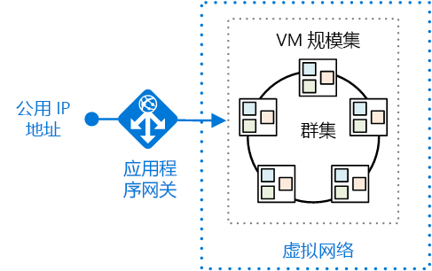
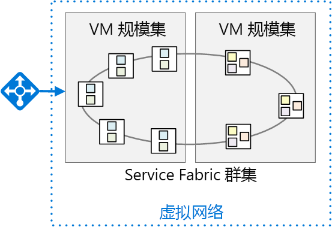

# <a name="migrate-an-azure-cloud-services-application-to-azure-service-fabric"></a>将 Azure 云服务应用程序迁移到 Azure Service Fabric 

[ 示例代码][sample-code]

本文说明如何将 Azure 云服务中的应用程序迁移到 Azure Service Fabric。 它重点介绍了一些体系结构决策和建议的做法。 

对于本项目，我们从一款名为 Surveys 的云服务应用程序开始，并将其移植到 Service Fabric 中。 目标是在迁移该应用程序时尽可能少做更改。 在后续文章中，我们将采用一种微服务体系结构，针对 Service Fabric 优化该应用程序。

阅读本文之前，了解一下 Service Fabric 和微服务体系结构的基础知识通常大有裨益。 请参阅以下文章：

- [Azure Service Fabric 概述][sf-overview]
- [为什么通过微服务的方法构建应用程序？][sf-why-microservices]


## <a name="about-the-surveys-application"></a>关于 Surveys 应用程序

2012 年，模式和实践小组为[为云开发多租户应用程序][tailspin-book]一书创建了一个名为 Surveys 的应用程序。 书中描述了一个设计并实现 Surveys 应用程序的虚构公司 Tailspin。

Surveys 是一款多租户应用程序，允许客户创建问卷调查。 客户注册该应用程序后，客户组织中的成员可以创建和发布问卷调查，并收集结果进行分析。 该应用程序包括一个公共网站，人们可在网站上参与问卷调查。 请从[此处][tailspin-scenario]阅读有关原始 Tailspin 方案的详细信息。

现在，Tailspin 想使用 Azure 上运行的 Service Fabric，将 Surveys 应用程序迁移到微服务体系结构中。 由于该应用程序已部署为云服务应用程序，因此 Tailspin 采用一种多阶段方法：

1.  将云服务移植到 Service Fabric，同时尽量减少对应用程序的更改。
2.  通过迁移到微服务体系结构，针对 Service Fabric 优化应用程序。

本文介绍第一个阶段。 后续文章将介绍第二个阶段。 在实际项目中，这两个阶段有可能重叠。 移植到 Service Fabric 的同时，你也会开始将应用程序重新构建到微服务中。 之后，可能会进一步优化体系结构，可能将粗粒度的服务划分为粒度较小的服务。  

[GitHub][sample-code] 上提供了应用程序代码。 此存储库包含云服务应用程序和 Service Fabric 版本。 

> 该云服务是*开发多租户应用程序*一书中原始应用程序的更新版本。

## <a name="why-microservices"></a>为何使用微服务？

对微服务的深入讨论不在本文范围内，但下面介绍了 Tailspin 希望通过迁移到微服务体系结构获得的一些优势：

- **应用程序升级**。 服务可独立部署，因此，你可以使用递增的方法对应用程序升级。
- **复原能力和故障隔离**。 如果某个服务出现故障，其他服务将继续运行。
- **可伸缩性**。 服务可独立缩放。
- **灵活性**。 服务根据业务方案而非技术堆栈设计而成，因此可以更轻松地将服务迁移到新的技术、框架或数据存储。
- **敏捷开发**。 相比单一式应用程序，单个服务的代码更少，从而使基本代码更易理解、推理和测试。
- **小型专属团队**。 由于应用程序被分解为多个小型服务，因此每个服务可由一个小型专属团队构建。

## <a name="why-service-fabric"></a>为何使用 Service Fabric？
      
Service Fabric 非常适合微服务体系结构，因为 Service Fabric 内置了分布式系统所需的大部分功能，包括：

- **群集管理**。 Service Fabric 自动处理节点故障转移、运行状况监视和其他群集管理功能。
- **水平扩展**。 将节点添加到 Service Fabric 群集时，应用程序会自动缩放，因为服务分布在各个新节点中。
- **服务发现**。 Service Fabric 提供发现服务，可用于解析指定服务的终结点。
- **无状态和有状态服务**。 有状态服务使用[可靠集合][sf-reliable-collections]，可取代缓存或队列并且可分区。
- **应用程序生命周期管理**。 服务可独立升级，无需关闭应用程序。
- 跨一组计算机的**服务业务流程**。
- **更高的密度**，优化了资源消耗。 一个节点可以托管多个服务。

Service Fabric 可供各种 Microsoft 服务使用，包括 Azure SQL 数据库、Cosmos DB、Azure 事件中心等等，是一款用于构建分布式云应用程序的广受赞誉的平台。 

## <a name="comparing-cloud-services-with-service-fabric"></a>比较云服务和 Service Fabric

下表总结了云服务应用程序与 Service Fabric 应用程序之间的一些重要差异。 有关更深入的讨论，请参阅[迁移应用程序之前了解云服务与 Service Fabric 之间的差异][sf-compare-cloud-services]。

|        | 云服务 | Service Fabric |
|--------|---------------|----------------|
| 应用程序组合 | 角色| 服务 |
| 密度 |每个 VM 一个角色实例 | 单个节点上多个服务 |
| 最小节点数 | 每个角色 2 个 | 对于生产部署，每个群集 5 个 |
| 状态管理 | 无状态 | 无状态或有状态* |
| Hosting | Azure | 云或本地 |
| Web 托管 | IIS** | 自托管 |
| 部署模型 | [经典部署模型][azure-deployment-models] | [资源管理器][azure-deployment-models]  |
| 打包 | 云服务包文件 (.cspkg) | 应用程序和服务包 |
| 应用程序更新 | VIP 交换或滚动更新 | 滚动更新 |
| 自动缩放 | [内置服务][cloud-service-autoscale] | 使用 VM 规模集进行自动缩放 |
| 调试 | 本地仿真器 | 本地群集 |


\* 有状态服务使用[可靠集合][sf-reliable-collections]将状态存储在各个副本中，以便所有读取操作都在群集节点本地进行。 写入操作跨节点进行复制，以保证可靠性。 无状态服务通过使用数据库或其他外部存储，可以有外部状态。

** 辅助角色也可以使用 OWIN 自托管 ASP.NET Web API。

## <a name="the-surveys-application-on-cloud-services"></a>云服务上的 Surveys 应用程序

下图展示了云服务上运行的 Surveys 应用程序的体系结构。 


该应用程序由两个 Web 角色和一个辅助角色组成。

- **Tailspin.Web** Web 角色托管一个 ASP.NET 网站，Tailspin 客户可用于创建和管理问卷调查。 客户还使用此网站注册应用程序和管理其订阅。 最后，Tailspin 管理员可通过它查看租户列表和管理租户数据。 

- **Tailspin.Web.Survey.Public** Web 角色托管一个 ASP.NET 网站，人们可在网站上参与 Tailspin 客户发布的问卷调查。 

- **Tailspin.Workers.Survey** 辅助角色执行后台处理。 Web 角色将工作项放入队列，辅助角色则处理这些项。 定义了两个后台任务：将问卷调查答案导出到 Azure SQL 数据库，以及计算问卷调查答案的统计数据。

除云服务外，Surveys 应用程序还使用其他 Azure 服务：

- **Azure 存储**，用于存储问卷调查、问卷调查答案和租户信息。

- **Azure Redis 缓存**，用于缓存 Azure 存储中存储的一些数据，以便加快读取访问速度。 

- **Azure Active Directory** (Azure AD)，用于验证客户和 Tailspin 管理员的身份。

- **Azure SQL 数据库**，用于存储问卷调查答案进行分析。 

## <a name="moving-to-service-fabric"></a>迁移到 Service Fabric

如前文所述，此阶段的目标是在迁移到 Service Fabric 时尽量减少所需的更改。 为此，我们创建了与原始应用程序中每个云服务角色相对应的无状态服务：


此体系结构有意设计成与原始应用程序非常类似。 不过，该图隐藏了一些重要差异。 在本文的其余部分，我们将探讨这些差异。 


## <a name="converting-the-cloud-service-roles-to-services"></a>将云服务角色转换为服务

如前文所述，我们已将各云服务角色迁移到 Service Fabric 服务。 由于云服务角色是无状态的，因此，在此阶段，在 Service Fabric 中创建无状态服务较为合理。 

迁移时，我们遵循了[将 Web 角色和辅助角色转换成 Service Fabric 无状态服务的指南][sf-migration]中概述的步骤。 

### <a name="creating-the-web-front-end-services"></a>创建 Web 前端服务

在 Service Fabric 中，服务在由 Service Fabric 运行时创建的进程内运行。 对于 Web 前端，这意味着该服务不在 IIS 内运行， 而必须托管 Web 服务器。 此方法称为*自托管*，因为进程内运行的代码充当 Web 服务器主机。 

自托管要求意味着 Service Fabric 服务不能使用 ASP.NET MVC 或 ASP.NET Web 窗体，因为这些框架需要 IIS，并且不支持自托管。 自托管选项包括：

- [ASP.NET Core][aspnet-core]，使用 [Kestrel][kestrel] Web 服务器自托管。 
- [ASP.NET Web API][aspnet-webapi]，使用 [OWIN][owin] 自托管。
- [Nancy](http://nancyfx.org/) 等第三方框架。

原始 Surveys 应用程序使用 ASP.NET MVC。 由于 ASP.NET MVC 不能在 Service Fabric 中自托管，因此，我们曾考虑使用以下迁移选项：

- 将 Web 角色移植到可自托管的 ASP.NET Core。
- 将网站转换成单页应用程序 (SPA)，以调用使用 ASP.NET Web API 实现的 Web API。 这需要重新设计 Web 前端。
- 保留现有的 ASP.NET MVC 代码，并将 Windows Server 容器中的 IIS 部署到 Service Fabric。 此方法只需对代码稍作改动，甚至无需改动。 但是，Service Fabric 中的[容器支持][sf-containers]目前仍处于预览阶段。

基于以上考虑，我们选择了第一个选项：移植到 ASP.NET Core。 为此，我们遵循了[从 ASP.NET MVC 迁移到 ASP.NET Core MVC][aspnet-migration] 中所述的步骤。 

> [!NOTE]
> 在 ASP.NET Core 中使用 Kestrel 时，出于安全考虑，应在 Kestrel 前面放置一个反向代理，以处理来自 Internet 的流量。 有关详细信息，请参阅 [ASP.NET Core 中的 Kestrel Web 服务器实现][kestrel]。 [部署应用程序](#deploying-the-application)部分介绍了建议的 Azure 部署。

### <a name="http-listeners"></a>HTTP 侦听器

在云服务中，Web 角色或辅助角色通过在[服务定义文件][cloud-service-endpoints]中声明 HTTP 终结点来公开该终结点。 Web 角色必须具有至少一个终结点。

```xml
<!-- Cloud service endpoint -->
<Endpoints>
    <InputEndpoint name="HttpIn" protocol="http" port="80" />
</Endpoints>
```

同样，Service Fabric 终结点在服务清单中声明： 

```xml
<!-- Service Fabric endpoint -->
<Endpoints>
    <Endpoint Protocol="http" Name="ServiceEndpoint" Type="Input" Port="8002" />
</Endpoints>
```

但与云服务角色不同的是，Service Fabric 服务可共存于同一节点内。 因此，每个服务必须侦听不同的端口。 本文后面会讨论如何将端口 80 或端口 443 上的客户端请求路由到服务的正确端口。

服务必须为每个终结点显式创建侦听器。 原因是 Service Fabric 对通信堆栈不可知。 有关详细信息，请参阅[使用 ASP.NET Core 生成应用程序的 Web 服务前端][sf-aspnet-core]。

## <a name="packaging-and-configuration"></a>打包和配置

 云服务包含以下配置和包文件：

| 文件 | 说明 |
|------|-------------|
| 服务定义 (.csdef) | Azure 用于配置云服务的设置。 定义角色、终结点、启动任务和配置设置名称。 |
| 服务配置 (.cscfg) | 针对每个部署的设置，包括角色实例数、终结点端口号和配置设置的值。 
| 服务包 (.cspkg) | 包含应用程序代码和配置以及服务定义文件。  |

整个应用程序只有一个 .csdef 文件。 针对不同的环境可以有多个 .cscfg 文件，比如本地环境、测试环境或生产环境。 当服务运行时，可以只更新 .cscfg，而不更新 .csdef。 有关详细信息，请参阅[什么是云服务模型以及如何将其打包？][cloud-service-config]

Service Fabric 对服务*定义*和服务*设置*也有类似的区分，但结构更精细。 若要了解 Service Fabric 的配置模型，可先了解如何打包 Service Fabric 应用程序。 其结构如下：

```
Application package
  - Service packages
    - Code package
    - Configuration package
    - Data package (optional)
```

应用程序包是你部署的包。 它包含一个或多个服务包。 服务包包含代码包、配置包和数据包。 代码包包含服务的二进制文件，配置包包含配置设置。 在此模型中，升级各个服务时无需重新部署整个应用程序。 还可以只更新配置设置，而无需重新部署代码或重新启动服务。

Service Fabric 应用程序包含以下配置文件：

| 文件 | 位置 | 说明 |
|------|----------|-------------|
| ApplicationManifest.xml | 应用程序包 | 定义构成应用程序的服务。 |
| ServiceManifest.xml | 服务包| 描述一个或多个服务。 |
| Settings.xml | 配置包 | 包含服务包中定义的服务的配置设置。 |

有关详细信息，请参阅[在 Service Fabric 中对应用程序建模][sf-application-model]。

若要支持多个环境的不同配置设置，请使用[管理多个环境的应用程序参数][sf-multiple-environments]中所述的以下方法：

1. 在服务的 Setting.xml 文件中定义设置。
2. 在应用程序清单中，定义设置的替代项。
3. 将特定于环境的设置放入应用程序参数文件。


## <a name="deploying-the-application"></a>部署应用程序

Azure 云服务是托管服务，而 Service Fabric 是运行时。 可以在许多环境中创建 Service Fabric 群集，包括 Azure 和本地。 本文重点介绍如何部署到 Azure。 

下图展示了建议的部署：



Service Fabric 群集部署到 [VM 规模集][vm-scale-sets]。 规模集是一种 Azure 计算资源，可用于部署和管理一组相同的 VM。 

如前文所述，Kestrel Web 服务器出于安全原因需要一个反向代理。 此图展示了 [Azure 应用程序网关][application-gateway]，它是一种可提供各种第 7 层负载均衡功能的 Azure 服务。 它充当反向代理服务，终止客户端连接，并将请求转发到后端终结点。 你可能会使用其他反向代理解决方案，比如 nginx。  

### <a name="layer-7-routing"></a>第 7 层路由

在[原始 Surveys 应用程序](https://msdn.microsoft.com/en-us/library/hh534477.aspx#sec21)中，一个 Web 角色侦听端口 80，另一个 Web 角色侦听端口 443。 

| 公共站点 | Survey 管理站点 |
|-------------|------------------------|
| `http://tailspin.cloudapp.net` | `https://tailspin.cloudapp.net` |

另一种做法是使用第 7 层路由。 在此方法中，不同的 URL 路径会路由到后端的不同端口号。 例如，公共站点可能使用以 `/public/` 开头的 URL 路径。 

第 7 层路由选项包括：

- 使用应用程序网关。 

- 使用网络虚拟设备 (NVA)，比如 nginx。

- 编写一个自定义网关作为无状态服务。

如果有两个或更多个具有公共 HTTP 终结点的服务，但希望它们显示为一个具有单一域名的站点，可考虑使用此方法。

> 还有一个方法是允许外部客户端通过 Service Fabric [反向代理][sf-reverse-proxy]发送请求，但*不*建议采用此方法。 尽管这是可行的，但反向代理适用于服务到服务通信。 向外部客户端打开反向代理会公开群集中运行的*所有*具有 HTTP 终结点的服务。

### <a name="node-types-and-placement-constraints"></a>节点类型和放置约束

在上面所示的部署中，所有服务在所有节点上运行。 但是，也可以对服务分组，以便特定服务仅在群集内的特定节点上运行。 使用此方法的原因包括：

- 在不同的 VM 类型上运行某些服务。 例如，某些服务可能需要大量计算资源或需要 GPU。 Service Fabric 群集中可以有各种 VM 类型。
- 出于安全考虑，隔离前端服务与后端服务。 所有前端服务在一组节点上运行，后端服务则在同一群集中的其他节点上运行。
- 不同的缩放要求。 某些服务相比其他服务，可能需要在更多节点上运行。 例如，如果定义前端节点和后端节点，则每组节点都可以独立缩放。

下图展示隔离了前端服务与后端服务的群集：



若要实现此方法，请执行以下操作：

1.  创建群集时，定义两种或更多节点类型。 
2.  对于每个服务，均使用[放置约束][sf-placement-constraints]将该服务分配到一种节点类型。

在部署到 Azure 时，每种节点类型都会部署到不同的 VM 规模集。 Service Fabric 群集跨所有节点类型。 有关详细信息，请参阅 [Service Fabric 节点类型与虚拟机规模集之间的关系][sf-node-types]。

> 如果某个群集具有多种节点类型，则将其中一种节点类型指定为*主*节点类型。 Service Fabric 运行时服务（如群集管理服务）在主节点类型上运行。 在生产环境中，需为主节点类型预配至少 5 个节点。 其他节点类型应具有至少 2 个节点。

## <a name="configuring-and-managing-the-cluster"></a>配置和管理群集

必须保护群集，防止未经授权的用户与其连接。 建议使用 Azure AD 对客户端进行身份验证，并使用 X.509 证书确保节点到节点的安全性。 有关详细信息，请参阅 [Service Fabric 群集安全方案][sf-security]。

若要配置公共 HTTPS 终结点，请参阅[在服务清单中指定资源][sf-manifest-resources]。

通过向群集添加 VM，可以横向扩展应用程序。 VM 规模集支持使用自动缩放规则，基于性能计数器进行自动缩放。 有关详细信息，请参阅[使用自动缩放规则扩大或缩小 Service Fabric 群集][sf-auto-scale]。

运行群集时，应在某个中心位置从所有节点收集日志。 有关详细信息，请参阅[使用 Azure 诊断收集日志][sf-logs]。   


## <a name="conclusion"></a>结束语

将 Surveys 应用程序移植到 Service Fabric 的过程非常简单。 概括来说，我们执行了以下操作：

- 将角色转换成无状态服务。
- 将 Web 前端转换成 ASP.NET Core。
- 将打包和配置文件更改为 Service Fabric 模型。

另外，将部署从云服务更改为在 VM 规模集中运行的 Service Fabric 群集。

不过，应用程序此时还未获得微服务的所有优势，比如独立的服务部署和版本控制。 若要充分利用 Service Fabric，Tailspin 需要再做进一步优化。


<!-- links -->

[application-gateway]: /azure/application-gateway/
[aspnet-core]: /aspnet/core/
[aspnet-webapi]: https://www.asp.net/web-api
[aspnet-migration]: /aspnet/core/migration/mvc
[aspnet-hosting]: /aspnet/core/fundamentals/hosting
[aspnet-webapi]: https://www.asp.net/web-api
[azure-deployment-models]: /azure/azure-resource-manager/resource-manager-deployment-model
[cloud-service-autoscale]: /azure/cloud-services/cloud-services-how-to-scale-portal
[cloud-service-config]: /azure/cloud-services/cloud-services-model-and-package
[cloud-service-endpoints]: /azure/cloud-services/cloud-services-enable-communication-role-instances#worker-roles-vs-web-roles
[kestrel]: https://docs.microsoft.com/aspnet/core/fundamentals/servers/kestrel
[lb-probes]: /azure/load-balancer/load-balancer-custom-probe-overview
[owin]: https://www.asp.net/aspnet/overview/owin-and-katana
[sample-code]: https://github.com/mspnp/cloud-services-to-service-fabric
[sf-application-model]: /azure/service-fabric/service-fabric-application-model
[sf-aspnet-core]: /azure/service-fabric/service-fabric-add-a-web-frontend
[sf-auto-scale]: /azure/service-fabric/service-fabric-cluster-scale-up-down
[sf-compare-cloud-services]: /azure/service-fabric/service-fabric-cloud-services-migration-differences
[sf-connect-and-communicate]: /azure/service-fabric/service-fabric-connect-and-communicate-with-services
[sf-containers]: /azure/service-fabric/service-fabric-containers-overview
[sf-logs]: /azure/service-fabric/service-fabric-diagnostics-how-to-setup-wad
[sf-manifest-resources]: /azure/service-fabric/service-fabric-service-manifest-resources
[sf-migration]: /azure/service-fabric/service-fabric-cloud-services-migration-worker-role-stateless-service
[sf-multiple-environments]: /azure/service-fabric/service-fabric-manage-multiple-environment-app-configuration
[sf-node-types]: /azure/service-fabric/service-fabric-cluster-nodetypes
[sf-overview]: /azure/service-fabric/service-fabric-overview
[sf-placement-constraints]: /azure/service-fabric/service-fabric-cluster-resource-manager-cluster-description
[sf-reliable-collections]: /azure/service-fabric/service-fabric-reliable-services-reliable-collections
[sf-reliable-services]: /azure/service-fabric/service-fabric-reliable-services-introduction
[sf-reverse-proxy]: /azure/service-fabric/service-fabric-reverseproxy
[sf-security]: /azure/service-fabric/service-fabric-cluster-security
[sf-why-microservices]: /azure/service-fabric/service-fabric-overview-microservices
[tailspin-book]: https://msdn.microsoft.com/en-us/library/ff966499.aspx
[tailspin-scenario]: https://msdn.microsoft.com/en-us/library/hh534482.aspx
[unity]: https://msdn.microsoft.com/en-us/library/ff647202.aspx
[vm-scale-sets]: /azure/virtual-machine-scale-sets/virtual-machine-scale-sets-overview
