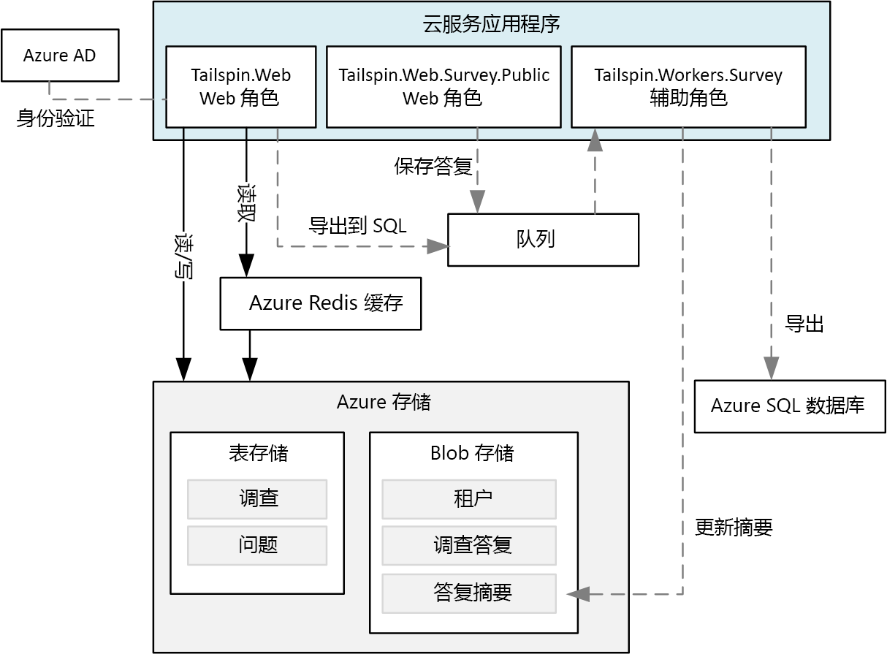
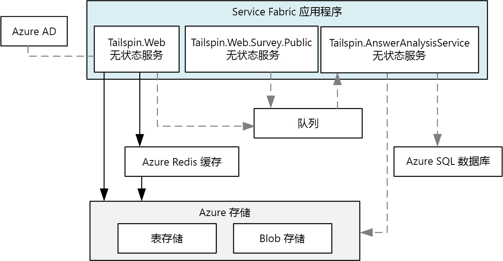
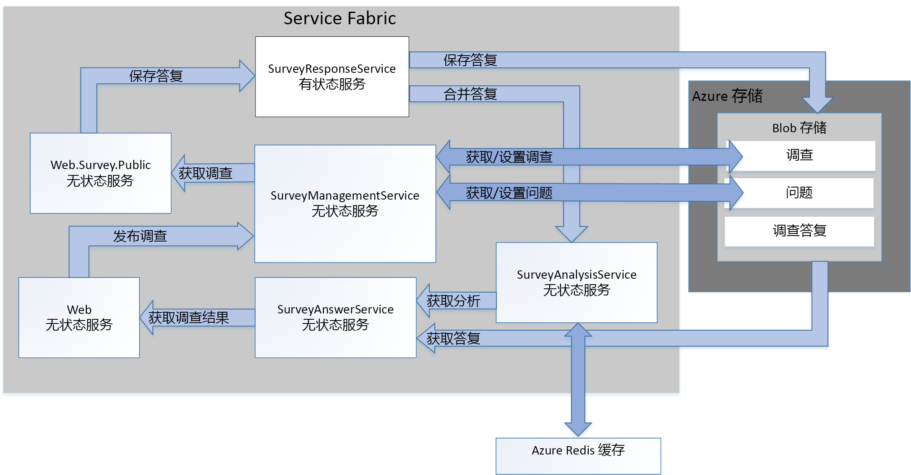

# <a name="refactor-an-azure-service-fabric-application-migrated-from-azure-cloud-services"></a>重构从 Azure 云服务迁移的 Azure Service Fabric 应用程序

[ 示例代码][sample-code]

本文介绍如何将现有的 Azure Service Fabric 应用程序重构为更精细的体系结构。 本文侧重于重构的 Service Fabric 应用程序的设计、打包、性能和部署注意事项。

## <a name="scenario"></a>方案

前一篇文章[将 Azure 云服务应用程序迁移到 Azure Service Fabric][migrate-from-cloud-services] 中已经提到，模式和实践团队在 2012 年编写了一篇指南，其中阐述了在 Azure 中设计和实施云服务应用程序的流程。 该指南介绍了一家名为 Tailspin 的虚构公司，他们想要创建一个名为 **Surveys** 的云服务应用程序。 用户可以通过 Surveys 应用程序创建和发布可让公众回答的调查表。 下图展示了此 Surveys 应用程序版本的体系结构：



**Tailspin.Web** Web 角色托管一个 ASP.NET MVC 站点，Tailspin 客户可以使用它来：
* 注册 Surveys 应用程序；
* 创建或删除单个调查表；
* 查看单个调查表的结果；
* 请求将调查表结果导出到 SQL；
* 查看聚合的调查表结果和分析。

**Tailspin.Web.Survey.Public** Web 角色还托管一个可让公众访问的、以便填写调查表的 ASP.NET MVC 站点。 这些响应将在队列中保存。

**Tailspin.Workers.Survey** 辅助角色通过从多个队列中拾取请求来执行后台处理。

后来，模式和实践团队又创建了一个新项目，用于将此应用程序移植到 Azure Service Fabric。 此项目的目标是只需做出必要的代码更改，就能让应用程序在 Azure Service Fabric 群集中运行。 因此，原始的 Web 和辅助角色并未分解成更精细的体系结构。 最终的体系结构与云服务版本的应用程序非常类似：



**Tailspin.Web** 服务是从原始 *Tailspin.Web* Web 角色移植的。

**Tailspin.Web.Survey.Public** 服务是从原始 *Tailspin.Web.Survey.Public* Web 角色移植的。

**Tailspin.AnswerAnalysisService** 服务是从原始 *Tailspin.Workers.Survey* 辅助角色移植的。

> [!NOTE] 
> 尽量对每个 Web 角色和辅助角色所做的代码更改极少，但 **Tailspin.Web** 和 **Tailspin.Web.Survey.Public** 经过修改，以便自我托管 [Kestrel] Web 服务器。 初期的 Surveys 应用程序是使用 Interet Information Services (IIS) 托管的 ASP.Net 应用程序，但无法在 Service Fabric 中以服务的形式运行 IIS。 因此，任何 Web 服务器（例如 [Kestrel]）必须能够自我托管。 在某些情况下，可以在 Service Fabric 的容器中运行 IIS。 有关详细信息，请参阅[容器的使用方案][container-scenarios]。  

现在，Tailspin 可将 Surveys 应用程序重构为更精细的体系结构。 Tailspin 的重构动机是更方便地开发、生成和部署 Surveys 应用程序。 Tailspin 希望通过将现有的 Web 角色和辅助角色分解成更精细的体系结构，来消除现有的紧密耦合通信，以及这些角色之间的数据依赖关系。

Tailspin 认识到了将 Surveys 应用程序转换成更精细体系结构所带来的优势：
* 可将每个服务打包成独立的项目，其作用范围很小，小型团队即可对其进行管理。
* 可以单独对每个服务进行版本控制和部署。
* 可以使用每个服务适用的最佳技术来实现该服务。 例如，可以在一个 Service Fabric 群集中，包含使用不同版本的 .Net Framework、Java 或其他语言（例如 C 或 C++）生成的服务。
* 每个服务可以独立缩放，以应对负载的增减。

> [!NOTE] 
> 多租户不在此应用程序的重构范围内。 Tailspin 提供多种选项来支持多租户，以后客户可以做出相关的设计决策，而不影响初始设计。 例如，Tailspin 可以针对群集中的每个租户创建单独的服务实例，或者针对每个租户创建单独的群集。

## <a name="design-considerations"></a>设计注意事项
 
下图展示了已重构为更精细体系结构的 Surveys 应用程序的体系结构：



**Tailspin.Web** 是一个无状态服务，它自我托管一个可让 Tailspin 客户访问的、以便创建调查表和查看调查表结果的 ASP.NET MVC 应用程序。 此服务与已移植的 Service Fabric 应用程序中的 *Tailspin.Web* 服务共享其大部分代码。 如前所述，此服务使用 ASP.NET Core，并改用 Kestrel 作为 Web 前端来实现 WebListener。

**Tailspin.Web.Survey.Public** 是一个无状态服务，它同样自我托管一个 ASP.NET MVC 站点。 用户可以访问此站点，从列表中选择调查表，然后填写调查表。此服务与已移植的 Service Fabric 应用程序中的 *Tailspin.Web.Survey.Public* 服务共享其大部分代码。 此服务也使用 ASP.NET Core，并改用 Kestrel 作为 Web 前端来实现 WebListener。

**Tailspin.SurveyResponseService** 是一个有状态服务，它在 Azure Blob 存储中存储调查表答案。 此外，它还将答案合并到调查表分析数据中。 之所以将该服务实现为有状态服务，是因为它使用 [ReliableConcurrentQueue][reliable-concurrent-queue] 来分批处理调查表答案。 此功能最初在移植的 Service Fabric 应用程序中的 *Tailspin.AnswerAnalysisService* 服务中实现。

**Tailspin.SurveyManagementService** 是一个无状态服务，用于存储和检索调查表与调查表的问题。 服务使用 Azure Blob 存储。 此功能最初也在移植的 Service Fabric 应用程序中的 *Tailspin.Web* 和 *Tailspin.Web.Survey.Public* 服务的数据访问组件中实现。 Tailspin 将原始功能重构为此服务，使其能够独立缩放。

**Tailspin.SurveyAnswerService** 是一个无状态服务，用于检索调查表答案和调查表分析。 该服务也使用 Azure Blob 存储。 此功能最初也在移植的 Service Fabric 应用程序中的 *Tailspin.Web* 服务的数据访问组件中实现。 Tailspin 将原始功能重构为此服务，因为它预期负载更小，因此希望使用更少的实例以节省资源。

**Tailspin.SurveyAnalysisService** 是一个无状态服务，用于在 Redis 缓存中保存调查表答案摘要数据，以提高检索的速度。 每当回答了某份调查表并将新的调查表答案数据合并到摘要数据中时，*Tailspin.SurveyResponseService* 就会调用此服务。 此服务包括最初在移植的 Service Fabric 应用程序中的 *Tailspin.AnswerAnalysisService* 服务中实现的功能。

## <a name="stateless-versus-stateful-services"></a>无状态服务与有状态服务

Azure Service Fabric 支持以下编程模型：
* 来宾可执行文件模式允许将任何可执行文件打包成服务并将其部署到 Service Fabric 群集。 Service Fabric 协调和管理来宾可执行文件的执行。
* 容器模型允许在容器映像中部署服务。 Service Fabric 支持在 Linux 内核容器和 Windows Server 容器的基础上创建和管理容器。 
* Reliable Services 编程模型允许创建可与所有 Service Fabric 平台功能集成的无状态服务或有状态服务。 有状态服务允许将复制状态存储在 Service Fabric 群集中， 而无状态服务则不允许。
* Reliable Actors 编程模型允许创建可实现虚拟执行组件模式的服务。

在 Surveys 应用程序中，除 *Tailspin.SurveyResponseService* 服务以外，其他所有服务都是无状态的 Reliable Services。 此服务实现 [ReliableConcurrentQueue][reliable-concurrent-queue] 来处理收到的调查表答案。 ReliableConcurrentQueue 中的响应保存到 Azure Blob 存储，并传递给 *Tailspin.SurveyAnalysisService* 进行分析。 Tailspin 之所以选择 ReliableConcurrentQueue，是因为响应不需要遵循队列（例如 Azure 服务总线）提供的严格先进先出 (FIFO) 排序规则。 ReliableConcurrentQueue 在设计上还能提供高吞吐量和低延迟来执行排队与取消排队操作。

请注意，保存已在 ReliableConcurrentQueue 中取消排队的项的操作最好是幂等的。 如果在处理队列中的某个项期间引发了异常，可以多次处理同一个项。 在 Surveys 应用程序中，将调查表答案合并到 *Tailspin.SurveyAnalysisService* 的操作不是幂等的，因为 Tailspin 判定调查表分析数据只是当前分析数据的快照，而不需要保持一致。 保存到 Azure Blob 存储的调查表答案最终是一致的，因此，始终能够基于这些数据正确地重新计算调查表最终分析结果。

## <a name="communication-framework"></a>通信框架

Surveys 应用程序中的每个服务使用 RESTful Web API 通信。 RESTful API 提供以下优势：
* 易用性：使用原生支持创建 Web API 的 ASP.Net Core MVC 生成每个服务。
* 安全性：尽管每个服务不需要 SSL，但 Tailspin 可以要求每个服务使用 SSL。 
* 版本控制：可以针对特定版本的 Web API 编写和测试客户端。

Surveys 应用程序中的服务利用 Service Fabric 实现的[反向代理][reverse-proxy]。 反向代理是在 Service Fabric 群集中每个节点上运行的服务，可以提供终结点解析、自动重试和处理其他类型的连接故障。 若要使用反向代理，可以使用预定义的反向代理端口对特定的服务发出每个 RESTful API 调用。  例如，如果反向代理端口设置为 **19081**，则可按如下所示调用 *Tailspin.SurveyAnswerService*：

```csharp
static SurveyAnswerService()
{
    httpClient = new HttpClient
    {
        BaseAddress = new Uri("http://localhost:19081/Tailspin/SurveyAnswerService/")
    };
}
```
若要启用反向代理，请在创建 Service Fabric 群集期间指定反向代理端口。 有关详细信息，请参阅 Azure Service Fabric 中的[反向代理][reverse-proxy]。

## <a name="performance-considerations"></a>性能注意事项

Tailspin 使用 Visual Studio 模板为 *Tailspin.Web* 和 *Tailspin.Web.Surveys.Public* 创建了 ASP.NET Core 服务。 默认情况下，这些模板会将日志输出到控制台。 在开发和调试期间，可将日志输出到控制台；但是，在将应用程序部署到生产环境后，应该禁用将所有日志输出到控制台。

> [!NOTE]
> 有关对生产环境中运行的 Service Fabric 应用程序设置监视和诊断的详细信息，请参阅 Azure Service Fabric 的[监视和诊断][monitoring-diagnostics]。

例如，应该在 *startup.cs* 中注释掉与每个 Web 前端服务对应的以下行：

```csharp
// This method gets called by the runtime. Use this method to configure the HTTP request pipeline.
public void Configure(IApplicationBuilder app, IHostingEnvironment env, ILoggerFactory loggerFactory)
{
    //loggerFactory.AddConsole(Configuration.GetSection("Logging"));
    //loggerFactory.AddDebug();

    app.UseMvc();
}
```

> [!NOTE]
> 将 Visual Studio 设置为“release”（发布）时，可以根据条件排除这些行。

最后，当 Tailspin 在生产环境中部署 Tailspin 应用程序时，会将 Visual Studio 切换到 **release** 模式。

## <a name="deployment-considerations"></a>部署注意事项

重构的 Surveys 应用程序由五个无状态服务和一个有状态服务构成，因此，群集规划仅限于确定正确的 VM 大小和节点数。 在描述群集的 *applicationmanifest.xml* 文件中，Tailspin 将每个服务的 *StatelessService* 标记的 *InstanceCount* 属性设置为 -1。 值 -1 指示 Service Fabric 在群集中的每个节点上创建一个服务实例。

> [!NOTE]
> 有状态服务要求执行额外的步骤来规划正确的分区数和分区的数据副本数。

Tailspin 使用 Azure 门户部署群集。 Service Fabric 群集资源类型部署所有必要的基础结构，包括 VM 规模集和负载均衡器。 在 Service Fabric 群集的预配过程中，建议的 VM 大小会显示在 Azure 门户中。 请注意，由于 VM 部署在 VM 规模集中，因此，当用户负载增大时，这些 VM 既可纵向扩展，也可横向扩展。

> [!NOTE]
> 如前所述，在迁移版本的 Surveys 应用程序中，两个 Web 前端是使用 ASP.Net Core 和充当 Web 服务器的 Kestrel 自我托管的。 尽管迁移版本的 Surveys 应用程序不使用反向代理，但我们强烈建议使用 IIS、Nginx 或 Apache 等反向代理。 有关详细信息，请参阅 [ASP.NET Core 中的 Kestrel Web 服务器实现简介][kestrel-intro]。
> 在重构的 Surveys 应用程序中，两个 Web 前端是使用 ASP.Net Core 和充当 Web 服务器的 [WebListener][weblistener] 自我托管的，因此不需要反向代理。

## <a name="next-steps"></a>后续步骤

[GitHub][sample-code] 上提供了 Surveys 应用程序代码。

如果你使用 [Azure Service Fabric][service-fabric] 不久，请先设置开发环境，然后下载最新的 [Azure SDK][azure-sdk] 和 [Azure Service Fabric SDK][service-fabric-sdk]。 SDK 包含 OneBox 群集管理器，用于在本地部署和测试 Surveys 应用程序，并完全支持 F5 调试。

<!-- links -->
[azure-sdk]: https://azure.microsoft.com/downloads/archive-net-downloads/
[container-scenarios]: /azure/service-fabric/service-fabric-containers-overview
[kestrel]: https://docs.microsoft.com/aspnet/core/fundamentals/servers/kestrel?tabs=aspnetcore2x
[kestrel-intro]: https://docs.microsoft.com/aspnet/core/fundamentals/servers/kestrel?tabs=aspnetcore1x
[migrate-from-cloud-services]: migrate-from-cloud-services.md
[monitoring-diagnostics]: /azure/service-fabric/service-fabric-diagnostics-overview
[reliable-concurrent-queue]: /azure/service-fabric/service-fabric-reliable-services-reliable-concurrent-queue
[reverse-proxy]: /azure/service-fabric/service-fabric-reverseproxy
[sample-code]: https://github.com/mspnp/cloud-services-to-service-fabric/tree/master/servicefabric-phase-2
[service-fabric]: /azure/service-fabric/service-fabric-get-started
[service-fabric-sdk]: /azure/service-fabric/service-fabric-get-started
[weblistener]: https://docs.microsoft.com/aspnet/core/fundamentals/servers/weblistener
